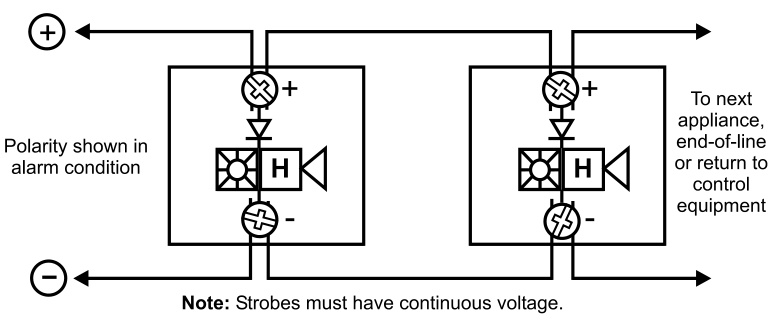

# Field Configurable Ceiling Horn -Strobes  

Genesis Series  

# Overview  

Genesis ceiling horn-strobes are small, compact, and attractive audible-visible emergency signaling devices. Protruding no more than $1.6"$ (41 mm), Genesis horn-strobes blend with any decor.  

Thanks to patented breakthrough technology, EDWARDS Genesis strobes do not require bulky specular reflectors and lenses. Instead, an exclusive cavity design conditions light to produce a highly controlled distribution pattern. Significant development efforts employing this new technology have given rise to a new benchmark in strobe performance – FullLight technology.  

FullLight strobe technology produces a smooth light distribution pattern without the spikes and voids characteristic of specular reflectors. This ensures the entire coverage area receives consistent illumination from the strobe flash. As a result, Genesis strobes with FullLight technology go well beyond the minimum UL-required “cross” pattern.  

Depending on the model, Genesis horn-strobes feature 15 to 95, or 95 to 177 candela output (see ordering information), which is selectable with a conveniently-located switch on the front of the device. The candela output setting is clearly visible even after final installation, yet it remains locked in place to prevent unauthorized movement after installation.  

Genesis horn-strobes feature textured housings in architecturally neutral white or eye-catching fire alarm red. An ingenious iconographic symbol indicates the purpose of the device. This universal symbol is code-compliant and is easily recognized by all building occupants regardless of what language they speak. Models with “FIRE” markings are also available.  

# Standard Features  

Field configurable – no need to remove the device! –	 15/30/75/95 cd and 95/115/150/177 cd models available –	 Switch settings remain visible even after the unit is installed – 	Low/high dB settings  

# Unique low-profile design  

–	 30 per cent slimmer profile than comparable signals –	 No visible mounting screws –	 Available with white or red housings  

# Easy to install  

–	 Fits all standard 4” square electrical boxes with plenty of room behind the signal for extra wire – no extension ring or trim plate needed   
–	 Pre-assembled with captive hardware – no loose pieces   
–	 #18 to #12 AWG terminals – ideal for long runs or existing wir  
ing  

# Unparalleled performance  

–	 Exclusive FullLight strobe technology produces the industry’s most even light distribution   
–	 Single high-efficiency microprocessor controls both horn and strobe   
–	 Low current draw minimizes system overhead   
–	 Independent horn control provided over a single pair of wires   
–	 Highly regulated in-rush current allows the maximum number of strobes on a circuit   
–	 100 dB peak – multiple frequency tone improves wall penetration  

# Application  

Genesis strobes are UL 1971-listed for use indoors as ceiling- or wall-mounted public-mode notification appliances for the hearing impaired. Prevailing codes require strobes to be used where ambient noise conditions exceed 105 dBA (87dBA in Canada), where occupants use hearing protection, and in areas of public accommodation as defined in the Americans with Disabilities Act (see application notes – USA).  

Combination horn-strobe signals must be installed in accordance with guidelines established for strobe devices.  

# Strobes  

Genesis strobes are UL 1971-listed for use indoors as ceiling- or wall-mounted public-mode notification appliances for the hearing impaired. Prevailing codes require strobes to be used where ambient noise conditions exceed specified levels, where occupants use hearing protection, and in areas of public accommodation. Consult with your Authority Having Jurisdiction for details.  

All Genesis strobes exceed UL synchronization requirements (within 10 milliseconds other over a two-hour period) when used with a synchronization source.  Synchronization is important in order to avoid epileptic sensitivity.  

NOTE: The flash intensity of some visible signals may not be adequate to alert or waken occupants in the protected area. Research indicates that the intensity of strobe needed to awaken $90\%$ of sleeping persons is approximately 100 cd. EDWARDS recommends that strobes in sleeping rooms be rated at at least 110 cd.  

WARNING: These devices will not operate without electrical power. As fires frequently cause power interruptions, further safeguards such as backup power supplies may be required.  

# Horns  

Genesis horn output reaches as high as 99 dB (peak) and features a unique multiple frequency tone that results in excellent wall penetration and an unmistakable warning of danger. All models may be configured for either coded or non-coded signal circuits. They can also be set for low dB output with a jumper cut that reduces horn output by about 5 dB.  

The suggested sound pressure level for each signaling zone used with alert or alarm signals is at least 15 dB above the average ambient sound level, or 5 dB above the maximum sound level having a duration of at least 60 seconds, whichever is greater, measured 5 feet $(1.5\,\mathsf{m})$ above the floor. The average ambient sound level is, A-weighted sound pressure measured over a 24-hour period.  

Doubling the distance from the signal to the ear will theoretically result in a 6 dB reduction of the received sound pressure level. The actual effect depends on the acoustic properties of materials in the space.  A 3 dBA difference represents a barely noticeable change in volume.  

# Dimensions  

  

# Installation and Mounting  

All models are intended for indoor wall or ceiling applications only. Horn-strobes mount to any flush North-American 4” square electrical box.  

  

Genesis ceiling horn-strobes simply unlatch and twist to open. This gains access to mounting screws and the selectable candela switch. The shallow depth of Genesis devices leaves ample room behind the signal for extra wiring. Once installed with the cover in place, no mounting screws are visible.  

EDWARDS recommends that these fire alarm horn-strobes always be installed in accordance with the latest recognized edition of national and local fire alarm codes.  

# Field Configuration  

Depending on the model, Genesis horn-strobes may be set for 15 to 95, or 95 to 177 candela output (see ordering information). The output setting is changed by simply opening the device and sliding the switch to the desired setting. The horn-strobe does not have to be removed to change the output setting. The setting remains visible through a small window on the front of the device after the cover is closed.  

The horn-strobe comes factory set for high dB output. Low dB output may be selected by cutting a jumper on the circuit board. This reduces the output by about 5 dB.  

# Wiring  

Field wiring terminals accommodate $\#18$ to $\#12$ AWG $(0.75\;\mathrm{mm}^{2}$ to $2.5\;\mathsf{m m}^{2},$ ) wiring. Horn/strobes are interconnected with a single pair of wires as shown below.  

  

GC-HDVM Temporal Horn-strobe: High dB Setting   

<html><body><table><tr><td>UL Rating</td><td>15cd RMS</td><td>30cd RMS</td><td>75cd RMS</td><td>95 cd RMS</td></tr><tr><td>16Vdc</td><td>147</td><td>190</td><td>316</td><td>372</td></tr><tr><td>16Vfwr</td><td>189</td><td>253</td><td>417</td><td>451</td></tr></table></body></html>  

GC-HDVM Temporal Horn-strobe: High dB Setting   

<html><body><table><tr><td rowspan="2">Typical Current</td><td colspan="2">15cd</td><td colspan="2">30 cd</td><td colspan="2">75cd</td><td colspan="2">95cd</td></tr><tr><td>RMS</td><td>Mean</td><td>RMS</td><td>Mean</td><td>RMS</td><td>Mean</td><td>RMS</td><td>Mean</td></tr><tr><td>16 Vdc</td><td>111</td><td>95</td><td>152</td><td>143</td><td>281</td><td>276</td><td>333</td><td>328</td></tr><tr><td>20Vdc</td><td>91</td><td>80</td><td>124</td><td>117</td><td>219</td><td>214</td><td>257</td><td>251</td></tr><tr><td>24Vdc</td><td>80</td><td>71</td><td>108</td><td>101</td><td>185</td><td>180</td><td>212</td><td>207</td></tr><tr><td>33Vdc</td><td>69</td><td>62</td><td>89</td><td>84</td><td>144</td><td>140</td><td>160</td><td>156</td></tr><tr><td>16Vfwr</td><td>153</td><td>81</td><td>218</td><td>123</td><td>388</td><td>240</td><td>420</td><td>268</td></tr><tr><td>20Vfwr</td><td>141</td><td>70</td><td>190</td><td>100</td><td>325</td><td>188</td><td>378</td><td>219</td></tr><tr><td>24Vfwr</td><td>135</td><td>64</td><td>176</td><td>90</td><td>280</td><td>154</td><td>310</td><td>180</td></tr><tr><td>33Vfwr</td><td>139</td><td>61</td><td>167</td><td>80</td><td>241</td><td>122</td><td>254</td><td>133</td></tr></table></body></html>  

GC-HDVM Temporal Horn-strobe: Low dB Setting   

<html><body><table><tr><td rowspan="2">Typical Current</td><td colspan="2">15cd</td><td colspan="2">30cd</td><td colspan="2">75cd</td><td colspan="2">95cd</td></tr><tr><td>RMS</td><td>Mean</td><td>RMS</td><td>Mean</td><td>RMS</td><td>Mean</td><td>RMS</td><td>Mean</td></tr><tr><td>16Vdc</td><td>108</td><td>91</td><td>149</td><td>139</td><td>275</td><td>269</td><td>327</td><td>322</td></tr><tr><td>20Vdc</td><td>87</td><td>75</td><td>120</td><td>113</td><td>214</td><td>209</td><td>250</td><td>245</td></tr><tr><td>24Vdc</td><td>76</td><td>66</td><td>103</td><td>97</td><td>180</td><td>175</td><td>205</td><td>201</td></tr><tr><td>33Vdc</td><td>64</td><td>57</td><td>85</td><td>80</td><td>138</td><td>135</td><td>153</td><td>150</td></tr><tr><td>16Vfwr</td><td>141</td><td>76</td><td>204</td><td>118</td><td>384</td><td>239</td><td>418</td><td>265</td></tr><tr><td>20 Vfwr</td><td>127</td><td>65</td><td>176</td><td>95</td><td>312</td><td>181</td><td>371</td><td>214</td></tr><tr><td>24 Vfwr</td><td>118</td><td>60</td><td>162</td><td>82</td><td>262</td><td>149</td><td>301</td><td>171</td></tr><tr><td>33Vfwr</td><td>127</td><td>56</td><td>155</td><td>73</td><td>229</td><td>118</td><td>249</td><td>129</td></tr></table></body></html>  

GC-HDVMH High cd Temporal Horn-strobe: High dB Setting   

<html><body><table><tr><td>95cd RMS</td><td>115cd RMS</td><td>150 cd RMS</td><td>177 cd RMS</td></tr><tr><td>341</td><td>399</td><td>506</td><td>570</td></tr><tr><td>487</td><td>578</td><td>670</td><td>711</td></tr></table></body></html>  

GC-HDVMH High cd Temporal Horn-strobe: High dB Setting   

<html><body><table><tr><td colspan="2">95cd</td><td colspan="2">115cd</td><td colspan="2">150cd</td><td colspan="2">177cd</td></tr><tr><td>RMS</td><td>Mean</td><td>RMS</td><td>Mean</td><td>RMS</td><td>Mean</td><td>RMS</td><td>Mean</td></tr><tr><td>324</td><td>322</td><td>377</td><td>374</td><td>477</td><td>474</td><td>554</td><td>551</td></tr><tr><td>258</td><td>256</td><td>299</td><td>296</td><td>369</td><td>366</td><td>417</td><td>414</td></tr><tr><td>220</td><td>217</td><td>252</td><td>249</td><td>304</td><td>301</td><td>341</td><td>338</td></tr><tr><td>172</td><td>169</td><td>188</td><td>185</td><td>223</td><td>220</td><td>244</td><td>241</td></tr><tr><td>463</td><td>265</td><td>535</td><td>312</td><td>665</td><td>400</td><td>718</td><td>442</td></tr><tr><td>392</td><td>211</td><td>439</td><td>240</td><td>517</td><td>287</td><td>587</td><td>334</td></tr><tr><td>346</td><td>179</td><td>382</td><td>212</td><td>458</td><td>246</td><td>498</td><td>271</td></tr><tr><td>296</td><td>142</td><td>323</td><td>152</td><td>358</td><td>178</td><td>387</td><td>194</td></tr></table></body></html>  

GC-HDVMH High cd Temporal Horn-strobe: Low dB Setting   

<html><body><table><tr><td colspan="2">95cd</td><td colspan="2">115cd</td><td colspan="2">150cd</td><td colspan="2">177cd</td></tr><tr><td>RMS</td><td>Mean</td><td>RMS</td><td>Mean</td><td>RMS</td><td>Mean</td><td>RMS</td><td>Mean</td></tr><tr><td>317</td><td>315</td><td>378</td><td>376</td><td>480</td><td>477</td><td>544</td><td>542</td></tr><tr><td>252</td><td>250</td><td>292</td><td>290</td><td>364</td><td>362</td><td>414</td><td>411</td></tr><tr><td>212</td><td>211</td><td>245</td><td>243</td><td>297</td><td>295</td><td>334</td><td>332</td></tr><tr><td>159</td><td>157</td><td>181</td><td>179</td><td>215</td><td>213</td><td>234</td><td>232</td></tr><tr><td>461</td><td>265</td><td>521</td><td>305</td><td>656</td><td>396</td><td>705</td><td>432</td></tr><tr><td>381</td><td>208</td><td>437</td><td>242</td><td>508</td><td>285</td><td>576</td><td>326</td></tr><tr><td>335</td><td>172</td><td>370</td><td>195</td><td>440</td><td>235</td><td>485</td><td>264</td></tr><tr><td>285</td><td>134</td><td>308</td><td>149</td><td>349</td><td>169</td><td>373</td><td>186</td></tr></table></body></html>  

# Notes and Comments  

1.	 Current values are shown in mA.   
2.	 UL Nameplate Rating can vary from Typical Current due to measurement methods and instruments used.   
3.	 EDWARDS recommends using the Typical Current for system design including NAC and Power Supply loading and voltage drop calculations.   
4.	 Use the Vdc RMS current ratings for filtered power supply and battery AH calculations. Use the Vfwr RMS current ratings for unfiltered power supply calculations.   
5.	 Fuses, circuit breakers and other overcurrent protection devices are typically rated for current in RMS values. Most of these devices operate based upon the heating affect   
of the current flowing through the device. The RMS current (not the mean current) determines the heating affect and therefore, the trip and hold threshold for those devices.   
6.	 Our industry has used ‘mean’ currents over the years.  However, UL will direct the industry to use the 2004 RMS values in the future.  

# dBA output  

<html><body><table><tr><td rowspan="2">HighdB Setting</td><td colspan="2">UL464</td><td>Average</td><td>Peak</td></tr><tr><td>Temporal</td><td>Steady</td><td>Temporal/ Steady</td><td>Temporal/ Steady</td></tr><tr><td>16Vdc</td><td>79.8</td><td>83.2</td><td>90.6</td><td>93.6</td></tr><tr><td>24Vdc</td><td>83.3</td><td>85.4</td><td>93.6</td><td>96.6</td></tr><tr><td>33Vdc</td><td>85</td><td>87.8</td><td>95.7</td><td>98.7</td></tr></table></body></html>  

Notes   

<html><body><table><tr><td rowspan="2">LowdB Setting</td><td colspan="2">UL464</td><td>Average</td><td>Peak</td></tr><tr><td>Temporal</td><td>Steady</td><td>Temporal/ Steady</td><td>Temporal/ Steady</td></tr><tr><td>16Vdc</td><td>75</td><td>79.3</td><td>86.3</td><td>88.7</td></tr><tr><td>24Vdc</td><td>78</td><td>83</td><td>88.8</td><td>92.4</td></tr><tr><td>33Vdc</td><td>80.9</td><td>85.9</td><td>91.8</td><td>95.1</td></tr></table></body></html>  

1. All values shown are dBA measured at 10 feet (3.01m); 2. UL464 values measured in reverberation room; 3. Average and Peak values are measured in anechoic chamber.  

<html><body><table><tr><td>Housing</td><td>O UL flammability rating. Red and white models available.</td></tr><tr><td>Lens</td><td>Opticalgradepolycarbonate(clear)</td></tr><tr><td>Mounting</td><td>North-American 4" square box, 2 1/8"(54 mm) deep (indoor wall or ceiling applications only).</td></tr><tr><td>Wireconnections</td><td>Screw terminals: single input for both horn and strobe. #18 to #12 AWG (0.75 mm2 to 2.5 mm2) wire size</td></tr><tr><td>Operating environment</td><td></td></tr><tr><td>Agency listings/approvals</td><td>Meets or exceeds ULC-S525 & ULC-S526, year 2004 UL requirements for standards UL1638 and UL1971, and complies withUL1480.Allhorn-strobescomplywithADACodeof Federal RegulationChapter28Part36FinalRule.CSFM,MEA,FM.</td></tr><tr><td>Operating voltage</td><td>GC-HDVM series temporal-tone horn-strobes: non-coded, filtered 16-33Vdcorunfiltered 16-33VdcFWR(orcoded(audibleNAConly) whenusedwithoptional G1MGenesisSignal Master)</td></tr><tr><td>Strobe output rating</td><td>UL 1971, UL 1638, ULC S526: selectable 15/30/75/95 cd (GC- HDVM) and 95/115/150/177 cd (GC-HDVMH)</td></tr><tr><td>Strobe flashrate</td><td>GC-HDvM series temporal-tone horn-strobes: one flash per second synchronizedwithoptional G1MGenesisSignal Masterindefinitely within10milliseconds(orself-synchronizedwithin200 milliseconds overthirtyminutesonacommoncircuitwithoutG1MGenesisSignal Master) Temporal setting (private mode only): synchronized to temporal</td></tr><tr><td>Synchronization Sources</td><td>outputofhorns onsame circuit G1M-RM,SIGA-CC1S,SIGA-MCC1S,BPS6A,BPS10A</td></tr><tr><td>Horn pulse rate</td><td>GC-HDVM series temporal-tonehorn-strobes:temporal rate synchronized with optional G1M Genesis Signal Master indefinitely within 10 milliseconds (or self-synchronized within 200 milliseconds over thirtyminutesonacommoncircuitwithoutG1MGenesisSignal</td></tr><tr><td>Temporal audible pattern</td><td>Master) V2 Sec ON, 2 sec OFF, 12 sec ON, 12 sec OFF, %2 sec ON,112 seC OFF,thenrepeatcycle</td></tr></table></body></html>  

# Ordering Information  

<html><body><table><tr><td>Catalog Number</td><td>Housing Color</td><td>Marking</td><td>Description</td><td>Ship Wt.Ibs (kg)</td></tr><tr><td>GC-HDVM</td><td>White</td><td>None</td><td rowspan="3">GenesisCeiling/WallHorn-Strobe</td><td rowspan="3">0.82 (1.8)</td></tr><tr><td>GCF-HDVM</td><td>White</td><td>“FIRE"</td><td>withselectable15,30,75,or95cdoutput</td></tr><tr><td>GCFR-HDVM</td><td>Red</td><td>“FIRE"</td><td></td></tr><tr><td>GC-HDVMH GCF-HDVMH</td><td>White White</td><td>None "FIRE"</td><td>GenesisCeiling/WallHorn-Strobe withselectable95,115,150,or177cdoutput</td><td></td></tr><tr><td></td><td></td><td></td><td></td><td></td></tr><tr><td>Accessories</td><td></td><td></td><td></td><td>0.2</td></tr><tr><td>G1M-RM</td><td></td><td></td><td>GenesisSignal Master-RemoteMount (1-gang)</td><td>(0.1) 0.5</td></tr><tr><td>SIGA-CC1S</td><td></td><td></td><td>Intelligent Synchronization Output Module (2-gang)</td><td>(0.23)</td></tr><tr><td>SIGA-MCC1S</td><td></td><td></td><td>Intelligent Synchronization Output Module(Plug-in UIO)</td><td>0.18 (0.08)</td></tr></table></body></html>  