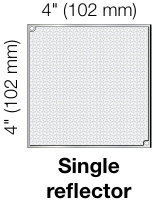
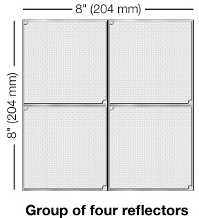
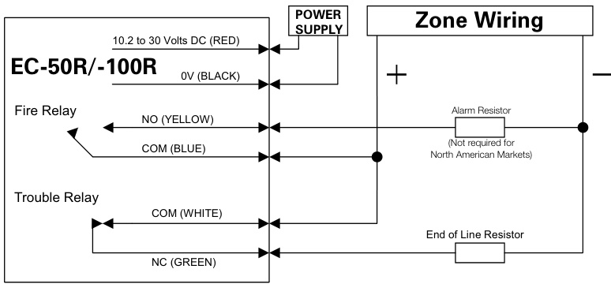
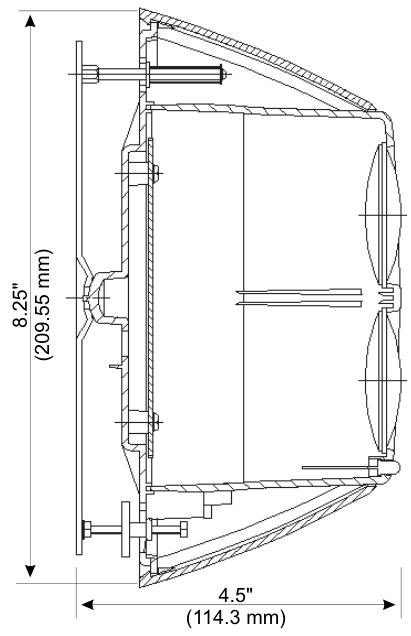
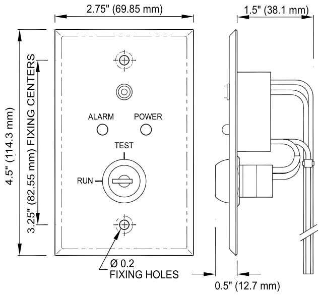
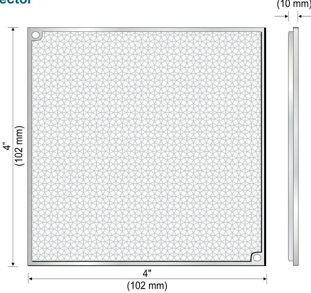

# Reflective Beam Smoke Detector EC-50R/-100R  

# Overview  

The EC-50R/-100R comprises a transmitter and receiver in a single enclosure and is usually installed between 19 inches and 24 inches below the ceiling. The transmitter emits an invisible infrared light beam that is reflected via a prism mounted directly opposite and with a clear line of sight. The reflected infrared light is detected by the receiver and analyzed. Smoke in the beam path will reduce the received infrared light proportionally to the density of the smoke. The detector analyzes this attenuation or obscuration of light and acts accordingly. Detectors are typically mounted within $\pm30$ feet $(9.14\,\mathsf{m})$ of a potential fire source. Consult your Authority Having Jurisdiction for spacing requirements specific to your locality.  

# Standard Features  

Coverage: 50R range 15 -160 ft (4.6 - 48.8 m); 100R range 160- 330 ft (48.8 - 100 m)   
•	 Microprocessor controlled   
•	 Automatic drift compensation   
•	 Simple alignment   
•	 Selectable alarm thresholds   
•24 Vdc operating voltage   
•	 Latching or non-latching operation   
•	 Low current consumption Optional Ground Level Test Station  

# Operation  

Alarm Threshold: Alarm thresholds of $25\%$ ,$35\%$ and $50\%$ obscuration can be selected to suit the environment, with $25\%$ the most sensitive setting. The factory default setting is 35 percent and is used for most typical applications. If the received infrared signal reduces to below the selected threshold for approximately 10 seconds, the fire relay is activated.  

Fire Alarm: There are two modes to the operation of the fire relay. Auto reset mode will reset the fire relay 5 seconds after the received infrared signal has recovered to a level above the Alarm threshold. Latching mode holds the fire relay active indefinitely after an Alarm condition has occurred. To clear the latched mode, power must be removed from the Detector for a minimum of 5 seconds.  

Trouble Alarm: If the infrared beam is obscured rapidly to a level of $90\%$ or greater for approximately 10 seconds, the Trouble relay is activated. Typical causes of trouble include an object being placed in the beam path, transmitter failure, loss of the prism, or sudden misalignment of the detector. The Trouble relay will reset within 2 seconds of the trouble being cleared.  

Automatic Gain Control (AGC): The Detector monitors long term degradation of signal strength caused by component aging or build up of dirt on optical surfaces. By comparing the received infrared signal against a standard every 15 minutes, the detector automatically compensates for signal differences of less than 0.7dB/hour. When the detector is showing AGC fault, detector is still capable of generating an alarm, and will display both Alarm and Trouble indications.  

# Test Stations  

The optional Ground Level Test Station facilitates testing of a connected detector from safe and convenient location. The unit is key-operated with a two-position Test/Run switch and includes two dedicated LEDs: one for Alarm indication and one for Power indication.  

When the test station key is inserted and turned to the Test position, the Power LED flashes to indicate that power is connected and that the 2-wire data link cable is correctly installed. After several seconds in the test position, the test station initiates an alarm at the detector head, which is indicated by the red LED on the detector and the Alarm LED on the test station. Test mode automatically times out after 20 seconds at which time the detector returns to standby mode, regardless of the test station keyswitch position.  

Connection between the test station and the detector is made by means of a 2-wire data link cable. The test station requires a 10.2 - 30 Vdc power connection.  

Test Filter: A test filter is supplied with the detector, which is used to verify the alarm threshold. See the installation sheet for details on testing and calibration.  

# Application  

Reflective beam smoke detectors are ideal for large open areas such as warehouses, hotel atriums, industrial plants and school gymnasiums.  

An infrared signal is projected out of the transmitter optics to the reflector placed at the opposite end of the detection zone. The signal is reflected back to the receiver where it is analyzed for fire and trouble. The EC-50R/-100R must be positioned correctly to minimize the detection time. The maximum lateral distance either side of the beam is found to be typically 30 feet (9.1 m) for satisfactory detection under flat ceilings, providing a total area coverage of 19,800 square feet (60 feet $\times\,330$ feet), or 1844 square metres ( $18.3\times100.6\,\mathrm{m})$ ).  

Smoke stratification may be overcome by mounting multiple beam detectors at different heights, one of which will project an infrared beam below the heat layer and into the smoke layer.  

Detection time will be longer in a building with a peaked roof if a fire occurs at the fringes of the protected area. If in doubt conduct appropriate smoke tests.  

The ideal location and spacing of the Detector is critical in a properly installed and operating fire alarm system. It is recommended that the detectors be located and spaced in accordance with the National Fire Protection Association (NFPA) Standard 72 "The National Fire Code".  No liability will be accepted for applications not conforming to NFPA regulations.  

The recommended installation height is approximately 19 to 24 inches (483 to 610 mm) below the ceiling. However, in all installations the National Fire Standards for that country/state must be consulted.  

Because of  the reflecting properties of the beam, all objects must be kept a minimum of 19 inches (483 mm) away from the centre of the beam path down the entire beam length. If highly reflective surfaces are close to the beam, then greater clearances should be applied.  

# Reflector Positioning  

Mount the reflector(s) on a secure surface directly opposite the detector. Ensure that there is a clear line of sight between the detector and the reflector(s), and that no moving objects such as doors or mechanical equipment interfere with the beam path. All objects should be kept a minimum of 19 inches $(483\,\mathsf{m m})$ away from the center of the detector beam down the entire length of the beam path. Reflectors should not be mounted on glass or reflective surfaces.  

EC-50R detectors should be mounted between 15 and 160 feet (4.6 and 48.8m) from a single reflector.  

  

  
EC-100R detectors should be mounted between 160 and 330 feet (48.8 and $100.6\;\mathrm{m};$ ) from a group of four reflectors.  

# Detector Spacing  

  

Detector positioning shown here is recommended for protected areas with flat ceilings. Spacing may vary for areas with high or sloped ceilings. In such cases, verify operation with smoke tests.  

In some cases potential smoke layering may be overcome by installing multiple beam detectors at different heights.  

# Typical Wiring  

The field wiring interface is accessed through the back plate of the detector head. The 8-pin connector is the interface to the field and is numbered left to right. This diagram is an example for a single reflective beam unit installed as the only device on a zone. The correct operation for Fire and Trouble should always be verified. Relays are shown in quiescent (standby) condition. Alarm and End of Line resistor values are determined by the fire alarm control panel and market standard practices.  

  
Zone Wiring   
Ground Level Test Station  

  

# Detector Installation  

Install the detector to a secure surface not subject to movement or vibration. Use the template provided to mark and install four fixing points. Secure the rear mounting plate to the four fixing points through the keyholes on the plate.  

When installing the detector on a wall supported with wood studs, ensure the fixing points are secured directly to the supporting stud. When installing the detector on a wall supported with metal studs, mount a metal plate at least $1/8^{"}\:(3.2\:\mathsf{m m})$ thick across two studs and secure the detector to the plate.  

# Dimensions  

Detector  

  
Test Station  

  
Reflector  

  

# Engineering Specifications EC-50R  

The projected beam type smoke detector shall be listed to UL 268 and shall consist of an integrated transmitter and receiver. The beam detector shall operate between a range of 15 and 160 feet (4.57 and 48.77 m). It shall feature automatic gain control, which will compensate for gradual signal deterioration due to dirt accumulation on the lenses. The unit shall include a wall mounting bracket. Testing shall be carried out using a calibrated test filter. It shall be possible to test the detector without direct access to it by means of a remotely installed key-operated test station.  

# EC-100R  

The projected beam type smoke detector shall be listed to UL 268 and shall consist of an integrated transmitter and receiver. The beam detector shall operate between a range of 160 and 330 feet (48.77 and $100\;\mathrm{m})$ ). It shall feature automatic gain control, which will compensate for gradual signal deterioration due to dirt accumulation on the lenses. The unit shall include a wall mounting bracket. Testing shall be carried out using a calibrated test filter. It shall be possible to test the detector without direct access to it by means of a remotely installed key-operated test station.  

# Ordering Information  

<html><body><table><tr><td colspan="2">Description</td><td>Ship Wt Ib (kg)</td></tr><tr><td>P/N EC-50R</td><td>EC-50RReflective BeamSmokeDetector c/wtestfilterandone</td><td>2.0 (0.90)</td></tr><tr><td>EC-100R</td><td>reflector EC-100RReflective BeamSmokeDetector c/wtestfilterandfour reflectors</td><td>2.0 (0.90)</td></tr><tr><td>EC-LLT</td><td>Ground Level Test Station</td><td>1.0 (0.45)</td></tr><tr><td>23901- 01</td><td>ReplacementReflector forEC-50R/-100R</td><td>1.0 (0.45)</td></tr></table></body></html>  

# Technical Specifications  

Beam Detector   

<html><body><table><tr><td>Compatibility</td><td>AllEDWARDSFireAlarm Control Panels</td></tr><tr><td>Power Supply</td><td>10.2Vdc to30Vdc(continu- ous power)</td></tr><tr><td>Current</td><td>Standby:Less than 4 mA Alarm/Trouble:Lessthan14 mA</td></tr><tr><td>Contacts</td><td>Alarm: Normally Open, rated 2A,30Vdc,resistive Trouble:NormallyClosed,</td></tr><tr><td>Signal Delay</td><td>rated2A,30Vdc，resistive Alarmandtrouble:10sec- onds</td></tr><tr><td>ResetTime</td><td>>5seconds (power down)</td></tr><tr><td>Dimensions (HxWxD)</td><td>8.25 in x 5.1 in x 4.7 in (21 cm ×13 cm×12 cm)</td></tr><tr><td>Weight</td><td>1.5 Ib (0.68 kg)</td></tr><tr><td>Operating Environment</td><td>Temperature:32°Fto100°F (0° C to 37° C) Humidity:93%RH,Non- condensing</td></tr><tr><td>Beam Coverage</td><td>Width:30 ft (9.14 m)either sideof beam Length,EC-50R:15 ft to 160 ft (4.57 m to 48.77 m) Length, EC-100R: 160 ft to 330 ft (48.77 m to 100 m)</td></tr><tr><td>Alarm Thresholds</td><td>2.50dB (25%),3.74dB (35%), 6.02dB (50%)obscuration</td></tr><tr><td>Optical Wavelength</td><td>880nm</td></tr><tr><td>Agency Listings</td><td>UL, ULC, CE</td></tr></table></body></html>  

<html><body><table><tr><td colspan="2">TestStation</td></tr><tr><td>Operating voltage</td><td>10.2to30Vdc</td></tr><tr><td>Off current</td><td>0 mA</td></tr><tr><td>On current</td><td>8 mA max (alarm)</td></tr><tr><td>Wiring Ter- minations</td><td>Suitablefor#12to#18AWG (2.5 mm2 to 0.75 mm2)wire size.Shielded twistedpair recommended.</td></tr><tr><td>Operating temperature</td><td>32°Fto100F</td></tr><tr><td>Key refer- ence</td><td>A126</td></tr><tr><td>Humidity</td><td>max93%RH(noncondens ing)</td></tr><tr><td>Agency Listings</td><td>UL, MEA, CSFM</td></tr></table></body></html>  