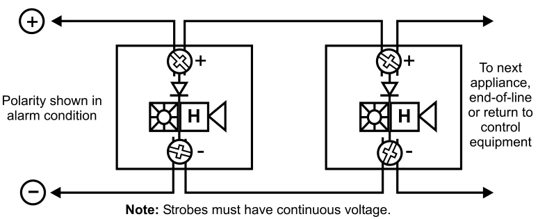

# Field Configurable Horns and Strobes Genesis Series  

# Overview  

The Genesis line of fire alarm and mass notification/emergency communications (ECS/MNS) signals are among the smallest, most compact audible-visible life safety signaling devices in the world. About the size of a deck of playing cards, these devices are designed to blend with any decor.  

Thanks to patented breakthrough technology, EDWARDS Genesis strobes do not require bulky specular reflectors and lenses. Instead, an exclusive cavity design conditions light to produce a highly controlled distribution pattern. Significant development efforts employing this new technology have given rise to a new benchmark in strobe performance – FullLight technology.  

FullLight strobe technology produces a smooth light distribution pattern without the spikes and voids characteristic of specular reflectors. This ensures the entire coverage area receives consistent illumination from the strobe flash. As a result, Genesis strobes with FullLight technology go well beyond the UL-1971 and ULC-S526 light distribution requirements.  

Genesis strobes and horn-strobes offer selectable candela output by means of a conveniently-located switch on the side of the device. Models are also available that offer fixed 15/75 cd output. The candela output setting remains clearly visible even after final installation, yet it stays locked in place to prevent unauthorized tampering.  

Genesis ECS/MNS appliances offer emergency signaling with clear or amber lenses and with optional ALERT housing labels. They are ideal for applications that require differentiation between fire alarm and mass notification alerts.  

# Standard Features  

# Unique low-profile design  

– The most compact UL-1971/ULC-S526 listed strobe available   
– Ultra-slim – protrudes less than one inch   
– Attractive appearance   
– No visible mounting screws  

# •	 Four field-configurable options in one device  

– Select 15, 30, 75, or 110 cd strobe output – Select high (default) or low dB horn output – Select temporal (default) or steady horn output – Select public mode flash rate (default) or private mode temporal flash  

# Fixed 15/75 cd model available  

# ECS/MNS models available  

# Easy to install  

– Fits standard 1-gang electrical boxes  – no trim plate needed – Optional trim plate accommodates oversized openings – Pre-assembled with captive hardware – #12 AWG terminals – ideal for long runs or existing wiring  

# Unparalleled performance  

– Industry’s most even light distribution – Meets tough synchronizing standards for strobes – Single microprocessor controls both horn and strobe – Independent horn control over a single pair of wires – Highly regulated in-rush current – Multiple frequency tone improves sound penetration – Field-programmable temporal strobe output option  

# Application  

Genesis strobes are UL 1971-listed for use indoors as wall-mounted public-mode notification appliances for the hearing impaired. Prevailing codes require strobes to be used where ambient noise conditions exceed 105 dBA (87dBA in Canada), where occupants use hearing protection, and in areas of public accommodation as defined in the Americans with Disabilities Act (see application notes – USA).  

Combination horn-strobe signals must be installed in accordance with guidelines established for strobe devices. Consult with your Authority Having Jurisdiction for details.  

All Genesis strobes exceed UL synchronization requirements (within 10 milliseconds over a two-hour period) when used with a synchronization source.  Synchronization is important in order to avoid epileptic sensitivity.  

WARNING: These devices will not operate without electrical power. As fires frequently cause power interruptions, further safeguards such as backup power supplies may be required.  

# Horns  

Genesis horn output reaches as high as 99 dB and features a unique multiple frequency tone that results in excellent sound penetration and an unmistakable warning of danger. Horns may be configured for either coded or non-coded signal circuits. They can also be set for low dB output with a jumper cut that reduces horn output by about 5 dB. Horn-only models may be ceiling-mounted or wall-mounted.  

The suggested sound pressure level for each signaling zone used with alarm signals is at least 15 dB above the average ambient sound level, or 5 dB above the maximum sound level having a duration of at least 60 seconds, whichever is greater, measured 5 feet (1.5 m) above the floor. The average ambient sound level is, A-weighted sound pressure measured over a 24-hour period.  

Doubling the distance from the signal to the ear will theoretically result in a 6 dB reduction of the received sound pressure level. The actual effect depends on the acoustic properties of materials in the space. A 3 dBA difference represents a barely noticeable change in volume.  

# ECS/MNS Applications  

Genesis ECS/MNS strobe appliances bring the same highperformance fire alarm features and unobtrusive design to mass notification applications. Available with amber lenses and optional ALERT housing labels, they are ideal for applications that require differentiation between fire alarm and mass notification alerts.  

# Installation  

Genesis horns and strobes mount to any standard one-gang surface or flush electrical box. Matching optional trim plates are used to cover oversized openings and can accommodate one-gang, two-gang, four-inch square, or octagonal boxes, and European 100 mm square.  

All Genesis signals come pre-assembled with captive mounting screws for easy installation. Two tabs at the top of the signal unlock the cover to reveal the mounting hardware. The shallow depth of Genesis devices leaves ample room behind the signal for extra wiring. Once installed with the cover in place, no mounting screws are visible.  

  
Genesis Horn/Strobe with optional trim plate  

# Field Configuration  

Temporal horn and horn-strobe models are factory set to sound in a three-pulse temporal pattern. Units may be con  

figured for use with coded systems by cutting a jumper on  the circuit board. This results in a steady output that can be turned on and off (coded) as the system applies and removes power to the signal circuit. A Genesis Signal Master is required when hornstrobe models are configured for coded systems. Non-temporal, horn-only models sound a steady tone.  

Genesis clear strobes and horn-strobes are shipped from the factory ready for use as UL 1971 compliant signals for public mode operation. These signals may be configured for temporal flash by cutting a jumper on the circuit board. This battery-saving feature is intended for private mode signaling only.  

Genesis clear strobes and horn-strobes may be set for 15, 30, 75, or 110 candela output. The output setting is changed by simply opening the device and sliding the switch to the desired setting. The device does not have to be removed to change the output setting. The setting remains visible through a small window on the side of the device after the cover is closed.  

Horns and horn-strobes are factory set for high dB output. Low dB output may be selected by cutting a jumper on the circuit board. This reduces the output by about 5 dB.  

# Wiring  

Field wiring terminals accommodate $\#18$ to $\#12$ AWG $(0.75\;\mathrm{mm}^{2}$ to $2.5\;\mathrm{mm}^{2})$ ) wiring. Horns, strobes, and combination horn-strobes are interconnected with a single pair of wires as shown below.  

  

# Strobes, Horn-Strobes  

Multi-cd Wall Strobes (G1-VM)   

<html><body><table><tr><td rowspan="2">UL Rating</td><td>15cd*</td><td>30cd*</td><td>15/75cd**</td><td>75cd*</td><td>110cd*</td></tr><tr><td>RMS</td><td>RMS</td><td>RMS</td><td>RMS</td><td>RMS</td></tr><tr><td>16Vdc</td><td>103</td><td>141</td><td>152</td><td>255</td><td>311</td></tr><tr><td>16Vfwr</td><td>125</td><td>179</td><td>224</td><td>346</td><td>392</td></tr></table></body></html>

\*G1-VM multi-cd; \*\*G1F-V1575 fixed 15/75 cd  

<html><body><table><tr><td rowspan="2">Typical Current</td><td>15cd</td><td>30 cd</td><td>15/75</td><td>75cd</td><td>110cd</td></tr><tr><td>RMS</td><td>RMS</td><td>RMS</td><td>RMS</td><td>RMS</td></tr><tr><td>16 Vdc</td><td>85</td><td>127</td><td>150</td><td>245</td><td>285</td></tr><tr><td>20Vdc</td><td>71</td><td>98</td><td>123</td><td>188</td><td>240</td></tr><tr><td>24 Vdc</td><td>59</td><td>82</td><td>104</td><td>152</td><td>191</td></tr><tr><td>33Vdc</td><td>46</td><td>64</td><td>84</td><td>112</td><td>137</td></tr><tr><td>16Vfwr</td><td>119</td><td>169</td><td>223</td><td>332</td><td>376</td></tr><tr><td>20 Vfwr</td><td>103</td><td>143</td><td>189</td><td>253</td><td>331</td></tr><tr><td>24 Vfwr</td><td>94</td><td>129</td><td>169</td><td>218</td><td>262</td></tr><tr><td>33Vfwr</td><td>87</td><td>112</td><td>148</td><td>179</td><td>205</td></tr></table></body></html>  

Wall Temporal Horn-strobes – High dB Setting   

<html><body><table><tr><td rowspan="2">UL Rating</td><td>15 cd*</td><td>30 cd*</td><td>15/75 cd**</td><td>75 cd*</td><td>110 cd*</td><td rowspan="4">G1-HDVMmulti-cd G1F-HDV1575fixed15/75cd</td></tr><tr><td>RMS</td><td>RMS</td><td>RMS</td><td>RMS</td><td>RMS</td></tr><tr><td>16Vdc</td><td>129</td><td>167</td><td>172</td><td>281</td><td>337</td></tr><tr><td>16Vfwr</td><td>176</td><td>230</td><td>269</td><td>397</td><td>443</td></tr></table></body></html>  

<html><body><table><tr><td rowspan="2">Typical Current</td><td>15cd</td><td>30cd</td><td>15/75</td><td>75cd</td><td>110cd</td></tr><tr><td>RMS</td><td>RMS</td><td>RMS</td><td>RMS</td><td>RMS</td></tr><tr><td>16 Vdc</td><td></td><td>135</td><td>160</td><td></td><td></td></tr><tr><td>20Vdc</td><td>102 88</td><td>109</td><td>137</td><td>246 193</td><td>309 248</td></tr><tr><td>24Vdc</td><td>81</td><td>94</td><td>122</td><td>161</td><td>203</td></tr><tr><td>33Vdc</td><td>74</td><td>72</td><td>106</td><td>124</td><td>154</td></tr><tr><td>16Vfwr</td><td>144</td><td>182</td><td>247</td><td>352</td><td>393</td></tr><tr><td>20 Vfwr</td><td>141</td><td>162</td><td>220</td><td>274</td><td>362</td></tr><tr><td>24 Vfwr</td><td>136</td><td>152</td><td>203</td><td>235</td><td>282</td></tr><tr><td>33Vfwr</td><td>125</td><td>144</td><td>196</td><td>201</td><td>232</td></tr></table></body></html>  

Wall Temporal Horn-strobes – Low dB Setting   

<html><body><table><tr><td rowspan="2">UL Rating</td><td>15 cd*</td><td>30 cd*</td><td>15/75 cd**</td><td>75 cd*</td><td>110 cd*</td><td rowspan="2"></td></tr><tr><td>RMS</td><td>RMS</td><td>RMS</td><td>RMS</td><td>RMS</td></tr><tr><td>16Vdc</td><td>122</td><td>160</td><td>146</td><td>274</td><td>330</td><td>*G1-HDVMmulti-cd</td></tr><tr><td>16Vfwr</td><td>162</td><td>216</td><td>231</td><td>383</td><td>429</td><td>k* G1F-HDV1575fixed15/75cd</td></tr></table></body></html>  

<html><body><table><tr><td rowspan="2">Typical Current</td><td>15cd</td><td>30cd</td><td>15/75</td><td>75 cd</td><td>110cd</td></tr><tr><td>RMS</td><td>RMS</td><td>RMS</td><td>RMS</td><td>RMS</td></tr><tr><td>16 Vdc</td><td>96</td><td>130</td><td>158</td><td>243</td><td>302</td></tr><tr><td>20 Vdc</td><td>79</td><td>104</td><td>133</td><td>189</td><td>241</td></tr><tr><td>24Vdc</td><td>68</td><td>88</td><td>119</td><td>156</td><td>197</td></tr><tr><td>33Vdc</td><td>56</td><td>71</td><td>100</td><td>118</td><td>146</td></tr><tr><td>16Vfwr</td><td>128</td><td>180</td><td>241</td><td>344</td><td>389</td></tr><tr><td>20 Vfwr</td><td>118</td><td>157</td><td>213</td><td>266</td><td>343</td></tr><tr><td>24 Vfwr</td><td>113</td><td>144</td><td>195</td><td>230</td><td>279</td></tr><tr><td>33Vfwr</td><td>112</td><td>137</td><td>182</td><td>197</td><td>226</td></tr></table></body></html>  

# Horns  

Wall or Ceiling Mounted Temporal Horns (G1-HD)   

<html><body><table><tr><td>UL Rating</td><td>High dB (RMS)</td><td>LowdB (RMS)</td></tr><tr><td>16Vdc</td><td>26</td><td>19</td></tr><tr><td>24Vdc</td><td>36</td><td>27</td></tr><tr><td>33Vdc</td><td>41</td><td>33</td></tr><tr><td>16 Vfwr</td><td>51</td><td>37</td></tr><tr><td>24 Vfwr</td><td>69</td><td>52</td></tr><tr><td>33Vfwr</td><td>76</td><td>70</td></tr></table></body></html>  

<html><body><table><tr><td>Typical</td><td>High dB</td><td>LowdB</td></tr><tr><td>Current</td><td>RMS</td><td>RMS</td></tr><tr><td>16Vdc</td><td>22</td><td>17</td></tr><tr><td>20Vdc</td><td>24</td><td>19</td></tr><tr><td>24Vdc</td><td>27</td><td>22</td></tr><tr><td>33Vdc</td><td>32</td><td>26</td></tr><tr><td>16 Vfwr</td><td>34</td><td>30</td></tr><tr><td>20 Vfwr</td><td>40</td><td>34</td></tr><tr><td>24 Vfwr</td><td>45</td><td>38</td></tr><tr><td>33Vfwr</td><td>52</td><td>47</td></tr></table></body></html>  

Wall or Ceiling Mounted Horns (G1-P)   

<html><body><table><tr><td>UL Designation</td><td>VoltageRange</td><td>Max.Current, RMS</td></tr><tr><td>Regulated 24 Vdc</td><td>16-33Vdc</td><td>13 mA</td></tr><tr><td>24 fwr</td><td>16-33Vfwr</td><td>11 mA</td></tr><tr><td></td><td colspan="2"></td></tr><tr><td>Typical Current</td><td colspan="2">RMS</td></tr><tr><td>24Vdc</td><td colspan="2">10</td></tr><tr><td>24Vdc</td><td colspan="2">11</td></tr><tr><td>31Vdc</td><td colspan="2">12</td></tr><tr><td>20Vfwr</td><td colspan="2">9</td></tr><tr><td>24Vfwr</td><td colspan="2">10</td></tr></table></body></html>  

Current values are shown in mA.  

# dBA output  

Temporal Horns, Horn-strobes (G1-HD, G1-HDVM series)   

<html><body><table><tr><td rowspan="2">High dB Setting</td><td colspan="2">UL464</td><td>Average</td><td>Peak</td></tr><tr><td>Temporal</td><td>Steady</td><td>Temporal/ Steady</td><td>Temporal/ Steady</td></tr><tr><td>16Vdc</td><td>81.4</td><td>85.5</td><td>91.4</td><td>94.2</td></tr><tr><td>24Vdc</td><td>84.4</td><td>88.6</td><td>94.5</td><td>97.6</td></tr><tr><td>33Vdc</td><td>86.3</td><td>90.4</td><td>96.9</td><td>99.5</td></tr></table></body></html>  

<html><body><table><tr><td rowspan="2">LowdB Setting</td><td colspan="2">UL464</td><td>Average</td><td>Peak</td></tr><tr><td>Temporal</td><td>Steady</td><td>Temporal/ Steady</td><td>Temporal/ Steady</td></tr><tr><td>16Vdc</td><td>76.0</td><td>80.1</td><td>86.3</td><td>89.2</td></tr><tr><td>24Vdc</td><td>79.4</td><td>83.5</td><td>89.8</td><td>92.5</td></tr><tr><td>33Vdc</td><td>82.1</td><td>86.5</td><td>92.5</td><td>95.3</td></tr></table></body></html>  

Steady Tone Horns (G1-P series)   

<html><body><table><tr><td></td><td>UL464</td><td>Average</td><td>Peak</td></tr><tr><td>16 Vdc</td><td>77 dBA, min</td><td>85dBA</td><td>91 dBA</td></tr><tr><td>16Vfwr</td><td>77 dBA, min</td><td>85dBA</td><td>91 dBA</td></tr></table></body></html>  

# Notes  

1.	 All values shown are dBA measured at 10 feet $(3.01\,\mathsf{m})$ .  
2.	 UL464 values measured in reverberant room.   
3.	 Average and Peak values are measured in anechoic chamber.  

# Specifications  

<html><body><table><tr><td>Housing</td><td>Red or white textured UV stabilized, color impregnated engineered plastic. Exceeds 94V-0 UL flammability rating.</td></tr><tr><td>Lens</td><td>Opticalgradepolycarbonate(clear)</td></tr><tr><td>Mounting (indoor only)</td><td>Flush mount: 212 inch (64 mm) deep one-gang box Surfacemount:Model27193surfacemountbox,wiremoldbox,orequivalentsurface-mountbox</td></tr><tr><td>Wire connections</td><td>With optional trim plate: One-gang, two-gang, four-inch square, octagonal, or European single-gang box</td></tr><tr><td>Operating environment</td><td>Indooronly:32-120°F(0-49°C)ambient temperature.93%relativehumidity</td></tr><tr><td>Agency listings/approvals</td><td>UL1971 (S218),UL1638 (S218),UL464 (S218),ULC S525,ULC S526,CSFM,CE,FCC,MEA</td></tr><tr><td>Dimensions (HxWxD)</td><td>Signal:4-1/2"x2-3/4"×13/16"(113mm×68mm×21mm)</td></tr><tr><td rowspan="3">Operating voltage</td><td>G1-HD series temporal-tone horns: non-coded, filtered 16-33 Vdc or unfiltered 16-33 Vdc FWR (or coded when horn</td></tr><tr><td>settosteadytone) G1-HDVM series temporal-tone horn-strobes: non-coded, filtered 16-33 Vdc or unfiltered 16-33 Vdc FWR (or coded</td></tr><tr><td>G1-VMseriesstrobes:non-coded,filtered16-33Vdcorunfiltered16-33VdcFWR</td></tr><tr><td>Strobe output rating</td><td>G1-Pseriessteady-tonehorns:coded ornon-coded,filtered 20-31Vdc orunfiltered 20-27Vfwr UL 1971,UL1638,ULC S526:selectable 15cd,30 cd,75cd,or110 cd output UL 1971:15 cd (fixed 15/75 cd models)</td></tr><tr><td>Strobeflashrate</td><td>UL1638,ULCS526:75 cd (fixed 15/75 cd models) G1-VM strobes and G1-HDVM series temporal-tone horn-strobes: one flash per second synchronized with optional</td></tr><tr><td>SynchronizationSources</td><td>temporal output of horns on same circuit SIGA-CC1S,SIGA-MCC1S,SIGA-CC2A,SIGA-MCC2A,G1M-RM BPS6A,BPS10A,APS6A,APS10A,iO64,iO500,FireshieldPlus 3,5and 10z0ne.</td></tr><tr><td>Horn pulse rate</td><td>AddG1MforG1-CVM&G1-HDVMdevicesonly. G1-HD temporal-tone horns and G1-HDVM series temporal-tone horn-strobes: temporal rate synchronized with optional G1MGenesisSignal Masterindefinitelywithin10 milliseconds.G1-P steady-tonehorns:continuous,steadytone only</td></tr><tr><td>Temporal audiblepattern</td><td>12 sec ON, %2 sec OFF, V2 sec ON, 2 sec OFF, V2 sec ON, 112 sec OFF, then repeat cycle</td></tr></table></body></html>  

<html><body><table><tr><td>Lens Color</td><td>Rating</td><td>Switch PositionA</td><td>Switch Position B</td><td>Switch Position C</td><td>Switch Position D</td></tr><tr><td>Amber</td><td>UL 1638</td><td>110cd</td><td>75 cd</td><td>30cd</td><td>15 cd</td></tr><tr><td>Amber</td><td>UL 1971*</td><td>88cd</td><td>60cd</td><td>24 cd</td><td>12 cd</td></tr><tr><td>Clear</td><td>UL 1971</td><td>110 cd</td><td>75 cd</td><td>30cd</td><td>15 cd</td></tr></table></body></html>

\* Equivalent Rating  

  
ECS/MNS appliances available with clear or amber lenses.  

  

# Ordering Information  

Model Housing Marking Lens Strobe  

Fire Alarm Appliances (c/w running man icon screen printed on housing)   

<html><body><table><tr><td></td><td></td><td></td><td></td><td></td><td></td><td></td><td></td></tr><tr><td>G1-VM</td><td>White</td><td>None</td><td>Clear</td><td>Selectable 15,30,75,or 110 cd</td><td>Strobe only</td><td>0.25 (0.11)</td><td></td></tr><tr><td>G1F-HD</td><td>White</td><td>FIRE</td><td>Clear</td><td>Horn only</td><td>Selectablehigh/lowdB</td><td>0.25</td><td>(0.11)</td></tr><tr><td>G1F-HDV1575</td><td>White</td><td>FIRE</td><td>Clear</td><td>15/75 cd1</td><td>Temporalhi/lodB-24V</td><td>0.25 (0.11)</td><td></td></tr><tr><td>G1F-HDVM</td><td>White</td><td>FIRE</td><td>Clear</td><td>Selectable15,30,75,or110cd</td><td>Selectablehigh/lowdB</td><td>0.25 (0.11)</td><td></td></tr><tr><td>G1F-P</td><td>White</td><td>FIRE</td><td>Clear</td><td>Steady Horn (not compatible with GenesisSignal Master)</td><td></td><td>0.25</td><td>(0.11)</td></tr><tr><td>G1F-V1575</td><td>White</td><td>FIRE</td><td>Clear</td><td>15/75 cd1</td><td>Strobe only</td><td>0.25</td><td>(0.11)</td></tr><tr><td>G1F-VM</td><td>White</td><td>FIRE</td><td>Clear</td><td>Selectable 15,30,75,or 110 cd</td><td>Strobe only</td><td>0.25</td><td>(0.11)</td></tr><tr><td>G1-HD</td><td>White</td><td>None</td><td>Clear</td><td>Horn only</td><td>Selectablehigh/lowdB</td><td>0.25</td><td>(0.11)</td></tr><tr><td>G1-HDVM</td><td>White</td><td>None</td><td>Clear</td><td>Selectable 15,30,75,or110cd</td><td>Selectablehigh/lowdB</td><td>0.25 (0.11)</td><td></td></tr><tr><td>G1-P</td><td>White</td><td>None</td><td>Clear</td><td>Steady Horn (not compatible with Genesis Signal Master)</td><td></td><td>0.25</td><td>(0.11)</td></tr><tr><td>G1RF-HD</td><td>Red</td><td>FIRE</td><td>Clear</td><td>Horn only</td><td>Selectablehigh/low dB</td><td>0.25</td><td>(0.11)</td></tr><tr><td>G1RF-HDV1575</td><td>Red</td><td>FIRE</td><td>Clear</td><td>15/75 cd1</td><td>Temporal hi/lo dB-24V</td><td>0.25</td><td>(0.11)</td></tr><tr><td>G1RF-HDVM</td><td>Red</td><td>FIRE</td><td>Clear</td><td>Selectable15,30,75,or110cd</td><td>Selectablehigh/lowdB</td><td>0.25</td><td>(0.11)</td></tr><tr><td>G1RF-P</td><td>Red</td><td>FIRE</td><td>Clear</td><td>Steady Horn (not compatible with Genesis Signal Master)</td><td></td><td>0.25</td><td>(0.11)</td></tr><tr><td>G1RF-V1575</td><td>Red</td><td>FIRE</td><td>Clear</td><td>15/75 cd1</td><td>Strobe only</td><td>0.25</td><td>(0.11)</td></tr><tr><td>G1RF-VM</td><td>Red</td><td>FIRE</td><td>Clear</td><td>Selectable 15,30,75,or110 cd</td><td>Strobe only</td><td>0.25</td><td>(0.11)</td></tr><tr><td>G1R-HD</td><td>Red</td><td>None</td><td>Clear</td><td>Horn only</td><td>Selectablehigh/lowdB</td><td>0.25 (0.11)</td><td></td></tr><tr><td>G1R-HDVM</td><td>Red</td><td>None</td><td>Clear</td><td>Selectable15,30,75,or110cd</td><td>Selectablehigh/lowdB</td><td>0.25</td><td>(0.11)</td></tr><tr><td>G1R-P</td><td>Red</td><td>None</td><td>Clear</td><td>Steady Horn (not compatible with Genesis Signal Master)</td><td></td><td>0.25</td><td>(0.11)</td></tr><tr><td>G1R-VM</td><td>Red</td><td>None</td><td>Clear</td><td>Selectable 15,30,75,or 110 cd</td><td>Strobe only</td><td>0.25 (0.11)</td><td></td></tr></table></body></html>  

Ship Wt. lbs (kg)  

ECS/MNS Appliances (no running man icon on housing)   

<html><body><table><tr><td>G1WA-VMA</td><td>White</td><td>ALERT</td><td>Amber</td><td>SelectableA,B,CorD</td><td>Strobe only</td><td>0.25 (0.11)</td></tr><tr><td>G1WA-VMC</td><td>White</td><td>ALERT</td><td>Clear</td><td>Selectable15,30,75,or110cd</td><td>Strobe only</td><td>0.25 (0.11)</td></tr><tr><td>G1WN-VMA</td><td>White</td><td>None</td><td>Amber</td><td>SelectableA,B,CorD</td><td>Strobe only</td><td>0.25 (0.11)</td></tr><tr><td>G1WN-VMC</td><td>White</td><td>None</td><td>Clear</td><td>Selectable15,30,75,or110cd</td><td>Strobe only</td><td>0.25 (0.11)</td></tr></table></body></html>  

Trim Plates   

<html><body><table><tr><td>G1T</td><td>White</td><td>None</td><td>Genesis Trim Plate (for two-gang or 4" square boxes)</td><td>0.15 (0.7)</td></tr><tr><td>G1RT</td><td>Red</td><td>None</td><td>Genesis TrimPlate (for two-gang or 4"square boxes)</td><td>0.15 (0.7)</td></tr><tr><td>G1T-FIRE</td><td>White</td><td>FIRE</td><td>Genesis TrimPlate(for two-gang or 4"square boxes)</td><td>0.15 (0.7)</td></tr><tr><td>G1RT-FIRE</td><td>Red</td><td>FIRE</td><td>GenesisTrimPlate(for two-gang or 4"square boxes)</td><td>0.15 (0.7)</td></tr><tr><td>G1WT-ALERT</td><td>White</td><td>ALERT</td><td>Genesis Trim Plate (for two-gang or 4" square boxes)</td><td>0.15 (0.7)</td></tr></table></body></html>  

Surface Boxes   

<html><body><table><tr><td>27193-16</td><td>White</td><td>N/A</td><td>One-gangsurfacemountbox</td><td>1 (0.4)</td></tr><tr><td>27193-11</td><td>Red</td><td>N/A</td><td>One-gangsurfacemountbox</td><td>1 (0.4)</td></tr></table></body></html>  

¹ These 15/75 cd models provide fixed output and are not multi-candela devices. The 15 cd output component complies with UL1971, while the 75 cd output component complies with UL 1638.  