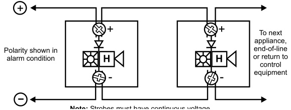

# Chimes &Chime-Strobes Genesis Series  

# Overview  

The Genesis line of signals are among the smallest, most compact audible-visible emergency signaling devices in the world. About the size of a deck of playing cards, these devices are designed to blend with any decor.  

Thanks to patented breakthrough technology, EDWARDS Genesis strobes do not require bulky specular reflectors and lenses. Instead, an exclusive cavity design conditions light to produce a highly controlled distribution pattern. Significant development efforts employing this new technology have given rise to a new benchmark in strobe performance – FullLight technology.  

FullLight strobe technology produces a smooth light distribution pattern without the spikes and voids characteristic of specular reflectors. This ensures the entire coverage area receives consistent illumination from the strobe flash. As a result, Genesis strobes with FullLight technology go well beyond the minimum UL-required “T” pattern, significantly exceeding UL-1971 light distribution requirements.  

Genesis strobes and chime-strobes offer 15 to 110 candela output, which is selectable with a conveniently-located switch on the side of the device. The candela output setting remains clearly visible even after final installation, yet it stays locked in place to prevent unauthorized tampering.  

Genesis signals feature textured housings in architecturally neutral white or traditional fire red. An ingenious iconographic symbol indicates the purpose of the device. This universal symbol is code-compliant and is easily recognized by all building occupants regardless of what language they speak. Models with “FIRE” markings are also available.  

# Standard Features  

# Unique low-profile design  

–	 The most compact UL-1971 listed strobe available   
–	 Ultra-slim – protrudes less than one inch from the wall   
–	 Attractive appearance   
–	 No visible mounting screws  

# Three field-configurable options in one device  

–	 Select 15, 30, 75, or 110 cd strobe output   
–	 Select non-coded (default), temporal, or coded (single  
stroke) chime operation   
–	 Select high (default) or low dB chime output  

# Easy to install  

–	 Fits standard 1-gang electrical boxes  – no trim plate needed –	 Optional trim plate accommodates oversized openings –	 Pre-assembled with captive hardware –	 #12 AWG terminals – ideal for long runs or existing wiring  

# Unparalleled performance  

–	 Single microprocessor controls both chime and strobe –	 Chime produces a pleasing mellow tone –	 Independent chime control over a single pair of wires –	 Industry’s most even light distribution –	 Meets tough synchronizing standards for strobes –	 Low current draw minimizes system overhead –	 Highly regulated in-rush current  

# Application  

# Strobes  

Genesis strobes are UL 1971-listed for use indoors as wall-mounted public-mode notification appliances for the hearing impaired. Prevailing codes require strobes to be used where ambient noise conditions exceed specified levels, where occupants use hearing protection, and in areas of public accommodation. Consult with your Authority Having Jurisdiction for details.  

All Genesis strobes exceed UL synchronization requirements (within 10 milliseconds other over a two-hour period) when used with a synchronization source.  Synchronization is important in order to avoid epileptic sensitivity.  

NOTE: The flash intensity of some visible signals may not be adequate to alert or waken occupants in the protected area. Research indicates that the intensity of strobe needed to awaken $90\%$ of sleeping persons is approximately 100 cd. EDWARDS recommends that strobes in sleeping rooms be rated at at least 110 cd.  

WARNING: These devices will not operate without electrical power. As fires frequently cause power interruptions, further safeguards such as backup power supplies may be required.  

# Chimes  

Genesis chimes produce a pleasing mellow tone. When steady (non-stroked) voltage is applied, the chime automatically pulses at 60 strokes per minute, or may be field-configured for temporal output. When installed with a GIM Signal Master Module, the chime may also be field-configured for coded operation, which enables the chime output to match the rate that voltage is applied to the circuit.  

The chime’s 79 dBA (peak) output level makes this device suitable for many private mode applications. Chimes may be set for low dB output with a jumper cut that reduces sound output by about 5 dB.  

Genesis chimes are intended as audible signaling devices for private-mode applications. For public-mode audible signaling, use Genesis horns and horn-strobes.  

Suggested sound pressure level for each private mode signaling zone used with alert or alarm signals is at least 10 dB above the average ambient sound level, or 5 dB above the maximum sound level having a duration of at least 60 seconds, whichever is greater, measured $5'$ $(1.5\;\mathsf{m})$ . above the floor. The average ambient sound level is the RMS, A-weighted sound pressure measured over a 24-hour period.  

Doubling the distance from the signal to the ear will theoretically result in a 6 dB reduction of the received sound pressure level. The actual effect depends on the acoustic properties of materials in the space. A 3 dBA difference represents a barely noticeable change in volume.  

# Chime dBA output  

<html><body><table><tr><td rowspan="2"></td><td colspan="2">UL464</td><td colspan="2">Average</td><td colspan="2">Peak</td></tr><tr><td>high</td><td>low</td><td>high</td><td>low</td><td>high</td><td>low</td></tr><tr><td>16Vdc</td><td>58.2</td><td>52.8</td><td>66.1</td><td>61</td><td>77</td><td>72.8</td></tr><tr><td>24Vdc</td><td>60.8</td><td>55.6</td><td>67.8</td><td>63.2</td><td>78.6</td><td>74.7</td></tr><tr><td>33Vdc</td><td>61.3</td><td>56.1</td><td>68.1</td><td>63.7</td><td>79.4</td><td>75.9</td></tr></table></body></html>

Notes 1.	 All values shown are measured at 10 feet (3.01m). 2.	 UL464 values measured in reverberation room. 3.	 Average and peak values are measured in anechoic chamber.  

# Installation  

Genesis chimes and strobes mount to any standard one-gang surface or flush electrical box. Matching optional trim plates are used to cover oversized openings and can accommodate one-gang, two-gang, four-inch square, or octagonal boxes, and European 100 mm square.  

All Genesis signals come preassembled with captive mounting screws for easy installation. Two tabs at the top of the  

# Genesis Chime-strobe with optional trim plate  

ing hardware. The shallow depth of Genesis devices leaves ample room behind the signal for extra wiring. Once installed with the cover in place, no mounting screws are visible.  

# Field Configuration  

Genesis strobes and chime-strobes may be set for 15, 30, 75, or 110 candela output. The output setting is changed by simply opening the device and sliding the switch to the desired setting. The device does not have to be removed to change the output setting. The setting remains visible through a small window on the side of the device after the cover is closed.  

Chimes and chime-strobes are factory set for high dB output. Optional low dB output may be selected by cutting a jumper on the circuit board. This reduces the audible output by about 5 dB.  

A second jumper cut changes the chime output from the factory set rate of 60 strokes per minute to three-pulse temporal output.  

Chimes may also be configured for single-stroke coded operation. This operates the chime once each time voltage is applied to the circuit. Voltage must be discontinued and then re-applied to operate the chime again. These optional coders produce a predetermined pattern of audible signals. A Genesis Signal Master is required when chimes are configured for coded operation.  

# Wiring  

Field wiring terminals accommodate #18 to #12 AWG $(0.75\,\mathsf{m m}^{2}$ to $2.5\:\mathrm{mm}^{2})$ wiring. Chimes, strobes, and combination chime-strobes are interconnected with a single pair of wires as shown below.  

  

# Current Draw  

Multi-cd Wall Temporal Chime-strobes (G1-CVM) – High dB Setting   

<html><body><table><tr><td rowspan="2">UL Rating</td><td>15cd</td><td>30cd</td><td>75cd</td><td>110cd</td></tr><tr><td>RMS</td><td>RMS</td><td>RMS</td><td>RMS</td></tr><tr><td>16Vdc</td><td>99</td><td>134</td><td>233</td><td>277</td></tr><tr><td>16Vfwr</td><td>154</td><td>195</td><td>338</td><td>383</td></tr></table></body></html>  

<html><body><table><tr><td rowspan="2">Typical Current</td><td>15cd</td><td>30 cd</td><td>75cd</td><td>110cd</td></tr><tr><td>RMS</td><td>RMS</td><td>RMS</td><td>RMS</td></tr><tr><td>16 Vdc</td><td>106</td><td>141</td><td>255</td><td>311</td></tr><tr><td>20Vdc</td><td>94</td><td>119</td><td>205</td><td>257</td></tr><tr><td>24Vdc</td><td>85</td><td>105</td><td>174</td><td>214</td></tr><tr><td>33Vdc</td><td>72</td><td>87</td><td>137</td><td>162</td></tr><tr><td>16Vfwr</td><td>152</td><td>199</td><td>356</td><td>402</td></tr><tr><td>20Vfwr</td><td>144</td><td>180</td><td>300</td><td>379</td></tr><tr><td>24 Vfwr</td><td>140</td><td>170</td><td>262</td><td>312</td></tr><tr><td>33Vfwr</td><td>140</td><td>162</td><td>223</td><td>256</td></tr></table></body></html>  

Multi-cd Wall Temporal Chime-strobes (G1-CVM) – Low dB Setting   

<html><body><table><tr><td rowspan="2">UL Rating</td><td>15cd</td><td>30 cd</td><td>75cd</td><td>110cd</td></tr><tr><td>RMS</td><td>RMS</td><td>RMS</td><td>RMS</td></tr><tr><td>16Vdc</td><td>88</td><td>123</td><td>222</td><td>266</td></tr><tr><td>16Vfwr</td><td>134</td><td>175</td><td>318</td><td>363</td></tr></table></body></html>  

<html><body><table><tr><td rowspan="2">Typical Current</td><td>15cd</td><td>30cd</td><td>75cd</td><td>110cd</td></tr><tr><td>RMS</td><td>RMS</td><td>RMS</td><td>RMS</td></tr><tr><td>16Vdc</td><td>101</td><td>137</td><td>247</td><td>302</td></tr><tr><td>20Vdc</td><td>85</td><td>112</td><td>194</td><td>247</td></tr><tr><td>24Vdc</td><td>75</td><td>97</td><td>165</td><td>205</td></tr><tr><td>33Vdc</td><td>61</td><td>77</td><td>124</td><td>149</td></tr><tr><td>16 Vfwr</td><td>139</td><td>187</td><td>350</td><td>395</td></tr><tr><td>20Vfwr</td><td>127</td><td>164</td><td>277</td><td>356</td></tr><tr><td>24 Vfwr</td><td>119</td><td>152</td><td>239</td><td>284</td></tr><tr><td>33Vfwr</td><td>116</td><td>139</td><td>202</td><td>230</td></tr></table></body></html>  

Wall Chimes (G1-C)   

<html><body><table><tr><td>ULRating</td><td>High dB (RMS)</td><td>Low dB (RMS)</td></tr><tr><td>16Vdc</td><td>30</td><td>19</td></tr><tr><td>24Vdc</td><td>43</td><td>26</td></tr><tr><td>33Vdc</td><td>45</td><td>27</td></tr><tr><td>16Vfwr</td><td>60</td><td>40</td></tr><tr><td>24 Vfwr</td><td>76</td><td>49</td></tr><tr><td>33Vfwr</td><td>81</td><td>55</td></tr></table></body></html>  

Wall Chimes (G1-C)   

<html><body><table><tr><td rowspan="2">Typical Current</td><td>High dB</td><td>LowdB</td></tr><tr><td>RMS</td><td>RMS</td></tr><tr><td>16Vdc</td><td>32</td><td>20</td></tr><tr><td>20Vdc</td><td>41</td><td>24</td></tr><tr><td>24Vdc</td><td>44</td><td>26</td></tr><tr><td>33Vdc</td><td>46</td><td>27</td></tr><tr><td>16 Vfwr</td><td>65</td><td>43</td></tr><tr><td>20 Vfwr</td><td>75</td><td>48</td></tr><tr><td>24 Vfwr</td><td>77</td><td>51</td></tr><tr><td>33Vfwr</td><td>84</td><td>56</td></tr></table></body></html>  

# Notes and Comments  

1.	 Current values are shown in mA.   
2.	 UL Nameplate Rating can vary from Typical Current due to measurement methods and instruments used.   
3.	 EDWARDS recommends using the Typical Current for system design including NAC and Power Supply loading and voltage drop calculations.   
4.	 Use the Vdc RMS current ratings for filtered power supply and battery AH calculations. Use the Vfwr RMS current ratings for unfiltered power supply calculations.   
5.	 Fuses, circuit breakers and other overcurrent protection devices are typically rated for current in RMS values. Most of these devices operate based upon the heating affect of the current flowing through the device. The RMS current (not the mean current) determines the heating affect and therefore, the trip and hold threshold for those devices.   
6.	 Our industry has used ‘mean’ currents over the years.  However, UL will direct the industry to use the 2004 RMS values in the future.  

# Specifications  

<html><body><table><tr><td>Housing</td><td></td></tr><tr><td>Lens</td><td>Optical grade polycarbonate (clear)</td></tr><tr><td>Mounting (indoor wall mount</td><td>Flush mount: 212 inch (64 mm) deep one-gang box Surfacemount:Model 27193surfacemountbox,wiremoldbox,orequivalentsurface-mountbox</td></tr><tr><td>only) Wireconnections</td><td>With optional trim plate: One-gang, two-gang, four-inch square, octagonal, or European single-gang box Screw terminals: single input for both chime and strobe. #18 to #12 AWG (0.75 mm2 to 2.5 mm2) wire size</td></tr><tr><td>Operating environment</td><td>32-120°F (0-49°C) ambient temperature.</td></tr><tr><td>Agency listings/approvals</td><td>93% relative humidity UL 1971, UL 1638, UL 464, CE, FCC, MEA, CSFM (FM pending). (All models comply with ADA Code of Federal</td></tr><tr><td>Dimensions (HxWxD)</td><td>Regulation Chapter 28 Part 36 Final Rule.) Signal: 4-1/2"×2-3/4"x 13/16" (113 mm × 68 mm × 21 mm)</td></tr><tr><td>Operating voltage</td><td>Trimplate: 5"(127 mm);Height -5-7/8"(149 mm); Depth -V2" (13 mm) G1-C series chimes: non-coded,filtered 16-33 Vdc or unfiltered 16-33 Vdc FWR (or coded when chime set to single-strokeoperation)</td></tr><tr><td>Strobe output rating</td><td>G1-CVM series chime-strobes: non-coded, filtered 16-33 Vdc or unfiltered 16-33 Vdc FWR (or coded (audible UL1971,UL1638:selectable 15 cd,30cd,75 cd,or 110cdoutput</td></tr><tr><td>Strobe flashrate</td><td>G1-CVM series chime-strobes:oneflashper second synchronized with optional G1M GenesisSignal Master</td></tr><tr><td>SynchronizationSources</td><td>indefinitely within 10 milliseconds (or self-synchronized within 200 milliseconds over thirty minutes on a common circuitwithoutG1MGenesisSignalMaster)</td></tr><tr><td></td><td>G1M-RM,SIGA-CC1S,SIGA-MCC1S,BPS6A,BPS10A</td></tr><tr><td>Chimepulserate</td><td>withoptional G1MGenesisSignal Master,indefinitelywithin10milliseconds(orself-synchronizedwithin200 milliseconds over thirty minutes on a common circuit without the G1M Genesis Signal Master); coded operation - up to one stroke per second (Genesis G1M Signal Master required).</td></tr></table></body></html>  

# Ordering Information  

<html><body><table><tr><td colspan="2">CatalogNumber</td><td rowspan="2">Description</td><td rowspan="2">Ship Wt. Ibs (kg)</td></tr><tr><td>White Finish</td><td>Red Finish</td></tr><tr><td>G1-CVM</td><td>G1R-CVM</td><td>GenesisChime-Strobe(selectable15,30,75,or110cd</td><td rowspan="3">0.25 (0.11)</td></tr><tr><td>G1-C</td><td>G1R-C</td><td>output,selectablehigh/lowdBoutput) GenesisChime(selectablehigh/lowdBoutput)</td></tr><tr><td>G1F-CVM</td><td>G1RF-</td><td>GenesisChime-Strobe(selectable15,30,75,or110 cdoutput,selectablehigh/lowdBoutput)-with“FiRE"</td></tr><tr><td>G1F-C</td><td>CVM G1RF-C</td><td>marking Genesis Chime (selectable high/low dB output)-"FIRE" marking</td><td></td></tr></table></body></html>  

Mounting Accessories   

<html><body><table><tr><td>G1T</td><td>G1RT</td><td>Genesis Trim Plate (for two-gang or 4" square boxes)</td><td rowspan="2">0.15 (0.7)</td></tr><tr><td>G1T-FIRE</td><td>G1RT- FIRE</td><td>Genesis Trim Plate (for two-gang or4” square boxes) with “FIRE markings</td></tr><tr><td>27193-16</td><td>27193-11</td><td>One-gang surfacemount box</td><td>1 (0.4)</td></tr></table></body></html>  

Synchronization Modules   

<html><body><table><tr><td colspan="2"></td><td rowspan="2">0.2 (0.1)</td></tr><tr><td>G1M</td><td>GenesisSignalMaster-Snap-onMount</td></tr><tr><td>G1M-RM</td><td>GenesisS Signal Master -Remote Mount (1-gang)</td><td rowspan="2">0.5 (0.23)</td></tr><tr><td>SIGA-CC1S</td><td>Intelligent Synchronization Output Module (2-gang)</td></tr><tr><td>SIGA-MCC1S</td><td>IntelligentSynchronization Output Module (Plug-in UIO)</td><td>0.18 (0.08)</td></tr></table></body></html>  