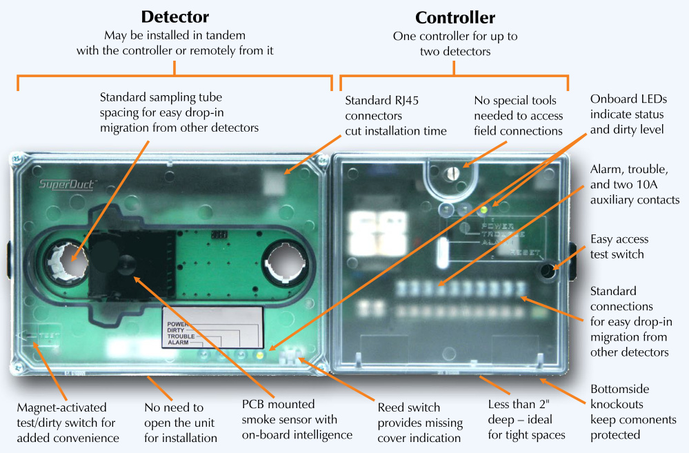

# Four-wire Duct Smoke Detector ESD-4W  

# Overview  

EDWARDS SuperDuct smoke detectors are the most advanced and most reliable devices in their class. Designed for easy installation and superb reliability, SuperDuct represents the perfect balance of practical design and advanced technology.  

Reliability and stability are two features built into every SuperDuct detector. SuperDuct features environmental compensation with patented differential sensing. This achieves a level of stability and reliability never before achieved for devices of this type. With differential sensing, SuperDuct sensors are immune from sensitivity drift – a common cause of false alarms. Every eight minutes the SuperDuct sensor checks its environment for dirt, humidity other conditions that normally interfere with sensor operation, and automatically adjusts its sensitivity to compensate. The result is unparalleled reliability and rock solid stability – two features essential to any duct smoke detection application.  

Sensitivity testing and diagnostics reveal some of the most exciting innovations built into SuperDuct. With the ingenious SuperDuct remote test station, a sensitivity test can be performed at any time from the safety and comfort of a maintenance office or utility room. Operated either by key or by magnet, the one-gang station also performs alarm tests for detectors connected to a single controller. Detectors may also be tested at the controller via a test switch, or they can be tested individually in the field with a simpleto-operate magnetic test tool. Access to the magnetic reed switch does not require the detector cover to be removed, so testing can be performed quickly and easily.  

A dedicated dirty/trouble LED on each unit offers immediate at-aglance information even when the cover is closed.  

# Standard Features  

# Detector assembly  

•	 Less than $2"$ deep for easy installation PCB mounted photoelectric detector with on-board intelligence •Environmental compensation with patented differential sensing •$-4^{\circ}\mathsf{F}$ to $158\sqrt{}$ (- $\cdot20^{\circ}\mathrm{C}$ to $70^{\circ}\mathrm{C})$ operating range 100 ft/min. to 4,000 ft/min air velocity rating •Standard RJ45 modular interconnection •Status LEDs remain visible through clear assembly cover Cover tamper reed switch for added security •Standard sampling tube and mounting holes •Install in tandem with the controller assembly, or remotely from it Sampling tubes install from front-side or back-side of housing Magnet-activated test/dirty/reset switch •	 No need to open the detector for installation  

# Controller  

•	 One controller for up to two detectors   
•	 Standard connections for easy migration from other detectors 24 Vac, 24 Vdc, 120 Vac or 230 Vac operation   
•	 Status LEDs remain visible through clear assembly cover   
•	 Knockouts located on the bottom   
Alarm contact, trouble contact, and two 10 amp auxiliary contacts   
No special tools required for easy access to field connections   
Interconnect up to 15 controllers for multiple fan shut- down  

# Configuration  

SuperDuct detectors and controllers feature a unique modular design that speeds installation and simplifies maintenance. Separate housings enable access to either the controller or detector without affecting the other.  

Underside conduit knockouts, rubber cable glands, and optional water-resistant gaskets keep contaminants away from components, ensuring years of trouble-free service. When cleaning is required, the detector comes apart easily and snaps back together in seconds.  

The detector assembly provides easy access to the smoke sensor, its wiring connections, sample and exhaust tube fittings, and the smoke chamber itself. Air enters the assembly by means of an air sampling tube (ordered separately), and exits by means of a six-inch exhaust tube (included). The sampling tube may be installed from either  

the air duct side of the assembly or from inside the sensor compartment, as preferred by the installer. (The exhaust tube must be installed from the air duct side.) Sampling tubes may be rotated in 45-degree increments so that air-holes can be aligned to allow the unit to be mounted at virtually any angle relative to the air flow.  

# The controller can  

accommodate up to two detectors. One or both detectors may be installed remotely from the con  

troller. A Category 5 wiring harnesses (ordered separately) is used for interconnection when detectors are installed remotely from the controller. Harnesses are terminated with RJ45 connectors and come in lengths of up to 15 feet. Controllers and detectors may also be ordered with terminal blocks for interconnection wiring. All models come with terminal blocks for customer connection of the on-board relays to external equipment. High voltage power input terminals are suitable for #22 AWG to #12 AWG wire while all other terminals can handle #22 AWG to #14 AWG wires.  

# SuperDuct Highlight: Remote Test/Reset Station  

SuperDuct’s ingenious labor-saving Remote Test/Reset stations not only provide remote alarm testing, they also annunciate detector dirt levels. Tests can be performed quickly and safely – without having to climb to the roof. Magnetically-operated and key-operated one-gang models are available.  

  

# Application  

SuperDuct smoke detection is ideally suited to HVAC applications where early indication of combustion is required within the confined space of ventilation ductwork.  

Duct detectors are usually installed on the supply duct after the air filters, or in the return air stream prior to being diluted by outside air.  

SuperDuct detectors continually sample air flow in the HVAC duct and initiate an alarm condition whenever smoke is detected.  An alarm is activated when the quantity (percent obscuration) of combustion products in that air sample exceeds the detector’s sensitivity setting.  

Air velocity in the duct as low as 100 ft/min. maintains adequate air flow into the sensor smoke chamber through air-holes in the air sampling tube and discharges through the exhaust tube. SuperDuct air sampling tubes must be installed with the inlet holes  

  
SuperDuct Overview  

facing the airstream. Sampling tubes may be rotated in 45-degree increments so that air-holes can be aligned to allow the unit to be mounted in virtually any angle relative to the airflow.  

SuperDuct detectors are engineered to operate optimally under the harsh environmental conditions frequently found in HVAC ductwork. Nonetheless, before installing the detector, test the duct air velocity, temperature, and humidity to verify that it is within the operating range of the SuperDuct detector. Consult the SuperDuct installation sheet for details.  

# Typical Layout  

With SuperDuct, smoke detection for two airstreams can be monitored with just one set of field connections for fan shut-down, damper control, etc.  

  

# Installation  

Up to two detectors may be connected to a single controller. Typically, the detector comes attached to  the controller, connected by means of an integral cable (provided).  

Alternatively, one or both detectors may be installed remotely from the controller and connected by means of either a cable with RJ45 connectors, or terminal blocks (see ordering information for details).  

Wiring between detector and controller, along with wiring between controller and fire alarm panel (if used) is supervised.  

# Assembly  

Controllers and detectors come pre-assembled for easy installation for the RJ-45 models. They are sold separately for the terminal versions.  

# Interconnection  

  
RJ-45 Model  

# High-humidity environments  

Use the SD-PH Protective Housing when installing SuperDuct detectors in high-humidity environments. The SD-PH is a weatherized housing that prevents condensation on the device by insulating the detectors and providing circulated air from the monitored HVAC duct. The SD-PH also adds a layer of protection against physical damage to the unit.  

  

The SD-PH is easy to install and service. The hinged and transparent cover provides ready access to the detector, while keeping its status indicators visible at all times.  

Note:	The SD-PH Protective Housing is weatherized against outdoor air, but it is not intended for direct outdoor exposure.  

# Terminal Model  

  

  
Fire alarm initiating circuit wiring  

End-of-line resistor required on last device for circuit supervision.   
Use resistor value specified by the fire alarm panel manufacturer.   
Note: This configuration is not allowed when using remote test stations.  

# Power input wiring  

  
Auxiliary relay wiring  

# Multiple fan shutdown interconnect wiring  

  

# Remote test station wiring  

<html><body><table><tr><td>Controller 15</td><td>Remoteteststation</td></tr><tr><td>19</td><td>1 Alarm 4</td></tr><tr><td>13</td><td>Power</td></tr><tr><td>3 20 2</td><td>5 Trouble 3 Reset/Test</td></tr></table></body></html>

Note: For applications where only the Alarm LED and Reset/Test switch is required, wiring the Power LED and Trouble LED is optional.  

# Dimensions  

# Controller and Detector (mounted in tandem)  

  

  

  

<html><body><table><tr><td></td><td>Controller: 6.75" x 5.45" x 1.90" inches (17.15 cm x 13.84 cm x 4.83 cm)</td></tr><tr><td>Dimensions</td><td>Sensor: 8.70" x 5.45"x 1.90" (22.10 cm x 13.84 cm x 4.83 cm) Controller with sensor: 14.51"x 5.45" x 1.90" (36.86 cm x 13.84 cm x 4.83 cm)</td></tr><tr><td>Wiresize</td><td>High voltage power input terminals (L&N): #12 to #22 AWG Allothers: #14 to #22 AWG DetectortoController:100feetmaxforeachdetector</td></tr><tr><td>Wiring distance</td><td>Test Station to Controller:10 ohms max.per wire (i.e. 621 feet with 22 AWG,3,952 feet with 14 AWG)</td></tr><tr><td>RJ-45 wiring harness</td><td>AWG)</td></tr><tr><td>Smokedetectionmethod</td><td>Cable type: CMP Photoelectric</td></tr><tr><td>Air velocity rating</td><td>100to 4,0o0ft/min and meets therequired minimum airpressure differential</td></tr><tr><td>Air pressure differential</td><td>0.005 to 1.00 inches of water</td></tr><tr><td>Sensitivity</td><td>0.67 to 2.46 %obscuration/ft</td></tr><tr><td>Reset time</td><td>2 seconds,max.</td></tr><tr><td>Power up time</td><td>8 seconds, max.</td></tr><tr><td>Alarm test response time</td><td>5 to 7 seconds</td></tr><tr><td>Controller LED indicators</td><td>Alarm (red), Trouble (yellow), Power (green)</td></tr><tr><td>Sensor LED indicators Alarm initiation relay</td><td>Alarm (red), Trouble (yellow), Dirty (yellow), Power (green)</td></tr><tr><td></td><td>Quantity: 1 Style: Normally open Ratings: 2.0 A at 30 Vdc (resistive) Quantity: 2</td></tr><tr><td> Auxiliary relay</td><td>Style: Form C Ratings: 10 A at 30 Vdc, 10 A at 250 Vac (contacts must switch a minimum of 100 mA at 5 Vdc)</td></tr><tr><td>Supervision (trouble) relay</td><td>Quantity: 1 Style: Form C Ratings: 2.0 A at 30 Vdc (resistive)</td></tr><tr><td>Auxiliary output</td><td>18 Vdc, nom., 30 mA, max.</td></tr><tr><td>Operating environment</td><td>Relative humidity: 10 to 93%, noncondensing</td></tr><tr><td>Operating voltages</td><td></td></tr><tr><td>Agency Approvals</td><td>UL, ULC, CSFM, FM, MEA</td></tr></table></body></html>  

# Accessories  

# RJ45 wiring harnesses  

These 8-conductor cables are used to interconnect detectors with controllers. Harnesses are available in 5 ft., 10 ft., and 15 ft. lengths. They include RJ45 connectors with rubber glands to provide a watertight seal at each end.  

# Air Sampling Tubes  

Rigid metal sampling tubes are available in several lengths. They can be installed without the need to open the detector.  

# Remote Test/Reset Station  

The Remote Test/Reset Station provides alarm test or dirty test   
capability from a remote location. It includes a one-gang plate,   
momentary SPST switch, red alarm LED, yellow trouble LED,   
green power LED, and terminal block. Magnetically-operated or   
key-operated models are available. Current Load $@$ 24 Vdc: standby $=5\,\mathsf{m A}$ ala $\mathsf{m}=15\;\mathsf{m A}$ max.  

# Air Velocity Test Kit  

With this kit, and a suitable manometer, testing can be carried out with the duct detector fully installed and wired.  

# Test Magnet  

Used to activate test routine from either a SD-TRM4 Remote Test/ Reset Station, or the detector.  

# Ordering Information  

<html><body><table><tr><td>Catalog Number</td><td>Description</td><td>Ship Wt. Ib. (kg)</td></tr><tr><td colspan="2">ControllersandDetectors</td><td></td></tr><tr><td>ESD-CJ</td><td>Controller(RJ45)</td><td>2.4 (1.1)</td></tr><tr><td>ESD-SJ</td><td>Sensor(RJ45)</td><td>2.4 (1.1)</td></tr><tr><td>ESD-4WJ</td><td>Controllerw/sensor(RJ45)</td><td>3.7 (3.4)</td></tr><tr><td>ESD-CT</td><td>Controller(terminals)</td><td>2.4 (1.1)</td></tr><tr><td>ESD-ST</td><td>Sensor(terminals)</td><td>2.4 (1.1)</td></tr></table></body></html>  

<html><body><table><tr><td colspan="2">Accessories</td></tr><tr><td>SD-T8</td><td>Air sample tube, 8 inch 0.5 (0.2)</td></tr><tr><td>SD-T18</td><td>Air sample tube, 18 inch 1.5 (0.7)</td></tr><tr><td>SD-T24</td><td>Air sample tube, 24 inch 1.1 (0.5)</td></tr><tr><td>SD-T36</td><td>Air sample tube, 36 inch 3.0 (1.4)</td></tr><tr><td>SD-T42</td><td>Air sample tube,42 inch 3.5 (1.6)</td></tr><tr><td>SD-T60</td><td>Air sample tube, 60 inch 5.8 (2.6)</td></tr><tr><td>SD-T78</td><td>Air sample tube, 78 inch 4.1 (1.9)</td></tr><tr><td>SD-T120</td><td>Air sample tube,120 inch 11.5 (5.2)</td></tr><tr><td>SD-RJ15</td><td>RJ45 wiring harness kit -- 15 ft. 1.5 (0.7)</td></tr><tr><td>SD-RJ10</td><td>RJ45 wiring harness kit -- 10 ft. 1.5 (0.7)</td></tr><tr><td>SD-RJ5</td><td>RJ45 wiring harness kit -- 5 ft. 0.6 (0.3)</td></tr><tr><td>SD-TRM4</td><td>Remote test/reset station, magnetic 1.0 (0.5)</td></tr><tr><td>SD-TRK4</td><td>Remote test/reset station, keyed 1.0 (0.5)</td></tr><tr><td>5956A</td><td>Remote LED Alarm Indicator 1.0 (0.5)</td></tr><tr><td>SD-PH</td><td>Protective housing for high humidity areas 5.5 (2.5)</td></tr><tr><td>SD-VTK</td><td>Air velocity test kit (stoppers, etc) 1.0 (0.5)</td></tr><tr><td>SD-GSK</td><td>Cover gasket kit 0.5 (0.2)</td></tr><tr><td>SD-MAG</td><td>Test magnet kit 0.5 (0.2)</td></tr><tr><td>SD-4WPCBT</td><td>Replacement PCB/sensor kit (terminals) 1.0 (0.5)</td></tr><tr><td>SD-4WPCBJ</td><td>ReplacementPCB/sensorkit(RJ45) 1.0 (0.5)</td></tr><tr><td>7140126-01</td><td>ReplacementRJ45interconnectcable 0.5 (0.2)</td></tr><tr><td></td><td></td></tr></table></body></html>  