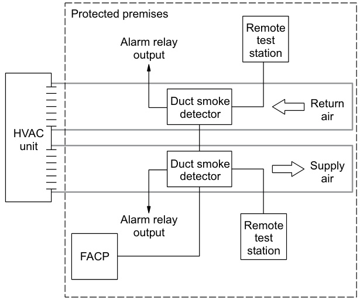
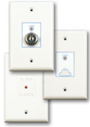
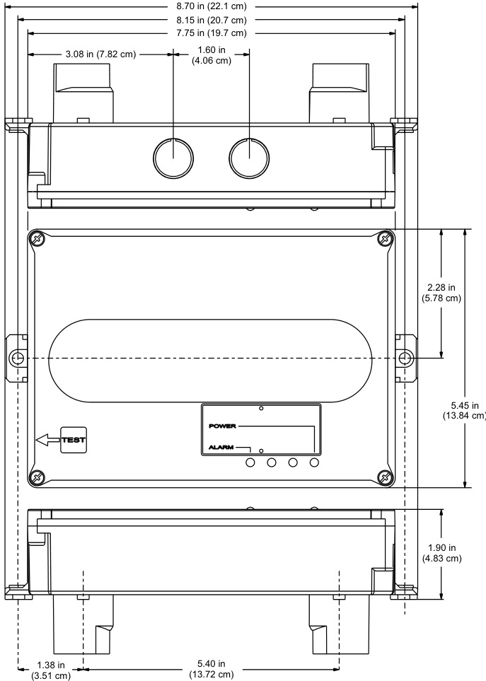
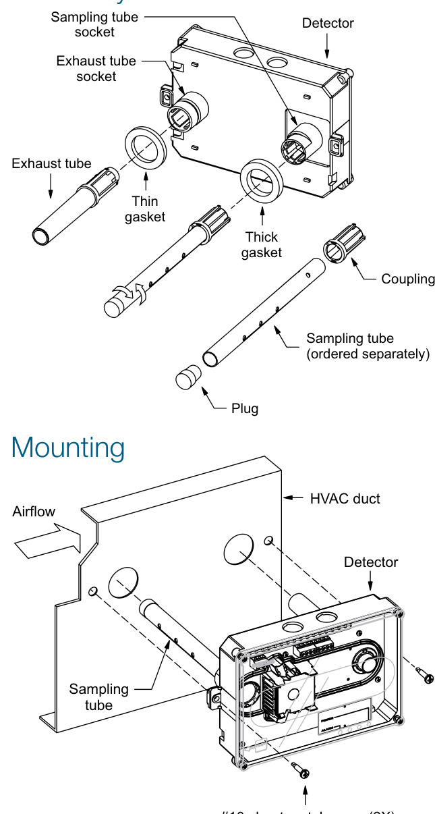
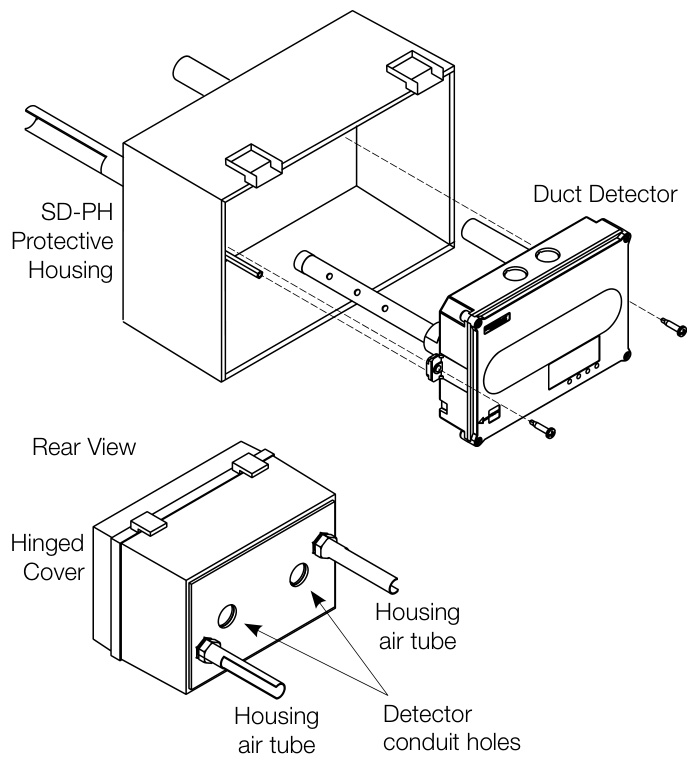
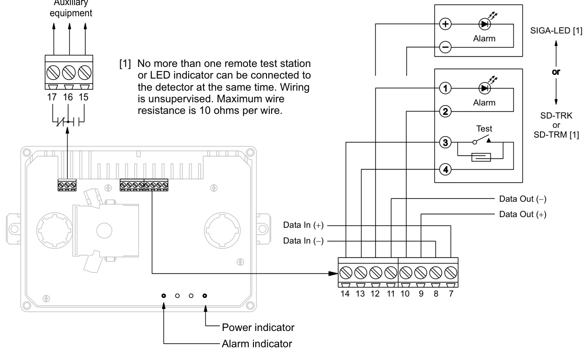

# Intelligent Duct Smoke Detector SIGA-SD  

# Overview  

The EDWARDS SuperDuct Signature Series smoke detector is the most advanced and most reliable device in its class. Designed for easy installation and superb reliability, SuperDuct represents the perfect balance of practical design and advanced technology.  

SuperDuct detectors feature a unique design that speeds installation and simplifies maintenance. Removable dust filters, conformally coated circuit boards, and optional water-resistant gaskets keep contaminants away from components, ensuring years of trouble-free service. When cleaning is required, the assemblies come apart easily and snap back together in seconds.  

A Signature Series photoelectric sensor is incorporated into the design of each SIGA-SD duct smoke detector. This sensor inherits the power and benefits of this exceptional line of intelligent devices.  

Signature Series sensors gather analog information from their smoke sensing elements and convert it into digital signals. The sensor measures and analyses these signals and compares the information to historical readings and time patterns to make an alarm decision. Digital filters remove signal patterns that are not typical of fires, which virtually eliminates unwanted alarms.  

WARNING: Duct detectors have specific limitations. Duct detectors are not a substitute for an open area smoke detector. Duct detectors are not a substitute for early warning detection or a replacement for a building’s regular fire detection system. Smoke detectors are not designed to detect toxic gases which can build up to hazardous levels in some fires. These devices will not operate without electrical power. As fires frequently cause power interruptions, EDWARDS suggests you discuss further safeguards with  your local fire protection specialist.  

# Standard Features  

•	 Less than $2"$ deep for easy installation and applications where space is tight   
•	 - $\cdot20^{\circ}\mathsf{F}$ to $158\sqrt{}\sqrt{}$ (- $-29\mathrm{{^\circ}C}$ to $70^{\circ}\mathrm{C})$ operating range with 100 ft/ min. to 4,000 ft/min air velocity rating assures reliability under harsh environmental conditions   
•	 Status LEDs remain visible through clear assembly cover   
•	 Cover monitor switch for added security   
•	 Standard sampling tube spacing for easy drop-in migration from other detectors   
•	 Sampling tube can be installed with or without the cover in place and can be rotated in 45-degree increments to ensure proper alignment with duct airflow   
•	 15.2 to 19.95 Vdc operation   
•	 Magnet-activated test switch   
•	 One Form C auxiliary alarm relay for controlling ancillary equipment (e.g., HVAC controls)   
•	 No special tools required for easy access to field connections   
•	 Signature Series intelligence   
Environmental compensation with differential sensing for reliable, stable, and drift-free sensitivity   
•	 Wide $0.79\%$ to $2.46\%$ obscuration/ft. smoke sensitivity   
•	 Identification of dirty or defective detectors  

# Application  

SuperDuct detectors are ideally suited to duct smoke detection applications where early indication of combustion is required within the confined space of ventilation ductwork. Its primary purpose is to provide early warning of an impending fire and to prevent smoke from circulating throughout the building. It is typically used to detect smoke in the supply side of the HVAC system but can provide supervision of the return side as well.  

  

SuperDuct detectors continually sample air flow in the HVAC duct and initiate an alarm condition whenever smoke is detected.  An alarm is activated when the quantity (percent obscuration) of combustion products in that air sample exceeds the detector’s sensitivity setting.  

# Signature Series Intelligence  

Like all Signature detectors, the SIGA-SD features electronic addressing and issues a dirty sensor warning when it reaches its preset limit. The dirty sensor warning indicates the sensor is operating within its specified limits but is in need of servicing. When the detector’s ability to compensate for environmental changes has reached its limit, the duct smoke detector signals a trouble condition.  

The SIGA-SD also uses differential sensing to prevent gradual environmental changes from triggering unwanted alarms. A rapid change in environmental conditions, such as smoke from a fire, causes the detector to signal an alarm state, but dust and debris accumulated over time does not change alarm sensitivity.  

Each Signature Series SuperDuct detector contains a microprocessor that performs comprehensive self-diagnostics and stores the results in nonvolatile memory. Stored results include details such as hours of operation, last maintenance date, and number of alarms and troubles. This information can be retrieved and reviewed when desired.  

# Detector Configuration  

The detector assembly cover provides easy access to the smoke sensor, its wiring connections, sample and exhaust tubes, and the smoke chamber itself.  

Air enters the detector’s sensing chamber through a sampling tube (ordered separately) that extends into the duct and is directed back into the ventilation system through an exhaust tube (included). The difference in air pressure between the two tubes pulls the sampled air through the sensing chamber. When a sufficient amount of smoke is detected in the sensing chamber, the detector initiates an alarm.  

The sampling tube may be installed from either the duct side of the assembly or from inside the sensor compartment, as preferred by the installer. (The exhaust tube must be installed from the duct side.) Sampling tubes may be rotated in 45-degree increments so that air-holes can be aligned to allow the unit to be mounted at virtually any angle relative to the air flow.  

In installations where the duct smoke detector’s controls and indicators are hidden from view, a remote test station or an LED indicator can be connected to the detector to provide these functions.  

# Remote Test Stations  

Labor-saving Remote Test/Reset stations provide alarm testing from the convenience of a remote location. Tests can be performed quickly and safely – without having to climb to the roof. Magneticallyoperated and key-operated one-gang models are available. Signature SuperDuct detectors are also compatible with SIGA-LED remote alarm LED.  

  

Air velocity in the duct as low as 100 ft/min. maintains adequate air flow into the sensor smoke chamber through air holes in the air sampling tube and discharges through the exhaust tube. SuperDuct air sampling tubes must be installed with the inlet holes facing the airstream. Sampling tubes may be rotated in 45-degree increments so that air-holes can be aligned to allow the unit to be mounted in virtually any angle relative to the airflow.  

SuperDuct sensors are engineered to operate optimally under the harsh environmental conditions frequently found in HVAC ductwork. Nonetheless, before installing the detector, test the duct air velocity, temperature, and humidity to verify that it is within the operating range of the SuperDuct detector. Consult the SuperDuct installation sheet for details.  

# Dimensions  

  

# Assembly  

  

# Wiring  

# High-humidity environments  

Use the SD-PH Protective Housing when installing SuperDuct detectors in high-humidity environments. The SD-PH is a weatherized housing that prevents condensation on the device by insulating the detectors and providing circulated air from the monitored HVAC duct. The SD-PH also adds a layer of protection against physical damage to the unit.  

  

The SD-PH is easy to install and service. The hinged and transparent cover provides ready access to the detector, while keeping its status indicators visible at all times.  

Note:	 The SD-PH Protective Housing is weatherized against outdoor air, but it is not intended for direct outdoor exposure.  

  

Specifications, detector   

<html><body><table><tr><td>Dimensions</td><td>8.70x5.45x1.90inches (221×138×48mm)</td></tr><tr><td>Wiresize</td><td>14to22AWG</td></tr><tr><td>Detection</td><td>Photoelectric</td></tr><tr><td>method</td><td>(light scattering principle)</td></tr><tr><td>Air velocity rating</td><td>100 to 4,000ft/min and meets the required minimum</td></tr><tr><td>Air pressure</td><td>airpressuredifferential 0.005 to 1.00 inches of</td></tr><tr><td>differential Sensitivity</td><td>water 0.79 to 2.46 %/ft</td></tr><tr><td>Alarmtest</td><td>obscuration 5 seconds</td></tr><tr><td>response time LED indicators</td><td>Alarm (red), Power (green)</td></tr><tr><td>Common alarmrelay</td><td>Unsupervised and power- limited Quantity: 1 Type:Form C Ratings:2.0A at30Vdc</td></tr><tr><td>Operating voltage</td><td>(resistive) 15.2 to19.95Vdc</td></tr><tr><td>Operating current</td><td>Standby:45μAAlarm:45 uA Inrush:1mAStandalone alarm:18 mA</td></tr><tr><td>Operating environment</td><td>Temperature (UL):-20 to 158 °F (-29 to 70 °C). Temperature (ULC): -4 to 120 °F (-29 to 49 °C) Relativehumidity:10to 93%,noncondensing</td></tr><tr><td>Agency listings</td><td>UL,ULC,CSFM,FM,MEA</td></tr></table></body></html>  

# Ordering Information  

# Specifications, test stations  

<html><body><table><tr><td colspan="2">RemoteTest/ResetStationsprovidealarmtest,trouble indication,andreset capabilityfrom a remote loca- tion.They include a one-gang plate,momentary SPST switch,red alarmLED,and terminal block.Magnetically- operated models (TRM) or key-operated models (TRK)</td></tr><tr><td>areavailable. Compatible electrical boxes</td><td>NorthAmerican1-gangbox Standard4-insquarebox, 1-1/2inches deep,with</td></tr><tr><td>LEDindicators</td><td>1-gang cover</td></tr><tr><td>LED type</td><td>Alarm (red) Clearlens</td></tr><tr><td>Wiresize</td><td>14to22AWG</td></tr><tr><td>Resistance per</td><td>10 Ohms,max.</td></tr><tr><td>wire Current</td><td>Seecontrollerspecifications</td></tr><tr><td>requirements LED circuit</td><td>Voltage: 3 Vdc,max.</td></tr><tr><td>ratings Switchratings</td><td>Current:30 mA,max. Voltage: 125 Vdc, max.</td></tr><tr><td>(SD-TRK) Switch ratings</td><td>Current:4 A,max. Voltage:200 Vdc, max.</td></tr><tr><td>(SD-TRM) Compatible detectors</td><td>Current: 0.5 A,max. SuperDuctconventional two-wireandSignatureduct</td></tr><tr><td>Operating environment</td><td>smokedetectors -4°F to158°F(-20°C to 70°C) Humidity: 93% RH,</td></tr><tr><td>Storage</td><td>noncondensing -4to140°F(-20to60°C)</td></tr><tr><td>temperature Agency listings</td><td>UL,ULC,MEA,CSFM</td></tr></table></body></html>  

<html><body><table><tr><td>Catalog Number</td><td>Description</td><td>Ship Wt., Ib. (kg)</td></tr><tr><td>SIGA-SD</td><td>Intelligent SuperDuctDetector</td><td>2.4 (1.1)</td></tr><tr><td colspan="3"></td></tr><tr><td colspan="3">Accessories</td></tr><tr><td>SD-T8</td><td>8-inch sampling tube</td><td>0.5 (0.2)</td></tr><tr><td>SD-T18</td><td>18-inch sampling tube</td><td>1.5 (0.7)</td></tr><tr><td>SD-T24</td><td>24-inch sampling tube</td><td>2.7 (1.2)</td></tr><tr><td>SD-T36</td><td>36-inchsampling tube</td><td>3.0 (1.4)</td></tr><tr><td>SD-T42</td><td>42-inch sampling tube</td><td>3.5 (1.6)</td></tr><tr><td>SD-T60</td><td>60-inchsampling tube</td><td>5.8 (2.6)</td></tr><tr><td>SD-T78</td><td>78-inch sampling tube</td><td>7.5 (3.4)</td></tr><tr><td>SD-T120</td><td>120-inch sampling tube</td><td>11.5 (5.2)</td></tr><tr><td>SD-PH</td><td>Protective housing for high humidity environments</td><td>5.5 (2.5)</td></tr><tr><td>SIGA-LED</td><td>Remote alarm LED</td><td>1.0 (0.5)</td></tr><tr><td>SD-TRM</td><td>Remote test station,magnetic</td><td>1.0 (0.5)</td></tr><tr><td>SD-TRK</td><td>Remote test station, keyed</td><td>1.0 (0.5)</td></tr><tr><td>SD-VTK</td><td>Air velocity test kit (stoppers only, etc)</td><td>1.0 (0.5)</td></tr><tr><td>SD-GSK</td><td>Cover gasket kit</td><td>0.5 (0.2)</td></tr><tr><td>SD-MAG</td><td>Test magnet kit</td><td>0.5 (0.2)</td></tr><tr><td>SIGA-SDPCB</td><td>Replacement PCB/Signature sensor kit</td><td>1.0 (0.5)</td></tr></table></body></html>  