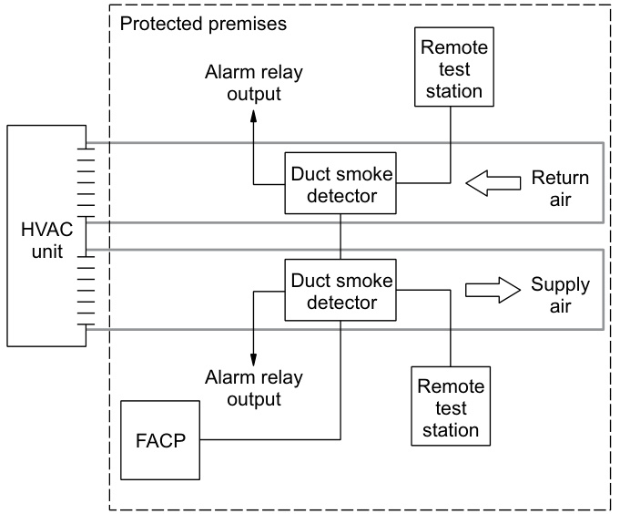
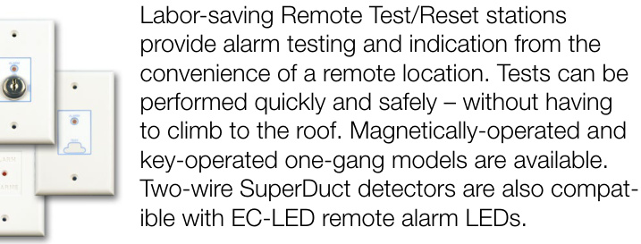
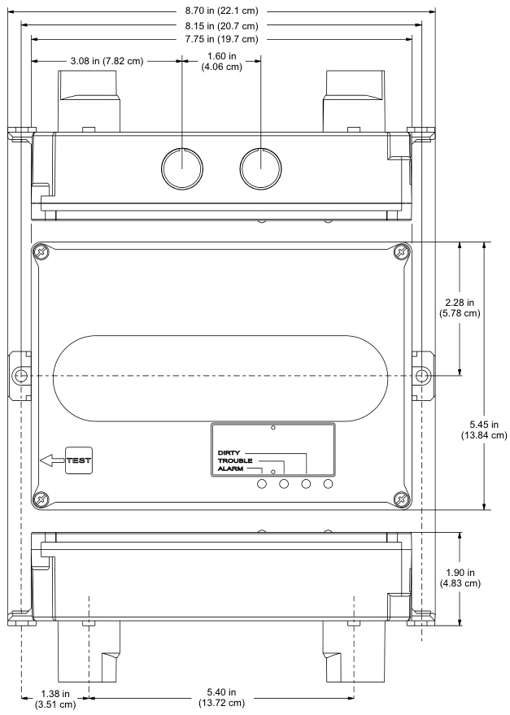
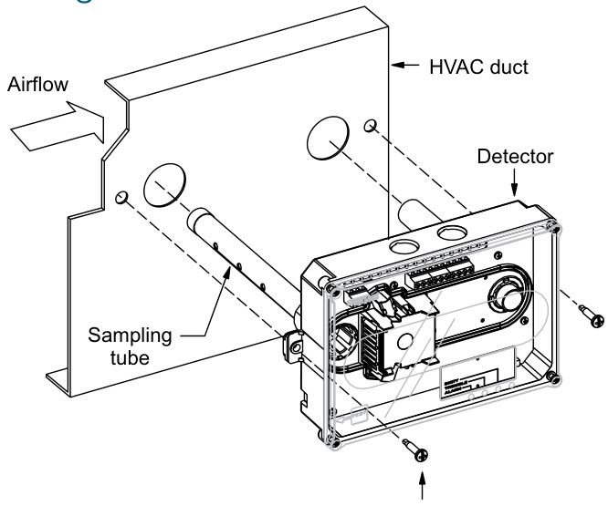
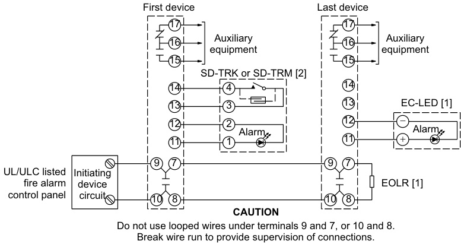
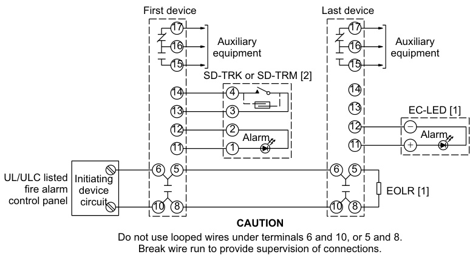
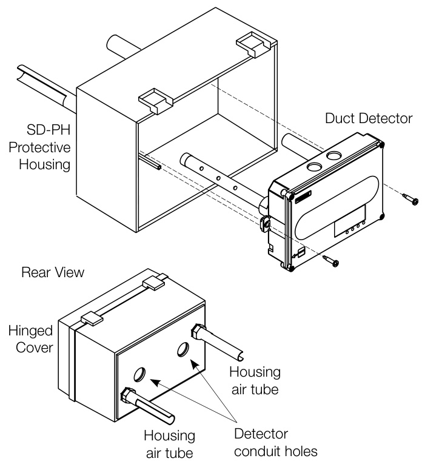

# Two-wire Duct Smoke Detector SuperDuct Series  

# Overview  

SuperDuct is slim feature-rich alternative to bulky duct smoke detectors. Designed for easy installation and superb reliability, SuperDuct represents the perfect balance of practical design and advanced technology.  

SuperDuct detectors feature a unique design that speeds installation and simplifies maintenance. Removable dust filters, conformally coated circuit boards, and optional water-resistant gaskets keep contaminants away from components, ensuring years of trouble-free service. When cleaning is required, the assemblies come apart easily and snap back together in seconds.  

SuperDuct detectors use differential sensing to prevent gradual environmental changes from triggering false alarms. A rapid change in environmental conditions, such as smoke from a fire, causes the detector to automatically signal an alarm condition but dust and debris accumulated over time does not change alarm sensitivity.  

The detector assembly cover provides easy access to the smoke sensor, its wiring connections, sample and exhaust tube fittings, and the smoke chamber itself. Air enters the detector’s sensing chamber through a sampling tube (ordered separately) that extends into the duct and is directed back into the ventilation system through an exhaust tube (included). The difference in air pressure between the two tubes pulls the sampled air through the sensing chamber. When a sufficient amount of smoke is detected in the sensing chamber, the detector initiates an alarm.  

# Standard Features  

# Smoke Sensor  

•	 PCB mounted photoelectric detector with onboard intelligence •	 Environmental compensation with differential sensing for reliable, stable, and drift-free sensitivity •	 Wide $0.79\%$ to $2.46\%$ obscuration/ft. smoke sensitivity  

# Detector assembly  

•	 Less than $2"$ deep for easy installation and applications where space is tight   
•	 - $-4^{\circ}\mathsf{F}$ to $158\sqrt{}$ (- $\cdot20^{\circ}\mathrm{C}$ to $70^{\circ}\mathrm{C}_{\prime}$ ) operating range with 100 ft/min. to 4,000 ft/min air velocity rating assures reliability under harsh environmental conditions   
•	 Status LEDs remain visible through clear assembly cover   
•	 Cover monitor switch for added security   
•	 Standard sampling tube spacing for easy drop-in migration from other detectors   
•	 Sampling tube can be installed with or without the cover in place and can be rotated in 45-degree increments to ensure proper alignment with duct airflow   
•	 On-board Alarm, Trouble, and Dirty LEDs   
•	 Magnet-activated test switch One Form C auxiliary alarm relay for controlling ancillary equipment (e.g., HVAC controls)   
•	 Easy access to field connection terminals  

# Application  

The SuperDuct two-wire duct smoke detector is ideally suited to applications where early indication of combustion is required within the confined space of ventilation ductwork. Its primary purpose is to provide early warning of an impending fire and to prevent smoke from circulating throughout the building. It is typically used to detect smoke in the supply side of the HVAC system but can provide supervision of the return side as well.  

  

SuperDuct detectors continually sample air flow in the HVAC duct and initiate an alarm condition whenever smoke is detected.  An alarm is activated when the quantity (percent obscuration) of combustion products in that air sample exceeds the detector’s sensitivity setting.  

Air velocity in the duct as low as 100 ft/min. maintains adequate air flow into the sensor smoke chamber through air holes in the air sampling tube and discharges through the exhaust tube. SuperDuct air sampling tubes must be installed with the inlet holes facing the airstream. Sampling tubes may be rotated in 45-degree increments so that air-holes can be aligned to allow the unit to be mounted in virtually any angle relative to the airflow.  

The sampling tube may be installed from either the duct side of the assembly or from inside the sensor compartment, as preferred by the installer. (The exhaust tube must be installed from the duct side.) Sampling tubes may be rotated in 45-degree increments so that air-holes can be aligned to allow the unit to be mounted at virtually any angle relative to the air flow.  

SuperDuct sensors are engineered to operate optimally under the harsh environmental conditions frequently found in HVAC ductwork. Nonetheless, before installing the detector, test the duct air velocity, temperature, and humidity to verify that it is within the operating range of the SuperDuct detector. Consult the SuperDuct installation sheet for details.  

# Remote Test, Reset, and Alarm Stations  

  

WARNING: Duct detectors have specific limitations. Duct detectors are not a substitute for an open area smoke detector. Duct detectors are not a substitute for early warning detection or a replacement for a building’s regular fire detection system. Smoke detectors are not designed to detect toxic gases which can build up to hazardous levels in some fires. These devices will not operate without electrical power. As fires frequently cause power interruptions, EDWARDS suggests you discuss further safeguards with  your local fire protection specialist.  

# Dimensions  

  

# Assembly  

  

# Mounting  

  
#10 sheet metal screw (2X)  

# Wiring  

IDC short circuit current $\leq100~\mathsf{m A}$ (Compatibility 0.0)  

  

IDC short circuit $>100~\mathsf{m A}$ (Compatibility 1.0)  

  

# Notes  

[1] End-of-line resistor required on last controller only. Value is determined by the fire alarm control panel.  

[2] No more than one remote test station can be connected at the same time.   
Wiring is nonsupervised. Maximum wire resistance is 10 ohms per wire.  

(3) Only the first detector to go into alarm operates its alarm relay. Operation of the alarm relay can't be guaranteed if a manual initiating device or other detector on the same circuit is activated.  

# High-humidity environments  

Use the SD-PH Protective Housing when installing SuperDuct detectors in high-humidity environments. The SD-PH is a weatherized housing that prevents condensation on the device by insulating the detectors and providing circulated air from the monitored HVAC duct. The SD-PH also adds a layer of protection against physical damage to the unit.  

  

The SD-PH is easy to install and service. The hinged and transparent cover provides ready access to the detector, while keeping its status indicators visible at all times.  

Note:	The SD-PH Protective Housing is weatherized against outdoor air, but it is not intended for direct outdoor exposure.  

# Specifications, detector  

<html><body><table><tr><td>Dimensions</td><td>8.70x5.45×1.90 inches (221x138× 48 mm)</td></tr><tr><td>Wire size</td><td>14to22AWG</td></tr><tr><td>Detection method</td><td>Photoelectric (light scattering principle)</td></tr><tr><td>Air velocity rating</td><td>100to4,0o0ft/min and meets therequired minimum airpressure differential</td></tr><tr><td>Air pressure differential</td><td>0.005 to 1.00 inchesof water</td></tr><tr><td>Sensitivity</td><td>0.79 to 2.46 %/ftobscuration</td></tr><tr><td>Reset time</td><td>1 second, max.</td></tr><tr><td>Power up time</td><td>30 seconds, max.</td></tr><tr><td>Alarmtestresponsetime</td><td>5 seconds</td></tr><tr><td>LED indicators</td><td>Alarm (red), Trouble (yellow), Dirty (yellow)</td></tr><tr><td>Common alarm relay</td><td>Unsupervised and power-limited. Quantity: 1. Type: Form C. Ratings: 2.0 A at 30 Vdc (resistive)</td></tr><tr><td>Operating voltage</td><td>16 to30Vdc</td></tr><tr><td>Operating current</td><td>Startup: 200 μA.Standby: 70 μA.Alarm: 5 to 100 mA.</td></tr><tr><td>Alarm impedance</td><td>50 to 750 Ohm</td></tr><tr><td>Operating Environment</td><td>Temperature (UL): -4 to 158 °F (-29 to 70 °C). Temperature (ULC): -4 to 120 °F (-29 to 49 °C)</td></tr><tr><td>Humidity</td><td>Relative humidity: 10 to93%,noncondensing 93% RH, noncondensing</td></tr><tr><td>Compatibility ID</td><td>0.0:IDC short circuit current<100 mA 0.O:IDC short circuit current =100 mA 1.0: IDC short circuit current > 100 mA</td></tr></table></body></html>  

# Specifications, test stations  

<html><body><table><tr><td colspan="2">indication,andresetcapabilityfromaremotelocation. Theyincludeaone-gangplate,momentarySPST switch,red alarmLED,yellow troubleLED,and terminal block. Magnetically-operated models (TRM) or key- operatedmodels(TRK)areavailable.</td></tr><tr><td>Compatible electrical boxes</td><td>NorthAmerican1-gang boxStandard 4-in square box, 1-1/2 inches deep,with</td></tr><tr><td>LED indicators</td><td>1-gang cover Alarm (red)</td></tr><tr><td>LED type</td><td>Clearlens</td></tr><tr><td>Wire size</td><td>12to22AWG</td></tr><tr><td>Resistanceper</td><td>10 Ohms,max.</td></tr><tr><td>wire Current</td><td>Seedetector specifications</td></tr><tr><td>requirements LED circuit ratings</td><td>Voltage: 3 Vdc, max. Current: 30 mA,max.</td></tr><tr><td>Switch ratings (SD-TRK)</td><td>Voltage:125Vdc,max. Current: 4 A, max.</td></tr><tr><td>Switch ratings (SD- TRM)</td><td>Voltage:200Vdc,max. Current:0.5 A,max.</td></tr><tr><td>Compatible detectors</td><td>SuperDuctconventional two-wireandSignature ductsmokedetectors</td></tr><tr><td>Operating environment</td><td>Temperature:32 to 131F (0 to 55°C) Humidity: 93% RH, noncondensing</td></tr><tr><td>Storage temperature</td><td>-4 to 140 °F(-20 to (0。 09</td></tr></table></body></html>  

# Ordering Information  

<html><body><table><tr><td>Catalog Number</td><td>Description</td><td>Ship Wt. Ib. (kg)</td></tr><tr><td>SD-2W</td><td>Conventional SuperDuct Detector</td><td>2.4 (1.1)</td></tr><tr><td></td><td></td><td></td></tr><tr><td>Accessories</td><td></td><td></td></tr><tr><td>SD-T8</td><td>8-inch sampling tube</td><td>0.5 (0.2)</td></tr><tr><td>SD-T18</td><td>18-inch sampling tube</td><td>1.5 (0.7)</td></tr><tr><td>SD-T24</td><td>24-inch sampling tube</td><td>2.7 (1.2)</td></tr><tr><td>SD-T36</td><td>36-inch sampling tube</td><td>3.0 (1.4)</td></tr><tr><td>SD-T42</td><td>42-inch sampling tube</td><td>3.5 (1.6)</td></tr><tr><td>SD-T60</td><td>60-inch sampling tube</td><td>5.8 (2.6)</td></tr><tr><td>SD-T78</td><td>78-inch sampling tube</td><td>7.5 (3.4)</td></tr><tr><td>SD-T120</td><td>120-inch sampling tube</td><td>11.5 (5.2)</td></tr><tr><td>SD-PH</td><td>Protectivehousing for high humidity areas</td><td>5.5 (2.5)</td></tr><tr><td>SD-TRM</td><td>Remoteteststation, magnetic</td><td>1.0 (0.5)</td></tr><tr><td>SD-TRK</td><td>Remote test station, keyed</td><td>1.0 (0.5)</td></tr><tr><td>EC-LED</td><td>RemoteLEDindicator</td><td>1.0 (0.5)</td></tr><tr><td>SD-VTK</td><td>Air velocity test kit</td><td>1.0 (0.5)</td></tr><tr><td>SD-GSK</td><td>(stoppers only, etc) Cover gasket kit</td><td>0.5 (0.2)</td></tr><tr><td>SD-MAG</td><td>Test magnet kit</td><td>0.5 (0.2)</td></tr><tr><td>SD-</td><td>ReplacementPCB,</td><td></td></tr><tr><td>2WPCB</td><td>2-wire sensor kit</td><td>1.0 (0.5)</td></tr></table></body></html>  