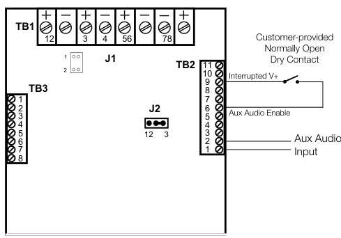

# Fire Alarm Audio Notification System ANS2 Series  

# Overview  

The ANS series of products from EDWARDS is a collection of high-performance audio notification systems that provide voice evacuation capability which meets the emergency voice alarm requirements of NFPA 72 for UL listed fire alarm applications. ANS panels are available in 25, 50, or 100 Watt models and include a microphone, amplifier, tone generator, digital message repeater (DMR), and supervisory interface.  

These self-contained systems offer robust field-configurable features and are supported by a wide range of accessory equipment that provides application flexibility and reliable performance for new and retrofit installations alike.  

Expander panels and modules extend the range of the ANS system to meet the needs of demanding audio applications. Accessory equipment such as zone switchers and remote microphones offer the sophistication of high-end systems for a relatively low cost.  

ANS systems are ideal for use with EDWARDS fire alarm control panels when emergency voice alarm service is required. Genesis speakers and speaker-strobes may be used with ANS audio systems to provide a clean and attractive appearance for voice audio applications.  

# Standard Features  

•	 Meets NFPA 72 Emergency Voice Alarm requirements   
•	 Easy to use custom configuration software   
•	 Clean dead-front construction   
•	 Integrated field recordable digital message player   
•	 Twenty minute message capacity   
•	 25, 50, or 100 Watt models available   
•	 Field selectable for either 25 or 70 Vrms speakers   
•	 120 VAC power supply and battery charger included   
•	 Paging microphone overrides message and tone   
•	 ANS25 and ANS100 systems are 520Hz compliant   
•	 High reliability, low maintenance   
•	 Fully supervised, UL listed   
•	 Easy installation, operation, and configuration   
•	 Built-in alarm and alert signals   
•	 24-hour backup capability  

# Application  

National fire codes generally require voice evacuation systems in places of assembly with over 300-person occupancy, in theatres with more than one screen, and in buildings seven stories or higher. ANS Series Audio Notification Systems represent an effective and efficient solution for meeting these requirements.  

ANS systems are ideal for new applications with fire control panels that do not provide integrated audio functions. These audio systems also provide the opportunity to add voice evacuation capability to existing fire alarm applications without replacing existing fire alarm control equipment.  

The fire alarm control panel works in concert with the ANS audio system, providing all initiating circuitry and a signaling circuit that connects to the ANS. The ANS provides its own internal supervision as well as supervision for its speaker lines.  

Faults are reported back to the fire alarm control panel by means of a supervisory circuit, which is connected to a matching EOLR on the ANS. Internal failures and speaker line faults open a contact, which the fire alarm control panel reports as an open fault on the supervisory circuit.  

A digital message repeater (DMR) is built into all ANS systems unless ordered without the DMR. Up to 20 minutes of custom messages can be uploaded in the field with the use of a laptop and the ANSCONFSOFT1 configuration software. In addition, the selection from eight available alarm tones, automatic message repeats, AC fault report delay, and connected equipment settings are all field-configurable.  

The paging microphone is an integral component of the audio notification system. Removal of the microphone from the panel will cause a Trouble condition. This is reported locally, as well as through the fire alarm control panel.  

All ANS panels include a 120 V, 60 Hz supply (standby batteries are required). Optionally, ANS panels can be powered with 24vdc from the fire alarm control panel or a booster power supply. Where speaker-strobes are used, strobe power is provided by the fire alarm control panel or a booster power supply.  

# Typical Wiring  

# ANS 25, 50, 100  

  

  
Optional Supervisory Circuit   
Multiple Unit Connection   
Addressable System  

  
Aux Audio Enable Connection  

  

Field wiring connections #6-32 wire clamp screw: 14-18 AWG $\#8-32$ wire clamp screw: 12-18 AWG Horizontal wire entry terminal: 18-26 AWG Wire gauge determined by circuit load  

# Accessory Equipment Zone Splitter  

  

The ANSZM4B2A Zone Splitter Module is used to enable the output of the ANS25, ANS50 or ANS100 to be split into multiple circuits for audio power distribution. The module accepts input from the ANS speaker output and utilizes output relays to distribute the power to separate circuits. The module may be cascaded to increase the number of circuits, and provides supervision of the individual circuits for either open or short conditions. Indicator LEDs display active or fault conditions for the individual circuits. A fault condition is reported to the ANS via the I2C communication port. The Zone Splitter Module may also be used with legacy ANS models, but in these cases supervision must employ TB2 Terminals 10 - 11 as a supervisory input.  

If Manual control of the circuits is required, an ANSSW8 must be employed. Zones may then be selected manually by switches or through pull-down inputs. In the event of an alarm condition, the module defaults to an All-Call. All-Call feature may only be overridden if accompanying panel has zone control features.  

  

# Expander Panels and Modules  

  

Audio Notification System expander panels and modules provide an easy and cost-effective way to increase the output power of ANS25, ANS50 or ANS100 voice evacuation systems.  

Audio Notification System panels include an audio amplifier, temporal pattern alarm tone, power supply and battery charger. They can be ordered with or without a paging microphone and/or digital message repeater.  

Audio Notification System modules do not include cabinets, and are intended to be mounted in a UL Listed enclosure.  They can be ordered with or without a a paging microphone and or digital message repeater. Voice evacuation expanders may be ganged together in any combination to provide up to 2,000 Watts of audio power.  

  

# Voice Evacuation Modules  

Modules may be ordered with or without a microphone for manual paging and/or, a digital message repeater (DMR). Modules can be powered from the FACP, a booster power supply or an optional transformer and standby batteries. They provide all the operational features and characteristics of ANS25, ANS50, or ANS100 voice evacuation panel, but are provided without the enclosure.  

Primary power may be supplied by the fire alarm control panel or by a separately-ordered power transformer. Any of the ANS voice evacuation accessories, including remote microphones, may be used with ANS voice evacuation modules. Expander modules can also be added in any combination to provide up to 2,000 Watts of audio power in a single voice evacuation system.  

# Accessory Equipment  

# ANSSW8 Switch/LED Card  

  

The ANSSW8 is an optional control/indication module that includes eight momentary contact switches and eight tri-color (green/red/amber) LEDs. Switches may be programmed for paging, emergency message activation, or control functions. When used in conjunction with the ANSZM4B2A Zone Splitter, the ANSSW8 may be programmed for zone paging. LEDs for switches assigned to page zones will indicate steady red for Page and flashing red for Alarm. An emergency message broadcast to any zone will indicate green. The zone LED will indicate amber if the associated speaker zone is in fault condition.  

Switches programmed for messages indicate Green when selected. Only one message is active at a time. If a higher priority message is activated while a message is playing, its associated LED will go off and the higher priority message LED will indicate. A fire alarm condition will override all other messages in the queue and the associated fire alarm message will be broadcast immediately.  

Switches may alternately be programmed for control functions. On a switch activation, a corresponding point on an ANSXM8 Output Card will follow. Switch LEDs indicate red on activation.  

# ANSDC8 Intelligent Input Interface Card  

  

The ANSDC8 is an intelligent input interface card with eight input points and eight corresponding red input LEDs. The ANSDC8 accepts external normally-open dry contacts. Inputs may be programmed for message activation or control functions. On activation of an input point the corresponding input LED turns on.  

# ANSXM8 Intelligent Output Interface Card  

  

The ANSXM8 is an intelligent output interface card with eight output points and eight red LEDs. Outputs are solid-state normally-open dry contacts rated at $30\;\mathrm{mA}$ max $\textcircled{\times}0\textsuperscript{-}24\lor.$ They may be field configured as normally-open dry contacts, or as  

separate voltage drive points. When used as drive points, each output can be tied to a specified voltage from zero to 24 volts, and feed the designated voltage as a drive point. Outputs 1 through 4 and Outputs 5 through 8 may linked to the same or different voltage references. Outputs may be programmed to follow a message activation, a page, or a control function. On activation the corresponding input LED will indicate.  

  
Outputs may be field configured as normally open dry contacts or as separate voltage drive points  

# Accessory Equipment Remote Microphone Panel  

  

The ANSREM is a supervised remote microphone for use with the ANS voice evacuation system. The microphone provides crystalclear live voice messages over the system speakers.  

Up to five ANSREM panels may be connected to a single ANSREMSUP supervisory card. This provides supervision of the wires to the ANSREM and supports wiring distances of up to 5,000 feet (1,524 meters).  

The ANSREM is housed in an attractive surface or semi-flush mounted enclosure, with a hinged locking door. It features deadfront construction, a microphone with a “Press-to-Talk” button, and discreet LEDs that indicate In-Use and Fault status.  

  

Remote Microphone Panel Dimensions: 8" H x 10" W x 3" D $(203\:\mathrm{mm}\times254\:\mathrm{mm}\times76\:\mathrm{mm})$  

# Standard Message  

This message is included with the ANS 25/50/100.  

(Female Voice) “Attention Please, there has been a report of an emergency. Proceed calmly to the nearest exit and leave the building immediately. Do not use the elevators, use stairwells where necessary. All handicapped occupants shall use the building evacuation plan.”  

# Backup Amplifier Switching Card  

  

The ANSBKUP switching card continually monitors the primary amplifier for signs of failure. Should the amplifier fail, the ANSBKUP automatically activates a backup amplifier.  A single amplifier can be used to back up one or more amplifiers of equal or lesser wattage. One  

up. The backup amplifier does not require its own microphone and digital message repeater unless a fully redundant voice evacuation system is required.  

  

The voice evacuation system shall be EDWARDS ANS Series or approved equal. The voice evacuation system shall provide $<\!25\!><\!50\!><\!100\!>$ Watts signal power and $<\!25\!><\!50\!><\!100\!>$ Watts voice power, and shall be UL Listed.  

All speaker circuits shall be field selectable for 25 or 70 Vrms operation and shall be power limited.vav  

The voice evacuation system shall be microprocessor based, and shall contain an integral microphone, $<\!25\!><\!50\!><\!100\!>$ Watt audio amplifier, tone generator, digital message repeater, 120 VAC power supply, and battery charger.  

The voice evacuation message/signal shall be broadcast until the Fire Alarm Control Panel (FACP) is reset, or until fire emergency personnel interrupt the broadcast with a manual page. On reset system shall automatically return to standby (normal operating) condition.  

A secondary message shall be provided that can be triggered by the closure of a contact from either the FACP or from any normally open contact device.  

Remote paging microphone(s) will be supported by the system through a supervised circuit. Remote microphone(s) may be mounted up to 5,000 ft. (1,524 m) away from the voice evacuation panel.  

Specifications   

<html><body><table><tr><td>Model</td><td>ANS25</td><td>ANS50</td><td>ANS100</td></tr><tr><td>Output power</td><td>25W</td><td>50W</td><td>100W</td></tr><tr><td>Output voltage</td><td colspan="3">25 or70Vrmsselectable</td></tr><tr><td>Output protection</td><td colspan="4">Power-limited, open and short circuit protected</td></tr><tr><td>Input voltage</td><td colspan="4">120 Vac at 60 Hz</td></tr><tr><td>Input current</td><td>0.8A @120Vac</td><td>0.5 A @120 Vac</td><td></td><td>1.0 A @120 Vac</td></tr><tr><td>Optional 24 Vdc input1</td><td></td><td></td><td></td><td></td></tr><tr><td>Standby</td><td>0.60 A</td><td>0.60 A</td><td></td><td>0.60 A</td></tr><tr><td>Alarm</td><td>1.00 A</td><td>1.00 A</td><td></td><td>2.60 A</td></tr><tr><td>Sine</td><td>2.90 A</td><td>3.40 A</td><td>400 - 4000 Hz</td><td>6.50 A</td></tr><tr><td>Frequency response</td><td colspan="4">800-2800 Hz</td></tr><tr><td>Dimensions</td><td colspan="4">Rough-in: 14.5×18×4"(368× 457×102 mm) Finished Door: 16.25 × 19.5" (413 × 495 mm)</td></tr><tr><td>BatteryType</td><td colspan="4">Two 12V Gel Cellin series</td></tr><tr><td>Battery size</td><td colspan="4"></td></tr><tr><td>Minimum</td><td>24 V, 7 Ah</td><td>24 V, 7 Ah 24 V, 18 Ah</td><td colspan="2" rowspan="2">24 V, 7 Ah 24 V, 24 Ah</td></tr><tr><td>Maximum</td><td>24 V, 18 Ah</td></tr><tr><td>Battery Standby Operating Time</td><td></td><td>24-60Hours inStandby 15 minutes in Alarm</td><td></td></tr><tr><td></td><td colspan="3">800 mA</td></tr><tr><td>Battery Charging Current Battery Input current</td><td colspan="4"></td></tr><tr><td>Standby</td><td>0.18 A</td><td>Full speaker load, no aux load: 0.15 A</td><td></td><td></td></tr><tr><td>Alarm</td><td>1.10 A</td><td>0.80A</td><td></td><td>0.16 A</td></tr><tr><td>Battery Input Current</td><td></td><td>Fullspeakerload,fullauxload of 0.5 A:</td><td></td><td>0.60A</td></tr><tr><td></td><td colspan="4"></td></tr><tr><td>Standby</td><td>1.10 A</td><td>1.00 A</td><td></td><td>1.10 A</td></tr><tr><td>Alarm</td><td>2.50 A</td><td>1.10 A</td><td></td><td>2.00 A</td></tr></table></body></html>

1 Input current measurements are determined using test conditions specified in UL 1711. Sine represents measurements made while the unit produces a continuous, undistorted sine wave of 1 kHz into the rated load of 25, 50, or 100 W at the rated output voltage. Alarm is the average current the unit experiences delivering an alarm signal, temporal whoop, to the rated load. Standby is the current draw of the unit with all normal power on and auxiliary terminals fully loaded. Battery standby is the current draw from the batteries on loss of power in an otherwise normal standby state.  

# Ordering Information  

<html><body><table><tr><td>PartNumber Description</td><td>Wt. Ib (kg)</td></tr><tr><td colspan="2">AudioNotificationPanels Microphone，andCabinet.</td></tr><tr><td>ANS100MDG2</td><td>100WattAudioNotificationPanel.GrayCabinet. 32 (14.5)</td></tr><tr><td>ANS100MDR2</td><td>100WattAudioNotificationPanel.RedCabinet. 32 (14.5)</td></tr><tr><td>ANS25MDG2</td><td>25WattAudioNotificationPanel.GrayCabinet. 29 (13.2)</td></tr><tr><td>ANS25MDR2</td><td>25WattAudioNotificationPanel.RedCabinet. 29 (13.2)</td></tr><tr><td>ANS50MDG2</td><td>50WattAudioNotificationPanel.GrayCabinet 32 (14.5)</td></tr><tr><td>ANS50MDR2</td><td>50WattAudioNotificationPanel.RedCabinet. 32 (14.5)</td></tr><tr><td colspan="2">ExpanderPanels</td></tr><tr><td>ANS100XG</td><td>100WattAudioExpanderPanel.GrayCabinet. 32 (14.5)</td></tr><tr><td>ANS100XR</td><td>100WattAudioExpanderPanel.RedCabinet. 32 (14.5)</td></tr><tr><td>ANS25XG</td><td>25 Watt Audio Expander Panel.Gray Cabinet. 29 (13.2)</td></tr><tr><td>ANS25XR</td><td>25WattAudioExpanderPanel.RedCabinet. 29 (13.2)</td></tr><tr><td>ANS50XG</td><td>50WattAudioExpanderPanel.GrayCabinet. 32 (14.5)</td></tr><tr><td>ANS50XR</td><td>50WattAudioExpanderPanel.RedCabinet. 32 (14.5)</td></tr></table></body></html>

Panels include power supply and battery charger".  

Zone Splitters   

<html><body><table><tr><td>ANSZM4B2A</td><td>Zone Module.4 Class B or 2 Class A circuits.</td></tr><tr><td colspan="2">RemoteMicrophones</td></tr><tr><td>ANSREMG</td><td>Remote microphone.Requires ANSREMSUP card in ANS 8 (3.6) panel. Gray surface/semi-flush cabinet. Supervised.</td></tr><tr><td>ANSREMR</td><td>Remote microphone.Requires ANSREMSUP card in ANS 8 (3.6) panel.Red surface/semi-flushcabinet.Supervised.</td></tr><tr><td>ANSREMSUP</td><td>Remote microphone supervisory card, one per system. 1 (0.5) Supervises up to 5 remote microphones.</td></tr><tr><td colspan="2">BackupAmplifier Modules</td></tr><tr><td>ANSBKUP Backup amplifier switching module.</td><td>1 (0.5)</td></tr><tr><td colspan="2">Modules</td></tr><tr><td colspan="2">ANS100A 100 Watt expander module. 5 (2.3)</td></tr><tr><td colspan="2">ANS100AMD2 100 Watt audio notification module with DMR and microphone. 5 (2.3)</td></tr><tr><td colspan="2"></td></tr><tr><td colspan="2">ANS25A 25 Watt expander module. 5 (2.3) 5 (2.3)</td></tr><tr><td colspan="2">ANS25AMD2 25WattaudionotificationmodulewithDMRandmicrophone.</td></tr><tr><td colspan="2">ANS50A 50Wattexpandermodule. 5 (2.3)</td></tr><tr><td colspan="2">ANS50AMD2 50 Watt audio notification module withDMR and microphone. 5 (2.3)</td></tr><tr><td colspan="2" rowspan="3">ANSDC8 8 dry-contact input/LED module. ANSSW8</td></tr><tr><td rowspan="2">8 position switch/LED module.</td></tr><tr><td rowspan="2">ANSXM8 8transistoroutput/LEDmodule.</td></tr><tr><td rowspan="2">Custom Messages (forANS1 Series only)</td></tr><tr><td rowspan="2"></td></tr><tr><td rowspan="2"></td></tr><tr><td rowspan="2">Alternate prerecorded DMR message PROM from library.</td></tr><tr><td rowspan="2">ANSDMRALT</td></tr><tr><td rowspan="2"></td></tr><tr><td rowspan="2">ANSDMRCUSTOM</td></tr><tr><td rowspan="2">Custom recorded message PROM.</td></tr><tr><td rowspan="2"></td></tr><tr><td rowspan="2"></td></tr><tr><td rowspan="2"></td></tr><tr><td rowspan="2">Call customer service for quotation and availability.</td></tr><tr><td></td></tr></table></body></html>  