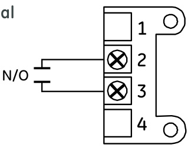
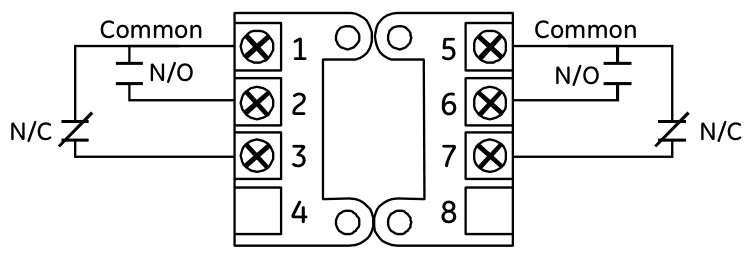
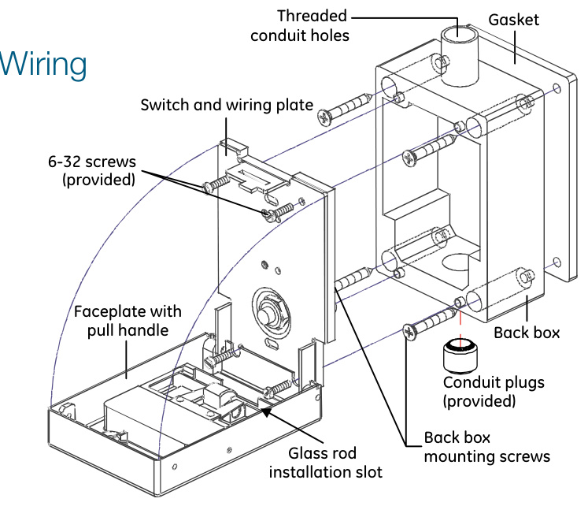
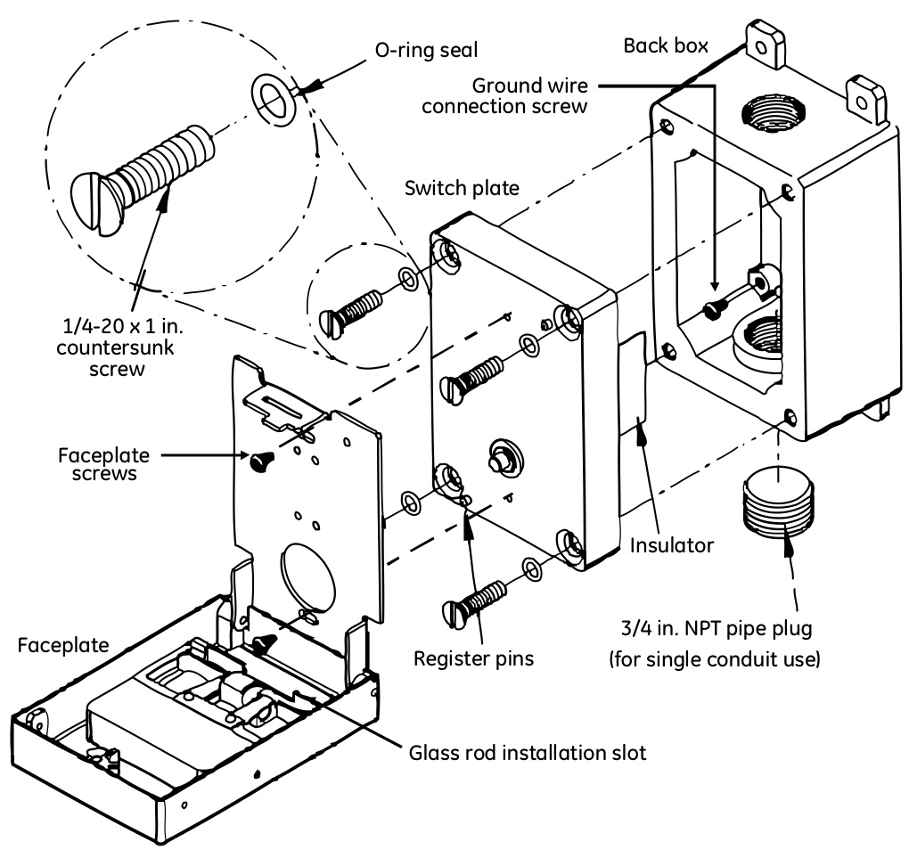

# Weatherproof and Explosionproof Manual Stations MPSR Series  

# Overview  

MPSR Series manual pull stations from EDWARDS are noncoded fire alarm stations solidly constructed of die-cast material. All components are pre-painted or have plated surfaces to inhibit corrosion.  

Weatherproof manual stations are rated for outdoor use. Singleand double-action MPSR models are available with either single pole (normally open) or double pole (double throw) alarm contacts. Depending on the model, access to the unit for resetting purposes is gained with either a keylock or hex screw.  

Explosionproof/weatherproof manual stations are rated for Class I Group B (hydrogen) C & D, Class II Groups E. F, G, Class III environments, and are rated NEMA 4X for outdoor use. They are available in single or double action activation with key or hex operated reset.  

All models feature terminal block connections and 10 amp contacts.  

# Standard Features  

# All models  

Solid corrosion-resistant construction   
Rated NEMA 4X for outdoor use   
Surface mount weatherproof backbox and gasket included   
Positive activation   
Terminals for wire connections  

# Weatherproof models  

•	 Single and double action models •	 Single or double pole contacts •	 Key lock or hex screw reset  

# Explosionproof models  

•	 Class I Group B, C & D, Class II Groups E. F, G, Class III   
•	 Single-action models convertible to double-action operation   
•	 Key lock reset   
•	 Double pole contacts  

# Application  

MPSR Series manual stations have 10 amp contacts. They may be used with or without a break glass rod. Rod replacement requires no special tools. Each manual station may be reset and locked using the standard key or hex key provided.  

Two contact terminal block wiring  

  

Six contact terminal block wiring  

  

# Assembly (weatherproof models)  

  

# Assembly (explosionproof models)  

  

<html><body><table><tr><td></td><td>Weatherproof models</td><td>Explosionproof/weatherproofmodels</td></tr><tr><td>Ratings</td><td>NEMA:4Xoutdoor</td><td>ULCSA:ClassI Group B,C & D,Class IIGroups E.F,G,Class 川 NEMA:4Xoutdoor</td></tr><tr><td>Dimensions</td><td></td><td></td></tr><tr><td>Width</td><td>3.06 in (7.77 cm)</td><td>3.20 in (8.13 cm)</td></tr><tr><td>Height</td><td>4.75 in (12.07 cm)</td><td>4.75 in (12.07 cm)</td></tr><tr><td>Depth</td><td>3.0 in (7.62 cm)</td><td>3.70 in (9.40 cm)</td></tr><tr><td>Electrical</td><td></td><td></td></tr><tr><td>Wiring</td><td>Two or six contact terminal block depending on model</td><td>Sixcontactterminalblock</td></tr><tr><td>Wiresize</td><td>14 to18AWG</td><td>14to18AWG</td></tr><tr><td>Switch</td><td>10 amp @ 120 Vac</td><td>10 amp @ 120 Vac</td></tr><tr><td>Physical</td><td></td><td></td></tr><tr><td>Mounting</td><td>Single gang weatherproof backbox (included)</td><td></td></tr><tr><td>Lock Operation</td><td>Standard key or hex key</td><td>Standardkeyorhexscrew</td></tr><tr><td>Operating environment</td><td>Single action or double action depending on model</td><td>Single-action(double-actionwithadaptercover)</td></tr><tr><td></td><td></td><td></td></tr><tr><td>Temperature</td><td>-30Fto 150 F(-35°C to 66°C)</td><td>-30 F to 150 °F (-35°C to 66℃)</td></tr></table></body></html>  

Ordering Information   

<html><body><table><tr><td>Model</td><td>Description</td><td>Ship Wt. Ib (kg)</td></tr><tr><td colspan="3">Weatherproof manual stations (weatherproofbackboxincluded)</td></tr><tr><td>MPSR1-SHTW-GE</td><td>Single-action, SPST, hex screw reset, terminal connections.</td><td>0.93 (0.42)</td></tr><tr><td>MPSR1-S45W-GE</td><td></td><td>0.93 (0.42)</td></tr><tr><td>MPSR1-DHTW-GE</td><td>Single-action,DPDT,hexscrewreset,terminal connections.</td><td>0.93 (0.42)</td></tr><tr><td>MPSR1-D45W-GE</td><td>Single-action, DPDT, Cat 45 Key reset, terminal connections.</td><td>0.93 (0.42)</td></tr><tr><td>MPSR2-SHTW-GE</td><td>Double-action,SPST,hexscrewreset,terminal connections.</td><td>1.7 (0.76)</td></tr><tr><td>MPSR2-DHTW-GE</td><td>Double-action,DPDT, hex screw reset, terminal connections.</td><td>1.7 (0.76)</td></tr><tr><td>MPSR2-S45W-GE</td><td>Double-action, SPST, Cat 45 Key reset, terminal connections.</td><td>1.7 (0.76)</td></tr><tr><td>MPSR2-D45W-GE</td><td>Double-action,DPDT,Cat 45Keyreset,terminalconnections.</td><td>1.7 (0.76)</td></tr><tr><td>MPSR2-SHTW-GE-NYW</td><td>Double-action,SPST,hexscrewreset,terminal connections,NYCwhite stripe.</td><td>1.7 (0.76)</td></tr><tr><td>MPSR2-S45W-GE-NYW</td><td>Double-action, SPST, Cat 45 Key reset, terminal connections, NYC white stripe.</td><td>1.7 (0.76)</td></tr><tr><td colspan="3">Explosionproof manual station(explosionproofbackboxincluded)</td></tr><tr><td>MPSR1-D45WX-GE</td><td>Single-action, DPDT, Cat 45 Key reset, terminal connections</td><td>0.93 (0.42)</td></tr><tr><td>MPSR-LP</td><td>Double actioncover</td><td>0.77 (0.35)</td></tr><tr><td>Accessories</td><td></td><td></td></tr><tr><td>MPSRGR10</td><td>ReplacementglassrodsforMPSRstations(10pack))</td><td></td></tr><tr><td>276-K1</td><td>Cat 45 Key (each)</td><td></td></tr><tr><td></td><td></td><td></td></tr></table></body></html>  