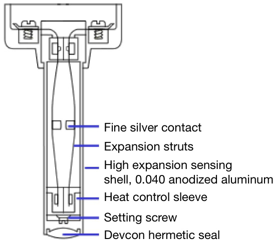
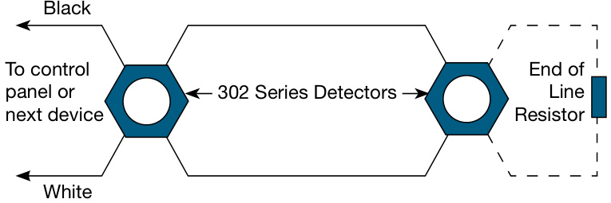
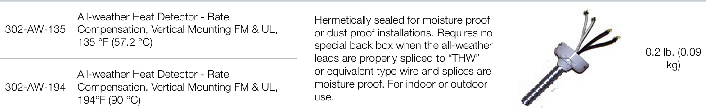
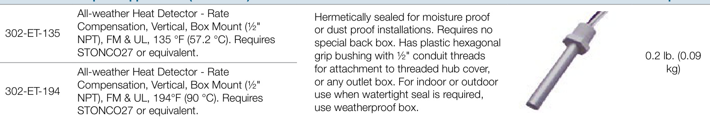
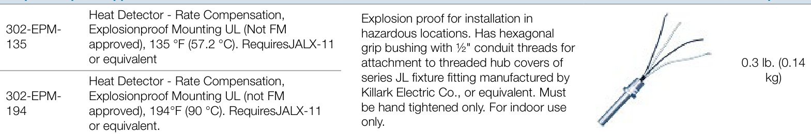
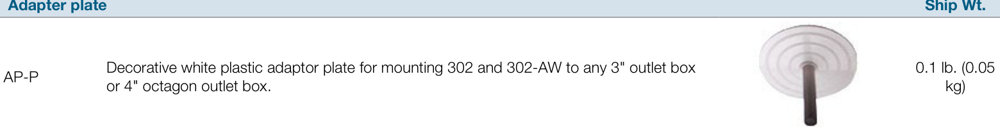
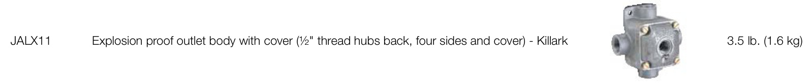

# Rate Compensation Heat Detectors 302 Series  

# Overview  

Series 302 heat detectors are designed for use in normal environments as well as environments where the detectors are subject to weather, moisture (internal condensation), and explosive atmospheres. They are normally-open devices designed to close an electrical circuit upon activation. All models feature rate compensation and are available with either 135 °F $(57.2\mathrm{~}^{\circ}\mathrm{C})$ or $194~^{\circ}\mathsf{F}$ (90 $^{\circ}\mathrm{C})$ ratings. They are self restoring, hermetically sealed, shock and corrosion resistant, and are tamperproof.  

# Standard Features  

•	 Rate compensation offsets thermal lag •	 Self-restoring – no manual reset required •	 Explosion proof and weatherproof models available •	 Weatherproof models available that do not require a special backbox •	 Box mount and surface mount models available  

# Application  

Sensors rated at 135 °F $(57.2\mathrm{~}^{\circ}\mathrm{C})$ will not respond to momentary temperature fluctuations less than 30 °F/minute between 60 °F $(16\,^{\circ}\mathrm{C})$ and $100~^{\circ}\mathsf{F}$ $(38\,^{\circ}\mathrm{C})$ . Sensors rated at $194^{\circ}\mathsf{F}$ $(90\mathrm{~}^{\circ}\mathrm{C})$ will not respond to momentary temperature fluctuations less than $50\ ^{\circ}\mathsf{F}/$ minute between 60 °F $16\,^{\circ}\mathrm{C})$ and $150~^{\circ}\mathsf{F}$ $(66\,^{\circ}\mathrm{C})$ . 302 Series sensors should not be used in environments where conditions exceed these parameters. Do not install them in hot air ducts, in front of heaters, in paint booths that use heat to cure paint, or any other location subject to temperature fluctuation.  

<html><body><table><tr><td>Sensor's Rated Temperature</td><td>Minimum Ambient Air Temperature</td><td>Maximum Ceiling Temperature</td></tr><tr><td>135°F (57.2 2°C)</td><td>-40°F (-40 °C)</td><td>100°F (38 °C)</td></tr><tr><td>194 °F (90 °C)</td><td>-40 )°F(-40 °C</td><td>150°F (66 °℃)</td></tr></table></body></html>  

The sensor's aluminum tube acts as a heat collector when sources of heat radiate directly on the tube. Install these sensors out of direct sunlight and away from radiating heat sources including the direct flow from heaters and heat ducts.  

# Rate Compensation  

302 Series sensors feature rate compensation, which improves performance by offsetting thermal lag, an inherent property of conventional fixed temperature heat sensors.  

A slow rate of temperature rise allows the heat to penetrate the inner expansion struts. The tubular shell and the struts expand slowly until the total device has been heated to its rated temperature level of 135 °F $(57.2\mathrm{~}^{\circ}\mathrm{C})$ or 194 °F $(90\mathrm{~}^{\circ}\mathrm{C})$ . At this point, the silver contact points close and an alarm is initiated.  

When subjected to a rapid rate temperature rise, there is not as much time for heat to penetrate the inner strut. However, the rapid lengthening of the shell allows the struts to come together at a lower level.  

When the surrounding air temperature returns to below the rated level, the shell contracts, forcing the contacts to open, thus automatically resetting the sensor.  

  

# Typical Wiring  

  

# Electrical Rating  

<html><body><table><tr><td>Voltage</td><td>Current</td></tr><tr><td>6-125VAC</td><td>5： amps</td></tr><tr><td>6-25VDC</td><td>1 due</td></tr><tr><td>125VDC</td><td>0.5a amp</td></tr></table></body></html>  

# Maintenance  

302 Series heat sensors are low maintenance. Sensors automatically restore when temperatures drop below their rated temperatures. The accumulation of dust and dirt does not normally affect the sensors’ operation.  

# Testing  

Testing for operation is simple and can be done before or after the sensor has been installed. Heat the sensor with a hair dryer (do not use any device with an open flame to test sensors). The sensor should operate shortly after the hot air is applied.  

Refer to NFPA 72, National Fire Alarm Code and/or the local authority having jurisdiction to determine testing frequency, record keeping, and other testing considerations.  

Detector Spacing   

<html><body><table><tr><td>Model</td><td>302</td><td>302-AW</td><td>302-ET</td><td>302-EPM</td></tr><tr><td>UL-Vertical Spacing (allmodels)</td><td>50＇×50' (15.2x15.2m)</td><td>50＇×50 （15.2x15.2m）</td><td>50＇×50' (15.2 x15.2 m)</td><td>40'×40 (12.2x12.2m)</td></tr><tr><td>UL-Horizontal Spacing (all models)</td><td>40'× 40'</td><td>40'×40</td><td>40'×40'</td><td>30＇×30 (9.1 x 9.1m)</td></tr><tr><td>FM-Horizontall orverticalspacing.</td><td>(12.2× 12.2 m) 30＇×30 (9.1x9.1m)</td><td>(12.2 x 12.2 m) 30'×30' (9.1×9.1m）</td><td>(12.2 x 12.2 m) 30'×30' (9.1x9.1m)</td><td>NotListed</td></tr></table></body></html>

Spacing is based on smooth ceilings that are up to ${}^{10}$ $\left(3\,\mathsf{m}\right)$ high. Refer to NFPA 72 for ceilings that are not considered smooth or are higher than $10^{\prime}$ (3 m).  

\* EPM models are not FM approved.  

# Dimensions  

<html><body><table><tr><td>Model</td><td>ET EMP</td><td></td></tr><tr><td>Tube Length</td><td>3"(76.2 mm) 3" (76.2 mm)</td><td rowspan="3"></td></tr><tr><td>TubeDiameter</td><td>0.5"(12.7 mm) 0.5"(12.7 mm)</td></tr><tr><td>NPT Thread</td><td>0.5" (12.7 mm) 0.5"(12.7 mm)</td></tr><tr><td>HexBase</td><td>1.25"( 1" (25.4 mm) plastic</td><td rowspan="2">(31.75 mm)</td></tr><tr><td></td><td>brass</td></tr></table></body></html>  

WARNING – Use For Property Protection Only: Heat detectors do not protect life against fire and smoke. In most fires, hazardous levels of smoke, heat and toxic gases can build up before a heat sensor would initiate an alarm. Independent studies indicate that heat sensors should only be used when property protection alone is involved. In cases where life safety is a factor, the use of smoke detectors is recommended.   
Under no circumstances should heat detectors be relied upon as the sole measure to ensure fire safety. However, if they are spaced in accordance with the specifications found under Application, these sensors can contribute, within an overall fire safety program, to reducing the risk of avoidable property losses.   
When used with automatic fire suppression systems such as pre-action and deluge sprinkler systems, carbon dioxide systems, halon systems, and dry chemical systems, at least two sensors should be used to initiate the alarm. This is commonly referred to as cross-zoning or priority matrix zoning and is necessary to eliminate premature discharge of the system. Refer to NFPA 72 for more information.  

<html><body><table><tr><td colspan="2">Interiorapplications</td><td rowspan="2"></td><td rowspan="2">Shipwt.</td></tr><tr><td>302-135</td><td>HeatDetector-RateCompensation,Interior VerticalSurfaceMountFM&UL,135°F(57.2 °C)</td></tr><tr><td>302-194</td><td>HeatDetector-RateCompensation,Interior Vertical Surface Mount FM& UL,194°F(90 °C).</td><td>Forinteriormounting.</td><td>0.21b.(0.09 kg)</td></tr></table></body></html>  

# Moisture & dust proof applications Ship Wt.  

  

Ship Wt.  

  

# Explosion proof applications Ship Wt.  

  

  

# Outlet body  

Ship Wt.  

Use with standard backboxes and covers such as those manufactured by Killark Electric Co., or equivalent.  

# Explosion proof outlet body  

Ship Wt.  

  