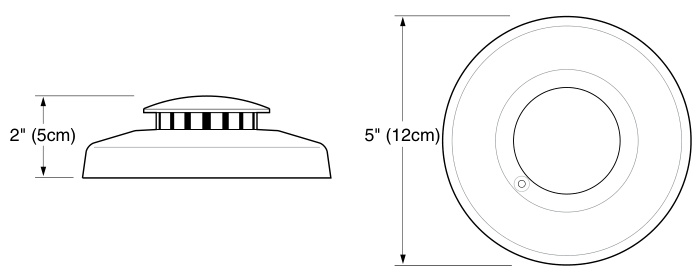
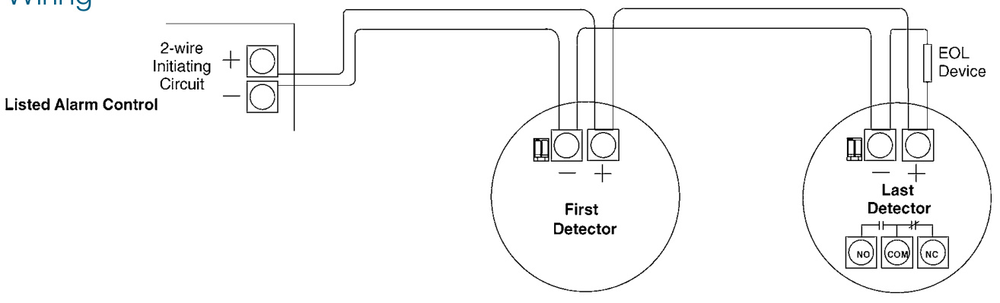

# Conventional Multi-Purpose Smoke Detectors with Auxiliary Functions 500 Series  

# Overview  

500 Series two-wire conventional photoelectric smoke detectors bring together trusted technology and a full line of features that meet the demands of every type of application. The 500 offers sounders in two-wire applications, specifically to meet residential code requirements.  

EDWARDS is also proud to offer proven technology like CleanMe®, dust compensation, field replaceable optical chambers, and self-diagnostics. CleanMe® is only available on the 500 2-wire models and will communicate with compatible FACPs when servicing is required.  

500 Series detectors work on a light-scattering principle. A pulsed infrared light-emitting diode serves as the light source, and a highspeed photo diode as the sensing element. This design has superior protection against nuisance alarms caused by dust, insects, RF interference, and ambient light.  

The proprietary optical chamber is field replaceable. In the event of a confirmed alarm the LED will light continuously. The unit indicates trouble by flashing the LED every second. This meets the NFPA 72 field sensitivity testing requirements.  

Additional diagnostic information is activated by applying a magnet near the detector’s integral reed switch. This initiates a self-diagnostic routine and provides visual indication of sensitivity level, or if service is required. The magnet test causes the LED to blink. The number of blink counts corresponds to a smoke detector sensitivity range.  

Models with a built-in 85dB sounders emit the temporal 3 pattern and can be easily tandemly interconnected using the 405-05 polarity reversal relay. This enables all detectors to sound when the initiating detector sounds and meets the requirement of the International Residential Building Code (IRC).  

# Standard Features  

•	 Remote maintenance (CleanMe®) reporting and builtin drift compensation reduces false alarms   
•	 Self-diagnostics meets NFPA 72 sensitivity testing requirements without the need for external meters Field-replaceable optical chamber makes service fast and simple   
•	 Large SEMS screw terminals accept 12-18 AWG wire   
•	 Small, low profile design blends with any environment Optional auxiliary functions include: •	 Integral sounder with optional tandem interconnection •	 Auxiliary relay Listed for applications such as elevator recall •	 Fire system isolated heat integrated with nonlatching single station smoke alarm •	 Integral fixed/ROR heat detectors  

# Application  

500 Series detectors are ideal for both retrofit applications and new installations alike. They are particularly well-suited for installations where detector reliability is essential, but where typical analog/addressable devices may not be appropriate or feasible. With their replaceable optical chambers, these detectors are equally well-suited to dusty environments where detectors require frequent cleaning.  

# Assembly  

Optional fixed temperature sensor  

Diagnostic LED Optional rate-of-rise sensor  

Replaceable optical chamber and bug screen   
Detector cap  

# Mounting and Installation  

500 Series detector bases mount directly to standard single-gang electrical boxes, three-inch round, or four-inch octagonal boxes. Detector heads simply twist onto the base. Heads are equipped with a break-away locking tab, which prevents unauthorized removal. SEMS terminals accept 24 to 12 AWG field wiring.  

# Dimensions  

  

# Typical Wiring  

  

# Specifications  

<html><body><table><tr><td colspan="2">Electrical</td></tr><tr><td>PowerSupply</td><td>8.5-33VDC(12/24Voperation) polaritysensitive</td></tr><tr><td>Maximum ripple pk-pk (6/12/24V)</td><td>10% (Vpk-pk)</td></tr><tr><td>Typicalaveragestandbycurrent</td><td>70 μA</td></tr><tr><td>Typical alarm current (6/12/24V)</td><td>up to 60 mA max if not limited by controlpanel</td></tr><tr><td>Auxiliaryrelaycontacts (521NCRXTonly)</td><td>1.0A@30VDC;FormC</td></tr><tr><td>Photoelectricsensitivity</td><td>3.1% + 0.5 -1.0%</td></tr><tr><td colspan="2"></td></tr><tr><td colspan="2">Environment</td></tr><tr><td>Operatingtemperature</td><td>32°to100°F(0°to37°C)</td></tr><tr><td>Operating humidity range</td><td>0 to95%non-condensing</td></tr><tr><td>RFI immunity</td><td>20 V/m min; 0-1000 MHz</td></tr></table></body></html>  

<html><body><table><tr><td colspan="2">Physical</td></tr><tr><td>Color</td><td>White</td></tr><tr><td>Field wiring size Heat detector specifications</td><td>12-18 AWG (16-22 recommended) Rate-of-Rise:</td></tr><tr><td></td><td>15°F/minand>105°F (8.3° C/min and >40.6° C) Fixed Threshold: 135° F (57.2° C)</td></tr><tr><td>UL 2-wire compatibility identifiers</td><td>S09A,S10A,S11A</td></tr><tr><td>Sounder output (521NCSXT only)</td><td>85dB @ 10feet</td></tr><tr><td>Drift compensation adjustment</td><td>1.0% ft.max</td></tr><tr><td>Detector head dimensions</td><td>5.5 D× 2"H (14.0× 5 cm)</td></tr><tr><td>Mounting dimensions</td><td>5.25"(13.3 cm) diameter; 0.3" (0.8 cm) height</td></tr><tr><td colspan="2"></td></tr><tr><td colspan="2">Regulations</td></tr><tr><td>Reset time</td><td>1 second min</td></tr><tr><td>Listings</td><td></td></tr><tr><td>500N Series:</td><td>UL 268 cUL, CSFM</td></tr><tr><td>521B,521BXT:</td><td>UL 268, CSFM</td></tr><tr><td>528B,528BXT:</td><td>ULC</td></tr></table></body></html>  

<html><body><table><tr><td>Model</td><td>Description</td><td>Compatibility</td><td>AlarmCurrent (mA)</td><td>Reverse polarity(mA)</td></tr><tr><td>521B</td><td>2-wire,photoelectric,8.5-33VDC;UL268,CSFMListed</td><td>S09A/S10A</td><td>5min.-60max.</td><td></td></tr><tr><td>521BXT</td><td>2-wire,photoelectric,8.5-33VDC,fixedtempandrate-of-riseheat; UL268,CSFMListed</td><td>S09A/S10A</td><td>5min.-60max.</td><td></td></tr><tr><td>521NCRXT</td><td>2-wire,photoelectric,8.5-33VDC,fixedtempand rate-of-riseheat,aux.relay;UL268,cUL,CSFMListed</td><td>S11A</td><td>15min.-60max.</td><td></td></tr><tr><td>521NCSXT</td><td>2-wire,photoelectric，8.5-33VDC,fixedtempandrate-of-riseheat, temporal3sounder;UL268,cUL,CSFMListed</td><td>S10A</td><td>10min.-60max</td><td>10</td></tr><tr><td colspan="5">Note:Only500Series2-wiresmokedetectorsareCleanMecompatible.</td></tr></table></body></html>  

<html><body><table><tr><td colspan="2">Accessories</td></tr><tr><td>405-05</td><td>Polarityreversalmoduleenablessounderinterconnectionofall4-wiresmokedetectors,wheninitiatingdetectorsoundsallsmokes sound.</td></tr><tr><td>SM200-12PKG</td><td>Smoke!inaCan?cannedsmokeforfunctionaltesting</td></tr><tr><td>SM-EXT1</td><td>Smoke!inaCan?extensiontube</td></tr><tr><td>211-10PKG</td><td>Replacementopticalchambers(setof1o)</td></tr></table></body></html>  