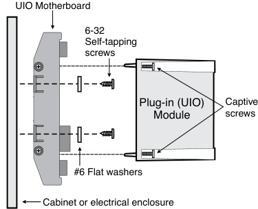
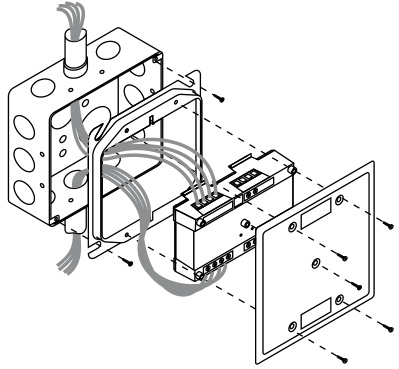
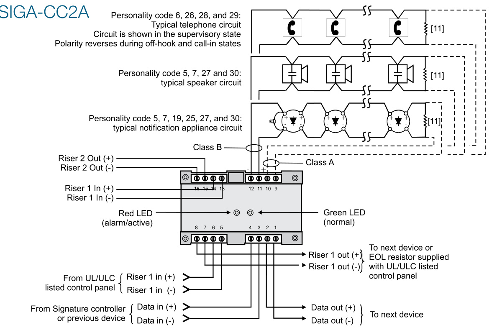
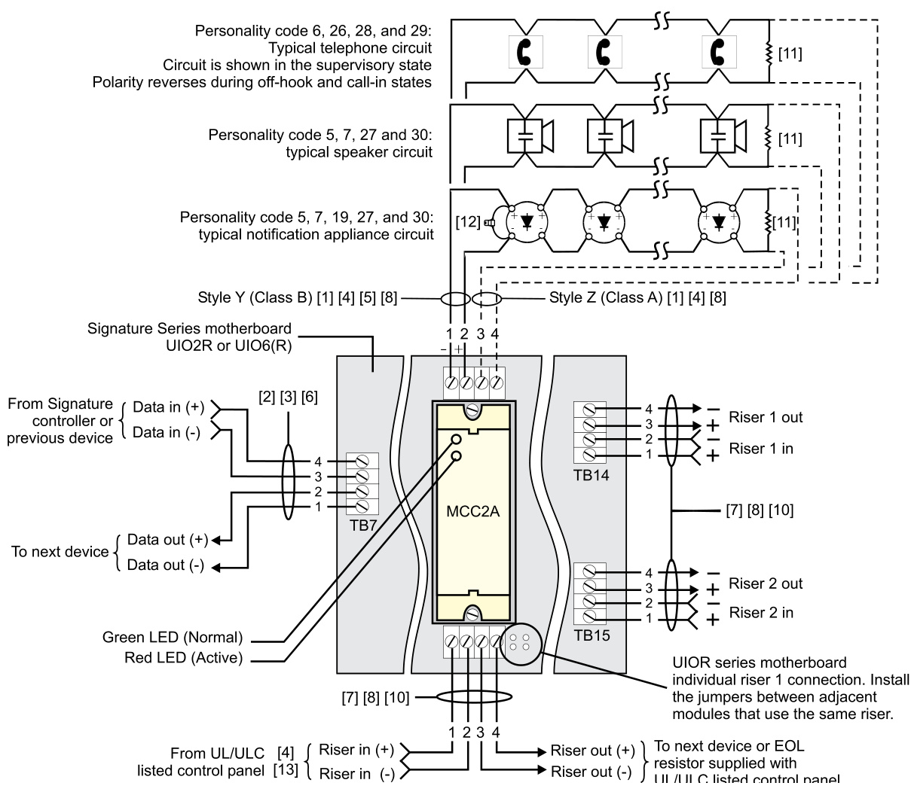

# Signal Modules with Class A Operation SIGA-CC2A, SIGA-MCC2A  

# Overview  

SIGA-CC2A and SIGA-MCC2A Single/Dual Input Signal Modules are part of EDWARDS's Signature Series system. They are intelligent analog addressable devices used for connecting, upon command from the loop controller, supervised Class A or Class B signal or telephone circuits to their respective power inputs.  

Module power inputs may carry polarized 24 Vdc current to operate audible and visible signal appliances, or 25 and $70\,\mathrm{V}_{\mathrm{RMS}}$ to operate audio evacuation speakers and firefighter’s telephones. The SIGA-CC2A/MCC2A may be configured as a three-state or four-state telephone riser selector.  

The loop controller assigns an address to the module automatically. No addressing switches are used. A custom address can be assigned using a laptop computer.  

Diagnostic LEDs provide visible indication of the status of the   
module when the cover plate is removed: •	 Normal — green LED flashes •	 Alarm/active — red LED flashes  

The CC2A mounts in a two-gang electrical box. The MCC2A plugs into a UIO motherboard. Both modules provide the same functionality.  

The actual operation of the module is determined by the “personality code” selected by the installer. It is downloaded to the module from the Signature loop controller during system configuration.  

# Standard Features  

# Class A or B Operation  

# •	 Supports three- and four-state telephones  

# Dual input (riser) select  

Use for connecting supervised 24 Vdc Audible/Visible signal circuits, or 25 and 70 VRMS Audio Evacuation and Telephone circuits to their power inputs.  

# Ring-tone generator  

When configured for telephone circuits, the SIGA-CC2A/ MCC2A generates its own ring-tone signal eliminating the need for a separate ring-tone circuit.  

# Plug-in (UIO) or standard 2-gang mount  

UIO versions allow quick installation where multiple modules are required. The 2-gang mount version is ideal for remote locations that require a single module.  

# Automatic device mapping  

Signature modules transmit information to the loop controller regarding their circuit locations with respect to other Signature devices on the wire loop.  

# Electronic addressing  

Programmable addresses are downloaded from the loop controller or a laptop PC; there are no switches or dials to set.  

Ground fault detection by address Detects ground faults right down to the device level.  

The operation of the SIGA-CC2A/MCC2A is determined by their sub-type code or “Personality Code”. The code is selected by the installer depending upon the desired application and is downloaded from the loop controller. The following personality codes can be used with the SIGA-CC2A/MCC2A:  

<html><body><table><tr><td colspan="2">Whenusing theSiGA-CC2A/McC2A asasingleinputmodule</td></tr><tr><td>Personality code5</td><td>panel inhibits the activation of the audible or visible signal circuit, so that the riser is not connected to the wiring fault.</td></tr><tr><td>Personality code 27</td><td>Riser selector Class A, single input. Operates the same as personality code 5, except wiring is Class A. Riser selector Class B three-state, single input, ring tone. The module operates as a riser selector for a three-state</td></tr><tr><td>Personality code 6 Personality</td><td>(open, normal, active) firefighter's telephone. When a telephone handset is plugged into its jack or lifted from its hook, the module generates its own ring-tone signal. A separate ring-tone riser is unnecessary. The module sends this signal to the control panel to indicate the presence of an off-hook condition and waits for the system operator to</td></tr><tr><td>code 28</td><td>Riser selector Class A three-state, single input, ring tone. Operates the same as personality code 6, except wiring is Class A. Riser selector Class B four-state, single input, ring tone. The module operates as a riser selector for a four-state (open, normal, active, trouble) firefighter's telephone. Only one telephone can be used with the CC2A at any given</td></tr><tr><td>Personality code 26 Personality</td><td>time. When a telephone handset is plugged into its jack or lifted from its hook, the module generates its own ring- operatorresponds, the ring-tonesignal is disabled.</td></tr><tr><td>code29 Personality</td><td>ClassA.NotcompatiblewithWardenPhones. Class B auto synchronization output. The module operates to provide synchronization of compatible fire alarm sig- nals across multiple zones. The output wiring is monitored for opens and shorts. If a short exists, the module inhibits</td></tr><tr><td>code25 Personality</td><td>the activation of the audible/visual signal circuit so that the riser is not connected to the wiring fault. Note: You may use nonsynchronous fire alarm signals with or instead of compatible synchronized fire alarm signals, but the opera- tion of these devices will not comply with UL 1971. twiringisClassA</td></tr></table></body></html>  

<html><body><table><tr><td colspan="2">WhenusingtheSIGA-CC2A/MCC2A Iasadualinputmodule:</td></tr><tr><td>Personality code7</td><td>Riserselector ClassB,dual input.Themoduleoperates asa riserselectorfor dualsignal power r (24 Vdc) or dual audioevacuation(25Vor70V)r riser selector. The output circuit is monitored for open or shorted wiring. If a short exists, the control panel inhibits the activation of the audible or visible signal circuit, so the riser is not connected to the wiring fault.</td></tr><tr><td>Personality code30</td><td>RiserselectorClassA,dualinput. . Operates the same as personality code 7,except wiring is Class A.</td></tr></table></body></html>  

# Installation  

SIGA-MCC2A: mount the UIO motherboard inside a suitable EDWARDS enclosure with screws and washers provided. Plug the SIGA-MCC2A into any available position on the motherboard and secure the module to the motherboard with the captive screws. Wiring connections are made to the terminals on the motherboard (see wiring diagram). UIO motherboard terminals are suited for $\#12$ to #18 AWG $2.5\;\mathrm{mm}^{2}$ to $0.75\;\mathrm{mm}^{2}$ ) wire size.  

  

SIGA-CC2A: mount to North American 2-1/2 inch $(64\;\mathsf{m m})$ deep two-gang boxes and 1-1/2 inch $(38\,\mathsf{m m})$ deep 4-inch square boxes with two-gang covers and SIGA-MP mounting plates. The terminals are suited for $\#12$ to $\#18$ AWG $(2.5\;\mathsf{m m}^{2}$ to $0.75\;\mathrm{mm}^{2})$ ) wire size.  

  
Electronic Addressing - The loop controller electronically addresses each module saving valuable time during system commissioning.  Setting complicated switches or dials is not required. Each module has its own unique serial number stored in its on-board memory. The loop controller identifies each device on the loop and assigns a “soft” address to each serial number. If desired, the modules can be addressed using a laptop computer. No addressing switches are used.  

# Warnings & Cautions  

These modules do not provide supervision of the riser. The f ire alarm panel must provide this function.  

These modules do not support conventional 2-wire smoke detectors.  

These modules will not operate without electrical power.  As fires frequently cause power interruption, we suggest you discuss further safeguards with your fire protection specialist.  

EDWARDS recommends that this module be installed according to latest recognized edition of national and local fire alarm codes.  

# Compatibility  

These modules are part of EDWARDS's Signature Series intelligent processing and control platform. They are compatible with EST4, EST3, EST3X and iO Series control panels.  

# Testing & Maintenance  

The module’s automatic self-diagnosis identifies when it is defective and causes a trouble message. The user-friendly maintenance program shows the current state of each module and other pertinent messages. Single modules may be turned off (de-activated) temporarily, from the control panel.  

Scheduled maintenance (Regular or Selected) for proper system operation should be planned to meet the requirements of the Authority Having Jurisdiction (AHJ). Refer to current NFPA 72 and ULC CAN/ULC 536 standards.  

# Wiring  

Single/Dual input Class A and Class B wiring (personality 5, 7, 19, 25, 27, 30) Ring tone for three-state and four-state telephone Class A and Class B wiring (personality 6, 26, 28, 29)  

  

# Notes  

For maximum wire resistance and maximum wire distances, refer to IOMC Manual (P/N 270144).  

Maximum #12 AWG $(2.5\mathsf{m m}^{2})$ wire. Min. #18 $(0.75\mathsf{m m}^{2})$ .  

Refer to Signature Loop Controller Installation Sheet for wiring specifications.  

These modules will NOT support two-wire smoke detectors.  

# SIGA-MCC2A  

All wiring power limited and supervised. If the input source is non-power limited, then maintain spacing of 1/4 inch or use FPL, FPLP, FPLR or equivalent in accordance with NEC.  

The SIGA-UIO6 does not come with TB8 through TB13.  

Supervised and powerlimited.  

Supervised and powerlimited when connected to a power-limited source. If the source is nonpowerlimited, maintain a space of 1/4 inch from power-limited wiring or use FPL, FPLP, FPLR, or an equivalent in accordance with the National Electrical Code.  

  

The input for this riser is common to all modules.  

<html><body><table><tr><td>SIGA-CC2A</td><td colspan="2">SIGA-MCC2A</td></tr><tr><td colspan="3">Voltage 20 VDC</td></tr><tr><td colspan="3">Standby: 350 μA Current Alarm:175 μA</td></tr><tr><td colspan="3">Ground fault 10 k Ohms</td></tr><tr><td>impedance Wire Size</td><td colspan="2">12to18AWG</td></tr><tr><td>Maximum line impedance</td><td colspan="2">(2.5 to 0.75 sq mm) Refer tothe installationmanual for</td></tr><tr><td>Output ratings (special applications)</td><td colspan="2">yourfire alarm control panel 24VDC:2A 25VAC audio:50 W 70 VAC audio:35W EOLresistor value: 47kQ</td></tr><tr><td>Operating</td><td colspan="2">Max. circuit resistance: Refer to manual Max. circuit capacitance: 0.1 μF Temperature: 32 to 120°F(0 to 49°C) Humidity: 0 to 93% RH, noncondensing</td></tr><tr><td>environment Storage temperature</td><td colspan="2">at 90F (32°C) -4 to 140°F (-20 to 60°F)</td></tr><tr><td>Standard 4 in. square box Mounting European 100 mm</td><td colspan="2">North American 2-1/2 in. deep 2-gang box UIO2R or UIO6(R) by 1-1/2 in. deep box motherboard square box</td></tr><tr><td>Synchronization</td><td colspan="2">Meets UL1971 synchronization requirement. All signaling devices signal within 0.01 seconds of eachotherforaperiodof at least twohourswhile maintaining a one hertz signal rate. (For a list of compatible devices, see “Compatibility"). Note: For synchronization, the maximum resistance between any two devices is 20 Ω. See the voltage specifications for the MCC2A, the signaling device, and thecontrol panel todetermine themaximum allowablewireresistance.</td></tr></table></body></html>  

Strobe Capacity   

<html><body><table><tr><td>Strobe candelarating</td><td>Maximumstrobes</td></tr><tr><td>15,15PS,5A</td><td>29</td></tr><tr><td>30,15/75,3A,7A</td><td>16</td></tr><tr><td>60,75PS,6A</td><td>11</td></tr><tr><td>75</td><td>10</td></tr><tr><td>110,8A</td><td>8</td></tr></table></body></html>  

<html><body><table><tr><td>Catalog Number</td><td>Description</td><td>Ship Wt. Ibs (kg)</td></tr><tr><td>SIGA-CC2A</td><td>Dual Input Signal Module (Standard Mount) with Class A Operation</td><td>0.5 (0.23)</td></tr><tr><td>SIGA-MCC2A</td><td>Dual Input Signal Module (UIO Mount) with Class A Operation</td><td>0.18 (0.08)</td></tr><tr><td colspan="3"></td></tr><tr><td colspan="3">Related Equipment</td></tr><tr><td>27193-21</td><td>Surface Mount Box-Red,2-gang</td><td>2 (1.2)</td></tr><tr><td>27193-26</td><td>Surface Mount Box -White, 2-gang</td><td>2 (1.2)</td></tr><tr><td>SIGA-UIO2R</td><td>Universal Input-Output Module Board w/Riser Inputs - Two Module Positions</td><td>0.32 (0.15)</td></tr><tr><td>SIGA-UIO6R</td><td>Universal Input-Output Module Board w/Riser Inputs - Six Module Positions</td><td>0.62 (0.28)</td></tr><tr><td>SIGA-UI06</td><td>Universal Input-Output Module Board - Six Module Positions</td><td>0.56 (0.25)</td></tr><tr><td>235196P</td><td>Bi-polar Transient Protector</td><td>0.01 (0.05)</td></tr><tr><td colspan="3"></td></tr><tr><td>Accessories</td><td>Multifunction Fire Cabinet - Red, supports</td><td></td></tr><tr><td>MFC-A</td><td>Signature Module Mounting Plates Signature Module Mounting Plate,</td><td>7.0 (3.1)</td></tr><tr><td>SIGA-MP1</td><td>1 footprint</td><td>1.5 (0.70)</td></tr><tr><td>SIGA-MP2</td><td>Signature Module Mounting Plate, 1/2 footprint</td><td>0.5 (0.23)</td></tr><tr><td>SIGA-MP2L</td><td>Signature Module Mounting Plate, 1/2 extended footprint</td><td>1.02 (0.46)</td></tr></table></body></html>  