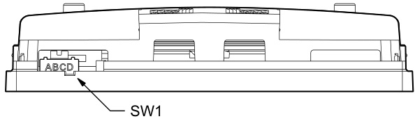
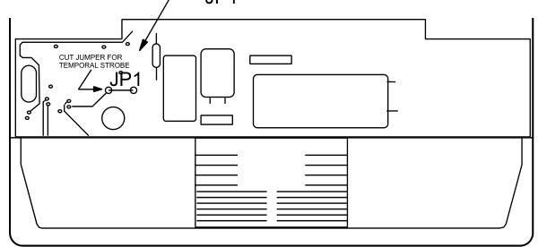

# Genesis Strobe Expander G4E Series  

# Overview  

EDWARDS's Genesis G4E Strobe Expander offers both Mass Notification/Emergency Communication (MNEC) and Life Safety System notification capabilities without all the wall clutter of separate, or larger appliances. The ingenious patent-pending G4E Strobe Expander accomplishes this by providing a separate, independently-controlled strobe that fits readily behind a Genesis G4 Series speaker or speaker-strobe.  

This attractive low-profile design allows a single, compact assembly to house three vital notification elements: a clear multicandela strobe that serves life safety requirements; a colored multi-candela strobe that serves MNEC needs; and, a highly intelligible multi-tap, multi-purpose loudspeaker.  

The UL Listed G4E Strobe Expander offers all the advanced features found in the popular Genesis line of notification appliances, including Fulllight™ strobe technology, as well as synchronization capabilities that exceed UL 1971 requirements. G4E Strobe Expanders are 100 per cent compatible with other Genesis and Enhanced Integrity appliances on the same circuit.  

The G4E packs two independent strobes and a loudspeaker into one sleek, low-profile design that is actually slimmer than many other single-strobe units on the market today. Functionally and aesthetically, the G4E Strobe Expander continues the Genesis tradition of excellence, quality and value.  

# Standard Features  

Sleek design Patent pending design allows the installation of two independent strobes and a speaker in a single compact footprint  

Fewer parts to stock Uses standard G4 Speaker-strobes  

Field configurable convenience Adjustable settings remain visible even after the unit is installed  

Meets UL 1971 synchronization requirements  

Highly regulated in-rush current Allows the maximum number of strobes on a circuit  

No extension ring or trim plate needed Fits standard 4-inch square electrical boxes with plenty of room behind the signal for wiring  

Optional surface-mount back box   
High and low rear mounting hole patterns and knock-outs for   
easy retrofit applications  

# Application  

The patent pending G4E is ideal for new and retrofit applications where both fire alarm and mass notification signaling is required. By allowing a speaker and two independent strobes to be installed in a single compact footprint, the G4E cuts down on wall clutter and reduces the number of boxes that have to be installed. This not only speeds installation and reduces costs – it also makes for a neat installation that minimizes the impact on the interior design of the protected space.  

For surface-mount and/or retrofit applications, the optional G4EWB (white) or G4ERB (red) backbox can be used.  This box has $\%"$ and $\%"$ knockouts, and a unique rear hole arrangement that allows for mounting over a 4" square box that is installed at $82"$ or $84^{\prime\prime}$ above finished floor (AFF), yet keeps the lower strobe light at $80"$ AFF.  The backbox can also be mounted directly to a solid surface and accept wiring through the top or side knockouts.  

The G4E Strobe Expander features field-selectable strobe outputs. The selection remains visible even after installation, making it easy to verify that the strobe output is suitable for the application – and in line with the output setting of its companion G4 Speaker-strobe.  

Available with red or white housings, as well as clear or amber lenses, and optional “FIRE” or “ALERT” markings, there is a G4E model to suit any application. For added flexibility, a simple jumper cut changes the flash rate from the standard one flash per second for public mode signaling, to a 3-3-3 temporal rate for private mode applications.  

Prevailing codes require strobes to be used where ambient noise conditions exceed specified levels, where occupants use hearing protection, and in areas of public accommodation. Consult your Authority Having Jurisdiction for details.  

All Genesis strobes, including the G4E, exceed UL synchronization requirements (within 10 milliseconds over a two-hour period) when used with a compatible synchronization source. See the Specifications section for details.  

NOTE: The flash intensity of some visible signals may not be adequate to alert or waken occupants in the protected area. Research indicates that the intensity of strobe needed to awaken 90 per cent of sleeping persons is approximately 100 cd. EDWARDS recommends that strobes in sleeping rooms be rated at at least 110 cd.  

# Wiring  

  

# Notes  

1.	 All wiring is power-limited and supervised.   
2.	 For proper electrical supervision, break the wire run at each $\mathsf{E}+$ and E– terminal.   
3.	 Marking indicates signal polarity required to activate the device.  

# Field Configuration  

Genesis G4E Strobe Expanders may be field configured for the desired candela output. The output setting is visible through a small window on the bottom of the device and is changed by simply sliding the switch until the desired setting appears in the window.  

  

Genesis speaker-strobes may also be configured for temporal flash. This feature is intended for private mode signaling only. To set the device for temporal flash, cut the jumper as shown in the Jumper Location diagram below.  

  

# Light output  

Per cent of UL rating versus angle  

  

# Candela Output  

<html><body><table><tr><td>Lens Color</td><td>Rating</td><td>Switch PositionA</td><td>Switch Position B</td><td>Switch Position C</td><td>Switch Position D</td></tr><tr><td>Amber</td><td>UL1638</td><td>110 cd</td><td>75 cd</td><td>30cd</td><td>15 cd</td></tr><tr><td>Amber</td><td>UL 1971*</td><td>88cd</td><td>60cd</td><td>24 cd</td><td>12 cd</td></tr><tr><td>Clear</td><td>UL 1971</td><td>110 cd</td><td>75cd</td><td>30cd</td><td>15 cd</td></tr></table></body></html>

\* Equivalent Rating  

# Typical Current Draw (RMS)  

<html><body><table><tr><td>Voltage</td><td>Switch PositionA</td><td>Switch PositionB</td><td>Switch PositionC</td><td>Switch PositionD</td></tr><tr><td>16 Vdc (UL)</td><td>294ma</td><td>239ma</td><td>130ma</td><td>96ma</td></tr><tr><td>20Vdc</td><td>245 ma</td><td>188 ma</td><td>101 ma</td><td>78 ma</td></tr><tr><td>24Vdc</td><td>203 ma</td><td>159 ma</td><td>86 ma</td><td>65 ma</td></tr><tr><td>16 Vfwr (UL)</td><td>375ma</td><td>329 ma</td><td>169 ma</td><td>120 ma</td></tr><tr><td>20Vfwr</td><td>342ma</td><td>264 ma</td><td>147 ma</td><td>106ma</td></tr><tr><td>24 Vfwr</td><td>283 ma</td><td>225ma</td><td>130 ma</td><td>95 ma</td></tr></table></body></html>  

# Installation and Mounting  

Genesis G4E Expanders are intended for indoor wall mounted applications only.  They can be flush mounted to a recessed North American 4” square electrical box (minimum $1.5^{\mathfrak{s}}$ deep). Units may also be surface mounted using the optional G4EWB (white) or G4ERB (red) backboxes. Refer to installation sheet for mounting height details  As always, check and comply with applicable codes and regulations.  

  

# Specifications  

<html><body><table><tr><td>Installation type</td><td>Indoor, dry</td></tr><tr><td>Housing</td><td>Red or white textured UV stabilized, color impregnated engineered plastic.Exceeds 94V-0 UL flammability rating.</td></tr><tr><td>Dimensions</td><td>7.81"h x5.06" w x 2.27" d (198 mm h x 129 mm w x 58 mm d) With wallbox: 7.81" h x 5.06" w x 4.02" d (198 mm h x 129 mm w x 102 mm d)</td></tr><tr><td>Mounting</td><td></td></tr><tr><td>(indoorwallmountonly)</td><td></td></tr><tr><td>WireConnections Operating environment</td><td>Screw terminals18 to16AWG (UL 1971),18to 14AWG (UL 1638)</td></tr><tr><td></td><td>32-120°F(0-49°C) ambient temperature; 0-93%relative humidity. UL1971,UL1638</td></tr><tr><td>Agency Listings</td><td></td></tr><tr><td>Operating Voltage</td><td>16 to33VDC,16to33VFWR(Thisdevicewastested totheregulated24VDC/FWRoperatingvoltagelimitsof16V and 33V. Donot apply80%and 110%of these values for system operation.)</td></tr><tr><td>UL ratings StrobeFlashRate</td><td>Regulated24DC,Regulated24FWR</td></tr><tr><td>Supervisory voltage</td><td>Default:Oneflashpersecond.Selectablebyjumper:3-3-3 temporal.</td></tr><tr><td></td><td>30Vmaximum MeetsUL1971requirements.Maximumallowedresistancebetweenanytwodevicesis20Q.Refertospecifications</td></tr><tr><td>Synchronization</td><td>for the synchronizationcontrol module,this strobe,and thecontrol panel todetermine allowed wireresistance.</td></tr><tr><td>SynchronizationSources</td><td>SIGA-CC1S,SIGA-MCC1S,SIGA-CC2A,SIGA-MCC2A,G1M-RM BPS6A,BPS10A,APS6A,APS10A,iO64, iO500,Fireshield Plus 3,5 and 10z0ne.</td></tr><tr><td>Compliance</td><td>Meets year 2004 UL requirements for standards UL1638 and UL1971,and complies with UL1480 fifth edition</td></tr></table></body></html>  

# Ordering Information  

<html><body><table><tr><td colspan="4">StrobeExpanderwithmulticandela strobe</td><td rowspan="2">Notes</td></tr><tr><td>Model</td><td>Housing</td><td>Marking</td><td>Lens</td></tr><tr><td>G4ERA-A</td><td rowspan="2">Red</td><td>Alert</td><td>Amber</td><td rowspan="5">ExpandersarelistedforuseonlyforG4 Speaker-strobeswith thesamehousing color andwithadifferentlenscolor.Clearlens modelsconfiguredforprivatemodearelisted toUL1971andUL1638.Clearlensmodels configuredforpublicmodeandcoloredlens UnitswithclearlensavailableonlywithFireor nomarkings. Shipping weight for all models: 0.77 Ib. (0.35</td></tr><tr><td>G4ERN-A</td><td>None</td><td>Amber</td></tr><tr><td>G4EWA-A</td><td rowspan="2">White</td><td></td><td>Amber</td></tr><tr><td>G4EWF-C</td><td>Alert Fire</td><td>Clear</td></tr><tr><td>G4EWN-A</td><td rowspan="2"></td><td>None</td><td>Amber</td></tr><tr><td></td><td></td><td>modelsareonlylisted toUL1638. kg).</td></tr></table></body></html>  

# Accessories  

<html><body><table><tr><td>Model</td><td>Description</td></tr><tr><td>G4ERB</td><td>G4 Dual-strobe FormatS Surface box,F Red</td></tr><tr><td>G4EWB</td><td>G4 Dual-strobe Format Surface box,White</td></tr></table></body></html>  

  