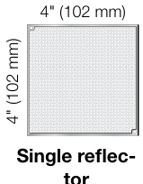
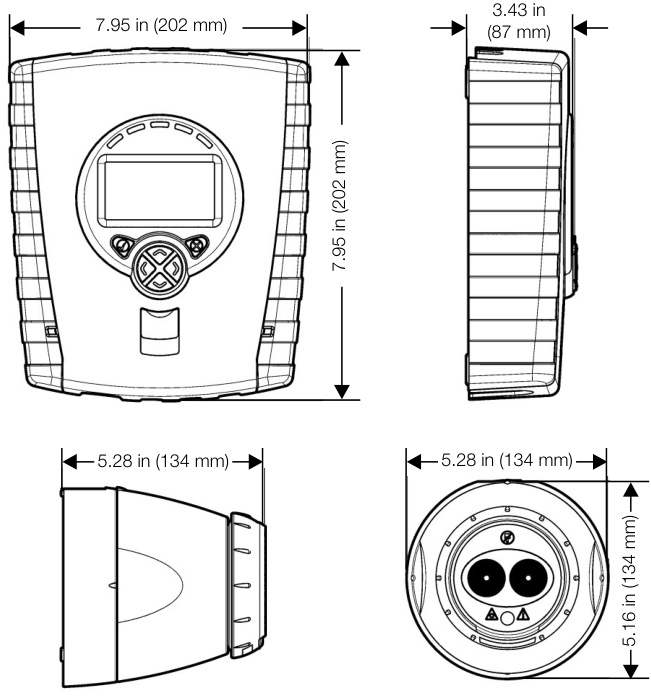

# Reflective Beam Smoke Detector EC5000R  

# Overview  

The EC5000R comprises a transmitter and receiver in a single enclosure. The transmitter emits an invisible infrared light beam that is reflected via a reflector mounted directly opposite and within a clear line of sight. The reflected infrared light is detected by the receiver and analyzed. Smoke in the beam path will reduce the received infrared light proportionally to the density of the smoke. The detector analyzes this attenuation and initiates an alarm condition when a predetermined level of obscuration is reached.  

The EC5000R System features advanced innovations such as auto-alignment, which indicates the optimal location of the reflector by means of an integrated laser. Once installed, the system automatically steers and maintains the beam to the optimum position for reliable performance.  

# Standard Features  

•	 Range of 26.25 to 330 ft. (8 m to 100 m) •	 Ground level controller with LCD display for easy system maintenance and testing Up to two detector heads reporting to one controller •	 Laser-assisted prism mounting speeds installation •	 Automatic beam alignment increases reliability •	 Contamination compensation reduces nuisance alarms •	 Building shift compensation maintains system integrity •	 Separate alarm and trouble contacts for easy configuration •	 Built-in electronic UL/ULC obscuration accepted fire test •	 Password protected settings for added security •	 Programmable fire thresholds for application flexibility  

# Application  

Reflective beam smoke detectors are ideal for large open areas such as warehouses, hotel atrium, industrial plants and school gymnasiums.  

An infrared signal is projected out of the transmitter optics to the reflector placed at the opposite end of the detection zone. The signal is reflected back to the receiver where it is analyzed for fire and trouble. The maximum lateral distance either side of the beam is found to be typically 30 feet (9.1 m) for satisfactory detection under flat ceilings, providing a total area coverage of 19,800 square feet (60 feet x 330 feet), or 1844 square metres ( $18.3\,\times$ $100.6\;\mathrm{m}$ ).  

Smoke stratification may be overcome by mounting multiple beam detectors at different heights, one of which will project an infrared beam below the heat layer and into the smoke layer.  

Detection time will be longer in a building with a peaked roof if a fire occurs at the fringes of the protected area. If in doubt conduct appropriate smoke tests.  

The ideal location and spacing of the detector is critical in a properly installed and operating fire alarm system. It is recommended that the detectors be located and spaced in accordance with NFPA 72.  

The recommended installation height is approximately 19 to 24 inches (483 to $610\;\mathsf{m m})$ ) below the ceiling. However, in all installations the National Fire Standards for that country/state must be consulted.  

Because of  the reflecting properties of the beam, all objects must be kept a minimum of 19 inches $(483\,\mathsf{m m})$ ) away from the centre of the beam path down the entire beam length. If highly reflective surfaces are close to the beam, then greater clearances should be applied.  

# Reflector Positioning  

Mount the reflector(s) on a secure surface directly opposite the detector. Ensure that there is a clear line of sight between the detector and the reflector(s), and that no moving objects such as doors or mechanical equipment interfere with the beam path. All objects should be kept away from the center of the detector beam down the entire length of the beam path. Reflectors should not be mounted on glass or reflective surfaces.  

EC5000R detectors come standard with a single reflector, which should be mounted between 27 and 160 feet (8 and $50\;\mathrm{m}$ ) from the detector.  

For detector/reflector distances of 160 to 330 ft (8 to 100 m), order a Long-Range Reflector Kit. This provides three additional reflectors for grouping as shown at right.  

See the Ordering Table for available mounting brackets and options.  

  

  

# Detector Spacing  

  

Detector positioning shown here is recommended for protected areas with flat ceilings. Spacing may vary for areas with high or sloped ceilings. In such cases, verify operation with smoke tests.  

In some cases potential smoke layering may be overcome by installing multiple beam detectors at different heights.  

# Typical Wiring  

The field wiring interface is accessed through the back plate of the detector head. The 8-pin connector is the interface to the field and is numbered left to right. This diagram is an example for a single reflective beam unit installed as the only device on a zone. The correct operation for Fire and Trouble should always be verified. Relays are shown in quiescent (standby) condition. Alarm and End of Line resistor values are determined by the fire alarm control panel and market standard practices.  

  
Zone Wiring  

# Engineering Specification  

The projected beam type smoke detector shall be listed to UL 268 listed and shall consist of up to two integrated transmitters, receiver detector heads and single low level remote control unit. The detector shall operate between a range of 26.25 ft. to 330 ft. (8m to 100m). The temperature range of the system shall be $-4^{\circ}\mathsf{F}$ to $131\,^{\circ}\mathsf{F}$ (- $-20^{\circ}\mathrm{C}$ to $55^{\circ}\mathrm{C})$ . The beam detector heads shall include an integral built-in laser pointer to assist prism mounting. The beam detector shall feature automatic gain control which will compensate for gradual signal deterioration from dirt accumulation on the lenses. The beams detector heads shall include AutoOptimise self-correcting motorized head feature to ensure unit is always receiving maximum signal available, and shall automatically compensate for building shift. The unit shall include a low level remote display and control unit with LCD read-out for set-up, reporting and testing of up to two separate detector heads. The system shall be capable of programming alarm thresholds of $10\%$ to $60\%$ in $1\,\%$ increments. The system shall be capable of programming delay to fault and delay to alarm from 2 seconds to 30 seconds in 1 second increments. Test and acceptance of the system shall be carried out by using the UL approved internal electronic obscuration fire test. The projected beam type smoke detector shall be a 4-wire 24 VDC device to be used with a Nationally Recognized Testing Laboratory’s Listed separately supplied 4-wire control panel. The Reflective beam type smoke detector shall be a Fire Fighting Enterprises Fireray 5000.  

# Dimensions  

  

# Technical Specifications  

<html><body><table><tr><td colspan="2">Electrical</td></tr><tr><td>Primary Input</td><td>14 to36VDC</td></tr><tr><td>Standby Current</td><td>LowCurrentMode:5mAto8.5mA@24VDC dependingonnumberofdetectorheadsused. HighCurrentMode:37mA@24VDC</td></tr><tr><td>AlarmCurrent</td><td>5mAto8.5mA@24VDC depending onnumberof detectorheadsused</td></tr><tr><td>Relay Contacts</td><td>1Aat30VDCResistive</td></tr><tr><td>Reset Time</td><td>5Secondsmaximum</td></tr><tr><td>Start Up Time</td><td>45 Seconds</td></tr><tr><td>Optical Wavelength</td><td>850nm</td></tr><tr><td>AlarmThreshold</td><td>10%-60% (35%Default)</td></tr><tr><td>Temperature Rating</td><td>-4 °F to 131°F(-20°C to 55°C). ULListedInstallations: 32°Fto 100F(0°℃ to37.8°C).</td></tr><tr><td>RelativeHumidity</td><td>0% to 93% RH non-condensing</td></tr><tr><td>Range</td><td>26.25ft.to330 ft.(8 m to 100 m)</td></tr><tr><td>Cabling</td><td>Betweendetectorsandcontrollers24to14AwG. One pair, shielded.</td></tr></table></body></html>  

<html><body><table><tr><td>Physical</td><td></td></tr><tr><td>Housing</td><td>FlameRetardantABS</td></tr><tr><td>IPRating</td><td>IP54</td></tr><tr><td>Finish</td><td>Light Grey/Black</td></tr><tr><td>Conduit Knockouts</td><td>Controller:7-1/2"/M-20 DetectorHead-1M-20</td></tr><tr><td>Weight:</td><td>Head & Controller:3.24 Ibs (1.47kg)</td></tr><tr><td>Dimensions</td><td>Head:5.28"H×5.16"L×5.28"W (135mmH×131mmL×134mmW Controller:3.43"Hx9.06"Lx7.95"W (87mmH×230mmL×202mmW) Prism:0.37"Hx4.13"L×3.94"W (9.5mmH×105mmL×100mmW)</td></tr></table></body></html>  

<html><body><table><tr><td colspan="2">Agency Listings</td></tr><tr><td>UL, ULC S529 (File no. S3417)</td><td>CSFM (File no. 7260-1508-104)</td></tr><tr><td>MEA (File no. 22-08-E)</td><td>FMApproved</td></tr></table></body></html>  

# Ordering Information  

<html><body><table><tr><td>EC5000R</td><td>Reflectiveautoalignbeamsmokedetectorsystem.Includesonedetectorhead onecontroller,oneprism.</td></tr><tr><td colspan="2"></td></tr><tr><td>Accessories</td><td></td></tr><tr><td>EC5000X</td><td>AdditionalDetectorheadandoneprism,foruseonEC5oooR</td></tr><tr><td>5000-004</td><td>LongRangePrismKit-3 additional prisms forinstallationsbetween160ftand330ft(50m-100m)</td></tr><tr><td>5000-005</td><td>UniversalAlignmentbracket</td></tr><tr><td>5000-201</td><td>Universal130degreealignmentbracket</td></tr><tr><td>5000-006</td><td>Wallbracketmounts,1or4prisms</td></tr><tr><td>5000-007</td><td>4 prism alignment adapter plate</td></tr><tr><td>5000-008</td><td>1prismalignmentadapterplate</td></tr><tr><td>5000-009</td><td>Controllerbackbox</td></tr><tr><td>5000-010</td><td>Semiflushtrimplatefor5000-009</td></tr><tr><td>5000-011</td><td>Detectorsurfacemountuni-box</td></tr><tr><td>5000-012</td><td>Detector2gangmountingplate</td></tr><tr><td>5000-014</td><td>CeilingPendantmountbracket</td></tr></table></body></html>  