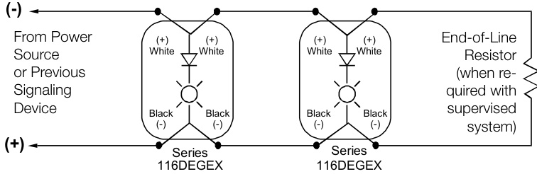
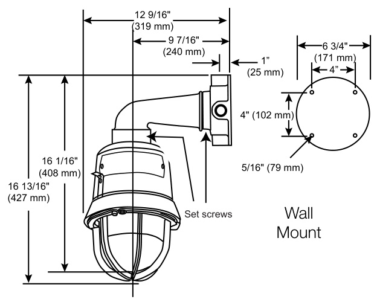
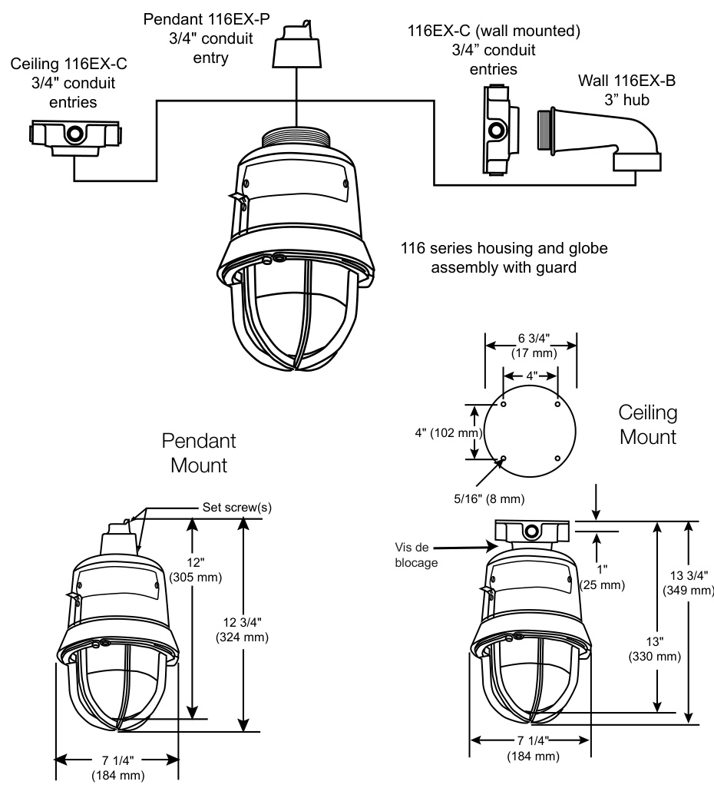
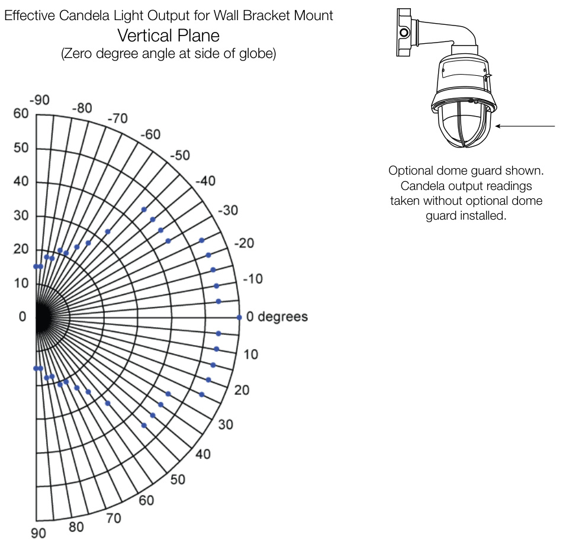
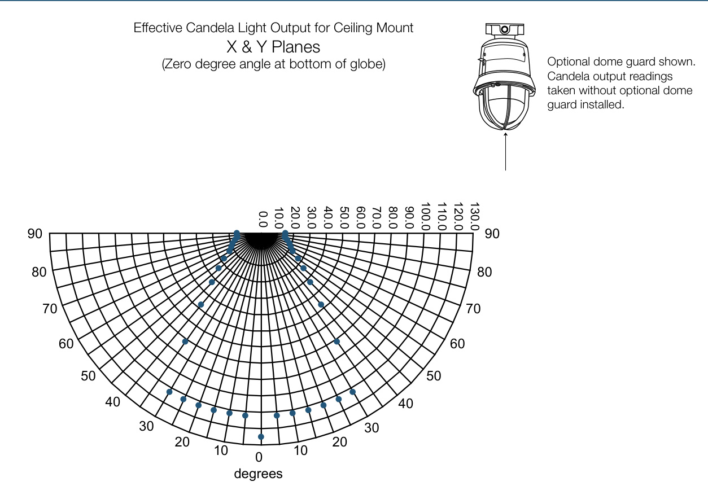

# Hazardous Location Strobes 116DEGEX-FJ  

# Overview  

116DEGEX-FJ hazardous location strobes are life safety signaling appliances designed for installation in hazardous environments. Rigid specifications and state-of-the-art technology provide for high visual output and low maintenance. The 116DEGEX-FJ has negligible in-rush current.  

When pendant, wall or ceiling mounted, the 116DEGEX-FJ meets or exceeds the requirements of UL 1971 Signaling Appliance for the Hearing Impaired.  

The 116DEGEX-FJ is intended for indoor use in UL 1971 (signal appliance for the hearing impaired) listed compatible fire alarm systems. The strobe flashes a 360-degree beam of light approximately at 1 Hertz (65 times per minute) with a UL 1971 125 cd ceiling and 60 cd wall light output. With the guard installed, the strobe flashes a beam with an output of 86 cd ceiling and 51 cd wall. The strobe is also UL 1638 (visual signal appliance, private mode) listed with dome guard installed for both indoor and outdoor use, and other applications requiring electrical supervision of the signaling circuit field wiring. The 116 Class strobes are cUL listed to Canandian Standard ULC-S526-07 (Visual Signal Device for Fire Alarm Systems), suitable for indoor and outdoor applications. The strobe features an enhanced synchronization circuit to comply with the latest requirements of UL 1971 and CAN/ULCS526-07. Synchronized operation requires a separately installed synchronization control module. See Ordering Information for details.  

When assembled with one of the three available mounting options, the 116DEGEX-FJ is UL Listed for use in Class I, Division 1, Groups C and D, Class I, Division 2, Groups A, B, C and D, Class II, Division 1, Group E, F and G, Class II, Division 2, Group F and G, and Class III Division 1 and 2 hazardous locations. The strobe is also cUL Listed as a Type 3R and 4X enclosure.  

# Standard Features  

•	 UL 1971 listed and ADA compliant for the hearing impaired   
•	 Negligible in-rush current   
•	 Approved for fire alarm applications   
•	 Wall, ceiling or pendant mount Diode-polarized for use in electronically supervised circuits High-impact glass dome   
•	 1 Hertz flash rate (65 flashes per minute)   
•	 Synchronized with external module   
•	 60 cd wall or 125 cd ceiling, per UL 1971   
•	 Factory sealed - no external seals required   
Quick connect - threads onto mounting module for easy installation   
•	 Epoxy powder coat for corrosion resistance   
•	 cUL listed to CAN/ULC-S526-07 and UL 1638 for indoor and outdoor applications  

# Application  

116DEGEX-FJ hazardous location strobes are designed for use in compatible EDWARDS fire alarm systems and other applications requiring electrical supervision of signaling circuit field wiring.  

These strobes are suitable for many locations including mines, graineries, flour mills, tankers, refineries, laboratories and other applications where environmental hazards may be present. 116DEGEX-FJ strobes are particularly well-suited in areas of high noise levels where standard bells or horns are not satisfactory.  

When pendant, wall or ceiling mounted, 116DEGEX-FJ strobes are cUL listed to CAN/ULC-S526-07 for indoor and outdoor applications, and UL 1971 Listed (ADA compliant) for indoor visual signaling applications in non-sleeping areas.  

# Wiring  

  

# Notes:  

•	 DC Polarity of circuit shown in supervisory state (signal inactive). Reverse circuit polarity to activate signal. •	 Electrical supervision requires wire run to be broken at each device. •	 Device for constant input voltage. Do not connect to “coded” or pulsating voltage.  

# Mounting  

Thanks to its modular design, the 116DEGEX-FJ configures for pendant, ceiling, or wall mounting. See the ordering information table for available mounting modules.  

  

  

• UL Required CD for 60 Rating • UL Required CD for 125 Rating  

  

  

<html><body><table><tr><td>Mounting</td><td>Pendant,ceiling,orwall</td></tr><tr><td>Rated strobeintensity</td><td>UL 1971 (indoor) and ULC-S526-07 (indoor& outdoor): 125 cd ceiling,60 cd wall</td></tr><tr><td>Flash Rate</td><td>1 Hertz (65 fpm)</td></tr><tr><td>Agency Listings</td><td>CUL</td></tr><tr><td>UL Listed Hazardous Classifications</td><td>Class I, Division 1,Groups C &D,Division 2,Groups A,B,C & D; Class ll, Division 1,Groups,E,F & G, Division 2,Groups F & G; Class Ill,Divisions 1& 2</td></tr><tr><td>ADACompliance</td><td>UL 1971 listed signaling appliance for the hearing impaired, indoor, non-sleeping areas only</td></tr><tr><td>SynchronizationSources</td><td>SIGA-CC1S,SIGA-MCC1S,SIGA-CC2A,SIGA-MCC2A,G1M-RM, BPS6A,BPS10A,APS6A,APS10A,iO64,iO500,FireshieldPlus3,5 and 10zone,EST3X</td></tr><tr><td>NEMA Ratings</td><td>Type 3R, Type 4X, cUL listed</td></tr><tr><td>VoltageRange</td><td>16-33Vdc,16-33VFWR</td></tr><tr><td>Operating Current(RMS)</td><td>0.505A@24Vdc(regulated),0.683A@24VFWR</td></tr><tr><td>OperatingTemperature</td><td>cUL -40 to 150 °F (-40 to 66 °℃)</td></tr><tr><td>Lens Color</td><td>Clear</td></tr><tr><td>Strobe Type</td><td>Xenon - clear/nominal white flash</td></tr><tr><td>Finish</td><td>Graypowdercoatepoxy</td></tr><tr><td>Weight</td><td>18 Ibs (8.2 kg)</td></tr></table></body></html>  

Operating Temperatures   

<html><body><table><tr><td>Ambient Temperature</td><td>SupplyWire Temperature Marking</td><td>ClassI,Div.2 GroupsA,B</td><td>Class I,Div. 1&2 Groups C,D</td><td>Classll,Div.1 GroupsE,F,G &ClassIIl</td><td>Class Il,Div.2 GroupsF,G，& ClassIIl</td></tr><tr><td>40°C(104F)</td><td>75°℃(167°F)</td><td>T2B(260°C)</td><td>T6 (85°C)</td><td>T4A (120°C)</td><td>T4A(120°C)</td></tr><tr><td>55°℃(131F)</td><td>90°C(194F)</td><td>T2B (260°C)</td><td>T6 (85 ℃)</td><td>T4 (135°C)</td><td>T4 (135°C)</td></tr><tr><td>65°C(149F)</td><td>105 °℃ (221F)</td><td>T2B (260 °C)</td><td>T6 (85 ℃)</td><td>T3C(160°C)</td><td>T3C(135°C)</td></tr></table></body></html>  

# Ordering Information  

<html><body><table><tr><td>Model</td><td>Description</td><td>Ship Wt.</td></tr><tr><td>116DEGEX-FJ</td><td>ExplosionproofStrobe,DiodePolarized</td><td>18Ibs8.2 kg</td></tr><tr><td>116EX-B</td><td>Wallbracketmountingelbow</td><td></td></tr><tr><td>116EX-C</td><td>Ceiling/wallmountingmodule</td><td></td></tr><tr><td>116EX-P</td><td>Pendant mounting module-3/4"(19 mm) NPT</td><td></td></tr><tr><td>116-GRD</td><td>LensGuard</td><td></td></tr><tr><td>116-GLOBE</td><td>ReplacementGlobe</td><td></td></tr></table></body></html>  