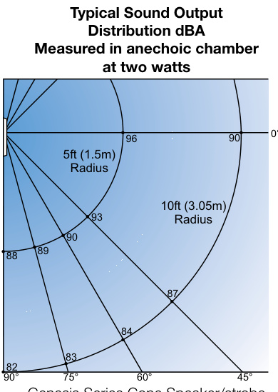
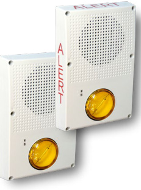
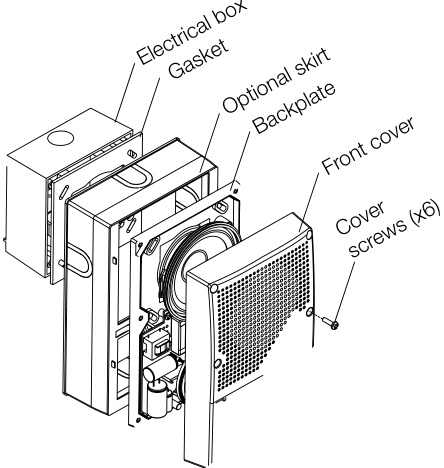
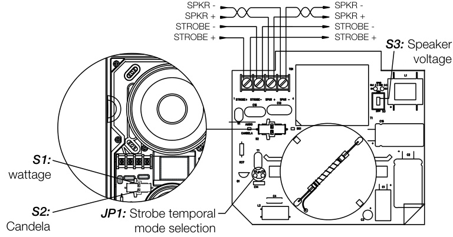
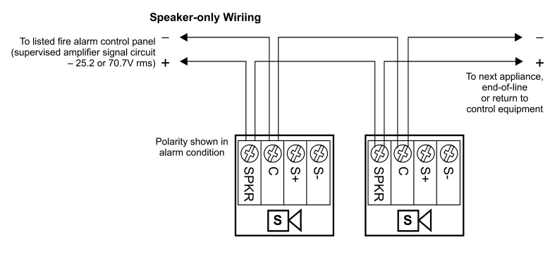
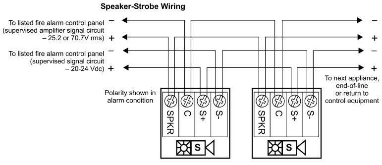
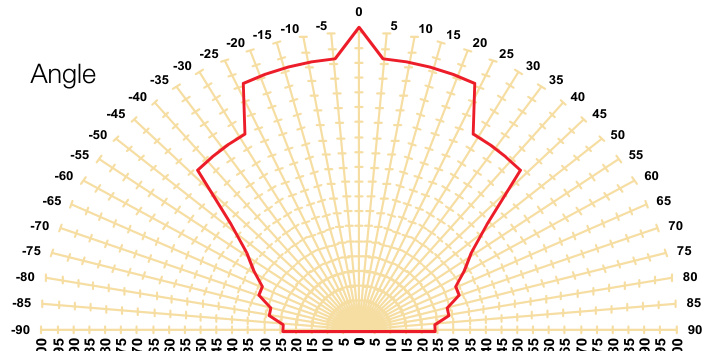
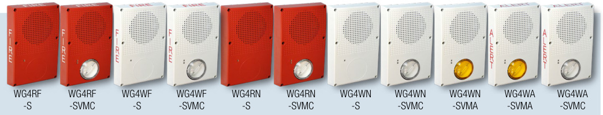

# Outdoor Rated Speakers and Strobes Genesis WG4 Series  

# Overview  

Genesis WG4 Series speakers and speaker-strobe appliances are among the most versatile emergency appliances of their kind. Rated for indoor or outdoor use, they are suitable for a wide range of wet and harsh environments with a listed operating temperature range of as low as $-31\,^{\circ}\mathsf{F}$ to as high as $151\,^{\circ}\mathsf{F}$ (- $35^{\circ}\mathrm{C}$ to $66^{\circ}\mathrm{C})$ .  

Field-configurable light and sound output settings add to their onsite flexibility, while optional FIRE or ALERT markings and colored lenses make them ideal for either emergency communications/ mass notification (ECS/MNS) or fire alarm applications.  

These appliances are suitable for indoor and outdoor applications, and are ideal for challenging conditions such as parking garages and process areas. They are listed for mounting on the ceiling or the wall, and thanks to an ingenious full backplane sealing gasket, can be installed to recessed (in-the-pour/block) electrical boxes. WG4 signals also mount to suitable surface boxes served by raceways. Optional color-matched trim skirts provide a clean, finished appearance. All appliance wiring is accomplished room-side for easy installation.  

WG4 Series appliances feature highly intelligible and efficient mylar-cone loudspeakers. These are dual-voltage (25.2V or 70.7V), and have field-selectable output taps ranging from 80.8 dBA to 90.0 dBA. The multi-candela strobes are available with clear or amber lenses and in two output categories – standard and high-output. They are precision-timed to meet UL 1971 synchronization standards, and field-configurable for one of four candela intensities. Wattage and candela settings are viewable even after installation through an innovative sealed viewport display.  

# Standard Features  

•	 Outdoor and indoor rated   
•	 Low-profile design   
•	 Wall or ceiling mount   
•	 Room-side wiring accepts 18 to 12 AWG (0.75 to $2.5\;\mathrm{mm}^{2}$ )  
•	 Wide operating temperature range   
•	 Field-selectable speaker wattage, voltage, and strobe candela settings   
•	 Field-configurable temporal strobe output option   
•	 Clear and amber lenses available   
•	 Fully-compatible with Genesis synchronization protocols   
•	 Standard and high-output strobe intensities   
•	 Speaker only and Speaker/Strobe appliance options  

# Application  

# Speaker Application  

The suggested sound pressure level for each signaling zone used with alert or alarm signals is a minimum of 15 dB above the average ambient sound level or 5 dB above the maximum sound level  

having a duration of at least 60 seconds, whichever is greater. This is measured 5 feet $(1.5\;\mathsf{m})$ ) above the floor.  

Doubling the distance from the signal to the ear will theoretically cause a 6dB reduction in the received sound pressure level. The actual effect depends on the acoustic properties of materials in the space. Doubling the power output of a device (e.g.: a speaker from 1W to 2W) will increase the sound pressure level by 3dBA.  

  
Genesis Series Cone Speaker/strobe  

# Strobe Application  

Genesis clear-lensed strobes are UL 1971-listed for use indoors as wall- or ceiling-mounted public-mode notification appliances for the hearing impaired, and UL 1638-listed for outdoor applications. Prevailing codes require strobes to be used where ambient noise conditions exceed specified levels, where occupants use hearing protection, and in areas of public accommodation. UL 1638-listed colored lens strobe lights are available for ECS/MNS and outdoor applications.  

Visible appliance synchronization is required to avoid causing issues with people who have Photosensitive Epilepsy (PSE).  Notification appliance synchronization is also generally required when more than one strobe appliance are in the same field of view from any one location. All Genesis strobes meet UL synchronization requirements (within 10 milliseconds over a two-hour period) when used with a synchronization source.  

# ECS/MNS Application  

Genesis ECS/MNS appliances bring the same high-performance life safety features and unobtrusive design to mass notification applications. Standard models are available with clear or amber lenses and optional ALERT housing labels, they are ideal for applications that require differentiation between life safety and mass notification alerts. Appliances with red, green or blue lenses are also available.  Contact EDWARDS Customer Service for details.  

  

WARNING: These devices will not operate without electrical power. As fires frequently cause power interruptions, we suggest you discuss further safeguards with your local fire protection specialist.  

EDWARDS recommends that these devices always be installed in accordance with the latest recognized edition of national and local codes. Refer to the appropriate codes and standards for mounting height information.  

# Installation and Mounting  

  

WG4 signals are rated for outdoor use and are suitable for indoor or outdoor applications on walls or ceilings. For surface-mounting in outdoor or wet applications, appliances must be mounted to an EDWARDS 449 electrical box. In dry conditions, they are compatible with standard 4-inch by $1\,\%$ -inch deep electrical boxes. When using the optional  

WG4WTS or WG4RTS trim skirt, a  449 or 2-1/8" deep box must be used.  

The Genesis WG4 Speaker-Strobe may be wall- or ceiling-mounted, and may be placed in one of four positions: strobe above, strobe below, and strobe to either side. The shallow depth of Genesis devices leaves room behind the appliance for extra wiring.  

# Field Configuration  

Genesis WG4 speakers may be set to 70- or 25-Volt operation, and for $\%$ ,$\%$ , 1, or 2 watt operation. The wattage setting (represented by the letters Z,Y, X, and T) is changed by removing the cover and simply sliding the S1 switch until the desired setting appears. The setting remains visible through a small window on the front of the device after the cover is installed. The voltage setting (70V or 25V) is toggled at S3. This setting is not visible after the cover is replaced.  

Genesis WG4 speaker-strobes also feature selectable candela output. The actual light output for a given selection depends on the color of the strobe lens and whether it is a high output model or a standard output model. Refer to the specification tables for corresponding settings. The candela setting (represented by the letters D, C, B, and A) is changed by removing the cover and simply sliding the S2 switch until the desired setting appears. The setting remains visible through a small window on the front of the device after the cover is installed.  

  

Genesis speaker-strobes may also be configured for temporal flash. This power-saving feature is intended for private mode signaling only. To set the device for temporal flash, snip the jumper at $\pmb{\mathcal{I}}\pmb{\mathcal{P}}\pmb{\mathcal{I}}$ .  

<html><body><table><tr><td>Speaker Default Strobe</td><td>25VRMSor70VRMS,switchselectable 70VRMS 24VDC,24VFWRnominal</td></tr><tr><td>Supervisoryvoltage</td><td>30 V max.</td></tr><tr><td>Speakerresponse</td><td>400 to 4,000 Hz</td></tr><tr><td>Wiresize</td><td>12 to18AWG(0.75 to2.50mm2)</td></tr><tr><td>Compatible strobe synchronization sources</td><td>SIGA-CC1S,SIGA-MCC1S,SIGA-CC2A SIGA-MCC2A,G1M-RM,BPS6A,BPS10A APS6A,APS10A,3X-SFS1,iO64,iO500, FireshieldPlus3,5and10zone.</td></tr><tr><td>Compatible electricalboxes</td><td>Wet:Model449 (WG4trimskirtrecommended) Dry:4"squareby1-1/2"deepboxwhenused withouta trimskirt.Whentrimskirtisused, box mustbe 4"squareby2-1/8"deep.</td></tr><tr><td>Operatingenvironment Temperature Relativehumidity</td><td>Wet -31 to 151F (-35to66°C) 0to95%noncondensing</td></tr></table></body></html>  

# Sound level output (dBA)  

<html><body><table><tr><td>Wattage</td><td>SwitchPosition</td><td>25V 70V</td></tr><tr><td>2W</td><td>T 90.0</td><td>89.7</td></tr><tr><td>1W</td><td>X 87.1</td><td>86.9</td></tr><tr><td>12W</td><td>Y 84.0</td><td>83.9</td></tr><tr><td>14W</td><td>Z 80.8</td><td>80.8</td></tr></table></body></html>

dBA $=$ Decibels, A-weighted. UL 1480: Sound level output at 10 ft. $(3.05\;\mathsf{m})$ measured in a reverberant room using 400 to 4,000 Hz band-limited pink noise.  

# Wiring  

Field wiring is connected to Genesis signals with terminals that accommodate #18 to #12 AWG $(0.75\;\mathrm{mm}^{2}$ to $2.5\;\mathsf{m m}^{2},$ ) wiring.  

  

  

  
UL off-axis candela requirements as a percent of the UL rated output  

<html><body><table><tr><td colspan="2">Indoor rating per UL 1971 (candela)</td><td colspan="2">StrobeSwitchPosition A B</td><td>C D</td></tr><tr><td rowspan="3">Standard indino Models (-SVMx)</td><td rowspan="2">Lens Color</td><td>Clear</td><td>87 70</td><td>29 15</td></tr><tr><td>Amber*</td><td>62 59 25</td><td>13</td></tr><tr><td rowspan="2">Current</td><td>VDC</td><td>319 167</td><td>144 106</td></tr><tr><td>FWR</td><td>386 347</td><td>178 120</td></tr><tr><td rowspan="4">High Output Models (-SVMHx)</td><td rowspan="2">Lens Color</td><td>Clear</td><td>161 147 123</td><td>102</td></tr><tr><td>Amber*</td><td>130 125 101</td><td>84</td></tr><tr><td rowspan="2">Current</td><td>VDC</td><td>495 494</td><td>390 324</td></tr><tr><td>FWR</td><td>646 607 487</td><td>412</td></tr></table></body></html>

\* UL 1971 Equivalent candela value  

<html><body><table><tr><td colspan="2">Outdoor rating per UL 1638 (candela)</td><td colspan="2">StrobeSwitchPosition</td><td>D</td></tr><tr><td rowspan="4">Standard indino Models (-SVMx)</td><td rowspan="2">Lens Color</td><td>Clear</td><td>A B C</td><td>6</td></tr><tr><td>Amber*</td><td>35 28 25 24</td><td>12 10 5</td></tr><tr><td rowspan="2">Current</td><td>VDC</td><td>319 167</td><td>144 106</td></tr><tr><td>FWR</td><td>386 347 178</td><td>120</td></tr><tr><td rowspan="4">High Output Models (-SVMHx)</td><td rowspan="2">Lens Color</td><td>Clear</td><td>65 60 50</td><td>41</td></tr><tr><td>Amber*</td><td>52 51 41</td><td>34</td></tr><tr><td rowspan="2">Current</td><td>VDC</td><td>495 494 390</td><td>324</td></tr><tr><td>FWR</td><td>646 607 487</td><td>412</td></tr></table></body></html>

\* UL 1971 Equivalent candela value  

# Ordering Information  

  

All speakers include field-selectable ¼, ½, 1, or 2 watt taps and selectable 25V or 70V operation.  

<html><body><table><tr><td>Model</td><td>Housing</td><td>Marking</td><td>Lens</td><td>StrobeOutput*</td><td>Ship Wt.</td></tr><tr><td colspan="6">LifesafetyAppliances</td></tr><tr><td>WG4RF-SVMC</td><td>Red</td><td rowspan="2">FIRE None</td><td rowspan="6"></td><td rowspan="6">Selectable standard output 15/29/70/87 cd</td><td rowspan="6">1.5 Ibs. (0.68 kg)</td></tr><tr><td>WG4WF-SVMC</td><td>White</td></tr><tr><td>WG4RN-SVMC</td><td>Red</td><td rowspan="2">Clear</td></tr><tr><td>WG4WN-SVMC</td><td>White</td></tr><tr><td>WG4RF-SVMHC</td><td>Red</td><td rowspan="2">FIRE</td><td rowspan="3">Selectable high output 102/123/147/161cd</td></tr><tr><td>WG4WF-SVMHC</td><td>White</td></tr><tr><td>WG4RN-SVMHC</td><td>Red</td><td rowspan="2">None</td></tr><tr><td>WG4WN-SVMHC</td><td>White</td><td rowspan="2">FIRE</td></tr><tr><td>WG4RF-S</td><td>Red</td><td rowspan="2"></td></tr><tr><td>WG4WF-S</td><td>White</td><td rowspan="2">Speaker Only</td></tr><tr><td>WG4RN-S</td><td>Red</td><td rowspan="2">None</td></tr><tr><td>WG4WN-S</td><td>White</td><td rowspan="2"></td></tr><tr><td></td><td></td><td rowspan="2"></td></tr><tr><td></td><td></td><td rowspan="2"></td></tr><tr><td></td><td></td><td></td></tr></table></body></html>  

ECS/MNS Appliances   

<html><body><table><tr><td>WG4WA-SVMA</td><td rowspan="8">White</td><td>ALERT</td><td rowspan="3">Amber</td><td>Selectable</td><td rowspan="6">1.5 Ibs. (0.68 kg)</td></tr><tr><td>WG4WN-SVMA</td><td>None</td><td>standardoutput 13/25/59/62cd</td></tr><tr><td>WG4WA-SVMC</td><td>Clear ALERT</td><td>15/29/70/87cd</td></tr><tr><td>WG4WA-SVMHA</td><td rowspan="2">None</td><td rowspan="2">Selectablehighoutput Amber 84/101/125/130cd</td></tr><tr><td>WG4WN-SVMHA</td></tr><tr><td>WG4WN-SVMHC WG4WA-SVMHC</td><td rowspan="2">ALERT</td><td colspan="2" rowspan="2">Selectablehighoutput Clear 102/123/147/161cd Speaker Only</td></tr><tr><td>WG4WA-S</td></tr></table></body></html>

\* See light output tables for more specific strobe values.  

Accessories   

<html><body><table><tr><td>WG4WTS</td><td>Surface Skirt for GenesisWG4 appliance family,white.</td></tr><tr><td>WG4RTS</td><td>Surface Skirt for Genesis WG4 appliance family, ,red.</td></tr><tr><td>WG4GSKT</td><td>ReplacementMounting Gasket</td></tr><tr><td>74347U</td><td>Surfacemountbox,outdoorrated</td></tr></table></body></html>  