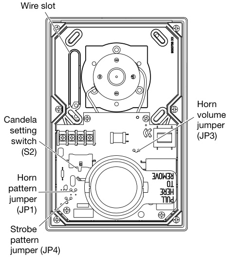
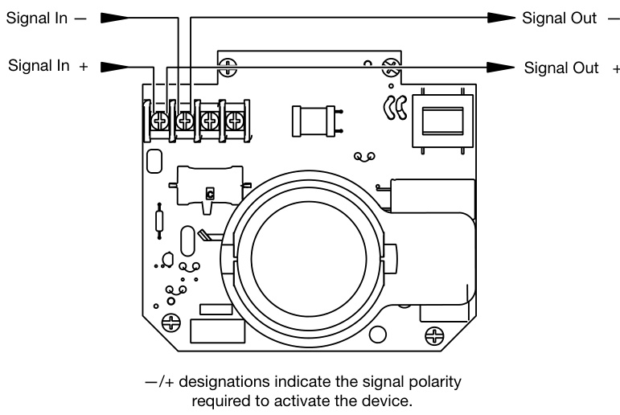

# Outdoor Rated Horns and Horn-Strobes Genesis WG4 Series  

# Overview  

Genesis WG4 Series horns and horn-strobe appliances are among the most versatile emergency appliances of their kind. Rated for indoor or outdoor use, they are suitable for a wide range of wet and harsh environments with a listed operating temperature range of as low as $-40~^{\circ}\mathsf{F}$ to as high as 151 $^{\circ}\mathsf{F}$ (- ${\cdot}40\ ^{\circ}\mathrm{C}$ to $66\;^{\circ}\mathrm{C}_{\prime}$ ).  

Field-configurable light and sound output settings add to their onsite flexibility, while optional FIRE markings make them ideal for fire alarm applications.  

These appliances are suitable for indoor and outdoor applications, and are ideal for challenging conditions such as parking garages and process areas. They are available for mounting on the ceiling or the wall, and thanks to an ingenious optional full backplane sealing gasket, can be installed to recessed (in-the-pour/block) electrical boxes. WG4 notification appliances also mount to suitable surface boxes. Optional color-matched trim skirts provide a clean, finished appearance. All appliance wiring is accomplished room-side for easy installation.  

WG4 Series appliances feature an efficient and powerful piezo sounder. The multi-candela strobes are available with clear lenses in two output categories – standard and high-output. They are precision-timed to meet UL 1971 synchronization standards, and field-configurable for one of four candela intensities. Candela settings are viewable even after installation through an innovative sealed viewport display.  

# Standard Features  

•	 Outdoor and indoor rated   
•	 Low-profile design Wall or ceiling mount   
•	 Room-side wiring accepts 18 to 12 AWG (0.75 to $2.5\;\mathrm{mm}^{2}$ )Wide operating temperature range   
•	 Field-selectable settings   
•	 Fully-compatible with Genesis synchronization protocols   
•	 Standard and high-output strobe intensities   
•	 Horn only and horn-strobe options  

# Application  

# Installation and Mounting  

# Horns  

Genesis horn output reaches as high as 97 dBA in accordance with UL 464 (104 dBA in accordance with ULC-S525) and features a unique frequency tone that results in excellent sound penetration and an unmistakable warning of danger. Horns may be configured for either coded or non-coded notification circuits. They can also be set for low dB output with a jumper cut that reduces horn output by about 5 dB.  

The suggested sound pressure level for each notification zone used with alarm notification appliances is at least 15 dB above the average ambient sound level, or 5 dB above the maximum sound level having a duration of at least 60 seconds, whichever is greater, measured 5 feet (1.5 m) above the floor. The average ambient sound level is A-weighted (fast response) sound pressure measured over a 24-hour period.  

Doubling the distance from the notification appliance to the ear will theoretically result in a 6 dB reduction of the received sound pressure level. The actual effect depends on the acoustic properties of materials in the space.  A 3 dBA difference represents a barely noticeable change in volume.  

# Strobe Application  

Genesis clear-lensed strobes are UL 1971-listed for use indoors as wall- or ceiling-mounted public-mode notification appliances for the hearing impaired, and UL 1638-listed for outdoor applications. Prevailing codes require strobes to be used where ambient noise conditions exceed specified levels, where occupants use hearing protection, and in areas of public accommodation.  

Visible appliance synchronization is required to avoid causing issues with people who have Photosensitive Epilepsy (PSE).  Notification appliance synchronization is also generally required when more than two strobe appliances are in the same field of view from any one location. All Genesis strobes meet UL synchronization requirements (within 10 milliseconds over a two-hour period) when used with a synchronization source.  

WARNING: These devices will not operate without electrical power. As fires frequently cause power interruptions, we suggest you discuss further safeguards with your local fire protection specialist.  

EDWARDS recommends that these devices always be installed in accordance with the latest recognized edition of national and local codes. Refer to the appropriate codes and standards for mounting height information.  

  

WG4 notification appliances are rated for outdoor use and are suitable for indoor or outdoor applications on walls or ceilings. For surface-mounting in outdoor or wet applications, appliances must be mounted to a 449 or 74347U electrical box. In dry conditions, they are compatible with standard 4-inch square by $1\,\%$ -inch deep electrical boxes. When using the optional WG4WTS or WG4RTS trim skirt, a  449 or 4-inch square by $2\!-\!1/8"$ deep box must be used.  

The Genesis WG4 horn and horn-strobe may be wall- or ceilingmounted, and may be placed in one of four positions: strobe above, strobe below, and strobe to either side. The shallow depth of Genesis devices leaves room behind the appliance for extra wiring.  

# Field Configuration  

Horn pattern: Audible output for WG4 horns and horn-strobes is factory set to to sound in a three-pulse temporal pattern. Units may be configured for use with coded systems by cutting a JP1 on the circuit board. This results in a steady output that can be turned on and off (coded) as the system applies and removes power to the notification circuit. A Genesis Signal Master is required when horn-strobe models are configured for coded systems.  

  

Horn output: Horns and horn-strobes are factory set for high dB output.   
Low dB output may be selected by cutting a jumper on the circuit board.   
This reduces the output by about 5 dB.  

Strobe pattern: Genesis WG4 horn-strobes are factory set for use as UL 1971 compliant notification appliances for public mode operation. These notification appliances may be configured for temporal flash by cutting JP4 on the circuit board. This battery-saving feature is intended for private mode signaling only.  

Strobe output: Genesis WG4 horn-strobes may be set for one of four output intensities.The output setting is changed by simply opening the device and sliding the switch to the desired setting. The device does not have to be removed to change the output setting. The setting remains visible after the cover is closed through a small window on the front of the device.  

# Wiring  

Field wiring is connected to WG4 notification appliances with terminals that accommodate #18 to #12 AWG $(0.75\;\mathrm{mm}^{2}$ to 2.5 $\mathsf{m m}^{2},$ ) wiring.  

  

# Specifications  

Horns and Horn-strobes   

<html><body><table><tr><td></td><td>24VDC,24VFWRnominal</td></tr><tr><td>Operatingvoltage Dimensions (WxH×D)</td><td>5.6×8.5×1.4in.(142×216×36mm)</td></tr><tr><td>Horntone</td><td>3.2 kHz</td></tr><tr><td>Wiresize</td><td>12 to18AWG(0.75to2.50mm2)</td></tr><tr><td>Compatibleelectricalbox</td><td></td></tr><tr><td>Outdoor Indoor</td><td>Model449or74347U 4 in.square by 1.5 in.deepbox</td></tr><tr><td>Operatingenvironment</td><td></td></tr><tr><td>Temperature</td><td>-40 to151°F(-40 to66°C)</td></tr><tr><td></td><td>Relativehumidity0to95%noncondensing</td></tr></table></body></html>  

# Compatible Synchronization Sources  

Horn-strobes   

<html><body><table><tr><td>Auto-sync OutputModules</td><td>SIGA-CC1S,SIGA-CC2A,SIGA- MCC1S,SIGA-MCC2A</td></tr><tr><td>GenesisSignalMaster</td><td>G1M-RM</td></tr><tr><td>Booster&AuxiliaryPowerS Supplies</td><td>APS6A,APS10ABPS6ABPS10A</td></tr><tr><td>ControlPanelswithGenesis Synchronizationbuilt-in</td><td>FireShieldPlus,iOSeries,EST3X</td></tr></table></body></html>  

# Sound Output  

Horns and Horn-strobes (dBA)   

<html><body><table><tr><td rowspan="2">VolumeSetting</td><td colspan="2">16V</td><td colspan="2">24V</td><td colspan="2">33V</td></tr><tr><td>UL 464</td><td>ULC- S525</td><td>UL 464</td><td>ULC- S525</td><td>UL 464</td><td>ULC- S525</td></tr><tr><td>Continuous High</td><td>89.7</td><td>94.0</td><td>94.7</td><td>99.6</td><td>97.4</td><td>102.9</td></tr><tr><td>ContinuousLow</td><td>85.4</td><td>92.8</td><td>89.5</td><td>97.2</td><td>92.5</td><td>98.6</td></tr><tr><td>Temporal High</td><td>84.2</td><td>96.5</td><td>90.5</td><td>100.5</td><td>93.5</td><td>104.2</td></tr><tr><td>Temporal Low</td><td>81.7</td><td>90.3</td><td>85.4</td><td>94.2</td><td>88.1</td><td>97.0</td></tr></table></body></html>

dBA $=$ Decibels, A-weighted. UL 464: Sound level output measured in a reverberant room at 10 ft. (3.05m). CAN/ULC-S525: Sound level output measured in an anechoic room at 10ft (3.05m).  

Standard Candela Horn-strobes   

<html><body><table><tr><td colspan="2" rowspan="2">Standard/rating</td><td colspan="4">StrobeSwitchPosition</td></tr><tr><td>D</td><td>C</td><td>B</td><td>A</td></tr><tr><td>UL1971</td><td>Indoor</td><td>15cd</td><td>29cd</td><td>70cd</td><td>87cd</td></tr><tr><td>UL1638</td><td>Outdoor@-35°C</td><td>6cd</td><td>12 cd</td><td>28cd</td><td>35cd</td></tr><tr><td>CAN/ULC-S526</td><td>Outdoor @-40°C</td><td>1 cd</td><td>3cd</td><td>8cd</td><td>10cd</td></tr></table></body></html>  

High Candela Horn-strobes   

<html><body><table><tr><td rowspan="2">Standard/rating</td><td colspan="4">StrobeSwitchPosition</td></tr><tr><td>D</td><td>C</td><td>B</td><td>A</td></tr><tr><td>UL 1971</td><td>Indoor</td><td>102cd</td><td>123cd</td><td>147cd</td><td>161cd</td></tr><tr><td>UL1638</td><td>Outdoor @-35°C</td><td>41cd</td><td>50cd</td><td>60cd</td><td>65cd</td></tr><tr><td>CAN/ULC-S526</td><td>Outdoor @-40°C</td><td>11 cd</td><td>14 cd</td><td>17 cd</td><td>18cd</td></tr></table></body></html>  

# Operating Current (UL specifies current ratings at 16 volts)  

Standard Candela Horn-strobes in RMS (mA), continuous   

<html><body><table><tr><td rowspan="2">Input Voltage</td><td colspan="4">StrobeSwitchPosition</td></tr><tr><td>D</td><td>C</td><td>B</td><td>A</td></tr><tr><td>16VDC</td><td>127</td><td>168</td><td>297</td><td>351</td></tr><tr><td>16VFWR</td><td>218</td><td>239</td><td>393</td><td>422</td></tr><tr><td>24VDC</td><td>107</td><td>130</td><td>210</td><td>238</td></tr><tr><td>24VFWR</td><td>190</td><td>222</td><td>325</td><td>356</td></tr></table></body></html>  

High Candela Horn-strobes in RMS (mA), continuous   

<html><body><table><tr><td rowspan="2">Input Voltage</td><td colspan="3">StrobeSwitchPosition</td></tr><tr><td>D</td><td>C B</td><td>A</td></tr><tr><td>16VDC</td><td>342</td><td>408 517</td><td>526</td></tr><tr><td>16VFWR</td><td>447</td><td>502 614</td><td>679</td></tr><tr><td>24VDC</td><td>240</td><td>271 327</td><td>365</td></tr><tr><td>24VFWR</td><td>390</td><td>400 486</td><td>540</td></tr></table></body></html>  

Horn only models (mA)   

<html><body><table><tr><td rowspan="2">Setting</td><td colspan="2">16VF RMS,continuous</td><td colspan="2">24V, typical</td></tr><tr><td>High dB</td><td>Low dB</td><td>High dB</td><td>Low dB</td></tr><tr><td>VDC</td><td>69.1</td><td>41.2</td><td>49.0</td><td>32.3</td></tr><tr><td>VFWR</td><td>135</td><td>91.3</td><td>99.1</td><td>67.1</td></tr></table></body></html>  

# Ordering Information  

<html><body><table><tr><td>Model</td><td>Housing</td><td>Marking</td><td>Strobe Output</td><td>Ship Wt.</td></tr><tr><td>WG4RF-HVMC</td><td>Red</td><td rowspan="2">FIRE None</td><td rowspan="4">Selectable standardcandela output</td><td rowspan="9">1.5 Ibs. (0.68 kg)</td></tr><tr><td>WG4WF-HVMC</td><td>White</td></tr><tr><td>WG4RN-HVMC</td><td>Red</td></tr><tr><td>WG4WN-HVMC</td><td>White</td><td rowspan="3">FIRE</td></tr><tr><td>WG4RF-HVMHC</td><td>Red White</td><td rowspan="2">Selectable high candela output</td></tr><tr><td>WG4WF-HVMHC WG4RN-HVMHC</td><td>Red</td></tr><tr><td>WG4WN-HVMHC</td><td>White</td><td rowspan="2">None FIRE</td><td rowspan="6"></td></tr><tr><td>WG4RF-H</td><td>Red</td></tr><tr><td>WG4WF-H</td><td>White</td><td rowspan="3">Horn Only</td></tr><tr><td>WG4RN-H</td><td>Red</td></tr><tr><td></td><td></td></tr><tr><td>WG4WN-H</td><td>White</td><td rowspan="2">None</td></tr><tr><td></td><td></td></tr></table></body></html>  

Accessories   

<html><body><table><tr><td>WG4WTS</td><td>SurfaceS Skirtfor GenesisWG4appliancefamily,white.</td></tr><tr><td>WG4RTS</td><td>Surface Skirt for Genesis WG4 appliance family, red.</td></tr><tr><td>WG4GSKT</td><td>FullE BodyMounting Gasketforsmoothsurfaces,WG4appliancefamily</td></tr><tr><td>74347U</td><td>Surfacemountbox,outdoorrated,red</td></tr><tr><td>449</td><td>Surfacemountbox,outdoorrated,gray</td></tr></table></body></html>  