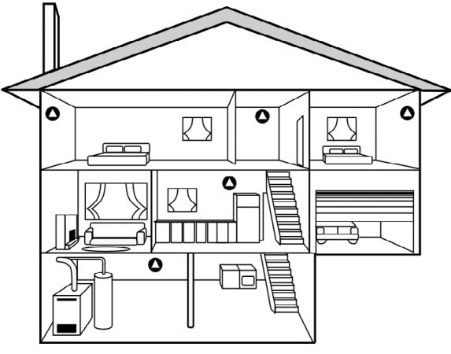
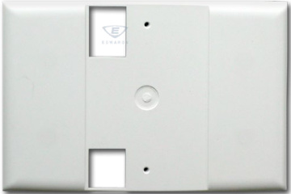
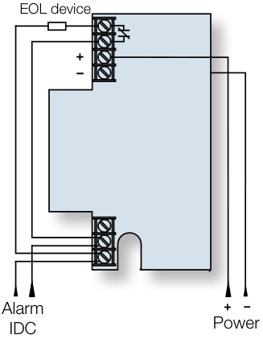
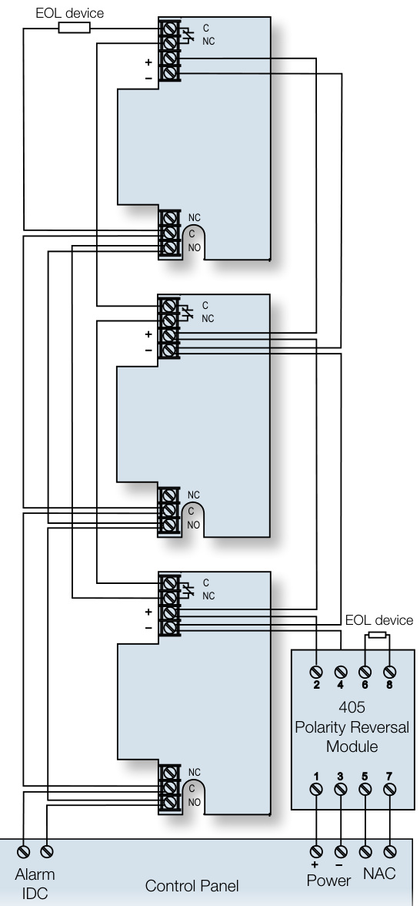
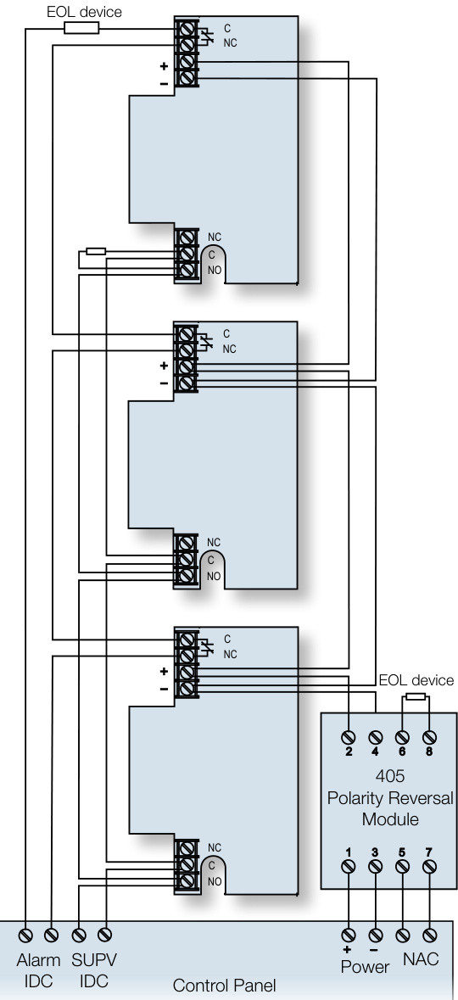

# 12/24VDC Carbon Monoxide Detector with SafeTest TM 260-CO  

# Overview  

The 260-CO carbon monoxide (CO) detector is an accurate and reliable means of alerting building occupants of potentially dangerous levels of CO in the protected area. The internal electro-chemical sensor communicates with a sophisticated on-board microprocessor that accurately tracks CO levels over time.  

This commercial-grade detection technology results in quick response, reliable sensing, fast reset time, and superior false alarm immunity. Its small size allows the 260-CO to blend inconspicuously with any decor, and its smooth contoured design is compatible with both residential and commercial environments.  

Unaffected by normal indoor temperature variations, the 260-CO automatically adjusts for environmental changes and operates reliably under a wide variety of conditions. It also monitors its own performance and compensates for sensitivity drift throughout the course of its service life.  

The 260-CO features the SafeTest™ functional test feature, which facilitates testing with real CO gas. SafeTest meets the functional test requirement in NFPA 720, 2009/2012 editions.  

Like all CO detectors, the 260-CO has a limited service life. But unlike most, which last only six years, the 260-CO’s advanced sensor features a service life rated at 10 years. When it approaches this point, the 260-CO’s end-of-life timer automatically triggers a warning that indicates the device must be serviced. This warning annunciates at the detector, as well as at the control panel, and optionally at a remote monitoring station.  

An integrated temporal-4 sounder provides local signaling capability for the 260-CO, and it easily interfaces with any intrusion or fire alarm system by means of its output relay. Its low current draw results in little additional demand on the system power supply.  

# Standard Features  

•	 10-year end-of-life signal   
•	 SafeTest™ feature — functional test with spray of real CO gas   
•	 Advanced electro-chemical sensing technology   
•	 Wiring option activates sounders of all connected detectors when any one of them goes into alarm   
•	 Deep housing with plenty of room for wiring   
•	 UL 2075 compliant   
•	 Transmits sensor end-of-life to the supervising panel and central station if the system is monitored   
•	 CO sensitivity conforms to UL 2034 requirements   
•	 Built-in trouble/power supervision relay Self-diagnostics keep the device operating optimally throughout its service life   
•	 12 or 24VDC operation and 150mA Form C relay   
•	 Large SEMS terminals ease wiring installation 14 to 22 AWG   
•	 One-touch TEST/HUSH button simplifies local operation   
•	 Integrated 85 dBa temporal-4 sounder for local notification   
•	 On-board LED provides local alarm and trouble indication   
•	 Inconspicuous footprint and attractively contoured design   
•	 Adapter plate simplifies replacing 240-COe detectors  

# Application  

The 260-CO Carbon Monoxide Detector is intended for ordinary indoor-dwelling unit applications in both residential and commercial occupancies, including single/multiple family residential occupancies, hotel rooms, dorm rooms, and other areas approved by the authority having jurisdiction (AHJ). The 260-CO detector can connect to either UL 985 (Household Fire Warning) or UL 864 (Commercial Fire) control panels. It is not intended for use in industrial applications such as gasoline refineries or parking garages, which require different listings.  

The 260-CO is a four-wire device that uses a Class 2 output from a control panel. Nonetheless, the primary alarm notification device remains the 260-CO’s internal sounder with the control panel secondary to these purposes. The 260-CO is not a substitute for life safety devices, and should be only considered as an integral part of a comprehensive safety program.  

Selecting a suitable location is critical to the correct operation of CO detectors. Install the 260-CO in accordance with NFPA 720 Standard for the Installation of Carbon Monoxide (CO) Detection and Warning Equipment. Place wall-mounted detectors at least 5 ft. $(1.5\;\mathsf{m})$ up from the floor. For ceiling mounted applications, place the detector at least 1 ft. $(0.3\;\mathsf{m})$ from any wall.  

Recommended CO detector locations:  

$\checkmark$ Within 10 ft. $(3\,\mathsf{m})$ of all sleeping areas, including areas such as hotel rooms and dorm rooms.   
$\checkmark$ In a suitable environment: areas with a temperature range of 40 to $100~^{\circ}\mathsf{F}$ (4.4 to $37.8\;^{\circ}\mathrm{C})$ and with a relative humidity range of 10 to $90\%$ noncondensing.   
$\checkmark$ In residential dwellings, locate detectors in every bedroom and on each level. At a minimum, place one detector outside the sleeping areas.  

  
Recommended locations for CO detectors  

Always check with your local building codes, legislation, and Authority Having Jurisdiction for specific CO location requirements in your area Recommended CO detector locations in commercial occupancies:  

$\checkmark$ Outside each separate sleeping area in the immediate vicinity of the bedrooms (including areas such as hotel rooms and dorm rooms) On every occupied level of a dwelling unit, including basements, but excluding attics and crawl spaces  

Centrally located on every habitable level of the building and in every HVAC zone based on an engineering evaluation considering potential sources and migration of carbon monoxide $\checkmark$ On the ceiling in the same room as permanently installed fuelburning appliances $\checkmark$ In any area required by local building codes, legislation, or the authority having jurisdiction $\checkmark$ On a firm, permanent surface  

# Do not install the CO detector:  

$\pmb{\pmb{x}}$ 8Within 5 ft. $(1.5\;\mathsf{m})$ of any cooking appliance   
$\pmb{\pmb{x}}$ 8Within 10 ft. (3 m) of a fuel-burning appliance   
$\pmb{\pmb{x}}$ 8 Near air conditioners, heating registers, and any other ventilation   
source that may interfere with CO gas entering the detector   
$\pmb{\pmb{x}}$ 8Where furniture or draperies may obstruct the airflow   
$\pmb{\pmb{x}}$ 8In a recessed area  

# Operation  

SafeTest functional test: This test facilitates the use of CO test spray to verify the correct operation of the detector, which is mandatory per NFPA 720. The SafeTest mode is activated by pressing and holding the test/hush button for 5-10 seconds. While in SafeTest mode, directing UL-classified CO testing spray at the sensor port will result in the activation of the alarm relay, and the sounder and red LED in a temporal-four pattern. Pressing and holding the test/hush will exit SafeTest mode.  

Distinct temporal-four sounder alarm: The 85 dB temporalfour sounder provides a distinctive alarm notification that is easy to differentiate from smoke alarm notification devices. The alarm beeps four times, rests five seconds and then repeats the pattern.  

Test/hush button: Use the test/hush button to test the alarm and silence an activated alarm. Pushing the test/hush button silences the integral sounder for five minutes. The red alarm light stays on and if CO is still present after five minutes, the detector once again sounds in the temporal-four pattern.  

End of sensor life indicator: The detector uses both a flashing green LED and intermittent sounder chirps to indicate that the detector needs replacing. To silence the detector, push the test/hush button. The detector also begins signaling a trouble when the CO sensor is approaching end-of-life.  

Common trouble relay: The trouble relay opens to indicate a trouble condition upon lost power, CO sensor cell trouble, or cell end-of-life. When connected to a listed control panel, the trouble relay can report a trouble condition locally at the panel and optionally at the central station, if the system is monitored.  

WARNINGS: Connect the CO detector only to a zone dedicated exclusively for CO detection and that is monitored 24 hours a day. Do not connect to an initiating circuit with fire or security devices. Failure to properly install, test, and maintain a CO detector may cause it to fail, potentially resulting in loss of life.  

# Installation  

The 260-CO Carbon Monoxide Detector is a four-wire device designed to use a Class 2 output from a control panel or auxiliary power supply Listed to UL 985 or 864 standards.  

All wiring must conform to the NFPA 70 National Electric Code, UL 2075, NFPA 720, and applicable codes. Use 14 to 22 AWG wire.  

The 260-CO adapter plate Use a 250-COPLT adaptor plate when replacing a 240- COe with a 260-CO to cover any paint discoloration left behind.  

  

# Wiring  

  
Single device, single zone  

Multiple devices, separate alarm, trouble zone  

# Tandem Interconnect:  

Use a Single Circuit Reversal Module when wiring multiple 260-CO detectors for tandem interconnect. On alarm, the module disconnects the detector from its normal power supply and applies reverse polarity from the notification appliance circuit. This causes the sounders to activate on other 260-CO detectors that are on the same loop. Only the initiating detector will sound and blink red. All others in tandem mode will sound but not blink red.  

  
Multiple devices, single zone  

  

Specifications   

<html><body><table><tr><td>Input voltage</td><td>12 or 24 VDC supplied by UL 985 or UL 864 listed control panel or resettable auxiliary power supply</td></tr><tr><td>Current consumption</td><td></td></tr><tr><td>Normal</td><td>20 mA</td></tr><tr><td>Alarm</td><td>40 mA (75 mA in test) 150 mA at 33 VDC</td></tr><tr><td>Alarmrelay Type</td><td>Form C</td></tr><tr><td>UL rating</td><td>Zone</td></tr><tr><td>Common trouble relay</td><td>150mA at33VDC</td></tr><tr><td>Type</td><td>Normally opened held closed with power applied</td></tr><tr><td>UL rating Sensor life</td><td>Common 10 years from date of manufacture</td></tr><tr><td>Sounder</td><td>85dB</td></tr><tr><td>Compatible control panel</td><td>Listed to UL 985 or 864 standards</td></tr><tr><td>Compatible electrical box</td><td>2-1/2 in. (64 mm) single-gang</td></tr><tr><td>Wire size</td><td>14 to 22 AWG (0.25 to 2.0 mm2)</td></tr><tr><td>Dimensions (W × L × D)</td><td></td></tr><tr><td>Detector</td><td>3.1 x 4.6 × 1.4 in. (7.8 × 11.7 × 3.6 cm)</td></tr><tr><td>Adapter plate Color</td><td>4.5 x 6.5 x 0.2 in. (11.4 × 16.5 x 0.5 cm) White</td></tr><tr><td>Operating environment</td><td></td></tr><tr><td>Temperature</td><td>40 to 100 °F (4.4 to 37.8 °C)</td></tr><tr><td>Relative humidity</td><td>10 to 90% noncondensing</td></tr><tr><td>CO sensitivity</td><td>70 ppm, 60 to 240 minutes</td></tr><tr><td></td><td>150 ppm, 10 to 50 minutes</td></tr><tr><td></td><td></td></tr><tr><td></td><td>400 ppm, 4 to 15 minutes</td></tr></table></body></html>  

# Ordering Information  

<html><body><table><tr><td>Model</td><td>Description</td></tr><tr><td>260-CO</td><td>Carbon monoxide detector, alarm & trouble relays, sounder,end-of lifesignal,12/24VDC</td></tr><tr><td>ESL405-01</td><td>PolarityReversalModule，24VDC</td></tr><tr><td>COGasTestSpray</td><td>Functional CO gas test spray Solo C-6 from SDI (www.sdifire.com) availablethrough securitydistribution.</td></tr></table></body></html>  