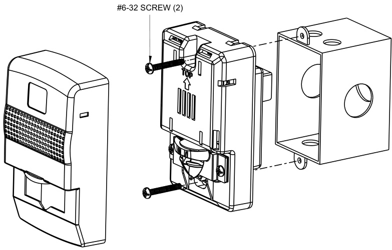
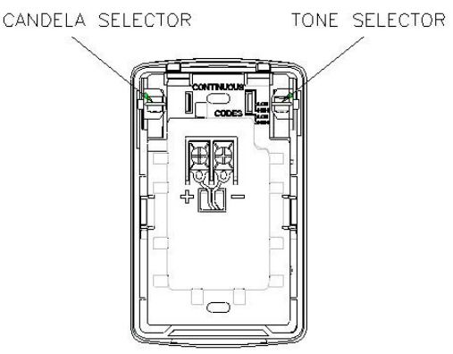
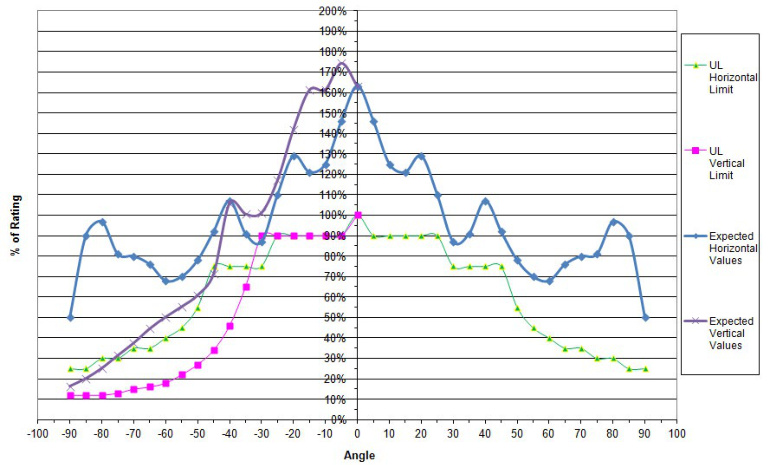
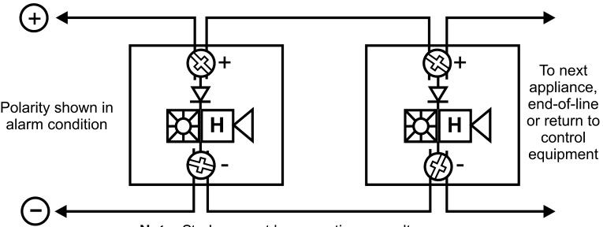
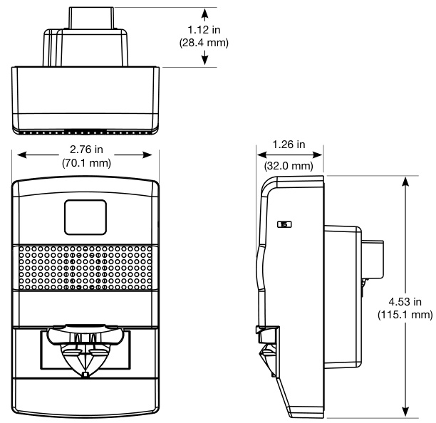
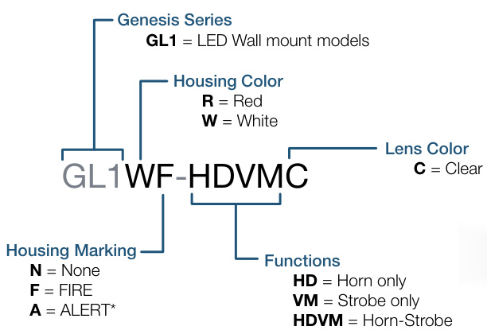
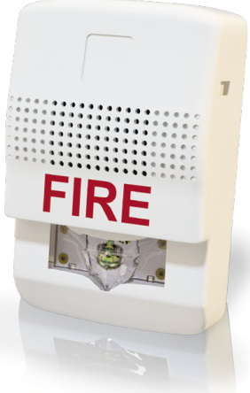

# Wall Model LED Strobes and Horns Genesis GL Series  

# Overview  

Innovative LED technology allows the new Genesis GL Series horns and LED strobes a more energy-efficient and sleek lowprofile design compared to previous Genesis models making them less expensive to install and operate by reducing overhead, and requiring fewer power supplies, backup power and batteries. These new appliances are designed with performance, energyefficiency, and life safety in mind.  

About the size of a deck of playing cards, Genesis GL strobes do not require bulky specular reflectors to maximize output. Instead, high efficiency optics, combined with patented electronics, deliver highly-controlled and uniform light distribution pattern in exchange for lower current requirements.  

These devices are designed to improve efficiency by reducing overhead — requiring fewer power supplies and often smaller wire gauge. This makes them ideal for any installation that calls for high efficiency and clean modern design appeal.  

Serviceability is another area where GL Series appliances shine. Field configurable light and sound output levels provide the flexibility modern life safety projects demand, while the Genesis control and synchronization protocol keeps multiple strobes on compatible NAC circuits synchronized.  

# Standard Features  

LED technology – More energy efficient – High efficiency optics  

Low-profile design – Compact design... single gang mounting – Ultra-slim... protrudes about one inch from mounting sur  
face – Attractive appearance... no visible mounting screws  

Field-configurable visible and audible settings – Selectable 15, 30, 75, or 110 cd strobe output – Selectable high (default) or low dB horn output – Selectable temporal (default) or steady horn output  

Easy to install  

– Fits standard 1-gang electrical boxes – no trim plate needed – Optional trim plate for 4-inch square boxes – Slide switches for field configuration – 12 to 18 AWG in-out screw terminals for quick wiring  

High performance standards for demanding applications   
– UL 1971 standards   
– No synch modules needed   
– RoHS (Restriction of Hazardous Substances) compliant   
– UL/ULC/CSFM/FCC approved  

# Application  

# Strobes  

Genesis GL Series strobes are UL 1971-listed for use indoors as wall-mounted public-mode notification appliances for the hearing impaired. Prevailing codes require strobes to be used where ambient noise conditions exceed 105 dBA (87 dBA in Canada), where occupants use hearing protection, and in areas of public accommodation as defined in the Americans with Disabilities Act.  

All Genesis strobes exceed UL synchronization requirements (within 10 milliseconds over a two-hour period) when used with a synchronization source. Synchronization is important in order to avoid epileptic sensitivity. See the specifications table for a list of compatible sources.  

Note: Due to differences in technology and light output characteristics, Genesis GL Series strobe lights cannot be installed in the same field of view as a Genesis Xenon-based strobe light appliance.  

# Horns  

Genesis horn output reaches as high as 95 dBA-fast and features a unique multiple frequency tone that results in excellent sound penetration and a warning of danger. Horns may be configured for either coded or noncoded notification appliance circuits. They can also be set for low dBA-fast output. This setting reduces horn output by about 5 dBA-fast. Horn-only models may be ceilingmounted or wall-mounted.  

The suggested sound pressure level for each signaling zone used with alarm signals is at least 15 dBA-fast above the average ambient sound level, or 5 dBA-fast above the maximum sound level having a duration of at least 60 seconds, whichever is greater. These values are measured at five feet $(1.5\;\mathsf{m})$ above the floor. The average ambient sound level is A-weighted, fast response sound pressure measured over a 24-hour period.  

Doubling the distance from the signal to the ear will theoretically result in a 6 dBA-fast reduction of the received sound pressure level. The actual effect depends on the acoustic properties of materials in the space. A 3 dBA-fast difference represents a barely noticeable change in volume.  

# Installation  

Genesis horns and strobes mount to any standard one-gang surface or flush electrical box. Matching optional trim plates are used to cover oversized openings and can accommodate one-gang or four-inch square boxes. Optional color matched single-gang surface boxes are available.  

  

All Genesis devices come with mounting screws for easy installation. Two tabs at the top of the device unlock the cover to reveal the mounting holes. The shallow depth of Genesis devices leaves ample room behind them for extra wiring. Once installed with the cover in place, no mounting screws are visible.  

# Field Configuration  

Temporal horn and horn-strobe models are factory set to sound in a three-pulse temporal pattern. Units may be configured for steady (nonpulsed) output that can be coded (turned on and off) at precise intervals by certain EDWARDS control panels and control modules. Genesis strobes and horn-strobes may be set for 15, 30, 75, or 110 candela output. The output setting is changed by simply removing the cover and two mounting screws and sliding the switch to the desired setting. The setting remains visible through a small window on the side of the device after the cover is closed.  

Horns and horn-strobes are factory set for high dB output. Low dB output may be selected by sliding the tone selector switch. This reduces the output by about 5 dBA-fast.  

  

  

# Sound Output  

Horn and Horn-Strobe Sound Output, Reverberant dBA per UL 464   

<html><body><table><tr><td colspan="2"></td><td colspan="3">Horns&Horn-Strobesat24V</td></tr><tr><td>Outputmode</td><td>dB Setting</td><td>16.0V</td><td>24.0V</td><td>33.0V</td></tr><tr><td rowspan="2">Continuous</td><td>High</td><td>80</td><td>83</td><td>86</td></tr><tr><td>Low</td><td>78</td><td>81</td><td>81</td></tr><tr><td rowspan="2">Horn Temporal Horn</td><td>High</td><td>76</td><td>79</td><td>81</td></tr><tr><td>Low</td><td>75</td><td>77</td><td>77</td></tr></table></body></html>  

Horn and Horn-Strobe Sound Output, Anechoic dBA per CAN/ULC-S525-07   

<html><body><table><tr><td colspan="2"></td><td colspan="2">Horns&Horn-Strobesat24V</td></tr><tr><td>Output mode</td><td>dB Setting</td><td>16.0V 24.0V</td><td>33.0V</td></tr><tr><td>Continuous</td><td>High</td><td>91</td><td>94 97</td></tr><tr><td>Horn</td><td>Low</td><td>86</td><td>06 92</td></tr><tr><td>Temporal</td><td>High</td><td>91</td><td>95 96</td></tr><tr><td>Horn</td><td>Low</td><td>86</td><td>90 91</td></tr></table></body></html>  

ULC Directional Characteristics   

<html><body><table><tr><td>Axis dBA Angle</td><td></td><td></td></tr><tr><td rowspan="3">Horizontal</td><td>-3dBA</td><td>35 degrees left and right</td></tr><tr><td>-6dBA</td><td>90 degrees left and right</td></tr><tr><td>-3dBA</td><td>45 degrees down;30 degreesup</td></tr><tr><td>Vertical</td><td>-6dBA</td><td>90 degrees up and down</td></tr></table></body></html>  

# Current Draw (mA) at 16 volts  

<html><body><table><tr><td colspan="6">Horn/strobe</td></tr><tr><td colspan="2"></td><td>15cd</td><td>30 cd</td><td>75cd</td><td>110cd</td></tr><tr><td rowspan="4">DC</td><td>Temporal low</td><td>38</td><td>42</td><td>122</td><td>209</td></tr><tr><td>Temporal high</td><td>40</td><td>46</td><td>125</td><td>219</td></tr><tr><td>Continuous low</td><td>42</td><td>44</td><td>128</td><td>214</td></tr><tr><td>Continuous high</td><td>47</td><td>55</td><td>131</td><td>209</td></tr><tr><td rowspan="4">FWR</td><td></td><td></td><td></td><td></td><td></td></tr><tr><td>Temporal low</td><td>58</td><td>70</td><td>151</td><td>261</td></tr><tr><td>Temporal high</td><td>66</td><td>76</td><td>152</td><td>263</td></tr><tr><td>Continuous low</td><td>68</td><td>77</td><td>156</td><td>267</td></tr><tr><td></td><td>Continuous high</td><td>77</td><td>87</td><td>161</td><td>270</td></tr></table></body></html>  

<html><body><table><tr><td colspan="6">Strobe Only</td></tr><tr><td rowspan="3"></td><td></td><td>15cd</td><td>30cd</td><td>75cd</td><td>110cd</td></tr><tr><td>DC</td><td>30</td><td>40</td><td>115</td><td>200</td></tr><tr><td>FWR</td><td>44</td><td>60</td><td>153</td><td>266</td></tr></table></body></html>  

<html><body><table><tr><td colspan="6">Horn Only</td></tr><tr><td rowspan="3"></td><td></td><td>Temporal</td><td>Temporal high</td><td>Continuous low</td><td>Continuous high</td></tr><tr><td>DC</td><td>low 22</td><td>30</td><td>26</td><td>37</td></tr><tr><td>FWR</td><td>50</td><td>49</td><td>50</td><td>59</td></tr></table></body></html>  

# Notes: Unfiltered Full Wave Rectified Ratings  

Candela and Horn Settings will determine the current draw of the device.   
Genesis GL appliances were tested to the regulated voltage limits of 16.0 to $33.0\,\mathrm{V}.$ Do not apply voltage outside of this range.   
Strobes are not designed to be used on coded systems in which the applied voltage is cycled on and off.  

# Wiring  

Field wiring terminals accommodate 12 to 18 AWG (0.75 to 2.5 $\mathsf{m m}^{2})$ wiring. Horns, strobes, and combination horn-strobes are interconnected with a single pair of wires as shown below.  

  
Note: Strobes must have continuous voltage  

# Dimensions  

  

# Specifications  

<html><body><table><tr><td>Material</td><td>Red orwhitetextured UVstabilized,colored impregnatedengineered plastic.Exceeds94V-0ULflammabilityrating</td></tr><tr><td>Weight</td><td>0.35 Ibs</td></tr><tr><td>Lens</td><td>Lexan</td></tr><tr><td>Dimensions</td><td>Appliance:4.53"H×2.76"Wx1.27"D(115mmx70 mmx32mm))</td></tr><tr><td>OperatingTemperature</td><td>Trimplate:5.25"Hx4.58"Wx0.32"D(133mmx116 mmx8mm). Indoor:33.8°Fto120.2°F(1°C to49°C)and maximumhumidityof93%</td></tr><tr><td>Mounting (indoor only)</td><td>Strobes and horn-strobes areforwall-mount installation only.Horn-onlymodelsmaybe ceiling-or wall-mounted. Flush mount:2-1/2inch(64mm) deep one-gangbox. Surfacemount:ModelGL1xN-BB1Gsurfacemountbox,wiremoldbox,orequivalentsurface-mountbox.</td></tr><tr><td>WireConnections</td><td>Withoptional GL1xN-TP trimplate:One-gangorfour-inchsquarebox.</td></tr><tr><td>OperatingVoltage</td><td>12 to18 AWG (0.75 to2.5mm2) 24VDC:16to33VDC</td></tr><tr><td>Strobe Output Rating</td><td>Selectable 15,30,75,110 candela output(UL1971 and ULC S526)</td></tr><tr><td>StrobeFlashRate</td><td>Strobesaredesignedtoflashat1flashpersecond</td></tr><tr><td>SynchronizationSources</td><td>SIGA-CC1S,SIGA-MCC1S,SIGA-CC2A,SIGA-MCC2A,G1M-RM,BPS6A,BPS10A,APS6A,APS10A,iO64,O500 FireshieldPlus3,5and10zone.</td></tr><tr><td>HornPulseRate</td><td>1/2second on, 1/2 second off, 1/2 second on,1-1/2 seconds off and repeat) is specified byANSl and NFPA 72 for standardemergencyevacuationsignaling.</td></tr></table></body></html>  

<html><body><table><tr><td>Model</td><td>Housing</td><td>Marking</td><td>Lens</td><td>Strobe</td><td>Horn</td><td>Ship Wt. Ib. (kg)</td></tr></table></body></html>  

Fire Alarm Appliances   

<html><body><table><tr><td>GL1RF-HD</td><td>Red</td><td>FIRE</td><td>N/A</td><td>Horn only</td><td>TemporalorSteady,HighorLowdB</td><td>0.25 (0.11)</td></tr><tr><td>GL1RF-HDVMO</td><td>Red</td><td>FIRE</td><td>Clear</td><td>Selectable15,30,75,or110cd</td><td>TemporalorSteady,HighorLowdB</td><td>0.25 (0.11)</td></tr><tr><td>GL1RF-VMC</td><td>Red</td><td>FIRE</td><td>Clear</td><td>Selectable15,30,75,or110cd</td><td>Strobe only</td><td>0.25 (0.11)</td></tr><tr><td>GL1RN-HD</td><td>Red</td><td>None</td><td>N/A</td><td>Horn only</td><td>Temporal orSteady,Highor Low dB</td><td>0.25 (0.11)</td></tr><tr><td>GL1RN-HDVMC</td><td>Red</td><td>None</td><td>Clear</td><td>Selectable15,30,75,or110cd</td><td>Temporal or Steady, High or Low dB</td><td>0.25 (0.11)</td></tr><tr><td>GL1RN-VMC</td><td>Red</td><td>None</td><td>Clear</td><td>Selectable15,30,75,or110cd</td><td>Strobe only</td><td>0.25 (0.11)</td></tr><tr><td>GL1WF-HD</td><td>White</td><td>FIRE</td><td>N/A</td><td>Horn only</td><td>TemporalorSteady,HighorLowdB</td><td>0.25 (0.11)</td></tr><tr><td>GL1WF-HDVMC</td><td>White</td><td>FIRE</td><td>Clear</td><td>Selectable15,30,75,or110cd</td><td>Temporal or Steady, High or Low dB</td><td>0.25 (0.11)</td></tr><tr><td>GL1WF-VMC</td><td>White</td><td>FIRE</td><td>Clear</td><td>Selectable15,30,75,or110cd</td><td>Strobe only</td><td>0.25 (0.11)</td></tr><tr><td>GL1WN-HD</td><td>White</td><td>None</td><td>N/A</td><td>Horn only</td><td>TemporalorSteady,HighorLowdB</td><td>0.25 (0.11)</td></tr><tr><td>GL1WN-HDVMC</td><td>White</td><td>None</td><td>Clear</td><td>Selectable15,30,75,or110cd</td><td>TemporalorSteady,HighorLowdB</td><td>0.25 (0.11)</td></tr><tr><td>GL1WN-VMC</td><td>White</td><td>None</td><td>Clear</td><td>Selectable15,30,75,or110cd</td><td>Strobe only</td><td>0.25 (0.11)</td></tr></table></body></html>  

Trim Plates   

<html><body><table><tr><td>GL1WN-TP</td><td>White</td><td>None</td><td>GenesisGLSeriesTrimPlate(for4-inchsquareboxes)</td><td>0.15 (0.7)</td></tr><tr><td>GL1RN-TP</td><td>Red</td><td>None</td><td>GenesisGLSeriesTrimPlate(for4-inchsquareboxes)</td><td>0.15 (0.7)</td></tr></table></body></html>  

Surface Boxes   

<html><body><table><tr><td>GL1WN-BB1G</td><td>White</td><td>N/A</td><td>One-gangsurfacemountboxforGLSeries</td><td>1 (0.4)</td></tr><tr><td>GL1RN-BB1G</td><td>Red</td><td>N/A</td><td>One-gang surfacemountboxforGLSeries</td><td>1 (0.4)</td></tr></table></body></html>  

# Model Selector  

  

  