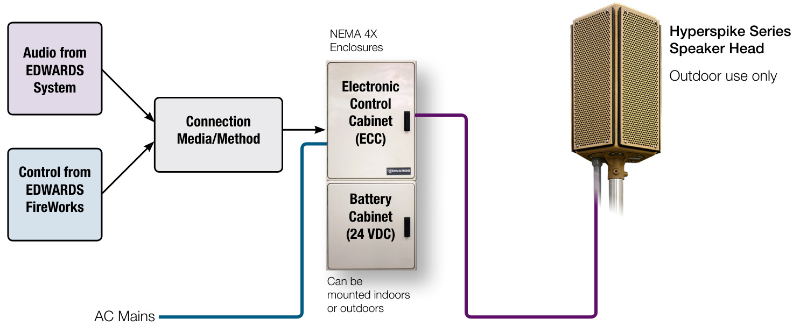
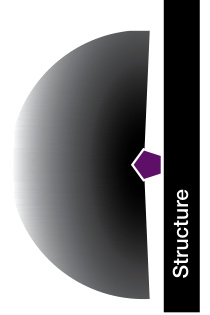
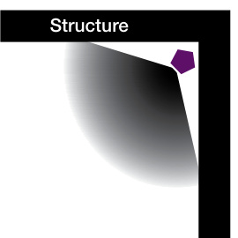
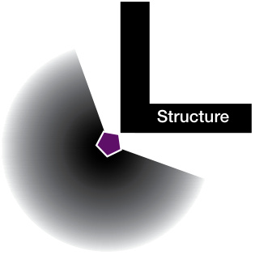

# Lightweight High Power Speaker Arrays Hyperspike® Series  

# Overview  

EDWARDS brand Hyperspike Series High Power Speaker Arrays (HPSA) employ exclusive HyperSpike technology to deliver lightweight and acoustically sophisticated solutions for mass notification installations. These rugged outdoor-rated units are among the industry's smallest in physical size, yet they reproduce some of the clearest (up to 0.91 STI, source-dependant) and loudest (up to 126 dBA Fast $@$ 1m) audio signals available. Loudspeaker heads are as small as $13.2"$ ($33.5\,\mathsf{c m})$ in diameter and $24.7^{11}$ (62.7 cm) in height. A single panel unit weighs as little as 16 lbs $(7.3\,\mathsf{k g})$ .  

Hyperspike Series loudspeakers are available in a number of different configurations, from one panel configurations that provide a relatively narrow sound dispersion, to five-panel configurations with full $360^{\circ}$ sound projection.  

The unique design of Hyperspike Series loudspeakers allow for a 100 percent up-time duty cycle—when powered from an AC source, they can be powered and ready to perform 24/7. This makes them ideally suited for daily activation, as well as emergency use.  

Hyperspike Series HPSAs can be permanently installed, or can be configured for portable use. Units come standard with an internal inverter/charger system that can operate the HPSA from the 24 VDC battery compliment.  

Each Hyperspike Series HPSA loudspeaker requires a separatelypurchased remotely-mounted Electronics Control Cabinet (ECC) that can be installed indoors or outdoors. These house the audio power amplifiers as well as control and power equipment. The lockable reinforced fiberglass cabinets are rated NEMA 3, 3R, 3S, 4, 4X, 12, 12K and 13. They come ready to interface with the EST3 Emergency Communication Platform.  

# Standard Features  

•	 Intelligible audio performance (up to 0.91 STI)   
•	 24/7/365 duty cycle   
•	 360, 230, 185 and 120 degree dispersion pattern options   
•	 320 to 6400 watt configurations Optional ethernet and wireless capability with additional equipment Easy installation—mounts to standard 2-inch diameter mast   
•	 Lightweight loudspeaker heads—as low as 16 pounds $(7.3\,\mathsf{k g})$   
•	 Rugged outdoor construction Reliable and supervised interfaces to the EST3 Emergency Communications platform   
•	 Includes an 8 ft $(2.44\;\mathsf{m})$ flexible weathertight wiring conduit   
•	 Ethernet & Wireless capability(additional equipment required)  

# Application  

Any outdoor facilities, such as:  

Universities, Colleges & High S •Health care campuses •Quads •Parking lots •Military bases •Force protection •Large ships •Piers •Docks •Industrial complexes •Refineries •Power plants •Air fields •Stadiums •Golf Courses •Camp Grounds •Amusement parks •Open mines •Weather warning systems •Flood warning systems •Civil defense  

# Installation  

For optimal performance and safety when installing in permanent locations, High Power Speaker Arrays (HPSAs) loudspeakers should be mounted 35 to 55 feet (10.7 to $16.8\;\mathrm{m}^{\mathrm{`}}$ ) above grade on a pole, building or other structure. For portable or vehicle-mounted applications, the loudspeaker head should be at least 20 feet (6.1 m) above grade and away from people. For all installations, it is also key to have clear, open space around the speaker head. HPSA output is best via line-of-sight.  

The factory assembled and tested Electronics Control Cabinets (ECCs) contain the HPSA interface terminals, transient protectors, and components to support easy, clean, and supervised connection to the EST3 Emergency Communications platform. This makes for simple and intuitive control of the units from a single control point or multiple locations.  

The ECCs contain the power amplifier(s), digital signal processor, and power inverter system. Batteries are maintained in a Ready State by a temperature-compensated charging system.  

The ECCs can be mounted inside or outside. Mounting options include pole, flange (wall), or pedestal. Heaters and ventilation units can also be ordered when required. When outdoor mounting, ECC and battery cabinets can be mounted below the loudspeaker head for easy access, but high enough to prevent vandalism. The ECC can hold one or two replaceable power amplifiers. Cabinets are equipped with tamper switches.  

Internal displays and diagnostic LEDs simplify maintenance. HPSA status is also transmitted to the EST3 Emergency Communications platform. A GFCI-protected convenience outlet is provided with ECCs to aid in servicing. All ECC power is protected with circuit breakers. Exterior wiring to and from the ECC is protected by transient protectors.  

Typically, the Hyperspike Series HPSA provides the EST3 Emergency Communications platform with the following signals:  

•Activation Confirmation   
•Incoming AC failure   
•Inverter AC failure   
•Audio failure   
•DC failure   
•Door tamper  

Units come standard with a one year warranty. An optional second year of additional coverage may be purchased at the time of the initial order. Warranties exclude batteries, which carry a 90-day warranty.  

# US Military Specifications  

Loudspeaker Head   

<html><body><table><tr><td>Hot Temperature</td><td>MIL-STD-810GMethod501.5ProcedureII(60C)</td></tr><tr><td>ColdTemperature</td><td>MIL-STD-810GMethod501.5Procedurell</td></tr><tr><td>Blowing Rain</td><td>(-20C)</td></tr><tr><td>AggravatedHumidity</td><td>MIL-STD-810GMethod506.5Procedurel MIL-STD-810GMethod507.5Procedurell</td></tr><tr><td>Salt Fog</td><td>MIL-STD-810GMethod509.5</td></tr><tr><td>Blowing gDust</td><td>MlL-STD-810GMethod510.5Procedure1</td></tr></table></body></html>  

# Typical Deployment  

  

# Specifications  

Loudspeakers   

<html><body><table><tr><td></td><td>SpeakerPanels</td><td>Sound Dispersion</td><td>1600Class</td><td>3200Class</td><td>6400Class</td></tr><tr><td rowspan="4">Output</td><td>5 Panel Array</td><td>360°</td><td>1600Watts</td><td>3200Watts</td><td>6400Watts</td></tr><tr><td>3PanelArray</td><td>230°</td><td>960Watts</td><td>1920Watts</td><td>3840Watts</td></tr><tr><td>2PanelArray</td><td>185°</td><td>640Watts</td><td>1280Watts</td><td>2560Watts</td></tr><tr><td>1Panel Array</td><td>120°</td><td>320Watts</td><td>640Watts</td><td>1280Watts</td></tr><tr><td rowspan="4">Weight</td><td>5 Panel Array</td><td>360°</td><td>48 Ib. (21.77 kg)</td><td>96 Ib (43.55 kg)</td><td>192 Ib (87.09 kg)</td></tr><tr><td>3PanelArray</td><td>230°</td><td>31 Ib (14.06 kg)</td><td>62 Ib (28.12 kg)</td><td>124 Ib (56.25 kg)</td></tr><tr><td>2 Panel Array</td><td>185°</td><td>24 Ib (10.89 kg)</td><td>48 Ib (21.77 kg)</td><td>96 Ib (43.55 kg)</td></tr><tr><td>1 Panel Array</td><td>120°</td><td>16 Ib (7.26 kg)</td><td>32 Ib (14.52 kg)</td><td>64 Ib (29.03 kg)</td></tr><tr><td rowspan="2">Dimensions</td><td>Each</td><td>Diameter</td><td>13.2"(33.52cm)</td><td>13.2"(33.52cm)</td><td>13.2"(33.52cm)</td></tr><tr><td>Each</td><td>Height</td><td>24.7" ( (62.7 cm)</td><td>44" (111.8 cm)</td><td>88" (223.5 cm)</td></tr><tr><td rowspan="2">Environmental</td><td colspan="4">Speaker Head:Outdoor operating temperature:-40F to 140F(-40C to +60C).</td><td rowspan="2"></td></tr><tr><td colspan="5">ECC (without heating/cooling system): -4F to 140F (-20C to +60C) Indoor operating temperature: +32 °F to +120 °F (0 °C to 49 °C); Humidity: 0% to 95% (non-condensing)</td></tr></table></body></html>  

<html><body><table><tr><td>Dimensions</td><td>70"×30"×12"</td><td>70"×30"×12"</td><td>70"×60"×12"</td></tr><tr><td>Weight(withoutbatteries)</td><td>177.8x76.2×30.5cm 242Ib (109.8kg)</td><td>177.8×76.2×30.5cm</td><td>177.8×152.4x30.5cm</td></tr><tr><td></td><td></td><td>248 Ib (112.5kg)</td><td>496Ib (225.0kg)</td></tr></table></body></html>  

# Sound Dispersion Patterns  

  

  

  

  
3-Panel Array $230^{\circ}$ Sound Dispersion  

5-Panel Array $360^{\circ}$ Sound Dispersion  

1-Panel Array $120^{\circ}$ Sound Dispersion  

# Ordering Information  

# High Power Speaker Arrays and Assemblies  

HPSA Assemblies are AC powered with optional DC backup. They come with a lockable NEMA 4 Electronics Control Cabinet (ECC) that holds the amplifier and 110V/60Hz battery charger. Charger or loudspeakers and ECCs may also be ordered separately. Batteries and battery enclosures are ordered separately. Enclosures are equipped with tamper switches. Loudspeakers come pre-assembled with an eight foot (2.4 meter) $\%$ -inch liquid-tight flexible conduit whip and wire leads.  

<html><body><table><tr><td></td><td>Loudspeaker Assembly with ECC</td><td>Loudspeaker Only (order ECC separately)</td><td>Output</td><td>Sound Dispersion</td><td>Active Panels</td><td>Speaker Head Color</td></tr><tr><td colspan="7"></td></tr><tr><td rowspan="8">1600 Watt Class</td><td>MN-HS16T5P</td><td>MN-HSHT16P5N</td><td>1600Watts</td><td>360°</td><td>5 of5</td><td rowspan="4">Tan</td></tr><tr><td>MN-HS16T3P</td><td>MN-HSHT16P3N</td><td>960Watts</td><td>230°</td><td>3of5</td></tr><tr><td>MN-HS16T2P</td><td>MN-HSHT16P2N</td><td>640Watts</td><td>185°</td><td>2 of 5</td></tr><tr><td>MN-HS16T1P</td><td>MN-HSHT16P1N</td><td>320Watts</td><td>120°</td><td>1 of5</td></tr><tr><td>MN-HS16G5P</td><td>MN-HSHG16P5N</td><td>1600 Watts</td><td>360°</td><td>5of5</td><td rowspan="4">Gray</td></tr><tr><td>MN-HS16G3P</td><td>MN-HSHG16P3N</td><td>960Watts</td><td>230°</td><td>3of5</td></tr><tr><td>MN-HS16G2P</td><td>MN-HSHG16P2N</td><td>640Watts</td><td>185°</td><td>2 of 5</td></tr><tr><td>MN-HS16G1P</td><td>MN-HSHG16P1N</td><td>320Watts</td><td>120°</td><td>1 of 5</td></tr><tr><td></td><td></td><td></td><td></td><td></td><td></td></tr><tr><td rowspan="8">3200WattClass</td><td>MN-HS32T5P</td><td>MN-HSHT32P5N</td><td>3200Watts</td><td>360°</td><td>5 of5</td><td rowspan="4">Tan</td></tr><tr><td>MN-HS32T3P</td><td>MN-HSHT32P3N</td><td>1920 Watts</td><td>230°</td><td>3of5</td></tr><tr><td>MN-HS32T2P</td><td>MN-HSHT32P2N</td><td>1280Watts</td><td>185°</td><td>2 of 5</td></tr><tr><td>MN-HS32T1P</td><td>MN-HSHT32P1N</td><td>640 Watts</td><td>120°</td><td>1 of 5</td></tr><tr><td>MN-HS32G5P</td><td>MN-HSHG32P5N</td><td>3200Watts</td><td>360°</td><td>5of5</td><td rowspan="4">Gray</td></tr><tr><td>MN-HS32G3P</td><td>MN-HSHG32P3N</td><td>1920Watts</td><td>230°</td><td>3of5</td></tr><tr><td>MN-HS32G2P</td><td>MN-HSHG32P2N</td><td>1280Watts</td><td>185°</td><td>2 of 5</td></tr><tr><td>MN-HS32G1P</td><td>MN-HSHG32P1N</td><td>640 Watts</td><td>120°</td><td>1 of 5</td></tr><tr><td></td><td></td><td></td><td></td><td></td><td></td></tr><tr><td rowspan="8">6400 Watt Class</td><td>MN-HS64T5P</td><td>MN-HSHT64P5N</td><td>6400Watts</td><td>360°</td><td>5of5</td><td rowspan="4">Tan </td></tr><tr><td>MN-HS64T3P</td><td>MN-HSHT64P3N</td><td>3840Watts</td><td>230°</td><td>3of5</td></tr><tr><td>MN-HS64T2P</td><td>MN-HSHT64P2N</td><td>1280Watts</td><td>185°</td><td>2 of5</td></tr><tr><td>MN-HS64T1P</td><td>MN-HSHT64P1N</td><td>640Watts</td><td>120°</td><td>1 of5</td></tr><tr><td>MN-HS64G5P</td><td>MN-HSHG64P5N</td><td>6400Watts</td><td>360°</td><td>5of5</td><td rowspan="4">Gray</td></tr><tr><td>MN-HS64G3P</td><td>MN-HSHG64P3N</td><td>3840Watts</td><td>230°</td><td>3of5</td></tr><tr><td>MN-HS64G2P</td><td>MN-HSHG64P2N</td><td>2560 Watts</td><td>185°</td><td>2 of5</td></tr><tr><td>MN-HS64G1P</td><td>MN-HSHG64P1N</td><td>1280Watts</td><td>120°</td><td>1 of5</td></tr><tr><td></td><td></td><td></td><td></td><td></td><td></td></tr></table></body></html>  

# NEMA 4 Electronics Control Cabinets (ECCs)  

ECCs hold the amplifier and 110V/60Hz battery charger. Enclosures are lockable and equipped with tamper switches.   
Loudspeakers, batteries, and battery enclosures are ordered separately.  

<html><body><table><tr><td colspan="2">NEMA 4 Electronics Control Cabinets (ECCs), loudspeakers ordered separately</td><td>Ethernet Capable</td><td>Battery Back up</td></tr><tr><td>MN-HSEC1-DH</td><td>MN-HS16 Class lockable NEMA 4 Electronic Control Cabinet (ECC) with amplifier, 110v/60Hz. inverter/battery charger (w/o batteries). Enclosure equipped with tamper switches.ACpowered amplifierwithDCbackup.Batteriesand accessories are orderedseparately.</td><td>No</td><td>Yes</td></tr><tr><td>MN-HSEC1-DE</td><td>MN-HS16Classlockable NEMA 4ElectronicControl Cabinet(ECC)withEthernet equippedwithtamperswitches.ACpowered amplifierwithDCbackup.Batteriesand accessoriesareorderedseparately.</td><td>Yes</td><td>Yes</td></tr><tr><td>MN-HSEC1-AH</td><td>MN-HS16 Class lockable NEMA 4 Electronic Control Cabinet (ECC) with amplifier, orderedseparately.</td><td>No</td><td>No</td></tr><tr><td>MN-HSEC1-AE</td><td>MN-HS16ClasslockableNEMA 4ElectronicControlCabinet(ECC)withEthernetcapa- bility, amplifier, 110V/60Hz. inverter/battery charger (w/o batteries). Enclosure equipped withtamperswitches.ACpoweredamplifier-NOBATTERYBACKUP.Accessoriesare ordered separately.</td><td>Yes</td><td>No</td></tr></table></body></html>  

<html><body><table><tr><td colspan="2">NEMA 4 Electronics Control Cabinets (ECCs), loudspeakers ordered separately</td><td>Ethernet Capable</td><td>Battery Back up</td></tr><tr><td>MN-HSEC1-SH</td><td>MN-HS16 Class lockable NEMA 4 Electronic Control Cabinet (ECC) with amplifier, 230V/50Hz. inverter/battery charger (w/o batteries). Enclosure equipped with orderedseparately.</td><td>No</td><td>Yes</td></tr><tr><td>MN-HSEC1-SE</td><td>MN-HS16 Class lockable NEMA 4 Electronic Control Cabinet (ECC) with Ethernet Accessories areorderedseparately.</td><td>Yes</td><td>Yes</td></tr><tr><td>MN-HSEC2-DH</td><td>MN-HS32 Class lockable NEMA 4 Electronic Control Cabinet (ECC) with amplifier, 110V/60Hz. inverter/battery charger (w/o batteries). Enclosure equipped with tamper switches. AC powered amplifier with DC battery backup. Batteries and accessories are ordered separately.</td><td>No</td><td>Yes</td></tr><tr><td>MN-HSEC2-DE</td><td>MN-HS32 Class lockable NEMA 4 Electronic Control Cabinet (ECC) with Ethernet and accessories are ordered separately.</td><td>Yes</td><td>Yes</td></tr><tr><td>MN-HSEC2-AH</td><td>MN-HS32 Class lockable NEMA 4 Electronic Control Cabinet (ECC) with amplifier, 110V/60Hz. inverter/battery charger (w/o batteries). Enclosure equipped with orderedseparately.</td><td>No</td><td>No</td></tr><tr><td>MN-HSEC2-AE</td><td>MN-HS32ClasslockableNEMA4ElectronicControlCabinet(ECC)withEthernet Accessories areorderedseparately.</td><td>Yes</td><td>No</td></tr><tr><td>MN-HSEC2-SH</td><td>230V/50Hz. inverter/battery charger (w/o batteries). Enclosure equipped with tamper switches. AC powered amplifier with DC battery backup. Accessories are ordered separately.</td><td>No</td><td>Yes</td></tr><tr><td>MN-HSEC2-SE</td><td>MN-HS32 Class lockable NEMA 4 Electronic Control Cabinet (ECC) with Ethernet equipped with tamper switches. AC powered amplifier with DC battery backup. Accessories areorderedseparately. MN-HS64 Class lockable NEMA 4 Electronic Control Cabinet (ECC) with amplifier,</td><td>Yes</td><td>Yes</td></tr><tr><td>MN-HSEC4-DH</td><td>110V/60Hz. inverter/battery charger (w/o batteries). Enclosure equipped with tamper switches. AC powered amplifier with DC backup. Batteries and accessories are ordered separately.</td><td>No</td><td>Yes</td></tr><tr><td>MN-HSEC4-DE</td><td>equipped with tamper switches. AC powered amplifier with DC battery backup. Batteries and accessories are ordered separately.</td><td>Yes</td><td>Yes</td></tr><tr><td>MN-HSEC4-AH</td><td>MN-HS64 Class lockable NEMA 4 Electronic Control Cabinet (ECC) with amplifier, 110V/60Hz. inverter/battery charger (w/o batteries). Enclosure equipped with tamper switches. AC powered amplifier-NO BATTERY BACKUP. Accessories are orderedseparately. MN-HS64 Class lockable NEMA 4 Electronic Control Cabinet (ECC) with Ethernet</td><td>No</td><td>No</td></tr><tr><td>MN-HSEC4-AE</td><td>Accessories are ordered separately. MN-HS64 Class lockable NEMA 4 Electronic Control Cabinet (ECC) with amplifier,</td><td>Yes</td><td>No</td></tr><tr><td>MN-HSEC4-SH</td><td>tamper switches. AC powered amplifier with DC battery backup. Accessories are orderedseparately.</td><td>No</td><td>Yes</td></tr><tr><td>MN-HSEC4-SE</td><td>equipped with tamper switches. AC powered amplifier with DC battery backup. Accessories areorderedseparately.</td><td>Yes</td><td>Yes</td></tr></table></body></html>  

<html><body><table><tr><td colspan="2">ProtectiveCovers</td></tr><tr><td>MN-HS16GPC</td><td>GrayHyperspikeSeries1600Wattclassoptionalprotectivecover.</td></tr><tr><td>MN-HS32GPC</td><td>GrayHyperspikeSeries3200Wattclassoptionalprotectivecover</td></tr><tr><td>MN-HS64GPC</td><td>Gray HyperspikeSeries 6400Watt class optional protective cover</td></tr><tr><td>MN-HS16TPC</td><td>Tan Hyperspike Series 1600 Watt class optional protective cover.</td></tr><tr><td>MN-HS32TPC</td><td>TanHyperspikeSeries3200Wattclassoptionalprotectivecover</td></tr><tr><td>MN-HS64TPC</td><td>TanHyperspikeSeries6400Wattclassoptionalprotectivecover</td></tr></table></body></html>  

Ethernet   

<html><body><table><tr><td>MN-POE6OWT</td><td>HighPowerPoE+(power overethernet) injector,Maxoutput of 60Wat 24/48VDC,-40to75°Coperating temperature.</td></tr></table></body></html>  

# Warranty Programs  

<html><body><table><tr><td></td><td>MN-HS16EXWARR2HyperspikeSeries1600Wattclassextendedwarranty-2yearstotal.MustbeorderedwhenHPSAisordered.</td></tr><tr><td>MN-HS32EXWARR2</td><td>HyperspikeSeries3200Wattclassextendedwarranty-2yearstotal.MustbeorderedwhenHPSAisordered.</td></tr><tr><td>MN-HS64EXWARR2</td><td>HyperspikeSeries64ooWattclassextendedwarranty-2yearstotal.MustbeorderedwhenHPSAisordered.</td></tr></table></body></html>  

Batteries and Accessories   

<html><body><table><tr><td>MN-HSBHK1X</td><td>VAC.RequiresMN-HSECCH1.</td></tr><tr><td>MN-HSBHK1S</td><td>HyperspikeSeriesBatterycomplimentheatingblankets(setof2).120VAC.RequiresMN-HSECCH1.TwousedforMN-HS64 Series.</td></tr><tr><td>MN-HSBX1</td><td>HyperspikeSeriesECCBatteryExtensionenclosure(withoutbatteries).Includestamperswitch,batteryshelfandcabling.Can bemountedtothesideorbelowtheECCprimarybatteryenclosure.</td></tr></table></body></html>  

# Heating and Ventilation  

<html><body><table><tr><td>MN-HSECCFAN1</td><td>HyperspikeSeriesECCTop-mountventilationfansystemwithsidelouvers.115VAC.ChangesECCratingtoNEMA3R</td></tr><tr><td>MN-HSECCH1</td><td>HyperspikeSeriesECCCabinetheatersystemkit(120VAC).Providesterminalsforbatteryheaterblanketkits.Oneusedfor</td></tr></table></body></html>  

Demo, Portable & Specialty   

<html><body><table><tr><td>MN-HS16DFDEMO1</td><td>GrayHyperspikeSeriesdemounit,1600wattwith120VACamplifier,microphone,MP3player.Ordertripods&accessoriesseparately.</td></tr><tr><td>MN-HS16DFPORT1</td><td>GrayHyperspikeSeriesportable1600watt120VACsystem,with120VACamplifier,laptopcomputer&case,microphone& software.Ordertripodsandaccessoriesseparately.</td></tr><tr><td>MN-HS16G5PAC</td><td>EDWARDSSystem-based1600WattOmni-directionalHPSAAssembly(5of5ActivePanels)withlockableNEMA4amplifier</td></tr><tr><td>MN-HS32DFDEMO1</td><td>GrayHyperspikeSeriesdemounit,3200wattwith120VACamplifier,microphone,MP3player.Ordertripods&accessoriesseparately</td></tr><tr><td>MN-HS32G5PAC</td><td>EDWARDSSystem-based3200WattOmni-directionalHPSAAssembly(5of5ActivePanels)withlockableNEMA4amplifier and electronics enclosure.11oV/60Hz operation only. Enclosure equipped with tamper switch.EDwARDShard-wire interface</td></tr></table></body></html>  

MN-AUDSOF1 Hyperspike Series audio optimization software package  

Audio Sofware   
Modeling Services   

<html><body><table><tr><td></td><td></td></tr><tr><td>MN-HSEMD12</td><td>PDF/CAD site topology drawing. Modeling based on 125-2Khz band and provide medium resolution graphics with 3dB steps in propagation for up to (6) acoustic device/array locations onto chloropleth map. Scale limit of this offer is for 4 million square feet venue.</td></tr><tr><td>MN-HSEMDNB</td><td>HyperspikeSeriesEASEmodeling exteriordirectenergyonly (no3Dbuildings)overlaidonGoogleearthmaporonprovidedPDF/CAD site topology drawing. Modeling based on 125-2Khz band and provide medium resolution graphics with 3dB steps in propagation for up to (4) acoustic device/array locations onto chloropleth map. Scale limit of this service is in 2 million square feet increments.</td></tr><tr><td>MNHSEMDQ</td><td>CAD site topology drawing. Modeling based on 125-2Khz band and provide medium resolution graphics with 3dB steps in propagation</td></tr><tr><td>MN-HSEMN12</td><td>HyperspikeSeriesEASE modeling interior direct/reflected energy.Upto(12) interior 3Dsubstructures overlaid onprovidedPDF/CAD planviewdrawing.Modelingbased on125-2Khzband andprovide mediumresolutiongraphicswith3dBsteps inpropagationfor up to (10) acoustic device/arraylocations onto chloropleth map.Scale limit of this offer is for 250,000 square foot venue.</td></tr><tr><td>MN-HSEMN24</td><td>HyperspikeSeriesEASE modeling interior direct/reflected energy.Upto(24) interior 3Dsubstructures overlaid onprovidedPDF/CAD</td></tr><tr><td>MN-HSEMNQ</td><td>HyperspikeSeriesEASEmodelinginteriordirect/reflectedenergy.Over24interior3DsubstructuresoverlaidonprovidedPDF/CAD uptosystemrequiredacousticdevice/arraylocationsontochloroplethmap.ContactEDWARDScustomerserviceforquote.</td></tr></table></body></html>  

Mounting Accessories   

<html><body><table><tr><td>MN-HSECCPM1</td><td>HyperspikeSeriesECCpole-mount installationkit.ForusewithMN-HS16&MN-HS32Seriesonly.</td></tr><tr><td>MN-HSLPMK1</td><td></td></tr><tr><td>MN-HSPM16</td><td></td></tr><tr><td>MN-HSPM33</td><td></td></tr><tr><td>MN-HSTPMS1</td><td>Hyperspike Series Emitter (loudspeaker) tripod mounting system. 10' tripod with 14' mast. Additional support and guy wires may</td></tr><tr><td>MN-HSWB1</td><td>benecessary.ECCcannotbemountedtothisunit.</td></tr><tr><td>MN-HSECCPED1</td><td>HyperspikeSeriesECCHousekeepingPedestal MountKit(4").Usedwhenwall-mountingMN-HS16orMN-HS32SeriesECC.2</td></tr><tr><td>MN-HSTEP1</td><td>requiredifwall-mountingMN-HS64SeriesECCs. Heavy duty foldable tripod with 3ft extension and carrying bag.Suggested use with 1600 watt HPSA or 650 watt MPSA</td></tr><tr><td>MN-HSMPWMB1</td><td>demonstrationkits.Nottobeusedwith3200wattor6400wattsystems.</td></tr><tr><td>MN-HSMPCMB1</td><td>HSSeriesMN-HSMP2oOClassemitterwallmount. HSSeriesMN-HSMP20OorMN-HSMP300Classemitterheadceilingmount.</td></tr><tr><td>MN-HSECCHDWB1</td><td>HSSeriesHeavyDutyECCWall Mountkit.Tobeusedwhen theECC isbeingmounted toawall withouta pedes-</td></tr><tr><td>MN-HSECMBRK1</td><td>taltosupporttheECC. HSSeriesMN-MP650orMN-HS16ClassEmitterheadceilingmount.</td></tr><tr><td>MN-HSE5SBRK1</td><td>HSSeriesMN-HS16ClassEmitterwallmountforfiveactivesideappliances.</td></tr></table></body></html>  

Power Amplifiers & Components   

<html><body><table><tr><td></td><td></td></tr><tr><td>MN-HSAMPCL16</td><td>HS16Series HyperspikeSeriesECCreplacement120VACpoweramplifierandmatedcompressor/limitermountedinmini-rackforECCfor</td></tr><tr><td>MN-HSAMPCL32</td><td>MN-HS32 Series (1 used) or MN-HS64 Series (2 used)</td></tr><tr><td>MN-HSECCACB20</td><td>HyperspikeSeriesECCReplacement AC Circuit breaker-20 Amp</td></tr><tr><td>MN-HSECCACB30</td><td>HyperspikeSeriesECCReplacement AC Circuit breaker -30Amp</td></tr><tr><td>MN-HSECCDM1</td><td>HyperspikeSeriesECCReplacement inverterdisplay module</td></tr><tr><td>MN-HSPAXFM1</td><td>HyperspikeECCReplacementpre-ampaudioisolationtransformermodule</td></tr><tr><td>MN-HSPWR110 MN-HSECCDCB1</td><td>HyperspikeReplacement24VDC/120vACcharger/invertermodule</td></tr><tr><td>MN-TP1201P</td><td>HyperspikeECCreplacementDCCircuitbreakerwithmountinghardware TPSeries12oVAClinetransientprotectormodule</td></tr><tr><td>MN-TP120STD</td><td>TP Series 120V circuit transient protectormodule</td></tr><tr><td>MN-TP24STD</td><td>TP Series 24V circuit transient protector module</td></tr><tr><td>MN-TP90STD</td><td>TPSeries9oVcircuittransientprotectormodule</td></tr><tr><td>MN-TPBLK1</td><td>TPSeriesSinglecircuitbreakerlockoutkit</td></tr><tr><td>MN-TPRJ31STD</td><td>TPSeriesRJ31transientprotectormodule</td></tr><tr><td>MN-TPRJ45STD</td><td>TPSeriesRJ45transientprotectormodule</td></tr><tr><td>MN-VR241</td><td>HyperspikeSeriesDCSensitiveSupervisionRelay</td></tr><tr><td>MN-HSSPKR1</td><td></td></tr></table></body></html>  

Doors and Mounting Hardware   

<html><body><table><tr><td>MN-HSECCDPK1</td><td></td></tr><tr><td>MN-HSECCLD</td><td>HyperspikeSeriesECCReplacementlowerdoor.OneusedforMN-HS16&MN-HS32Series.TwousedforMN-HS64Series.</td></tr><tr><td>MN-HSECCUD</td><td>HyperspikeSeriesECCReplacementupperdoor.OneusedforMN-HS16&MN-HS32Series.TwousedforMN-HS64Series</td></tr><tr><td>MN-HSRPLKEY1</td><td>HyperspikeSeriesreplacementkeyset(2keys)</td></tr></table></body></html>  