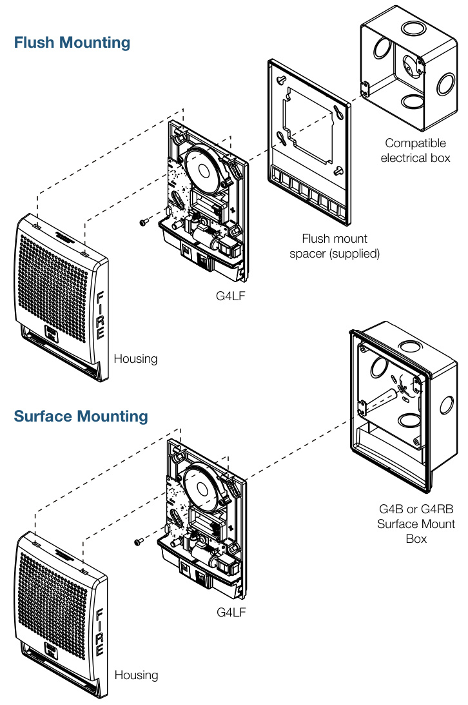
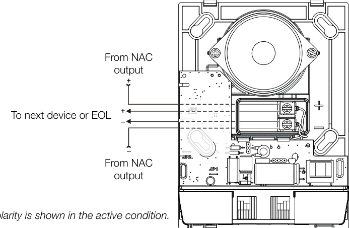
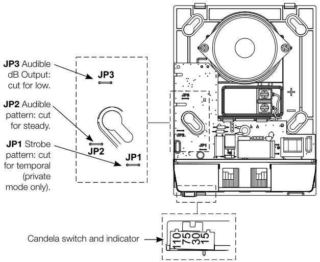
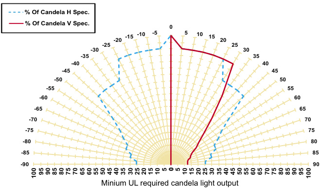

# Low Frequency Audible Signals Genesis G4LF Series  

# Overview  

G4LF Series notification appliances provide the benefits of Genesis life safety signals with output suitable for applications requiring low frequency audible tones. These high-performance appliances generate a crisp 520 Hz tone in the standard 3-3 temporal pattern. An optional setting configures the appliance for continuous audible output — a critical feature for notification appliance circuits that are coded with a CDR-3 coder module. G4LF appliances also feature field-configurable high and low dB output settings.  

When connected to compatible EDWARDS control equipment, G4LF Series audible output remains synchronized with all Genesis audible signals on the same Notification Appliance Circuit, including standard 3.2 kHz Genesis audible signals.  

Available G4LF models include audible-only appliances, as well as combination audible-visible signals. Combination appliances feature Genesis FullLight™ strobe technology, which produces a smooth light distribution pattern without the spikes and voids that characterize bulky specular reflectors. This ensures the entire coverage area receives consistent illumination exceeding UL-1971 light distribution requirements. It also results in a slim, low profile device that blends with any decor. Candela output is field configurable.  

When connected to a compatible synchronization source, Genesis appliances synchronize (strobes to UL 1971) to within 10 milliseconds indefinitely without the need for external modules or other equipment. See the Specifications section for a list of synchronization sources.  

# Standard Features  

Unique low-profile design... – Compact UL listed audible and audible-visible appliances – Ultra-slim: protrudes an inch from the mounting surface – Attractive appearance: no visible mounting screws  

Choice of colors and markings... – White or red housings – With or without FIRE markings  

# Easy to install...  

– Room side wiring accepts #18 - #12 AWG (0.75 to $2.5\;\mathrm{mm}^{2}$ )– Fits standard 4-inch square electrical boxes or standard Gensis G4B or G4RB surface-mount boxes  

Easy to configure without removing the device... – High or low dB output – Temporal or continuous audible tone – Temporal or continuous visible output – 15, 30, 75, or 110 candela intensity  

# High performance output..  

– Exclusive FullLight™ strobe output distribution pattern – Meets tough synchronization standards for strobes and audible signals  

# Application  

Genesis G4LF Series appliances are UL 464-listed for low-frequency audible requirements. Models are also available in combination with a UL 1971-listed strobe light for indoor wall-mounted public-mode notification applications. Many codes and regulations now call for low-frequency audible appliances $(520\,\mathsf{H}\mathsf{z})$ in newly constructed sleeping rooms and also require strobe lights under some of these circumstances. Consult with your Authority Having Jurisdiction for details.  

Combination audible-visible appliances are installed in accordance with guidelines established for visible (strobe) devices.  

When used with a compatible EDWARDS synchronization source, all Genesis xenon-based strobes — audible units, and combination appliances — maintain fully synchronization indefinitely. This exceeds the UL synchronization requirements of 10 milliseconds over a two-hour period.  

WARNING: These devices will not operate without electrical power. As fires frequently cause power interruptions, we suggest you discuss further safeguards with your local fire protection specialist.  

EDWARDS recommends that these devices always be installed in accordance with the latest recognized edition of national and local codes. Refer to the appropriate codes and standards for mounting height information.  

# Audible Signal Application  

Genesis low-frequency audible output features a code-compliant 520 Hz signal. Audible signals may be configured for either coded or non-coded signal circuits. They can also be set for low dB output with a jumper cut that reduces audible output by about 5 dB. Audible-only models may be ceiling-mounted or wall-mounted.  

For sleeping rooms, most codes and standards require 75 dBAfast at the pillow.  

For non-sleeping rooms, the suggested sound pressure level for each signaling zone used with alarm signals is at least 15 dB above the average ambient sound level, or 5 dB above the maximum sound level having a duration of at least 60 seconds, whichever is greater. This is measured 5 feet $(1.5\;\mathsf{m})$ above the floor.  

Doubling the distance from the signal to the ear will theoretically result in a 6 dB reduction of the received sound pressure level. The actual effect depends on the acoustic properties of materials in the space. A 3 dBA difference represents a barely noticeable change in volume.  

# Visible Signal Application  

For sleeping rooms covered by NFPA, a strobe light is typically required within 16 feet of the pillow. If the strobe light is wall-mounted and at or farther than 24 inches $(610\;\mathsf{m m})$ from the ceiling, it should be 110 cd or greater.  If the strobe light is ceiling-mounted or wall-mounted closer than 24 inches $(610\;\mathsf{m m})$ to the ceiling, it must be 177 cd or greater.  

# Installation  

Genesis G4LF Series appliances mount to a standard 4 inch (102 mm) square electrical box using the provided mounting spacer or directly to a Genesis G4 surface mount box.  

All Genesis appliances have two tabs at the top of the signal. Unlock the cover to reveal the mounting hardware. The shallow depth of Genesis devices leaves ample room behind the signal for extra wiring. Once installed with the cover in place, no mounting screws are visible.  

  

# Typical Wiring  

Room-side field wiring terminals accommodate $\#18$ to $\#12$ AWG $(0.75\;\mathrm{mm}^{2}$ to $2.5\;\mathsf{m m}^{2},$ ) wiring. Audible appliances, strobes, and combination audible-visual appliances are interconnected with a single pair of wires as shown.  

  

# Field Configuration  

Genesis G4LF Series audible appliances are factory set to operate in a Temporal 3 (three-pulse) pattern. Units may be configured for use with coded systems by cutting jumper JP2 on the circuit board. This results in a steady output that can be turned on and off (coded) as the system applies and removes power to the signal circuit. A Genesis Signal Master is required to maintain G4LF strobe light synchronization when connected to a coded system.  

Audible signals and combination audible-visible appliances are factory set for high dB output. Low dB output may be selected by cutting jumper JP3 on the circuit board. This reduces the output by about 5 dB.  

Genesis G4LF Series strobe lights are shipped from the factory ready for use as UL 1971 compliant signals for public mode operation. These signals may be configured for temporal flash by cutting jumper JP1 on the circuit board. This battery-saving feature may be used for private mode signaling only.  

  

Genesis G4LF Series strobe lights may be set for 15, 30, 75, or 110 candela output. The output setting is changed by simply opening the device and sliding the switch to the desired setting. The appliance does not have to be removed to change the output setting. The setting remains visible through a small window on the side of the device after the cover is closed.  

# Nominal Sound Level Output  

UL 464: Sound level output at 10 ft. $\left(3.05\;\mathrm{m}\right)$ measured in a reverberant room.  

<html><body><table><tr><td colspan="4">UL (dBA)</td></tr><tr><td colspan="2">Signal andvoltage</td><td>Low</td><td>High</td></tr><tr><td rowspan="3">Temporal</td><td>16VDC</td><td>72.4</td><td>76.0</td></tr><tr><td>24VDC</td><td>72.3</td><td>75.7</td></tr><tr><td>33VDC</td><td>73.3</td><td>75.4</td></tr><tr><td rowspan="3">Continuous</td><td>16VDC</td><td>75.7</td><td>79.8</td></tr><tr><td>24VDC</td><td>76.1</td><td>78.6</td></tr><tr><td>33VDC</td><td>75.4</td><td>78.8</td></tr></table></body></html>  

# Light Output  

Per cent of UL rating versus angle  

  

# Current Draw  

Audible-Visible Appliances  

<html><body><table><tr><td colspan="5">Operating horn-strobe current in RMS (mA) with audible set to standard (high) output</td></tr><tr><td>Strobe output (cd)</td><td>15</td><td>30</td><td>75</td><td>110</td></tr><tr><td colspan="5">Temporal</td></tr><tr><td>16VDC</td><td>219</td><td>266</td><td>381</td><td>437</td></tr><tr><td>16VFWR</td><td>308</td><td>362</td><td>510</td><td>579</td></tr><tr><td>24 VDC</td><td>151</td><td>176</td><td>243</td><td>278</td></tr><tr><td>24 VFWR</td><td>228</td><td>258</td><td>349</td><td>395</td></tr><tr><td>33VDC</td><td>112</td><td>132</td><td>177</td><td>199</td></tr><tr><td>33VFWR</td><td>186</td><td>208</td><td>267</td><td>291</td></tr><tr><td colspan="5"></td></tr><tr><td>Continuous 16VDC</td><td>221</td><td>258</td><td>371</td><td>433</td></tr><tr><td>16 VFWR</td><td>305</td><td>358</td><td>514</td><td>576</td></tr><tr><td>24 VDC</td><td>147</td><td>171</td><td>239</td><td>274</td></tr><tr><td>24 VFWR</td><td>211</td><td>247</td><td>335</td><td>377</td></tr><tr><td>33VDC</td><td>110</td><td>179</td><td>175</td><td>196</td></tr><tr><td>33VFWR</td><td>178</td><td>199</td><td>257</td><td>282</td></tr></table></body></html>

VDC $=$ Volts direct current, regulated and filtered VFWR $=$ Volts full wave rectified  

# Operating Current  

RMS (mA) Audible appliance only   

<html><body><table><tr><td colspan="2">Signal and voltage</td><td>Low</td><td>High</td></tr><tr><td rowspan="7">Temporal</td><td>16VDC</td><td>86</td><td>166</td></tr><tr><td>24 VDC</td><td>43</td><td>112</td></tr><tr><td>33VDC</td><td>36</td><td>87</td></tr><tr><td>16VFWR</td><td>97</td><td>215</td></tr><tr><td>24VFWR</td><td>78</td><td>159</td></tr><tr><td>33VFWR</td><td>76</td><td>140</td></tr><tr><td>16 VDC</td><td>36</td><td>160</td></tr><tr><td rowspan="6">Continuous</td><td>24VDC</td><td>45</td><td>109</td></tr><tr><td>33VDC</td><td>36</td><td>86</td></tr><tr><td>16VFWR</td><td>92</td><td>212</td></tr><tr><td>24VFWR</td><td>80</td><td>168</td></tr><tr><td>33VFWR</td><td>77</td><td>141</td></tr></table></body></html>

VDC $=$ Volts direct current, regulated and filtered VFWR $=$ Volts full wave rectified  

# Specifications  

<html><body><table><tr><td colspan="2">GenesisG4LFAudible and VisibleSignals</td></tr><tr><td>Operating voltage</td><td>24 VDC or 24 VFWR [1]</td></tr><tr><td>Housing</td><td>Red or white textured UV stabilized, color impregnated engineered plastic.</td></tr><tr><td>Dimensions</td><td>Height:6.5"(165 mm).Width: 5"(127 mm). Depth to wall: 1"(25 mm).</td></tr><tr><td>Mounting (indoor wall mount only)</td><td>supplied spacer. Surface: model G4B (white) or G4RB (red) surface mount box.</td></tr><tr><td>Synchronization Sources</td><td>SIGA-CC1S,SIGA-MCC1S,SIGA-CC2A,SIGA-MCC2A,G1M-RM BPS6A,BPS10A,APS6A,APS10A,EST3X,iO64,iO500,VS1,VS2,VM， E-FSA64, E-FSA250,Fireshield Plus.</td></tr><tr><td>Wire Size</td><td>12 to 18 AWG (0.75 to 2.50 mm2).</td></tr><tr><td>Operating environment</td><td>32-120° F (0-49° C) ambient temperature; 0-93% relative humidity, noncondensing.</td></tr><tr><td colspan="2"></td></tr><tr><td>Audible Signal</td><td></td></tr><tr><td>Audible pulse rate Temporal audible</td><td>Temporal rate with compatible synchronization source: indefinitely within 10 milliseconds. 12 sec ON,V2 sec OFF,12 sec ON,V2 sec OFF,12 sec ON,112 sec OFF,</td></tr><tr><td>pattern</td><td>then repeat cycle.</td></tr><tr><td colspan="2">Visible Signal</td></tr><tr><td></td><td></td></tr><tr><td>Strobe Output Rating Strobe Operating</td><td>UL1971:selectable 15cd,30 cd,75 cd,or 110cdoutput</td></tr><tr><td>Voltage StrobeFlash Rate</td><td>16 - 33 Vdc Regulated, 16-33 V Full wave rectified (UL Voltage Designations“Regulated 24" and “24 fwr")</td></tr><tr><td>Strobe Flash Synchronization</td><td>One flash per second. Oneflashpersecond (fps) within10 milliseconds overa 2 hour time</td></tr><tr><td>Strobe Lens Material</td><td>with UL 1971 synchronization standard. Temporal setting (private mode only): synchronized to temporal output on the same circuit. Polycarbonate</td></tr></table></body></html>

[1] This device was tested to the Regulated 24 DC/FWR operating voltage limits of 16 V and 33 V. Do not apply $80\%$ and $1\,10\%$ of these values for system operation.  

# Ordering Information  

<html><body><table><tr><td>Model</td><td>Housing</td><td>Marking</td><td>Audible Signal</td><td>Visible Signal</td><td>Ship Wt. Ibs (kg)</td></tr><tr><td colspan="6">FireAlarmAppliances(520Hzscreenprintedonhousing)</td></tr><tr><td>G4LFWN-HVM</td><td>White</td><td>None</td><td rowspan="6">Frequency (520 Hz)with selectable High/Low dB output.</td><td colspan="2"></td><td rowspan="6">1.5 Ibs. (0.68 kg)</td></tr><tr><td>G4LFWF-HVM</td><td>White</td><td>FIRE</td><td>Low</td><td>Selectable 15,30,75, or 110 cd.</td></tr><tr><td>G4LFRN-HVM</td><td>Red</td><td>None</td><td rowspan="4"></td><td rowspan="4">Audible</td></tr><tr><td>G4LFRF-HVM</td><td>Red White</td><td>FIRE</td></tr><tr><td>G4LFWN-H G4LFWF-H</td><td>White</td><td>None FIRE</td></tr><tr><td>G4LFRN-H</td><td>Red</td><td>None</td></tr><tr><td></td><td></td><td>FIRE</td><td></td><td rowspan="2">only.</td><td rowspan="2"></td></tr><tr><td>G4LFRF-H</td><td>Red</td><td></td><td></td></tr></table></body></html>  

Accessories   

<html><body><table><tr><td>SIGA-CC1S</td><td>IntelligentSynchronization Output Module (2-gang)</td><td>0.5 (0.23)</td></tr><tr><td>SIGA-MCC1S</td><td>Synchronization Output Module (Plug-in UIO)</td><td>0.18 (0.08)</td></tr><tr><td>SIGA-CC2A</td><td>Dual Input Signal Module with Class A Operation (2-gang)</td><td>0.5 (0.23)</td></tr><tr><td>SIGA-MCC2A</td><td>Dual Input Signal Module with Class A Operation (Plug-in UIO)</td><td>0.18 (0.08)</td></tr><tr><td>G4B</td><td>Surfacemountbox,white</td><td>0.7 (0.32)</td></tr><tr><td>G4RB</td><td>Surfacemountbox,red</td><td>0.7 (0.32)</td></tr></table></body></html>  