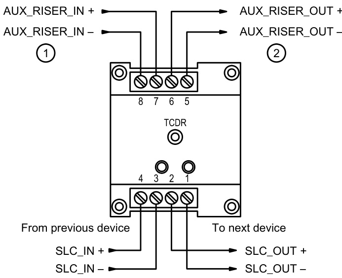
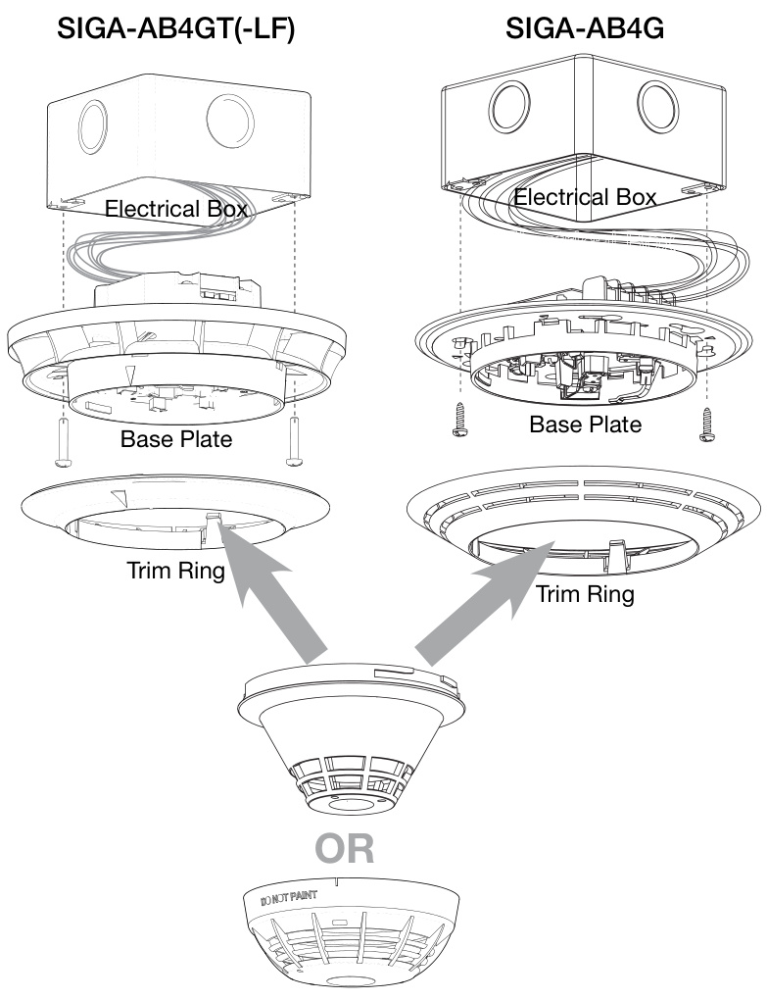
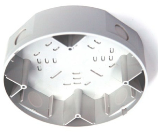
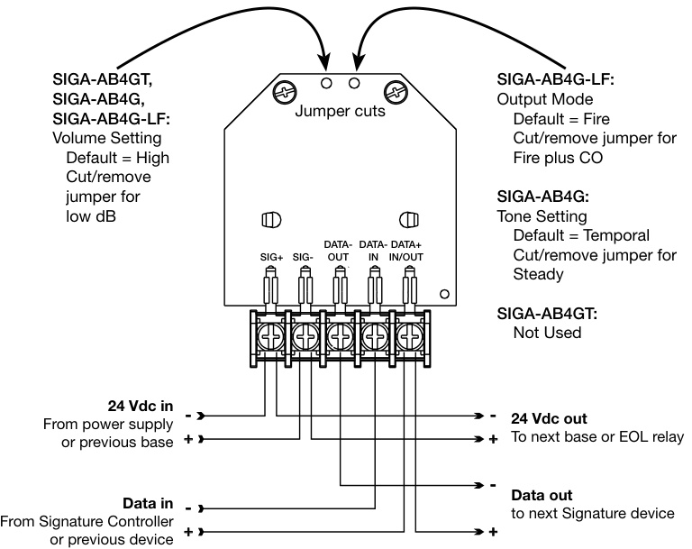
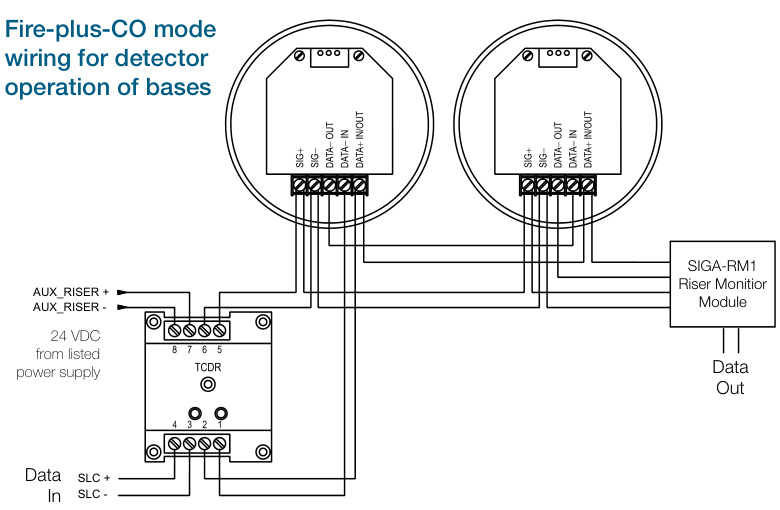
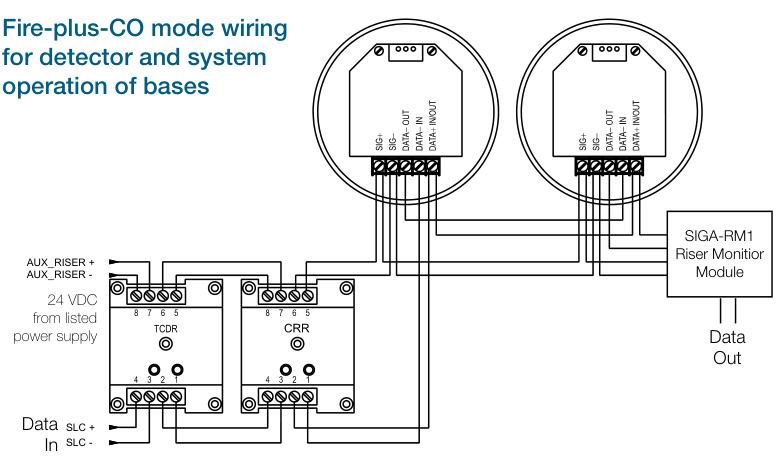
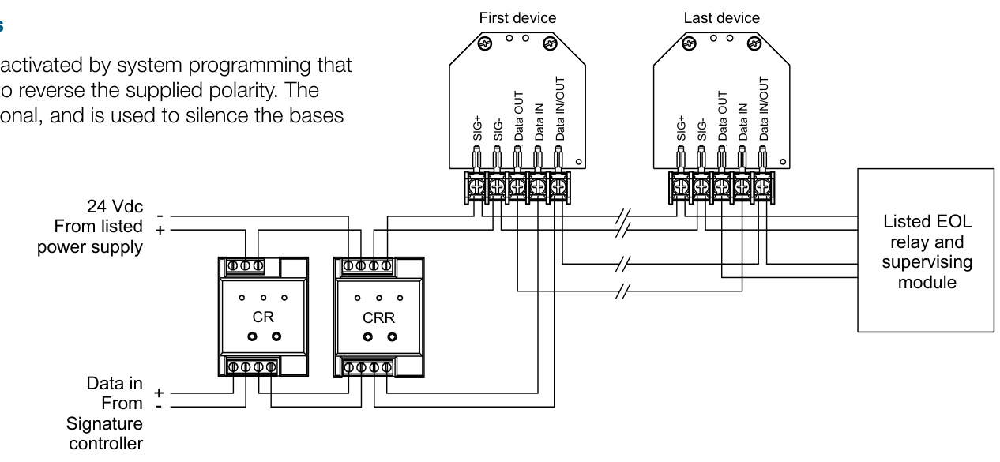
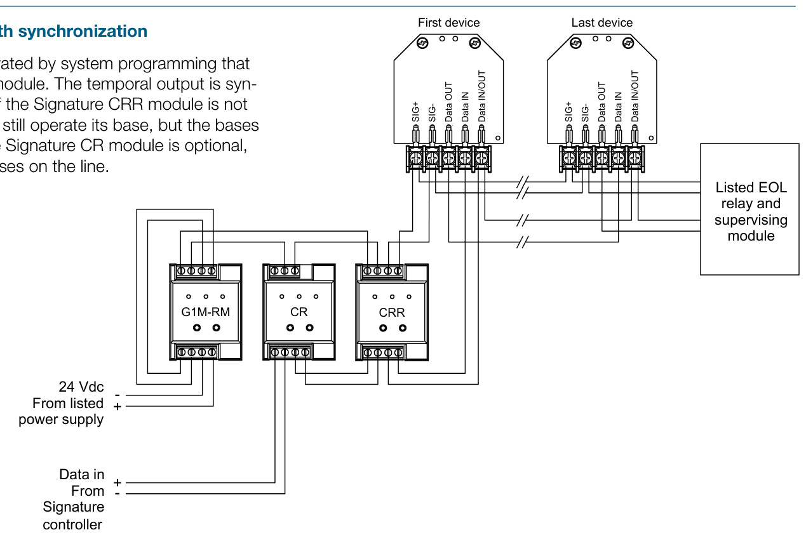

# Sounder Bases SIGA-AB4G, SIGA-AB4G-LF, SIGA-AB4GT, SIGA-TCDR  

# Overview  

The Signature Series AB4G sounder bases add audible output functions to any Signature Series detector. Bases can operate as independent local alarms, or as part of a zone or system alarm with synchronized audible output.  

Three models provide a full range of features that meet application needs and mandated code-compliant requirements:  

SIGA-AB4G bases provide sounder capability to Signature Series single-function smoke detectors. They are not intended for use with combination smoke/CO devices in Fire-plus-CO mode.  

SIGA-AB4GT bases provide sounder capability to Signature Series single-function smoke detectors, as well as combination smoke/CO detectors when used with a SIGA-TCDR Temporal Pattern Generator.  

SIGA-AB4G-LF bases provide 520 Hz low frequency sounder capability to Signature Series single-function smoke detectors, as well as combination smoke/CO detectors in Fire-plus-CO mode when used with a SIGA-TCDR Temporal Pattern Generator. The SIGA-AB4G-LF is suitable for applications requiring low frequency audible tones.  

All bases are compatible with first and second generation Signature Series intelligent detectors when properly configured.  

SIGA-AB4G sounder bases match the finish of Signature Series devices, and the sound output slots complement the air entry openings of the detector. The result is a compact unit with an attractive appearance.  

# Standard Features  

Low frequency model available   
Code-compliant $520\;\mathsf{H z}$ output.   
Temporal or steady tone   
Jumper selects steady or synchronized temporal output.  

High or low dB output Jumper selects low or high dBA output.  

# Single or group operation  

Optional polarity reversing module configures base for group alarm output.  

# UL268 and UL464 listed  

UL listing under smoke detector and audible signal standards allows application as smoke alarm and/or audible signal.  

# Attractive installation  

Flush mount to a wide selection of North American boxes or surface mount to optional custom-matched box.  

# Application  

Signature Series AB4G sounder bases are for use with Signature Series detectors in applications where localized or group alarm signaling is required. They are listed by Underwriters Laboratories under the UL268 and UL464 standards, allowing their application where both life safety alarms and/or notification appliances are required.  

# Programming and Field Configuration  

Each AB4G base uses the same address and programming label as the detector it supports.  

AB4G sounder bases can be set to simply operate according to the state of its detector, or configured through system programming to operate in conjunction with all sounder bases on the same circuit. They can also be controlled by program rules. Available operating modes are determined by the system that supports the Signature data loop.  

Bases may be configured in the field for either high or low dB output. When used for fire alarm-only applications (i.e.: not with CO detectors), AB4G bases may be configured for steady or temporal output. The default setting is high dB with temporal output.  

# Group Activation and Sychronization  

AB4G sounder bases on the same circuit may be activated as a group or zone with the use of a SIGA-CRR polarity reversal module, and the group or zone may be synchronized audible output with the use of a G1M-RM signal master.  

# Combination Smoke/CO Applications  

SIGA-AB4GT and SIGA-AB4G-LF audible bases may be used with combination smoke/CO detectors when a SIGA-TCDR is installed on the same Signature data loop.  

The output of these bases is field-configurable for Fire Alarm mode, or Fire Alarm plus CO Alarm mode. The SIGA-AB4G-LF has two operating modes: fire output only, where the unit produces a T3 tone; and, a Fire-plus-CO mode. In the Fire-plus-CO mode, the NAC circuit requires a SIGA-TCDR module to generate and synchronize the TC3 and TC4 tones. These two distinctive tones are necessary to differentiate fire alarm signals from CO alarm signals.  

Depending on the system supporting the Signature loop, the base can follow the state of the device it supports, or be controlled by program rules.  

# Low Frequency Applications  

The low frequency model (SIGA-AB4G-LF), features a distinctive $520\;\mathsf{H z}$ signal and is ideal for hotels, dormitories, and other commercial sleeping occupancies. This base can be set for low dB output with a jumper cut that reduces audible output by about 4 dB. For commerical sleeping rooms, most codes and standards require 75 dBA-fast at the pillow.  

# SIGA-TCDR Temporal Pattern Generator  

The SIGA-TCDR Temporal Pattern Generator is an addressable device that generates CO and fire signal sound patterns for AB4GT and AB4G-LF sounder bases. The control panel sends synchronization and channel commands to the SIGA-TCDR; the channel selection determines the pattern. In the U.S. Channel 1 is TC3 and Channel 2 is TC4. In Europe, Channel 1 is TC4 and Channel 2 is TC3 (in case both channels are activated Channel 1 has priority). Other markets depend on local requirements.  

Temporal patterns   

<html><body><table><tr><td>Name</td><td>Code</td><td>Used for</td></tr><tr><td>TC4</td><td>NFPA720</td><td>CO</td></tr><tr><td>TC3</td><td>NFPA 72</td><td>Fire</td></tr></table></body></html>  

The SIGA-TCDR module uses two addresses on the signaling line circuit (SLC). Address 1 is tied to Channel 1; Address 2 is tied to Channel 2.  

  
1.	 Use a power-limited and regulated 24 VDC primary or auxiliary power supply that is UL/ULC listed for fire protective signaling systems. 2.	 Power out to AB4GT sounder base or listed EOL relay and supervising module  

Depending on the type of alarm, the panel can select the corresponding pattern and send the activation command to the SIGA-TCDR.  

To control all sounder bases in the loop, use a SIGA-CRR module. The panel sends a signal to the SIGA-CRR causing it to reverse polarity. With the polarity on the riser reversed, all the sounder bases on this loop activate. The SIGA-TCDR maintains synchronization by processing the SYNC commands from the loop controller.  

EDWARDS recommends that fire alarm systems and their devices always be installed in accordance with the latest recognized edition of national and local fire alarm codes.  

# Installation and Mounting  

# Flush Mounting  

The sounder base flush mounts into 2-1/8 inch $\sqrt{54}\;\mathrm{mm}$ ) deep standard North American 4 inch square electric box, North American $4\times4$ inch octagonal concrete ring (mud box), and standard European 100 mm square electric boxes. The terminal block makes field wire connections fast and efficient . After wiring, a simple push and twist motion locks the Signature detector into the base.  

  
Surface Mounting  

AB4G-SB: When using the AB4G-SB surface mount box, install a reinforcing plate at every knockout. (Reinforcing plates are included with the box.) Remove the knockout first, and then slide the reinforcing plate into the plastic housing. After the plate is in place, install a conduit connector and nut (not supplied).  

  
AB4G-SB  

Optional Surface Box (6.8” diameter $\times\,1.8^{\ast}$ deep)  

# Configuration and Wiring  

  

# Typical Wiring, Fire-plus-CO mode AB4GT, AB4G-LF sounder bases  

  

  

# Detector operates the base  

# System turns on all bases  

All bases on the line can be activated by system programming that  

  

# System turns on bases with synchronization  

All bases on the line are activated by system programming that triggers the Signature CRR module. The temporal output is syn  

  

<html><body><table><tr><td>Signal Low dBA</td><td>High dBA</td></tr><tr><td></td><td></td></tr><tr><td>Nominal Sound Level 2</td><td></td></tr><tr><td>Steady/T3/T4 83</td><td>87</td></tr></table></body></html>  

<html><body><table><tr><td>Per UL268,UL521,UL2075 (reverberant) 3</td><td></td></tr><tr><td>TC3( (firep pattern) 76.3</td><td>80.8</td></tr><tr><td>TC4 (CO pattern) 73.0</td><td>77.4</td></tr><tr><td>Steady 80.9</td><td>85.3</td></tr></table></body></html>  

<html><body><table><tr><td colspan="2">Per UL 464 (reverberant) 3</td></tr><tr><td>TC3 (fire pattern)</td><td>74.8</td></tr><tr><td>70.3 TC4 +(CO pattern) 67.0</td><td>71.4</td></tr><tr><td>Steady 74.9</td><td>79.3</td></tr></table></body></html>

1 For NFPA 72 and NFPA 720 applications, the high dBA settings can be used for public mode evacuation. 2 Anechoic chamber $@$ 10ft 3 As measured in a UL reverberant room at 10 ft.  

# Operating Current, AB4G-LF  

mA RMS UL/ULC ratings   

<html><body><table><tr><td rowspan="2">Signal</td><td colspan="2">Low dBA</td></tr><tr><td>16VDC</td><td>24VDC 33VDC</td></tr><tr><td>TC3</td><td>76.0</td><td>76.4 85.6</td></tr><tr><td>TC4</td><td>112.8</td><td>148.0 125.6</td></tr><tr><td>Steady</td><td>75.2</td><td>76.0 92.4</td></tr></table></body></html>  

<html><body><table><tr><td colspan="3">High dBA</td></tr><tr><td>16VDC</td><td>24VDC</td><td>33VDC</td></tr><tr><td>92.0</td><td>76.0</td><td>93.6</td></tr><tr><td>107.2</td><td>150.0</td><td>150.8</td></tr><tr><td>143.0</td><td>92.0</td><td>97.0</td></tr></table></body></html>  

# Sound Level Output, AB4GT  

<html><body><table><tr><td>Signal Voltage</td></tr><tr><td>LowdBA High dBA</td></tr><tr><td></td></tr><tr><td>Reverberant roomper UL 4641</td></tr><tr><td>TC3(firepattern) 16VDC 80.5 85.2</td></tr><tr><td>TC4 (COpattern) 16VDC 73.9 77.5</td></tr><tr><td></td></tr><tr><td>ReverberantroomperUL268andFM2</td></tr><tr><td>TC3(firepattern) 16 VDC 86.5 90.8</td></tr><tr><td>TC4(COpattern) 16VDC 77.5 84.1</td></tr><tr><td>Sound pressure level per CAN/ULC-S525</td></tr><tr><td>Temporal 24VDC 95 91</td></tr><tr><td>Steady 24VDC 93 89</td></tr></table></body></html>

1 For UL 464 applications, low dBA settings are for private mode only. 2 For UL 268 applications, the high setting must be used for evacuation. 3 Voltage is regulated and filtered.  

# Sound Level Output, AB4G  

<html><body><table><tr><td>Signal</td><td>Voltage</td><td>LowdBA</td><td>High dBA</td></tr><tr><td colspan="4"></td></tr><tr><td colspan="4">Reverberant roomper UL 464*</td></tr><tr><td colspan="4"></td></tr><tr><td rowspan="2">Temporal</td><td>16 Vdc 24Vdc</td><td>71.5 75.5</td><td>78.1 80.7</td></tr><tr><td colspan="3">33Vdc</td></tr><tr><td rowspan="3">Steady</td><td>16Vdc</td><td>78.5 75.5</td><td>83.1 81.7</td></tr><tr><td>24 Vdc</td><td>79.5</td><td>84.5 86.5</td></tr><tr><td colspan="3">33Vdc 81.8</td></tr><tr><td colspan="4">ReverberantroomperUL268</td></tr><tr><td colspan="2"></td><td></td><td>84.1</td></tr><tr><td rowspan="2">Temporal</td><td>16Vdc</td><td>77.5 81.5</td><td>86.7</td></tr><tr><td colspan="3">24 Vdc</td></tr><tr><td rowspan="2"></td><td>33Vdc 16 Vdc</td><td>84.5 81.5</td><td>89.1 87.7</td></tr><tr><td colspan="3"></td></tr><tr><td colspan="2">Steady</td><td>24 Vdc 85.5</td><td>90.5</td></tr><tr><td colspan="3">33Vdc</td><td>87.8 92.5</td></tr></table></body></html>

dBA $=$ Decibels, A-weighted \*For UL 464 applications low dBA settings are for private mode only.  

# Operating Current (RMS), AB4G  

<html><body><table><tr><td>Voltage</td><td>LowdBA</td><td>High dBA</td><td>Notes</td></tr><tr><td>16VDC</td><td>17</td><td>28</td><td rowspan="4">VDC=Voltsdirect current,regulated and filtered</td></tr><tr><td>24VDC</td><td>24</td><td>41</td></tr><tr><td>33VDC</td><td>31</td><td>52</td></tr><tr><td>16VFWR</td><td>41</td><td>48</td></tr><tr><td>24VFWR</td><td>51</td><td>60</td><td rowspan="2">VFWR=Voltsfullwave rectified</td></tr><tr><td>33VFWR</td><td>60</td><td>66</td></tr></table></body></html>  

# Operating current (RMS), AB4GT  

<html><body><table><tr><td>LowdBA</td><td>HighdBA</td></tr><tr><td>31 mA</td><td>52mA</td></tr></table></body></html>  

Specifications   

<html><body><table><tr><td></td><td>SIGA-AB4G</td><td>SIGA-AB4GT</td><td>SIGA-AB4G-LF</td></tr><tr><td>Riser operating voltage</td><td></td><td>16 to 33 VDC</td><td></td></tr><tr><td>Operating Current </td><td colspan="3">See tables on previous page</td></tr><tr><td>Supervisory Current</td><td>DC = 1.46 mA,</td><td>DC = 1.46 mA</td><td>DC = 6.0 mA</td></tr><tr><td>Default Output Volume</td><td colspan="3">FWR = 2.15 mA High dBA</td></tr><tr><td>Default Tone</td><td colspan="3">Temporal Fire: Steady or TC3;</td></tr><tr><td>Resonant frequency</td><td colspan="2">Fire-plus-CO: TC3 or TC4 3.2 kHz</td><td>520 Hz +/- 10%</td></tr><tr><td>Temporal pattern</td><td>0.5 s on, 0.5 s off, 0.5 s on, 0.5 s off, 0.5 s on, 1.5 s off,</td><td colspan="2">As determined by the SIGA-TCDR... Fire: Steady or TC3; Fire-plus-CO: TC3 or TC4</td></tr><tr><td>Compatible detectors</td><td colspan="3">repeat cycle All Signature Series detectors</td></tr><tr><td>Compatible electrical boxes</td><td colspan="3">AB4G-SB surface box for audible base; 4 in. square by 2-1/8 in. (54 mm) deep box; 3-1/2 in. octagonal by 2-1/8 in. (54 mm) deep box; Standard European 100 mm2 box</td></tr><tr><td>Wire size</td><td colspan="3">12 to 18 AWG (0.75 to 2.50 mm2)</td></tr><tr><td>Base diameter</td><td colspan="3">6.8 in. (173 mm)</td></tr><tr><td>Base height from box</td><td colspan="2">0.8 in. (21 mm)</td><td>1.4 in. (35 mm)</td></tr><tr><td>Maximum distance from ceiling</td><td colspan="3">Wall mount - 12 in. (305 mm)</td></tr><tr><td>Environment type</td><td colspan="3">Indoor only</td></tr><tr><td>Operating environment Temperature</td><td colspan="3">32 to 120F (0 to 49°C)</td></tr><tr><td>Relative humidity</td><td colspan="3">0 to 93% noncondensing</td></tr><tr><td>Storage temperature Listings</td><td colspan="3">-4 to 140°F (-20 to 60°C) UL, ULC, CSFM UL, CSFM</td></tr></table></body></html>  

# Ordering Information  

<html><body><table><tr><td>Catalog Number</td><td>Description Ship Wt., Ib. (kg)</td></tr><tr><td>SIGA-AB4G-LF Low</td><td>Frequency Sounder BaseforCO andFire Detectors 0.3 (0.15)</td></tr><tr><td>SIGA-AB4GT Sounder BaseforCO</td><td>andFire Detectors 0.3 (0.15)</td></tr><tr><td>SIGA-AB4G</td><td>Sounder BaseforFire Detectors 0.3( (0.15)</td></tr></table></body></html>  

<html><body><table><tr><td colspan="4">RelatedEquipment</td></tr><tr><td>SIGA-TCDR</td><td>TemporalPatternGenerator</td><td></td><td>0.2 (0.1)</td></tr><tr><td>SIGA-MCRR</td><td>PolarityReversal Relay(Plug-inUlOmodule)</td><td>0.18</td><td>(0.08)</td></tr><tr><td>SIGA-CRR</td><td>PolarityReversalRelay(Standardmountmodule)</td><td>0.2</td><td>(0.1)</td></tr><tr><td>SIGA-MCR</td><td>Control RelayModule(Plug-inUIOmodule)</td><td>0.18</td><td>(0.08)</td></tr><tr><td>SIGA-CR</td><td>ControlRelayModule(Standardmountmodule)</td><td>0.2</td><td>(0.1)</td></tr><tr><td>SIGA-RM1</td><td>RiserMonitorModule</td><td></td><td>0.2 (0.1)</td></tr><tr><td>G1M-RM</td><td>Signal Master (1-gang remote mount)</td><td></td><td>0.2 (0.1)</td></tr><tr><td>AB4G-SB</td><td>SurfaceBoxforAudibleBase</td><td></td><td>1.0 (0.45)</td></tr></table></body></html>  