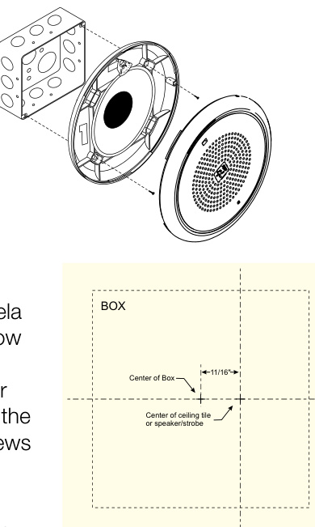
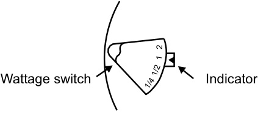
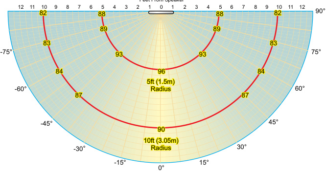
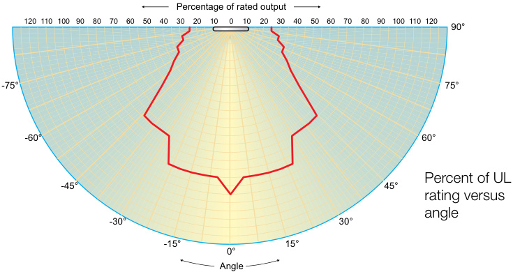
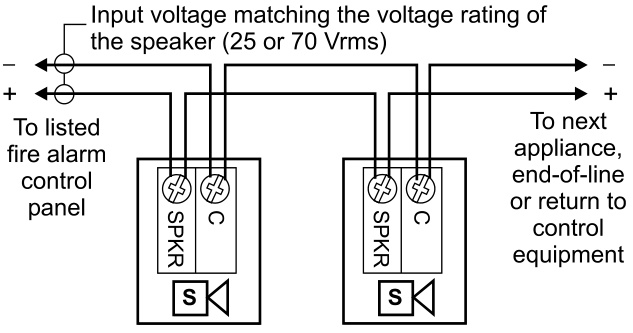

# Ceiling Speakers, Speaker-Strobes Genesis GC Series  

# Overview  

The Genesis line of ceiling life safety and emergency communications speakers and speaker-strobes combine high performance output with a low profile design to deliver a life safety signal solution that’s as versatile as it is effective. While they are designed to mount inconspicuously overhead, these devices are also rated for wall-mounted applications.  

Clear-lens speaker-strobes are available in high and low candela models, which feature 15 to 95, or 95 to 177 cd output (see ordering information). Ceiling speakers feature ¼ W to 2 W operation, which allows devices to be easily fine-tuned to achieve maximum benefit in exchange for the lowest possible system overhead.  

Light output and wattage tap settings are selectable with conveniently-located switches. Settings remain clearly visible even after final installation, yet they are locked in place to prevent unauthorized movement after installation.  

High fidelity models meet the NPFA 520 Hz requirements for newly construced commercial sleeping areas. They also produce crisp, clear voice audio output that is highly intelligible over large areas.  

These low-profile appliances feature textured housings in architecturally neutral white or eye-catching life safety red. Optional ALERT or FIRE markings make them ideal for applications that require differentiation between life safety and mass notification alerts.  

# Standard Features  

# High Fidelity 520 Hz speaker models available  

Low frequency output meets NFPA standards for newly constructed commercial sleeping areas; increases sound fidelity and audio intelligibility.  

# Field configurable – no need to remove the device  

– Select ¼, ½, 1, or 2 watt operation – 15/30/75/95 cd and 95/115/150/177 cd models available – Switch settings remain visible even after the unit is installed  

# Ideal for Mass Notification applications – blue and amber lens models available  

# Unique low-profile design  

– 30 per cent slimmer profile than comparable signals – Available with white or red housings  

# Unparalleled performance  

– loud 90 dBA output ensures clear, crisp audio – Precision strobe timing meets UL synchronization standards –$25\,\mathrm{V}_{\mathrm{FMS}}$ and $70\,\mathrm{V}_{\mathrm{FMS}}$ models available  

# Easy to install  

– Fits all standard 4-inch square electrical boxes with plenty of room for extra wire – no extension ring or trim plate needed – #18 - #12 AWG terminals – ideal for long runs, existing wiring  

# •	 Approved for public and private mode applications  

– UL 1971-listed as signaling devices for the hearing impaired   
– UL 1638-listed as protective visual signaling appliances   
– UL 1480-listed as life safety speaker   
– UL/ULC listed for ceiling or wall use  

# Strobe Application  

Genesis strobes are UL 1971 or 1638 listed for indoor use. Prevailing codes require strobes to be used where ambient noise conditions exceed specified levels, where occupants use hearing protection, and in areas of public accommodation. Consult with your Authority Having Jurisdiction for details.  

All Genesis strobes exceed UL synchronization requirements (within 10 milliseconds over a two-hour period) when used with a synchronization source. Synchronization for multiple strobe lights in a single field of view is required. See the Specifications table for compatible synchronization sources.  

# Application Notes - Canada  

(Based in part on 1995 Canada National Building Code)  

The signal sound pressure level shall not exceed 110 dBA in any normally occupied area. The sound pressure level from an audible signal in a floor area used for occupancies other than residential occupancies shall not be less than 10 dBA above ambient levels, and never less than 65 dBA. In sleeping rooms the sound pressure level from an audible signal shall not be less than 75 dBA when any intervening doors between the device and the sleeping room are closed.  

# Speaker Application  

The suggested sound pressure level for each signaling zone used with alert or alarm signals is a minimum of 15 dB above the average ambient sound level or 5 dB above the maximum sound level having a duration of at least 60 seconds, whichever is greater. This is measured 5 feet (1.5 m) above the floor.  

Doubling the distance from the signal to the ear will theoretically cause a 6 dB reduction in the received sound pressure level. The actual effect depends on the acoustic properties of materials in the space. Doubling the power output of a device (e.g.: a speaker from 1 W to 2 W) will increase the sound pressure level by 3 dBA. A 3 dBA difference represents a barely noticeable change in volume.  

Combination audible/visual signals must be installed in accordance with guidelines established for strobes.  

# High Fidelity Models  

Genesis G4HF Series High Fidelity appliances provide highly intelligible voice audio output. They are also effective in areas subject to high levels of ambient noise. These appliances are approved for use in sleeping areas under conditions described below.  

# Sleeping Room Applications  

Genesis GCHF Series High Fidelity appliances are ideal for hotels, dormitories, and other residential occupancies where audible output must meet the 520 Hz signaling characteristics required by NFPA 72.  

In sleeping areas, always ensure that the wattage tap of the speaker is set sufficiently high so that the sound pressure reaches at least 75 dBA-fast at the pillow.  

These appliances are part of an end-to-end audio system approved for use in sleeping areas when used in conjunction with approved audio hardware and a factory-supplied $520\;\mathsf{H z}$ tone. Check the System Compatibility List for other 520 Hz signaling requirements.  

NOTE: Speakers driven by third-party audio systems are not UL approved for use in sleeping rooms.  

# Mass Notification Applications  

Genesis Mass Notification appliances bring the same high-performance life safety features and unobtrusive design to mass  

notification applications. Models are available with optional ALERT housing labels, which make them ideal for applications that require differentiation between life safety and mass notification alerts.  

# Installation and Mounting  

All models are intended for indoor ceiling or wall applications only. Speaker-strobes are mounted to a flush North-American $4"$ square electrical box, $2^{1}/{\mathrm{s}}^{\prime\prime}$ $\left(54\;\mathsf{m m}\right)$ deep.  

Genesis ceiling speakerstrobes simply unlatch and hinge down to open. This gains access to mounting screws and the selectable candela wattage tap switches. The shallow depth of Genesis devices leaves ample room behind the signal for extra wiring. Once installed with the cover in place, no mounting screws are visible.  

  

# Installation Note:  

When installed, these devices are not   
centered on the electrical box. Make   
sure boxes are mounted to compensate for this difference. Use the mounting template provided with installation sheet 3100614.  

# Field Configuration  

  

Genesis ceiling speakerstrobes may be set for ¼, ½, 1, or 2 watt operation. Depending on the model, Genesis ceiling speaker-strobes have multi-candela output (see ordering information).  

Output settings are changed by simply opening the device and sliding the switches to the desired settings. The speaker-strobe does not have to be removed to change the output settings. The settings remain visible through small windows on the front of the device after the cover is closed.  

# Dimensions  

<html><body><table><tr><td></td><td>6.8" dia.</td></tr><tr><td>(173 mm)</td><td></td></tr><tr><td></td><td></td></tr><tr><td></td><td>1.0"</td></tr><tr><td></td><td></td></tr><tr><td></td><td>(25mm)</td></tr><tr><td></td><td></td></tr></table></body></html>  

# Typical Sound Output (dBA)  

  
Measured  at 2 watts setting in anechoic chamber  

# Light output - (effective cd)  

  

<html><body><table><tr><td colspan="2">Strobe Output and Current Draw</td><td colspan="4">Candelaswitchsetting</td></tr><tr><td colspan="2"></td><td>D</td><td>C</td><td>B</td><td>A</td></tr><tr><td colspan="6">Standardcdoutputmodels</td></tr><tr><td rowspan="2">Operating current, RMS (A)</td><td>VDC</td><td>0.109</td><td>0.151</td><td>0.281</td><td>0.318</td></tr><tr><td>VFWR</td><td>0.131</td><td>0.194</td><td>0.379</td><td>0.437</td></tr><tr><td rowspan="3">Light output (cd)</td><td>Clear Lens</td><td>15</td><td>30</td><td>75</td><td>95</td></tr><tr><td>Amber Lens</td><td>13</td><td>26</td><td>65</td><td>82</td></tr><tr><td>Blue Lens</td><td>6</td><td>12</td><td>31</td><td>40</td></tr><tr><td colspan="6">Highcdoutputmodels</td></tr><tr><td rowspan="2">Operating current, RMS (A)</td><td>VDC</td><td>0.330</td><td>0.392</td><td>0.502</td><td>0.565</td></tr><tr><td>VFWR</td><td>0.432</td><td>0.518</td><td>0.643</td><td>0.693</td></tr><tr><td rowspan="3">Light output (cd)</td><td>Clear Lens</td><td>95</td><td>115</td><td>150</td><td>177</td></tr><tr><td>Amber Lens</td><td>82</td><td>100</td><td>130</td><td>155</td></tr><tr><td>Blue Lens</td><td>48</td><td>59</td><td>78</td><td>80</td></tr><tr><td colspan="6">VDC=Volts directcurrent,regulated and filtered.VFWR=Voltsfull wave rectified 16VER</td></tr></table></body></html>

\*Sound level output notes: dBA $=$ Decibels, A-weighted. UL1480: Sound level output at 10 ft (3.05 m) measured in a reverberant room using 400 to $4,000\,{\sf H z}$ band limited pink noise. ULC-S541: Meets or exceeds 85dBA in an anechoic chamber at 10 ft $(3.05\;\mathrm{m})$ on at least one setting per code. Directional characteristics: Within 6 dB of on-axis sound level when measured $90^{\circ}$ off-axis (horizontal).  

Current Draw   

<html><body><table><tr><td colspan="5">ULNameplateRating</td></tr><tr><td rowspan="2">See note 1</td><td>"15"or "D"</td><td>"30" or "C"</td><td></td><td>"75"or"B"“95"or"A”</td></tr><tr><td>RMS</td><td>RMS</td><td>RMS</td><td>RMS</td></tr><tr><td>16Vdc</td><td>109</td><td>151</td><td>281</td><td>318</td></tr><tr><td>16Vfwr</td><td>131</td><td>194</td><td>379</td><td>437</td></tr></table></body></html>  

<html><body><table><tr><td colspan="5">TypicalCurrent</td></tr><tr><td>See note1</td><td>"15"or "D"</td><td>"30"or "C"</td><td></td><td>“75"or"B""95"or"A"</td></tr><tr><td></td><td>RMS</td><td>RMS</td><td>RMS</td><td>RMS</td></tr><tr><td>16Vdc</td><td>94</td><td>140</td><td>273</td><td>325</td></tr><tr><td>20Vdc</td><td>74</td><td>108</td><td>205</td><td>244</td></tr><tr><td>24Vdc</td><td>63</td><td>90</td><td>168</td><td>194</td></tr><tr><td>33Vdc</td><td>48</td><td>70</td><td>124</td><td>139</td></tr><tr><td>16Vfwr</td><td>126</td><td>187</td><td>368</td><td>403</td></tr><tr><td>20Vfwr</td><td>108</td><td>156</td><td>281</td><td>333</td></tr><tr><td>24Vfwr</td><td>97</td><td>139</td><td>240</td><td>270</td></tr><tr><td>33Vfwr</td><td>89</td><td>119</td><td>197</td><td>214</td></tr></table></body></html>  

<html><body><table><tr><td colspan="4">ULNameplateRating (high cdoutputmodels)</td></tr><tr><td>"95"or "D"</td><td>"115" or "C"</td><td>"150" or "B"</td><td>177" or "A"</td></tr><tr><td>RMS</td><td>RMS</td><td>RMS</td><td>RMS</td></tr><tr><td>330</td><td>392</td><td>502</td><td>565</td></tr><tr><td>432</td><td>518</td><td>643</td><td>693</td></tr></table></body></html>  

<html><body><table><tr><td colspan="4">Typical Current (high cd output models)</td></tr><tr><td>95cd</td><td>115cd</td><td>150cd</td><td>177cd</td></tr><tr><td>RMS</td><td>RMS</td><td>RMS</td><td>RMS</td></tr><tr><td>333</td><td>392</td><td>499</td><td>551</td></tr><tr><td>259</td><td>303</td><td>378</td><td>429</td></tr><tr><td>212</td><td>245</td><td>306</td><td>342</td></tr><tr><td>155</td><td>180</td><td>211</td><td>236</td></tr><tr><td>484</td><td>570</td><td>673</td><td>724</td></tr><tr><td>380</td><td>438</td><td>537</td><td>604</td></tr><tr><td>318</td><td>361</td><td>434</td><td>484</td></tr><tr><td>245</td><td>269</td><td>308</td><td>338</td></tr></table></body></html>  

# Current Draw Notes  

1.	 Light output switch settings for UL 1971 listed models are selectable by numeric candela value. ECS/MNS appliances are selectable by A, B, C, or D designations. 2. 	Current values are shown in mA.  

# Wiring  

Field wiring terminals accommodate $\#18$ to $\#12$ AWG $(0.75\;\mathrm{mm}^{2}$ to $2.5\;\mathsf{m m}^{2}.$ ) wiring.  

  

# Specifications  

<html><body><table><tr><td>Housing</td><td>Textured UV stabilized, color impregnated engineered plastic. Exceeds 94V-0 UL flammability rating. Red and white</td></tr><tr><td>Mounting</td><td>models available.</td></tr><tr><td></td><td></td></tr><tr><td>Wire connections Operating environment</td><td>Indoor only:32-120°F (0-49° C) ambient temperature;</td></tr><tr><td>Agency listings and approvals, GC Models</td><td>0-93% relative humidity. Meets ULC-S541, year 2004 UL requirements for standards UL1638 and UL1971. Complies with UL1480 Fifth Edition. UL/ULC File Number: S2813. FM, MEA,CSFM approved.CSFM File Number: 7320-1657: 0211/0285. Speaker-strobeS</td></tr><tr><td>Agency listings and approvals, Low Frequency</td><td>UL 464 Listed for low frequency signaling applications. Meets ULC-S541, year 2004 UL requirements for standards UL1638 and UL1971. Complies with UL1480 Fifth Edition. FM, MEA, CSFM pending. Speaker-strobes comply with ADA</td></tr><tr><td>GCHF Models Supervisory voltage</td><td>Code of Federal Regulation Chapter 28Part 36Final Rule. 30 V max.</td></tr><tr><td>Speaker</td><td></td></tr><tr><td>Operating Voltage</td><td></td></tr><tr><td>Speaker response</td><td>25 Vrms or 70 Vrms</td></tr><tr><td>indno</td><td>400 to 4,000 Hz</td></tr><tr><td>Strobe</td><td>See table on previous page.</td></tr><tr><td>Light output</td><td></td></tr><tr><td>Operating current</td><td>Fieldselectable.Seetableonpreviouspage.</td></tr><tr><td>Strobe output rating</td><td>See table on previous page.</td></tr><tr><td></td><td>Clear: UL 1971,ULC S526: selectable 15/30/75/95 cd (GC-VM) and 95/115/150/177 cd (GC-VMH)</td></tr><tr><td>Strobe operating voltage</td><td>16 to33VDC (24VDC nominal) or 16 to 33 VFWR (24 VFWR nominal)</td></tr><tr><td>Strobe flashrate</td><td>One flash per second, default. Temporal setting (private mode only): synchronized to temporal output of Genesis audible signals on same circuit.</td></tr><tr><td>Synchronization</td><td>Meets or exceeds UL 1971 requirements. Maximum allowed resistance between any two devices is 20 Ohms. Refer to specifications for the synchronization control module, this strobe, and the control panel to determine allowed wire</td></tr><tr><td>Synchronization Sources</td><td>resistance. SIGA-CC1S, SIGA-MCC1S, SIGA-CC2A, SIGA-MCC2A, G1M-RM, BPS6A, BPS10A, APS6A, APS10A, iO Series,</td></tr><tr><td>Lens</td><td>FireshieldPlus 3,5 and 10zone. Optical grade polycarbonate.</td></tr></table></body></html>  

<html><body><table><tr><td>Model</td><td>(520 Hz capable)</td><td>Color</td><td>Marking</td><td>Output</td><td>Voltage</td><td>Weight</td></tr><tr><td colspan="7">Life safety Appliances</td></tr><tr><td>GCHFRF-S2VMC</td><td>√</td><td>Red</td><td rowspan="3">FIRE None</td><td rowspan="4">Selectable 15,30,75, or 95 cd</td><td rowspan="15"></td><td rowspan="2"></td></tr><tr><td>GCHFWF-S2VMC</td><td>√</td><td>White</td></tr><tr><td>GCF-S2VM</td><td></td><td></td><td rowspan="6"></td><td rowspan="6"></td></tr><tr><td>GC-S2VM GCHFRN-S2VMC</td><td>√</td><td>Red</td></tr><tr><td></td><td></td><td>White</td></tr><tr><td>GCHFWN-S2VMC</td><td>√</td><td>Red</td></tr><tr><td>GCHFRF-S2VMCH GCHFWF-S2VMCH</td><td>√</td><td></td></tr><tr><td>GCF-S2VMH</td><td></td><td>White</td></tr><tr><td>GCHFRN-S2VMCH</td><td>√</td><td>Red</td><td rowspan="3">FIRE None</td><td rowspan="7">Selectable 25 Volt 95,115,150,177 (Selectable 14, %2,1, or 2 watt)</td><td rowspan="7"></td></tr><tr><td>GCHFWN-S2VMCH</td><td>√</td><td>White</td></tr><tr><td>GC-S2VMH</td><td></td><td></td></tr><tr><td>GCHFRF-S2</td><td>√</td><td>Red</td><td rowspan="4">FIRE</td><td rowspan="4"></td></tr><tr><td>GCFR-S2</td><td></td><td></td></tr><tr><td>GCHFWF-S2</td><td>√</td><td>White</td></tr><tr><td>GCHFRN-S2</td><td>√</td><td>Red</td></tr><tr><td>GCHFWN-S2</td><td>√</td><td rowspan="3">White</td><td rowspan="3">None</td><td rowspan="6">Speaker only models</td><td rowspan="6">1.62 Ib. (0.73 kg.)</td></tr><tr><td>GC-S2</td><td></td></tr><tr><td>GCWN-S2</td><td></td></tr><tr><td>GCHFRF-S7VMC</td><td>√</td><td>Red</td><td rowspan="3">FIRE 15, 30,75, or 95 cd</td></tr><tr><td>GCHFWF-S7VMC</td><td>√</td><td>White</td></tr><tr><td>GCF-S7VM</td><td></td><td></td></tr><tr><td>GCHFRN-S7VMC</td><td>√</td><td>Red</td><td rowspan="4">None FIRE</td><td rowspan="6">95,115,150,177</td><td rowspan="6">70V (Selectable</td></tr><tr><td>GCHFWN-S7VMC</td><td>√</td><td>White</td></tr><tr><td>GCHFRF-S7VMCH</td><td>√</td><td>Red</td></tr><tr><td>GCHFWF-S7VMCH</td><td>√</td><td>White</td></tr><tr><td>GCF-S7VMH</td><td></td><td rowspan="2">Red</td></tr><tr><td>GCHFRN-S7VMCH</td><td>√</td></tr><tr><td>GCHFWN-S7VMCH</td><td>√</td><td>White</td><td rowspan="2">None</td><td rowspan="6">Speaker only models</td><td rowspan="6">14, V2,1, or 2 watt)</td></tr><tr><td>GC-S7VMH</td><td></td><td>Red</td></tr><tr><td>GCHFRF-S7</td><td>√</td><td>Red</td><td rowspan="4">FIRE</td></tr><tr><td>GCFR-S7</td><td></td><td></td></tr><tr><td>GCHFWF-S7</td><td>√</td><td>White</td></tr><tr><td>GCF-S7</td><td></td><td>Red</td></tr><tr><td>GCHFRN-S7</td><td>√</td><td rowspan="3">White</td><td rowspan="3">None</td><td rowspan="3"></td><td rowspan="3"></td><td rowspan="3"></td></tr><tr><td>GCHFWN-S7</td><td>√</td></tr><tr><td>GC-S7</td><td></td></tr><tr><td>GCWN-S7</td><td></td><td></td><td></td><td></td><td></td><td></td></tr></table></body></html>

See next page for Mass Notification Appliances  

# Ordering Information  

<html><body><table><tr><td>Model</td><td>High Fidelity</td><td>Text Marking</td><td>Lens Color</td><td>Strobe Output</td><td>Speaker Voltage</td><td>Shipping Weight</td></tr><tr><td colspan="7">Mass Notification Appliances, white housings</td></tr><tr><td>GCHFWA-S2VMA</td><td>√</td><td rowspan="3">ALERT</td><td rowspan="3">Amber</td><td rowspan="3">13,26, 65, or 82 cd</td><td rowspan="7">25 Volt (Selectable 14, %2, 1, or 2 watt)</td></tr><tr><td>GCWA-S2VMA</td><td></td></tr><tr><td>GCHFWN-S2VMA</td><td></td></tr><tr><td>GCWN-S2VMA</td><td></td><td rowspan="3">None ALERT</td><td rowspan="3"></td><td>15, 30,75,</td></tr><tr><td>GCWN-S2VMC</td><td></td><td rowspan="2">Clear or 95 cd</td></tr><tr><td>GCHFWA-S2VMC GCWA-S2VMC</td><td>√</td></tr><tr><td>GCHFWA-S2VMAH</td><td>√</td><td rowspan="3">None</td><td rowspan="3">Amber </td><td rowspan="3">82,100,130,</td></tr><tr><td>GCWA-S2VMAH</td><td></td></tr><tr><td>GCHFWN-S2VMAH</td><td>√</td></tr><tr><td>GCWN-S2VMAH</td><td></td><td rowspan="3">ALERT</td><td rowspan="3"></td><td>or 155cd 95,115,150,</td></tr><tr><td>GCWN-S2VMHC GCHFWA-S2VMCH</td><td></td><td>Clear or 177 cd</td></tr><tr><td>GCWA-S2VMHC</td><td></td><td rowspan="3"></td></tr><tr><td>GCHFWA-S2</td><td></td><td colspan="2">Speaker only models</td></tr><tr><td>GCWA-S2</td><td></td><td rowspan="3"></td><td rowspan="3">13,26,65, or 82 cd</td></tr><tr><td>GCHFWA-S7VMA</td><td></td><td rowspan="2">ALERT Amber</td></tr><tr><td>GCWA-S7VMA GCHFWN-S7VMA</td><td></td></tr><tr><td>GCWN-S7VMA</td><td>√</td><td rowspan="3">None</td><td></td><td></td><td rowspan="9">70V (Selectable 14, %2,1, or 2 watt)</td></tr><tr><td>GCHFWN-S7VMB</td><td></td><td>Blue</td><td>Selectable 6,12,31, or</td></tr><tr><td>GCWN-S7VMC</td><td></td><td>Clear</td><td>40 cd 15,30,75,</td></tr><tr><td>GCHFWA-S7VMC</td><td>√</td><td rowspan="3">ALERT</td><td rowspan="3"></td><td rowspan="3">or 95 cd</td><td>1.62 Ib. (0.73 kg.)</td></tr><tr><td>GCWA-S7VMC</td><td></td><td></td></tr><tr><td>GCHFWA-S7VMAH</td><td>√</td><td>82,100,130, Amber or 155 cd</td></tr><tr><td>GCWA-S7VMHA</td><td>√</td><td rowspan="4">None</td><td rowspan="4">Blue</td><td rowspan="4">Selectable 48,59,78, or</td><td rowspan="4"></td></tr><tr><td>GCHFWN-S7VMAH</td><td></td></tr><tr><td>GCWN-S7VMHA</td><td></td></tr><tr><td>GCHFWN-S7VMBH</td><td></td></tr><tr><td>GCWN-S7VMHC</td><td></td><td rowspan="3">ALERT</td><td rowspan="3">Clear</td><td rowspan="3">80 cd 95,115,150, or 177 cd</td><td rowspan="3"></td></tr><tr><td>GCHFWA-S7VMCH</td><td>√</td></tr><tr><td>GCWA-S7VMHC</td><td></td></tr><tr><td>GCHFWA-S7</td><td></td><td rowspan="2"></td><td rowspan="2">Speaker only models</td><td rowspan="2"></td><td rowspan="2"></td></tr><tr><td>GCWA-S7</td><td></td></tr></table></body></html>  

# Accessories  

<html><body><table><tr><td>G1M-RM</td><td>Synchronization Output Module (1-gang)</td><td>0.2 (0.1)</td></tr><tr><td>SIGA-CC1S</td><td>IntelligentSynchronization Output Module (2-gang)</td><td>0.5 (0.23)</td></tr><tr><td>SIGA-MCC1S</td><td>Synchronization OutputModule (Plug-inUIO)</td><td>0.18 (0.08)</td></tr></table></body></html>  