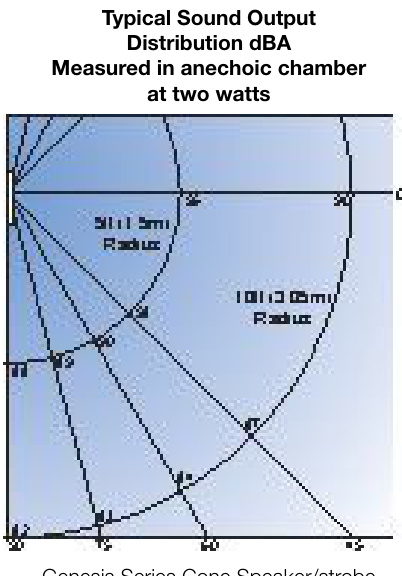
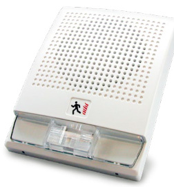
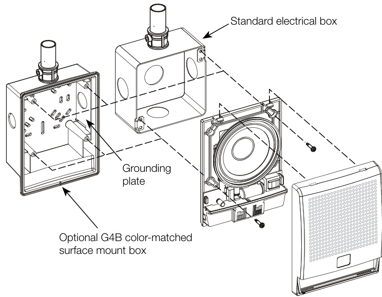
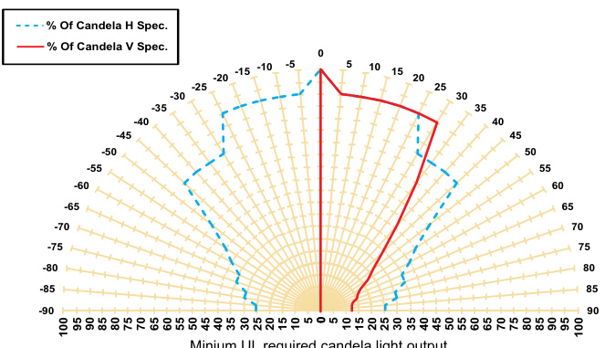

# Wall Speakers, Speaker-Strobes Genesis G4 Series  

# Overview  

The Genesis line of life safety and emergency communications speakers and speaker-strobes combine high performance output with a low profile design to deliver a life safety audio solution that’s as versatile as it is effective. Protruding no more than one inch from the wall, these appliances blend inconspicuously with any decor.  

Optional amber or blue lenses, ALERT or FIRE markings, and red or white housing colors ensure there is a device for every application, including mass notification and emergency communications.  

Speakers feature selectable wattage taps, while speaker-strobes allow for both wattage and light output levels to be configured in the field. Both settings remain clearly visible — even after final installation, which allows devices to be easily fine-tuned to achieve maximum benefit in exchange for the lowest possible system overhead.  

High fidelity models meet the NPFA 520 Hz requirements for newly construced commercial sleeping areas. They also produce crisp, clear voice audio output that is highly intelligible over large areas.  

All Genesis speakers include a DC blocking capacitor to allow electrical supervision of the audio distribution circuit. Models for $25\,\mathrm{V}_{\mathrm{FMS}}$ and $70\,\mathrm{V}_{\mathrm{RMS}}$ audio circuits are available. With their sealed back construction, these speakers are extra durable and provide outstanding audibility.  

# Standard Features  

# High Fidelity 520 Hz speaker models available  

Low frequency output meets NFPA standards for newly constructed commercial sleeping areas; increases sound fidelity and audio intelligibility.  

# Unique low-profile design  

–	 The most compact UL/ULC listed speaker-strobe available –	 Ultra-slim, protrudes a mere one inch from the wall Attractive appearance, no visible mounting screws  

# Field configurable – no need to remove the device  

–	 ¼, ½, 1, or 2 watt operation and selectable candela output with convenient switches that remain visible even after the unit is installed  

# Mass Notification models available with amber and blue lenses  

# Unparalleled performance  

–	 loud 90 dBA output ensures clear, crisp audio   
–	 Exclusive FullLight strobe technology produces even light distribution   
–	 Precision timing electronics meet tough synchronizing standards for strobes when used with compatible modules   
–	 Optional field-configurable temporal strobe output 25 Vrms and 70 Vrms models available, all supplied with a DC blocking capacitor for audio circuit supervision  

# Easy to install  

–	 Fits all standard 4-inch square electrical boxes with plenty of room behind the signal for extra wire – no extension ring or  trim plate needed   
–	 #18 - #12 AWG terminals – ideal for long runs or using existing wiring  

# Speaker Application  

The suggested sound pressure level for each signaling zone used with alert or alarm signals is a minimum of 15 dB above the average ambient sound level or 5 dB above the maximum sound level having a duration of at least 60 seconds, whichever is greater. This  

is measured 5 feet $(1.5\;\mathsf{m})$ above the floor.  

Doubling the distance from the signal to the ear will theoretically cause a 6 dB reduction in the received sound pressure level. The actual effect depends on the acoustic properties of materials in the space. Doubling the power output of a device (e.g.: a speaker from 1W to 2W) will increase the sound pressure level by 3dBA.  

  
Genesis Series Cone Speaker/strobe  

G4 speakers are available in combination with a UL 1971-listed strobe light for indoor wall-mounted public  

mode notification applications. These audible-visible appliances should be installed in accordance with guidelines established for visible (strobe) devices.  

# High Fidelity Models  

Genesis G4HF Series High Fidelity appliances provide highly intelligible voice audio output. They are also effective in areas subject to high levels of ambient noise. These appliances are approved for use in sleeping areas under conditions described below.  

# Sleeping Room Applications  

Genesis clear-lensed strobes are UL 1971-listed for use indoors as wall-mounted public-mode notification appliances for the hearing impaired. Prevailing codes require strobes to be used where ambient noise conditions exceed specified levels, where occupants use hearing protection, and in areas of public accommodation. UL 1638-listed colored-lensed strobe lights are available for mass notification applications. Consult with your Authority Having Jurisdiction for details.  

# Strobe Application  

When used with a compatible EDWARDS synchronization source, all Genesis xenon-based strobes — audible units, and combination appliances — remain fully synchronized indefinitely. This exceeds the UL synchronization requirements of 10 milliseconds over a twohour period. Strobe light synchronization is important in order to avoid issues with people that have Photosensitive Epilepsy.  

Genesis G4HF Series High Fidelity appliances are ideal for hotels, dormitories, and other residential occupancies where audible output must meet the 520 Hz signaling characteristics required by NFPA 72.  

In sleeping areas, always ensure that the wattage tap of the speaker is set sufficiently high so that the sound pressure reaches at least 75 dBA-fast at the pillow.  

These appliances are part of an end-to-end audio system approved for use in sleeping areas when used in conjunction with approved audio hardware and a factory-supplied $520\;\mathsf{H z}$ tone. Check the System Compatibility List for other 520 Hz signaling requirements.  

# Mass Notification Applications  

Genesis mass notification appliances bring the same high-performance life safety features and unobtrusive design to mass notification applications. Standard models are available with clear, amber, and blue lenses. They are ideal for applications that require differentiation between life safety and mass notification alerts. See the Ordering Information table for housing marking options.  

NOTE: Speakers driven by third-party audio systems are not UL approved for use in sleeping rooms.  

  

# Field Configuration  

Genesis speakers may be set for ¼, ½, 1, or 2 watt operation. The wattage setting is visible through a small window on the bottom of the device and is changed by simply sliding the switch until the desired setting appears in the window. The speaker does not have to be removed to change the wattage.  

Genesis speaker-strobes feature selectable candela output. The output setting is visible through a small window on the bottom of the device and is changed by simply sliding the switch until the desired setting appears in the window. The speaker-strobe does not have to be removed to change the output.  

Genesis speaker-strobes may also be configured for temporal flash. This battery-saving feature is intended for private mode signaling only. To set the device for temporal flash, snip the circuit board as shown in the Jumper Locations diagram above.  

  

WARNING: These devices will not operate without electrical power. As fires frequently cause power interruptions, we suggest you discuss further safeguards with your local fire protection specialist.  

# Installation and Mounting  

All models are intended for indoor wall mounted applications only. Speakers and speaker-strobes are flush mounted to a North-American $4"$ square electrical box, $2^{1}/{\mathrm{s}}^{\prime\prime}$ $E4\;\mathrm{mm}$ ) deep or a European 100 mm square box. Signals may be surface mounted to a Genesis surface-mount box (see ordering information for details).  

Two tabs at the top of the signal unlock the cover to facilitate mounting. The shallow depth of Genesis devices leaves room behind the signal for extra wiring. Once installed with the cover in place, no mounting screws are visible.  

  

EDWARDS recommends that these speaker-strobes always be installed in accordance with the latest recognized edition of national and local codes. Refer to installation sheet for mounting height information.  

# Wiring  

Field wiring is connected to Genesis signals with terminals that accommodate #18 to #12 AWG $(0.75\;\mathrm{mm}^{2}$ to $2.5\;\mathrm{mm}^{2}.$ ) wiring.  

  

# Light output  

Per cent of UL rating versus angle  

  

UL name plate maximum operating current (RMS-mA)   

<html><body><table><tr><td>Cd rating "15”</td><td>or "D</td><td>30” or "C 5</td><td>75” or “B</td><td>110" or “A”</td></tr><tr><td>16Vdc</td><td>96 120</td><td>130 169</td><td>239</td><td>294</td></tr><tr><td>16Vfwr</td><td></td><td></td><td>329</td><td>375</td></tr></table></body></html>  

Typical current, milliamps - average (RMS)   

<html><body><table><tr><td colspan="4">Cdrating “15"or“D” “30"or“C” “75”or“B” “110"or“A”</td></tr><tr><td>20Vdc</td><td>65 (78)</td><td>93 (101) 182 (188)</td><td>238 (245)</td></tr><tr><td>24Vdc</td><td>55 (65) 78 (86)</td><td>153 (159)</td><td>196 (203)</td></tr><tr><td>31Vdc</td><td>45 (53) 63 (69)</td><td>120 (124)</td><td>151 (157)</td></tr><tr><td>20Vfwr</td><td>56 (106) 79 (147)</td><td>147 (264)</td><td>197 (342)</td></tr><tr><td>24 Vfwr</td><td>50 (95) 68 (130)</td><td>121 (225)</td><td>155 (283)</td></tr><tr><td>27Vfwr</td><td>44 (84) 60 (115)</td><td>107 (200)</td><td>137 (251)</td></tr></table></body></html>  

Light output switch settings for UL 1971 listed models are selectable by numeric candela value. Light output for Mass Notification (ECS/MNS) appliances is selectable by A, B, C, or D designations.  

<html><body><table><tr><td>Lens Color</td><td>Switch PositionA</td><td>Switch PositionB</td><td>Switch PositionC</td><td>Switch Position D</td></tr><tr><td>Clear</td><td>110 cd</td><td>75 cd</td><td>30cd</td><td>15 cd</td></tr><tr><td>Amber</td><td>95cd</td><td>65 cd</td><td>26cd</td><td>13 cd</td></tr><tr><td>Blue</td><td>50cd</td><td>36cd</td><td>14 cd</td><td>7 cd</td></tr></table></body></html>  

# Sound level output  

G4HF High Frequency Models, dBA at $3.05~\mathrm{m}$ (10 ft.)   

<html><body><table><tr><td>Voltage</td><td>Setting (nominal)</td><td>Wattage (actual)</td><td>UL1480 Rating</td><td>ULC-S541 Rating</td><td>Anechoic (nominal)</td></tr><tr><td rowspan="4">25 VRMS</td><td>1/4 W</td><td>0.25W</td><td>80.9</td><td>81.5</td><td>81</td></tr><tr><td>1/2 W</td><td>0.50W</td><td>84.1</td><td>84.3</td><td>84</td></tr><tr><td>1W</td><td>1.00 W</td><td>86.6</td><td>87.2</td><td>87</td></tr><tr><td>2W</td><td>2.00 W</td><td>89.7</td><td>90.1</td><td>90</td></tr><tr><td rowspan="4">70 VRMS</td><td>1/4 W</td><td>0.25W</td><td>81.8</td><td>81.9</td><td>81</td></tr><tr><td>1/2 W</td><td>0.50W</td><td>84.6</td><td>84.9</td><td>84</td></tr><tr><td>1W</td><td>1.00 W</td><td>87.3</td><td>88.2</td><td>87</td></tr><tr><td>2W</td><td>2.00 W</td><td>90.5</td><td>90.9</td><td>90</td></tr></table></body></html>

UL 1480: Sound level output at 10 ft (3.05 m) measured in a reverberant room using 400 to 4,000 Hz band limited pink noise. ULC-S541: Sound level output at $\hbar O\,\hbar$ (3.05 m) measured in anechoic chamber  using  0 to 4,000 Hz band limited pink noise.  

G4 Standard Frequency Models   

<html><body><table><tr><td>Speaker WattageTap</td><td>Sound OutputLevel</td></tr><tr><td>1/4Watt</td><td>80dBA</td></tr><tr><td>1/2Watt</td><td>83dBA</td></tr><tr><td>1Watt</td><td>86dBA</td></tr><tr><td>2 Watt</td><td>89dBA</td></tr></table></body></html>  

UL 1480: Sound level output at 10 ft (3.05 m) measured in a reverberant room using 400 to 4,000 Hz band limited pink noise.  

<html><body><table><tr><td colspan="2">GenesisSpeakersandSpeaker-Strobes</td></tr><tr><td>Housing</td><td>RedorwhitetexturedUVstabilized,colorimpregnatedengineeredplastic.</td></tr><tr><td>Dimensions</td><td>Height: 6.5"(165 mm).Width:5"(127 mm).Depth to wall:1”(25 mm).</td></tr><tr><td>Mounting</td><td>Flush: North-American 4" square box, 2 1/8" (54 mm) deep.</td></tr><tr><td>(indoor wall mount only)</td><td>Surface: model G4B (white) or G4RB (red) surface mount box.</td></tr><tr><td>WireConnections</td><td>Screwterminals:separatepolarized inputsforspeakerandstrobe，#18to#12AWG(0.75mm2to2.5mm2)wiresize</td></tr><tr><td>Operatingenvironment</td><td>32-120°F(0-49°C)ambienttemperature;0-93%relativehumidity.</td></tr><tr><td>Agencylistingsandapprovals, G4Models</td><td>Meets ULC-S541, year 2004 UL requirements for standards UL1638 and UL1971. Complies with UL1480 Fifth</td></tr><tr><td>Agencylistingsandapprovals, LowFrequencyG4HFModels</td><td>UL 464 Listed for low frequency signaling applications. Meets ULC-S541, year 2004 UL requirements for standards ADA Code of Federal Regulation Chapter 28Part 36 Final Rule.</td></tr></table></body></html>  

<html><body><table><tr><td colspan="2">Speakers</td></tr><tr><td>Input/OperatingVolts</td><td>25VRMSor70VRMS.Seeorderinginformation.</td></tr><tr><td>SpeakerCone</td><td>Speaker frequency response: 300 to 12,000 Hz. 4-inch (102mm).</td></tr></table></body></html>  

Strobes   

<html><body><table><tr><td colspan="3">Strobeoutputrating</td></tr><tr><td colspan="2"></td><td></td></tr><tr><td>Amber:</td><td colspan="2">CAN/CSA-C22.2No.205,UL1638:selectable,95(A),65(B),26(C),13(D)</td></tr><tr><td></td><td>Blue:</td><td></td></tr><tr><td>StrobeOperatingVoltage</td><td></td><td></td></tr><tr><td>StrobeFlashRate</td><td>Oneflashpersecond</td><td></td></tr><tr><td>StrobeFlashSynchronization</td><td></td><td>Allstrobes:SynchronizationsourcerequiredtocomplywithUL1971synchronizationstandard.</td></tr><tr><td>SynchronizationSources</td><td></td><td>SIGA-CC1S,SIGA-MCC1S,SIGA-CC2A,SIGA-MCC2A,G1M-RM</td></tr><tr><td>StrobeLensMaterial</td><td>Polycarbonate</td><td></td></tr></table></body></html>  

<html><body><table><tr><td>Model</td><td>High Fidelity (520 Hz)</td><td>Housing Color</td><td>Text Marking</td><td>Lens Color</td><td>Strobe Output</td><td>Speaker Voltage</td><td>Shipping Weight</td></tr></table></body></html>  

<html><body><table><tr><td colspan="7">LifesafetyAppliances</td></tr><tr><td>G4-S2</td><td></td><td rowspan="2">White</td><td rowspan="2">None</td><td rowspan="4"></td><td rowspan="4">Speaker only models</td><td rowspan="4">25 Volt</td><td rowspan="4"></td></tr><tr><td>G4HFWN-S2</td><td>√</td></tr><tr><td>G4R-S2</td><td></td><td rowspan="2">Red</td><td rowspan="2">None</td></tr><tr><td>G4HFRN-S2</td><td></td></tr><tr><td>G4F-S2</td><td></td><td>White</td><td rowspan="3">FIRE</td><td rowspan="3"></td><td rowspan="6">(Selectable 14,%2,1, 0r 2 watt)</td><td rowspan="6"></td></tr><tr><td>G4HFWF-S2</td><td>√</td><td></td></tr><tr><td>G4RF-S2</td><td></td><td>Red</td><td rowspan="4"></td></tr><tr><td>G4HFRF-S2 G4-S2VM</td><td>√</td><td></td><td rowspan="3">None</td></tr><tr><td>G4HFWN-S2VMC</td><td></td><td>White</td></tr><tr><td>G4R-S2VM</td><td></td><td>Red</td></tr><tr><td>G4HFRN-S2VMC G4F-S2VM</td><td></td><td rowspan="2">White</td><td rowspan="2"></td><td rowspan="2">Clear</td><td rowspan="2">Selectable 15,30,75, or110 cd</td><td></td></tr><tr><td>G4HFWF-S2VMC</td><td></td></tr><tr><td>G4RF-S2VM</td><td>√</td><td rowspan="2">Red</td><td rowspan="2">FIRE None</td><td rowspan="6"></td><td rowspan="6">Speaker only models 70V</td><td rowspan="6">1.5 lbs. (0.68 kg)</td></tr><tr><td>G4HFRF-S2VMC</td><td></td></tr><tr><td>G4-S7</td><td></td><td rowspan="2">White</td><td rowspan="5">None</td></tr><tr><td>G4HFWN-S7</td><td>√</td></tr><tr><td>G4R-S7</td><td></td><td rowspan="2">Red</td></tr><tr><td>G4HFRN-S7</td><td>√</td></tr><tr><td>G4F-S7</td><td></td><td rowspan="2">White</td><td rowspan="4">FIRE</td><td rowspan="6">(Selectable 14, %2,1, or 2 Selectable 15,30,75,or 110 cd</td></tr><tr><td>G4HFWF-S7</td><td>√</td></tr><tr><td>G4RF-S7</td><td></td><td rowspan="2">Red</td><td rowspan="4"></td></tr><tr><td>G4HFRF-S7</td><td></td></tr><tr><td>G4-S7VM</td><td></td><td rowspan="2">White</td></tr><tr><td>G4HFWN-S7VMC</td><td>√</td></tr><tr><td>G4R-S7VM</td><td></td><td rowspan="2">Red</td><td rowspan="2">None FIRE</td><td rowspan="5">Clear</td><td rowspan="5"></td><td rowspan="5">watt)</td></tr><tr><td>G4HFRN-S7VMC</td><td></td></tr><tr><td>G4F-S7VM</td><td></td><td rowspan="2">White</td><td rowspan="2"></td></tr><tr><td>G4HFWF-S7VMC</td><td>√</td></tr><tr><td>G4HFRF-S7VMC</td><td>√</td><td>Red</td><td rowspan="2">FIRE</td><td rowspan="2">Clear</td><td rowspan="2">15/75 cd1</td></tr><tr><td>G4F-S7V1575 G4RF-S7V1575</td><td></td><td>White Red</td></tr></table></body></html>  

Mass Notification Appliances   

<html><body><table><tr><td>G4WA-S2VMA*</td><td></td><td rowspan="8">White</td><td rowspan="2">ALERT</td><td rowspan="2">Amber </td><td rowspan="2">Selectable 13,26,65,or 95 cd</td><td rowspan="8">1.5 Ibs. (0.68 kg)</td></tr><tr><td>G4HFWA-S2VMA*</td><td>√</td></tr><tr><td>G4WA-S2VMC</td><td></td><td>Clear</td><td>Selectable 15, 30, 75, or 110 cd</td><td rowspan="7">25 Volt (Selectable</td></tr><tr><td>G4HFWA-S2VMC G4WN-S2VMA*</td><td>√</td><td>Amber</td><td>Selectable</td><td></td></tr><tr><td>G4HFWN-S2VMA*</td><td>√</td><td>None</td><td>13,26,65, or 95 cd</td><td>14, %2,1,or 2 watt)</td></tr><tr><td>G4WN-S2VMC</td><td></td><td>ALERT</td><td rowspan="2">Clear None</td><td rowspan="2">15,30,75,or110 cd Speaker</td></tr><tr><td>G4WA-S2</td><td></td><td></td></tr><tr><td>G4HFWA-S2</td><td>√</td><td>None</td><td rowspan="2"></td><td rowspan="2">only models</td></tr><tr><td>G4WN-S2 G4WA-S7VMA*</td><td></td><td></td></tr><tr><td>G4HFWA-S7VMA*</td><td>√</td><td rowspan="6">White None</td><td>Amber ALERT</td><td rowspan="2">Selectable 13,26,65, or 95 cd Selectable</td><td rowspan="6">70V (Selectable 14,%2,1,or 2 watt)</td><td rowspan="6"></td></tr><tr><td>G4WA-S7VMC</td><td></td></tr><tr><td>G4HFWA-S7VMC</td><td>√</td><td>Clear 15,30,75,or110 cd</td></tr><tr><td>G4WN-S7VMA*</td><td></td><td>Selectable Amber 13,26,65,or 95 cd</td></tr><tr><td>G4HFWN-S7VMA*</td><td>√</td><td></td></tr><tr><td>G4HFWN-S7VMB</td><td></td><td>Blue 7,14,36,or50 cd Clear</td></tr><tr><td>G4WN-S7VMC G4WA-S7</td><td></td><td rowspan="2">ALERT</td><td rowspan="2">None</td><td rowspan="4">15,30,75,or110 cd Speaker</td><td rowspan="4"></td></tr><tr><td>G4HFWA-S7</td><td>√</td></tr><tr><td></td><td></td><td></td><td>only models</td></tr><tr><td>G4WN-S7</td><td></td><td>None</td><td></td></tr></table></body></html>

\* Not approved for fire alarm applications  

Accessories   

<html><body><table><tr><td>G1M-RM</td><td>SynchronizationOutput Module (1-gang)</td><td>0.2 (0.1)</td></tr><tr><td>SIGA-CC1S</td><td>Intelligent Synchronization Output Module (2-gang)</td><td>0.5 (0.23)</td></tr><tr><td>SIGA-MCC1S</td><td>SynchronizationOutput Module (Plug-in UIO)</td><td>0.18 (0.08)</td></tr><tr><td>G4B</td><td>Surfacemountbox,white</td><td>0.7 (0.32)</td></tr><tr><td>G4RB</td><td>Surfacemountbox,red</td><td>0.7 (0.32)</td></tr></table></body></html>  