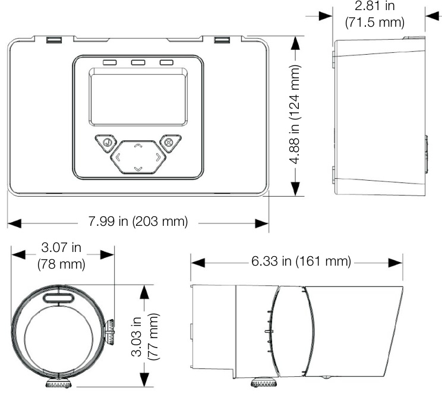
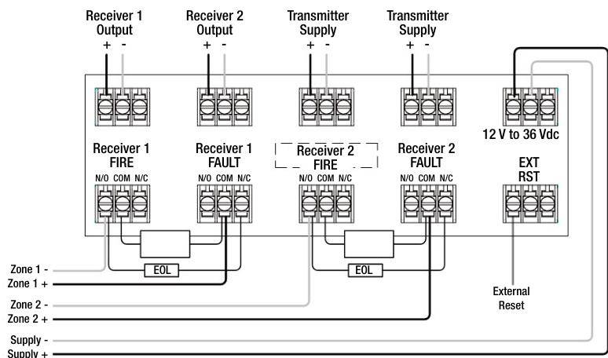
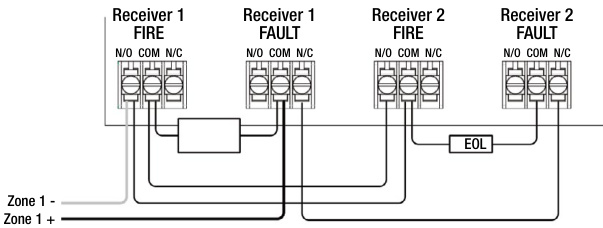
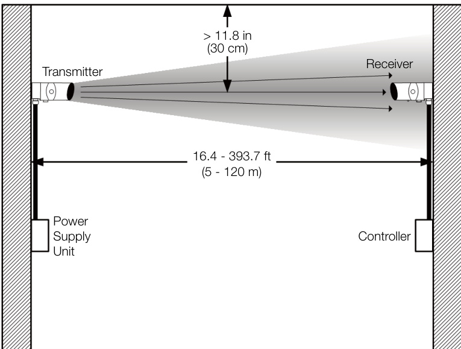
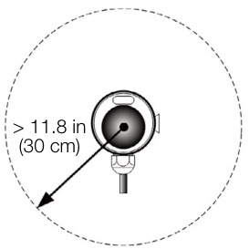

# End-to-End Beam Smoke Detector EC3000  

# Description  

The EC3000 is an end-to-end infrared optical beam smoke detector that comprises an infrared transmitter, receiver, and controller. The transmitter and receiver are installed near the ceiling of the protected area up to 393 feet ( $1\,20\;\mathrm{m})$ apart, while the controller is mounted at ground level where it remains accessible for maintenance and setup functions. Each controller will handle up to two transmitter/receiver pairs, each with separate fire and fault relays.  

The EC3000 is typically used in situations where it is impractical, inappropriate or not cost-effective to use point-type detectors. It also enables coverage of a large protected area at minimal cost, and is ideally suited for situations that might include high ceilings, dusty and dirty environments, or environments that are prone to temperature extremes.  

The EC3000 features integrated laser alignment, which simplifies installation, and configurable detector sensitivity and drift compensation, which reduces nuisance alarms. These features and capabilities make the EC3000 a practical and effective wide area detection solution.  

# Standard Features  

•	 Separate Transmitter and Receiver Heads   
•	 Range 16.5 to 393 feet (5 m to $120\;\mathsf{m}$ ), configurable per set of Detectors   
•	 Lateral Spacing per NFPA 72 is 60 feet   
•	 Integral Laser Alignment in Receiver   
•	 2-wire Interface between Controller and Receiver   
•	 Single and Twin Channel capability   
•	 Separate Fire and Fault Relays per Detector   
•	 Low Level Controller with LCD display   
•	 Programmable Sensitivity and Fire Threshold   
•	 Automatic Gain Control (AGC) for drift compensation   
•	 Built-in electronic UL/ULC obscuration-acceptance fire test   
•	 Knockouts for ease of installation and wiring   
•	 Built-in 1/2-inch/M-20 conduit knockouts on detectors and system controller  

# Application  

Beam smoke detectors are ideal for large open areas such as warehouses, hotel atrium, industrial plants and school gymnasiums. End-to-end beam smoke detectors are particularly useful where line of sight for the infrared detection path is narrow and where the building structure employs reflective surfaces.  

The EC300 is designed to be aesthetically pleasing making it equally suitable for modern architectural buildings, as well as historical sites – particularly where ornate ceilings exist.  

Smoke stratification may be overcome by mounting pairs of receivers and transmitters at different heights, one of which will project an infrared beam below the heat layer and into the smoke layer.  

Detection time will be longer in a building with a peaked roof if a fire occurs at the fringes of the protected area. If in doubt conduct appropriate smoke tests.  

The ideal location and spacing of the detector is critical in a properly installed and operating fire alarm system. It is recommended that the detectors be located and spaced in accordance with NFPA 72, which allows for lateral spacing of up to 60 ft $(18.3\,\mathsf{m})$ .  

# Dimensions  

# Typical Wiring  

  
Installation  

  
Two Receivers, two zones...   
Two Receivers, one zone...  

  

  

The distance between the ceiling and transmitter/receiver must be no more than 10 percent of the distance between floor and ceiling.  

Leave at least 11.8 inches (30 cm) unobstructed space around the receiver and transmitter.  

  

<html><body><table><tr><td>Operating Voltage Range</td><td>12 to36V DC±10%</td></tr><tr><td>Operating Controller Current (with 1 or 2 Receivers)</td><td>14mA (constant)</td></tr><tr><td>Operating Transmitter Current</td><td>8mA (per Transmitter)</td></tr><tr><td>Alarm Threshold</td><td>25%-60%</td></tr><tr><td>Power Down Reset Time</td><td>>20 seconds</td></tr><tr><td>Fireand FaultRelayContacts</td><td>ResistiveVFCO2A@30VoltsDC</td></tr><tr><td>Operating Temperature (non-condensing):</td><td>-4°F to +131°F (-20°C to +55°C)</td></tr><tr><td>Optical Wavelength</td><td>850nm</td></tr><tr><td>Operating Range</td><td>16.5 to 393 feet (5-120m)</td></tr><tr><td>MaximumCableDistance Between Receiver and Controller</td><td>330 Feet (100m)</td></tr><tr><td>Cabling between each Receiver and Controller</td><td>18-14AWG 1-Pair-Twisted,Jacketed</td></tr><tr><td>IP Rating</td><td>IP54</td></tr><tr><td>Relative Humidity (non-condensing)</td><td>93%</td></tr><tr><td>Dimensions and Weight, Control Unit</td><td>7.99 x 4.88 x 2.81in (203 ×124x71.5mm) 1.34lbs (0.607kg)</td></tr><tr><td>Dimensions and Weight, Transmitter&Receiver</td><td>3.07x3.03x6.33in (78 ×77 × 161mm) 0.456lbs (0.206kg)</td></tr><tr><td>Agency Listings</td><td>UL/ULC S3417, FM Pending, CSFM7260-1508-105</td></tr><tr><td>LED Indications Control Unit: Receiver:</td><td>Red = Fire,Amber = Fault, Green = System OK Red = Fire, Alignment LEDs for single person alignment</td></tr></table></body></html>  

# Engineering Specification  

The projected beam type smoke detector shall be listed to U.L. 268 and shall consist of up to two transmitters, two receivers and a single low level remote control unit. The detector shall operate between a range of 16.5 ft. to 393 ft. (5m to 120m). The temperature range of the system shall be $-4^{\circ}\mathsf{F}$ to $131\,^{\circ}\mathsf{F}$ (- $-20^{\circ}\mathrm{C}$ to $55^{\circ}\mathrm{C})$ .The receiver shall include an integral built-in laser pointer to assist in optimum alignment.  

The beam detector shall feature automatic gain control, which will compensate for gradual signal deterioration from dirt accumulation on the lenses. The receiver heads shall incorporate a Wide Field of View to ensure the unit is always receiving maximum signal available. The system shall include a low level remote display and control unit with LCD read-out for set-up, reporting and testing of up to two separate sets of heads. The system shall be capable of sending separate Trouble and Alarm signals for each of the sets of heads. The system shall be capable of programming alarm thresholds of $25\%$ to $60\%$ in $1\,\%$ increments.  

The system shall be capable of programming delay to fault and delay to alarm from 2 seconds to 30 seconds in 1 second increments.  

Test and acceptance of the system shall be carried out by using the UL/ULC approved internal electronic obscuration fire test. The projected beam type smoke detector shall be a 4-wire 24 VDC device to be used with a Nationally Recognized Testing Laboratory’s Listed and separately supplied 4- wire control panel. The End to End beam type smoke detector shall be an EDWARDS EC3000.  

<html><body><table><tr><td>EC3000-103</td><td>EndtoEndbeamsmokedetector16.5ft.to393ft.(5 mto120m).Systemincludesonetransmitter,one receiver,andonesystemcontrolunit.</td></tr><tr><td>EC3000-016</td><td>AdditionalDetectorPack(setoftransmitterand receiver heads).Use up to one additionalDetector PackperEC3000-103.</td></tr><tr><td>3000-201</td><td>AdjustmentBracket</td></tr><tr><td>3000-202</td><td>SurfaceMountAdapter</td></tr><tr><td>3000-203</td><td>4-inchSquareCoverPlate</td></tr><tr><td>5000-011</td><td>SurfaceMountDetectorBackBox(Requiresone 3000-202SurfaceMountAdaptorforeachhead-</td></tr><tr><td>3000-209</td><td>ordered separately). ControllerBackbox</td></tr><tr><td>3000-210</td><td>SemiFlushTrimPlate</td></tr><tr><td>1000-018</td><td>WireCageforEC3000whenusedwiththe5000-011 DetectorBackboxand3000-202(orderedseparately).</td></tr></table></body></html>  