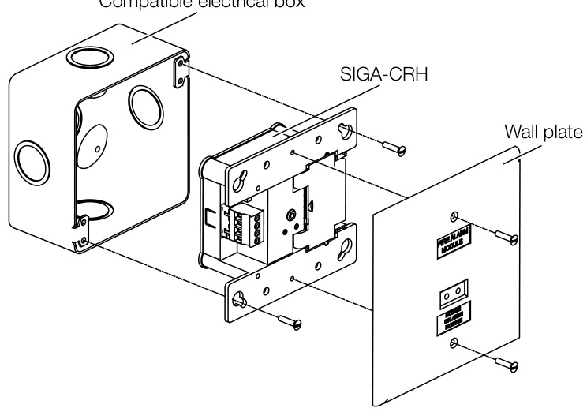
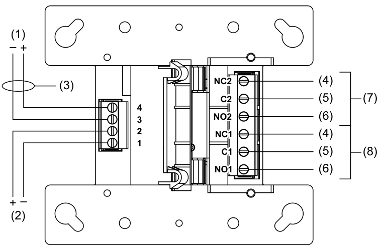

# High Power Control Relay Module SIGA-CRH  

# Description  

The SIGA-CRH High Power Control Relay Module is an addressable device designed for interface applications that require a high voltage, high current relay. Two identical sets of relay terminals are provided. Both sets of relay contacts transfer when the module is activated or restored. The state of the output terminals is not supervised.  

The module requires one address on the signaling line circuit (SLC). The address is assigned electronically. There are no address switches to set.  

# Standard Features  

# High Power Rating  

120/240 VAC or 24 VDC rated contact can be used to control external appliances such as door closers, fans, dampers etc. Provides one relay with two Form C contacts Relay accepts 12 to 18 AWG (1.0 to $4.0\:\mathsf{m m}^{2},$ wiring from two sources  

# Automatic device mapping  

Signature modules transmit information to the loop controller regarding their circuit locations with respect to other Signature devices on the wire loop.  

Removable terminal blocks Easy wiring and module replacement.  

# Electronic addressing  

Programmable addresses are downloaded from the loop controller or PC; there are no switches or dials to set.  

# Intelligent device  

Distributed intelligence allows lower communication speed with substantially improved control panel response time and less sensitivity to line noise and loop wiring properties; twisted or shielded wire is not required.  

# Application  

# Personality code  

Use Personality Code 8 to configure the SIGA-CRH module:  

Personality code 8: Signal - dry contact output. Configures the module as a dry relay contact to control external appliances (door closers, fan controllers, dampers) or equipment shutdown.  

# Indication  

The status LED shows the state of the module through the cover plate:  

•	 Normal: Green LED flashes •	 Alarm/active: Red LED flashes  

# Compatibility  

The SIGA-CRH is part of the Signature Series intelligent processing and control platform. It is compatible with EST3, EST3X, and iO Series control panels.  

# Warnings & Cautions  

The SIGA-CRH will not operate without electrical power. As fires frequently cause power interruption, we suggest you discuss further safeguards with your local fire protection specialist.  

EDWARDS recommends that this module be installed according to latest recognized edition of national and local fire alarm codes.  

# Testing & Maintenance  

SIGA-CRH automatic self-diagnosis identifies when it is defective and causes a trouble message. The user-friendly maintenance program shows the current state of each module and other pertinent messages. Single modules may be turned off (deactivated) temporarily, from the control panel. Availability of maintenance features is dependent on the fire alarm system used. Scheduled maintenance (Regular or Selected) for proper system operation should be planned to meet the requirements of the Authority Having Jurisdiction (AHJ). Refer to current NFPA 72 and ULC CAN/ ULC 536 standards.  

# Electronic Addressing  

The loop controller electronically addresses the SIGA-CRH, saving valuable time during system commissioning. Setting complicated switches or dials is not required. The module has its own unique serial number stored in its on-board memory.  

# Installation  

  

Consult the SIGA-CRH High Power Control Relay Module Installation Sheet for details.  

# Wiring  

  

(1)	 Signaling line circuit (SLC) from previous device   
(2)	 Signaling line circuit (SLC) to next device   
(3)	 Power-limited and supervised   
(4)	 Normally closed contact (NC)   
(5)	 Common contact (C)   
(6)	 Normally open contact (NO)  

Not supervised. Power-limited unless connected to a nonpowerlimited source. If the source is nonpower-limited, eliminate the power-limited mark and maintain a minimum of 0.25 in. $(6.4\;\mathsf{m m})$ ) space from power-limited wiring. For other mounting methods, see enclosure and bracket installation sheets to maintain separation of power-limited and nonpower-limited wiring. The wire size must be capable of handling fault current from a nonpower-limited source.  

or —  

Use type FPL, FPLR, FPLP, or permitted substitute cables, provided these power-limited cable conductors extending beyond the jacket are separated by a minimum of 0.25 in. $(6.4\;\mathsf{m m})$ space or by a nonconductive sleeve or nonconductive barrier from all other conductors. Refer to the NFPA 70 National Electrical Code for more details.  

(8)	 Relay terminal set 1. Identical to (7).  

<html><body><table><tr><td>SLC operating voltage</td><td>15.20 to 19.95 VDC</td></tr><tr><td>SLC current Standby</td><td>75 μA max.</td></tr><tr><td>Activated Contact ratings [1][2]</td><td>75 μA max.</td></tr><tr><td>240V50/60Hz 120 V50/60Hz 24VDC</td><td>7 A (PF 0.75), 1.5 A (PF 0.35) 7 A (PF 0.75),3.0 A (PF 0.35) 6 A resistive</td></tr><tr><td>Audio switching</td><td>0 to 20 kHz [3] 2 Form C, programmable</td></tr><tr><td>Relay type Relay ready delay</td><td>30 s max. (includes initial state set)</td></tr><tr><td>From power up From previous activation</td><td>5 s max. (one activation) 8 s max. (two activations, 1 s apart)</td></tr><tr><td>Circuit designation Signaling line circuits</td><td>Class A, Style 6 or Class B, Style 4. Refer to the control panel technical</td></tr><tr><td>Relay circuits Class E</td><td>publications for SLC wiring details.</td></tr><tr><td>Numberof SIGA-CRHperSLC</td><td>60 max.</td></tr><tr><td>Wiresize</td><td>12 to 18 AWG (1.0 to 4.0 mm2) North American double-gang × 2-1/8</td></tr><tr><td>Compatible electrical boxes</td><td>in. (54 mm) deep box</td></tr><tr><td></td><td>North American standard 4 in. square x 2-1/8 in. (54 mm) deep box</td></tr><tr><td>Agency Listings</td><td>CAN/ULC-S527,UL 864</td></tr><tr><td>Operating environment</td><td></td></tr><tr><td>Temperature</td><td>32to120°F(0 to49°C)</td></tr><tr><td></td><td></td></tr><tr><td>Relative humidity</td><td></td></tr><tr><td>Storage temperature</td><td>0 to 93%,noncondensing -4 to 140°F (-20 to 60°C)</td></tr></table></body></html>  

[1]	 Provide external fusing and back-EMF mitigation as required by your application. Do not use the SIGA-CRH in a mixed application, where one set of relay terminals has high-power requirements and the other set carries a low-power signal, as this may result in physical contamination of the low-power signal contacts.  

[2]	 The minimum load required in order to avoid long-term contact oxidation is 100 mA and 12 V.   
[3]	 Power must not exceed the contact ratings shown for a given PF (power factor).  

<html><body><table><tr><td>Catalog Number</td><td>Description</td><td>Ship Weight lbs (kg)</td></tr><tr><td>SIGA-CRH</td><td>HighPower Control Relay Module</td><td>0.4 (0.15)</td></tr></table></body></html>  