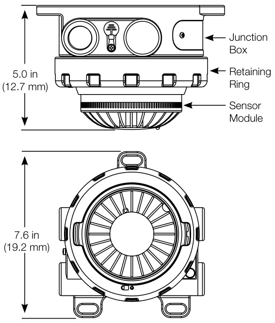
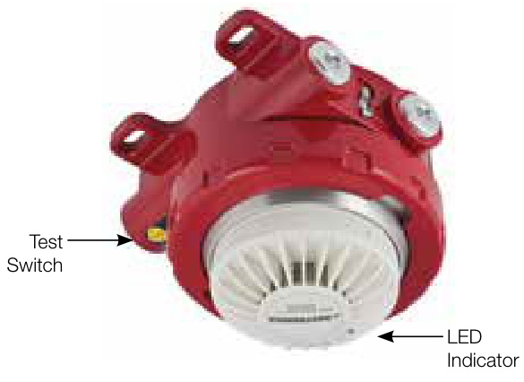
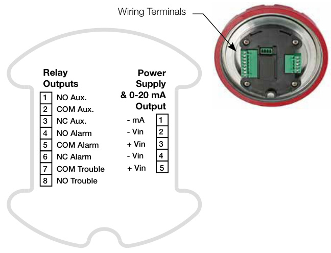

# Explosionproof Smoke Detector Model 30-3013  

# Description  

Model 30-3013 detectors are high performance smoke detectors built for use in hazardous locations. They are corrosion-resistant and feature a non-conducting aluminum alloy retaining ring that protects the detector sensor against the effects of explosions and other catastrophic events.  

The retaining ring mounts securely to a companion junction box, which offers several common port configurations for conduit connection. Together, the ring and box provide a sturdy protective shell for the detector head.  

The 30-3013’s advanced optical detector performs effectively with slow-burning smoldering fires, as well as quickly rising flames. The sensor module is hot-swappable and intrinsically safe while powered. This allows maintenance work to be performed without having to declassify the protected area as a hazardous location.  

An integrated Trouble relay ensures that the 30-3013 detector always performs as expected. On-board Alarm and Auxiliary relays integrate easily with EDWARDS fire systems, as well as auxiliary equipment such as dampers and door closers.  

# Standard Features  

•	 High performance optical smoke detection   
•	 Built-in $0{-}20\,\mathsf{m A}$ output for easy Distributed Control System (DCS) integration Self diagnostics for reliable operation   
•	 Alarm, Auxiliary, and Trouble relays for annunciator and control panel connection   
•	 On-board LED provides local annunciation   
Non-latching operation Convenient magnetic switch for manual testing FM Approved for smoke detection in Class I, Division 1 hazardous locations IECEx Zone approved IP44 ingress protection level suitable for onshore or offshore requirements  

# Application  

The 30-3013 Explosionproof Smoke Detector features a rugged design built to withstand environmental extremes. Its integrated milliamp outputs make it ideal for a wide range of industrial applications, while its agency approval ratings make it suitable for both on-shore and off-shore facilities.  

Typical applications for the 30-3013 Explosionproof Smoke Detector include:  

•	 Combustible storage facilities •	 Munitions manufacturing •	 Volatile chemical storage •	 Chemical processing plants •	 Petroleum refineries •	 Turbine enclosures •	 Battery rooms •	 HVAC applications  

# Installation  

All external wiring to the device is connected inside the integrated junction box. The 30-3013 has ports for up to four conduit entries. Each port accepts conduit with $3/4$ inch NPT.  

  

# Operation  

# LED Indication  

An LED located on the 30-3013 annunciates detector status.   
When operating normally, the LED flashes every four seconds.   
When the device is in alarm, it is steady on.  

# Non-latching operation  

The detector will check the alarm status once every 10 seconds. When smoke falls below the alarm threshold, the alarm condition will clear within 10 seconds.  

  

# Testing and Maintenance  

# Self Diagnostics  

During normal operation, the detector performs a self-test function automatically in the background once per second. Detection is not interrupted during the test, and no indication is given if the test passed. If the test fails, a Critical Fault condition will occur. If sensitivity drift is found to be approaching critical levels, an Advisory Fault condition will occur.  

# Manual Testing  

An on-board magnetic switch is used to initiate the Manual SelfTest. The LED will light when a magnet is detected at the switch. This test will immediately check the smoke chamber optics for sensitivity degradation.  

If there is a failure, the LED will shut off immediately after the one second test, and a Trouble condition will occur. If the test passes, an Alarm will be annunciated while the LED remains active. The alarm will clear after 10 seconds.  

# Wiring  

Use proper temperature rated cabling type and diameter for input power as well as output signal wiring. Terminals accept 14 to 18 AWG shielded stranded copper wire.  

The field wiring terminal connections are certified for a single wire in size from 0.2 to $2.5\;\mathrm{mm}^{2}$ (or two conductors with the same cross section 0.2 to $0.75\;\mathrm{mm}^{2}$ ). The screws must be tightened down with a torque 0.4 to $0.5\;\mathsf{N}\bullet\mathsf{m}$ . The metal housing must be electrically grounded.  

A minimum of 12 Vdc must be present at the 30-3013 to ensure proper operation. The maximum cable length from power source to 30-3013 is 2,000 feet $(610\;\mathsf{m})$ . When the 30-3013 Smoke Detector is mounted remotely using an STB termination box, maximum cable length from 30-3013 to STB is 500 feet $!52\;\mathrm{m})$ .  

  

# Specifications  

<html><body><table><tr><td>Operating Voltage</td><td>12-30Vdc (24Vdc nominal)</td></tr><tr><td>Power Consumption</td><td>3.5 watts maximum (2.75 watts at 24 Vdc)</td></tr><tr><td>Smoke alarm relay</td><td>Form C, 5 amperes at 30 Vdc: normally open/normally closed contacts and normally deenergized operation.</td></tr><tr><td>Trouble relay</td><td>Form A, 5 amperes at 30 Vdc: normally open contacts and normally energized operation.</td></tr><tr><td>Auxiliary relay</td><td>Form C,5 amperes at30Vdc: normally open/ normally closed contacts and normally de-</td></tr><tr><td>Temperature Range</td><td>energized operation. Operating:-20°C to +65°C (-4°F to +149°F)</td></tr><tr><td>Humidity Range</td><td>Storage:-55°Cto+70°C(-67°F to+158°F) 5 to 95% relative humidity.</td></tr><tr><td>Ingress Protection</td><td>IP44 (ceiling mount application only)</td></tr><tr><td>Current Output</td><td>0-20 mA(±0.3mA)dc current,with maximum loop resistance of 300 ohms from 12-17.9 Vdc,</td></tr><tr><td>Terminals</td><td>500 ohms from18 to19.9Vdc,and 600ohms. Ratedfor14-18AWG or2.5-0.75 mm2wire.</td></tr><tr><td>Thread Options</td><td>3/4 inch NPT or M25</td></tr><tr><td>Enclosure Material</td><td>Detector:Polycarbonate/ABS Junction Box: Copper-free aluminum (painted)</td></tr><tr><td>FM Approvals</td><td>Class I Div 1 Groups B,C,D T4 Class I Div 2 Groups A, B, C, D T4 Class I Zone 1 AEX db ia lIC T4 Gb Tamb-20°Cto+65°C IP44</td></tr><tr><td>IECExApprovals</td><td>IECExFMG15.0014X Ex db iaIIC T4 Gb Tamb-20°Ct0+65°C IP44</td></tr></table></body></html>  

# Ordering Information  

<html><body><table><tr><td>Model</td><td>Description Shipping Weight</td></tr><tr><td>3O-3O13A1N12F</td><td>ExplosionproofSmoke Detector 7.85 Ibs (3.56 kg)</td></tr></table></body></html>  