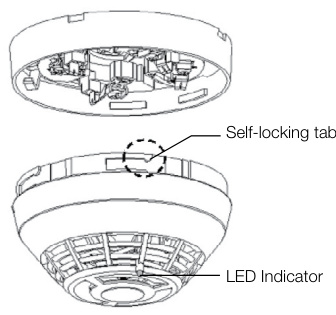
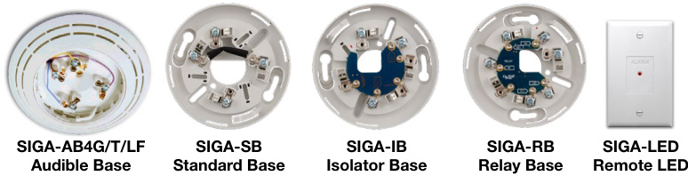
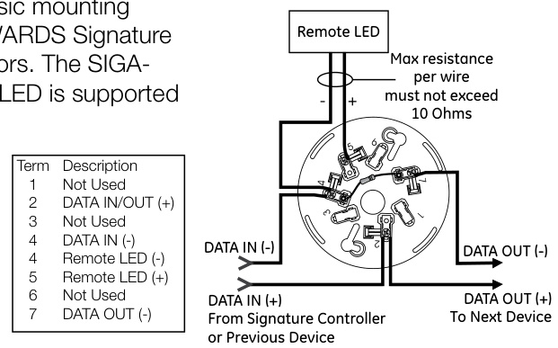
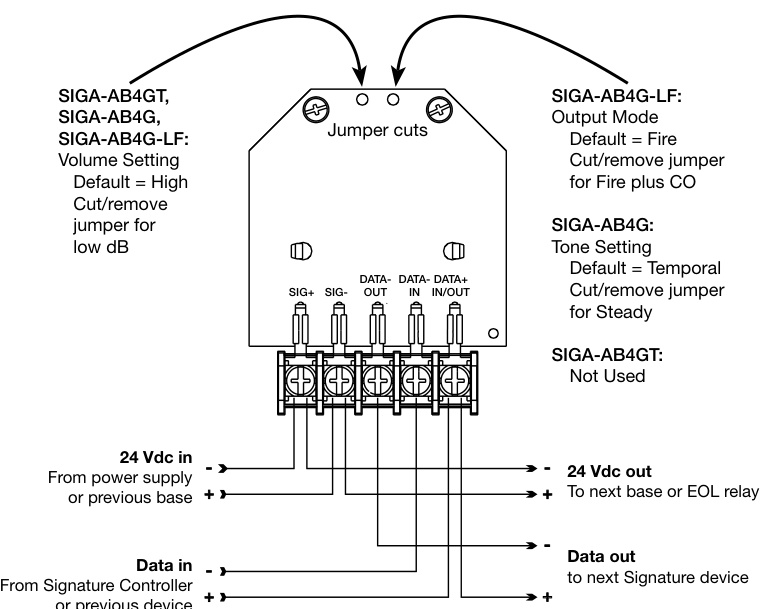
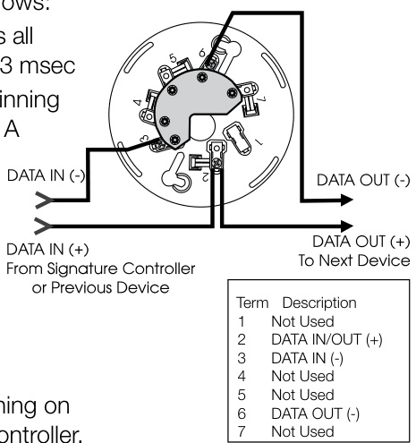
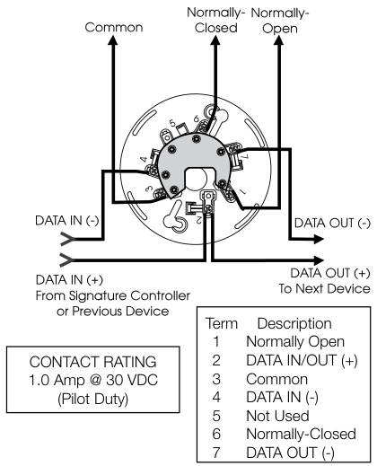
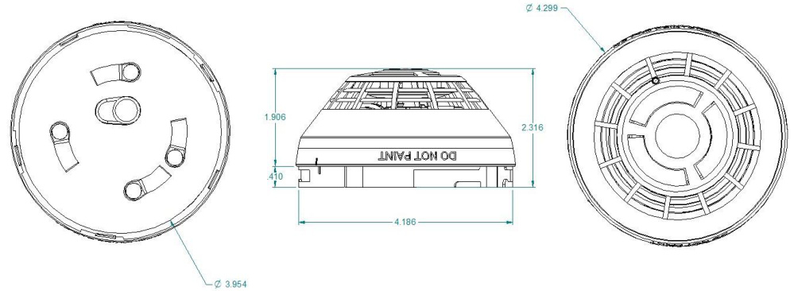

# Intelligent Smoke Detector SIGA-PD  

# Overview  

The Signature Series SIGA-PD optical smoke detector brings advanced sensing technology to a practical design that increases efficiency, saves installation time, cuts costs, and extends life safety and property protection capabilities. Continuous self-diagnostics ensure reliability over the long-haul, while environmental compensation helps reduce maintenance costs.  

Like all Signature Series detectors, the SIGA-PD is an intelligent device that gathers analog information from its optical sensor, converting this data into digital signals. To make an alarm decision, the detector’s on-board microprocessor measures and analyzes sensor readings and compares this information to historical data. Digital filters remove signal patterns that are not typical of fires, thus virtually eliminating unwanted alarms.  

# Standard Features  

Note: Some features described here may not be supported by all control systems. Check your control panel’s Installation and Operation Guide for details.  

•	 Next Generation Optical Smoke Sensing Technology   
Wide 0.53 to $3.94\;\%$ /ft. (1.7 to $12.35\mathrm{~\textperthousand~}$ ) smoke obscuration   
•	 Uses Existing Wiring   
•	 Automatic Device Mapping   
Up To 250 Total Signature Addresses Per Loop   
•	 Two Levels of Environmental Compensation   
•	 Two Levels of Dirty Detector Warning Twenty Pre-Alarm Settings   
Five Sensitivity Settings   
•	 Non-Volatile Memory Electronic Addressing Identification of Dirty or Defective Detectors Automatic Day/Night Sensitivity Adjustment   
•	 Bicolor (Green/Red) Status Led   
•	 Standard, Relay, Fault Isolator, and Audible Mounting Bases   
•	 Sensor Markings Provide Easy Testing Identification  

# Application  

The SIGA-PD detects extremely small particles of combustion and triggers an alarm at the first sign of smoke. Thanks to its high-performance forward-scattering reflective response technology, the photoelectric smoke sensor responds quickly and reliably to a wide range of fire types, espe­cially slow burning fires fuelled by combustibles typically found in modern multi-use buildings.  

# Compatibility  

The SIGA-PD detector is compatible only with the Signature Loop Controller.  

# Installation  

Signature Series detectors mount to North American 1-gang boxes, 3-1/2 inch or 4 inch octagon boxes, and to 4 inch square electrical boxes 1-1/2 inches (38 mm) deep. They mount to European BESA and 1-gang boxes with $60.3\:\mathrm{mm}$ fixing centers. See mounting base installation and wiring for more information.  

  

# Sensing and reporting technology  

The microprocessor in each detector provides additional benefits – Self-diagnostics and History Log, Automatic Device Mapping, and Fast, Stable Communication.  

Self-diagnostics and History Log - Each Signature Series detector constantly runs self-checks to provide important maintenance information. The results of the self-check are automatically updated and permanently stored in the detector’s non-volatile memory  

Automatic Device Mapping - The loop controller learns where each device’s serial number address is installed relative to other devices on the circuit. The mapping feature provides supervision of each device’s installed location to prevent a detector from being reinstalled (after cleaning etc.) in a different location from where it was originally.  

Fast Stable Communication - On-board intelligence means less information needs to be sent between the detector and the loop controller. Other than regular supervisory polling response, the detector only needs to communicate with the loop controller when it has something new to report.  

# Testing & Maintenance  

Each detector automatically identifies when it is dirty or defective and causes a “dirty detector” message. The detector’s sensitivity measurement can also be transmitted to the loop controller. A sensitivity report may be printed to satisfy NFPA sensitivity measurements, which must be conducted at the end of the first year and every two years thereafter.  

The user-friendly maintenance program shows the current state of each detector and other pertinent messages. Single detectors may be turned off temporarily from the control panel. Availability of maintenance features is dependent on the fire alarm system used.  

# Accessories  

Detector mounting bases have wiring terminals that are accessible from the “room-side” after mounting the base to the electrical box. The bases mount to North American 1-gang boxes and to $3\%$ inch or 4 inch octagon boxes, $1\,\%$ inches (38 mm) deep. They also mount to European BESA and 1-gang boxes with $60.3\:\mathrm{mm}$ fixing centers. The SIGA-SB4, SIGA-RB4, and SIGA-IB4 mount to North American 4 inch sq. electrical boxes in addition to the above boxes. They include the SIGA-TS4 Trim Skirt, which is used to cover the “mounting ears” on the base. The SIGA-AB4G mounts to a 4 inch square box only.  

  

Remote LED SIGA-LED - The remote LED connects to the SIGA-SB or SIGA-SB4 Standard Base only. It features a North American size 1-gang plastic faceplate with a white finish and red alarm LED.  

SIGA-TS4 Trim Skirt - Supplied with 4 inch bases, it can also be ordered separately to use with the other bases to help hide surface imperfections not covered by the smaller bases.  

Sounder Bases - Signature Series sounder bases are designed for use where localized or group alarm signaling is required.  

•	 SIGA-AB4G bases provide sounder capability to Signature Series to heat and smoke detectors. They are not intended for use with combination carbon monoxide detectors in Fire-plus-CO mode.   
•	 SIGA-AB4GT bases provide sounder capability to Signature Series smoke and heat detectors, as well as carbon monoxide detectors when used with a SIGA-TCDR Temporal Pattern Generator.   
•	 SIGA-AB4G-LF bases provide 520 Hz low frequency sounder capability to Signature Series smoke and heat detectors, as well as carbon monoxide detectors when used with a SIGA-TCDR Temporal Pattern Generator. The SIGA-AB4G-LF is suitable for applications requiring low frequency audible tones.  

# Typical Wiring  

The detector mounting bases accept #18 AWG $(0.75\mathsf{m m}^{2})$ , #16 $(1.0\mathsf{m m}^{2})$ , #14 AWG $(1.5\mathsf{m m}^{2})$ , and #12 AWG $(2.5\mathsf{m m}^{2})$ wire sizes. Sizes #16 AWG $(1.0\mathsf{m m}^{2})$ and $\#18$ AWG $(0.75\mathsf{m m}^{2})$ ) are preferred for ease of installation.  

This is the basic mounting base for EDWARDS Signature Series detectors. The SIGA  

  
Standard Detector Base, SIGA-SB, SIGA-SB4  

# Isolator Detector Base, SIGA-IB, SIGA-IB4  

This base includes a built-in line fault isolator for use on Class A circuits. A detector must be installed for it to operate. The isolator base does not support the SIGA-LED Remote LED.  

# Audible Sounder Bases, Fire Mode  

The isolator operates as follows:   
- 	a short on the line causes all isolators to open within 23 msec   
- 	at 10 msec intervals,beginning on one side of the Class A circuit nearest the loop controller, the isolators close to provide the next isolator down the line with power   
- 	when the isolator next to the short closes, it reopens within 10 msec.  

the other side of the loop controller.  

AB4GT, AB4G, AB4G-LF sounder bases  

  

  

# Warnings & Cautions  

This detector does not operate without electrical power. As fires frequently cause power interruption, discuss further safeguards with the local fire protection specialist.   
•	 This detector does not sense fires in areas where smoke cannot reach the detector. Smoke from fires in walls, roofs, or on the opposite side of closed doors may not reach the detector.   
•	 Photoelectric detectors have a wide range of fire-sensing capabilities and ares best suited for detecting slow, smoldering fires.   
•	 In Canada, install according to CAN/ULC-S524 Standard for the Installation of Fire Alarm Systems, CSA C22.1 Canadian Electrical Code, and the local authority having jurisdiction.  

# Relay Detector Base, SIGA-RB, SIGA-RB4  

This base includes a relay. Normally Open or Normally Closed operation is selected during installation. The dry contact is rated for 1 amp (pilot duty) $@$ 30 Vdc. The relay’s position is supervised to avoid accidentally jarring it out of position. The SIGA-RB can be operated as a control relay if programmed to do so at the control panel. The relay base does not support the SIGA-LED Remote LED.  

  

# Dimensions  

  

# Specifications  

<html><body><table><tr><td>Operatingvoltage</td><td>15.20to19.95VDC</td></tr><tr><td>Normaloperatingcurrent</td><td>51 μA</td></tr><tr><td>Alarmcurrent</td><td>68μA</td></tr><tr><td>SmokeSensitivityRange</td><td>UL/ULC:0.53 to3.94 %/ft.(1.7to12.35 %/m)obscuration</td></tr><tr><td>Vibrationlevel</td><td>10 to 35 Hz,with an amplitude of 0.01 in.</td></tr><tr><td>Airvelocity</td><td>0to 4,000 ft./min(0 to20 m/s)</td></tr><tr><td>Wallmounting</td><td>12 in.(305mm)max.from ceiling</td></tr><tr><td>Compatiblebases</td><td>SeeOrderingInformation</td></tr><tr><td>Compatibledetectortesters</td><td>Testifire1000,Testifire2000</td></tr><tr><td>Operatingenvironment</td><td>32to120°F(0 to49°C),0to93%RH,noncondensing</td></tr><tr><td>Construction</td><td>HighImpact Engineering Polymer,White</td></tr><tr><td>Storagetemperature</td><td>-4 to 140°F (-20 to 60°C)</td></tr><tr><td>EnvironmentalcompensationAutomatic</td><td></td></tr><tr><td>Agency Listings</td><td>CAN/ULC-S529,UL268,268A,CSFM,FMappr0ved</td></tr></table></body></html>  

# Ordering Information  

<html><body><table><tr><td>Catalog Number</td><td>Description</td><td>Ship Wt. Ibs (kg)</td></tr><tr><td>SIGA-PD</td><td>IntelligentOptical SmokeDetector</td><td>0.4 (0.16)</td></tr><tr><td colspan="3"></td></tr><tr><td colspan="3">Accessories</td></tr><tr><td>SIGA-SB</td><td>Detector Mounting Base- Standard</td><td rowspan="7">0.2 (.09)</td></tr><tr><td>SIGA-SB4</td><td>4-inch Detector Mounting Base c/w Trim Skirt</td></tr><tr><td>SIGA-RB</td><td>Detector Mounting Basew/Relay</td></tr><tr><td>SIGA-RB4</td><td>4-inch Detector Mounting Base w/Relay, c/w Trim Skirt</td></tr><tr><td>SIGA-IB</td><td>DetectorMounting Base w/Fault Isolator</td></tr><tr><td>SIGA-IB4</td><td>4-inch Detector Mounting Base w/ Fault Isolator, c/w Trim Skirt</td></tr><tr><td>SIGA-LED</td><td>Remote Alarm LED (not for EN54 applications)</td></tr><tr><td>SIGA-AB4G</td><td>Audible (Sounder) Base forFireDetectors 0.3 (0.15)</td></tr><tr><td>SIGA-AB4G-LF</td><td>Low Frequency Audible(Sounder) Base for CO and Fire Detectors 0.3 (0.15)</td></tr><tr><td>SIGA-AB4GT</td><td>Audible(Sounder)BaseforCOandFireDetectors 0.3 (0.15)</td></tr><tr><td>SIGA-TS4</td><td>Trim Skirt (supplied with 4-inch bases) 0.1 (0.04)</td></tr><tr><td>SIGA-TS</td><td>Trim Skirt -(optional for non 4-inch bases) 0.1 (0.04)</td></tr><tr><td>SIGA-DMP</td><td>DetectorMountingPlate 3.0 (1.4)</td></tr><tr><td>SIGA-RTA</td><td>DetectorRemoval Tool</td></tr><tr><td>SIGA-VA</td><td>DetectorCleaningTool</td></tr></table></body></html>  