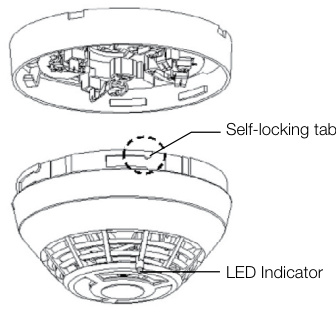
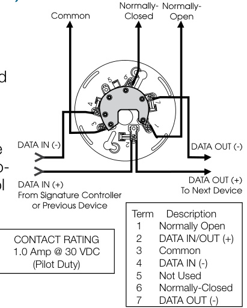
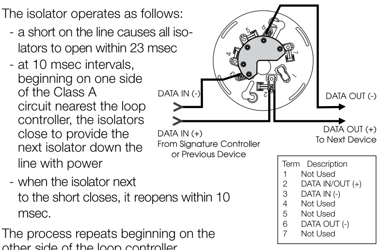

# Intelligent Heat Detectors SIGA-HRD, SIGA-HFD  

# Overview  

The Signature Series smoke detectors bring advanced sensing technology to a practical design that increases efficiency, saves installation time, cuts costs, and extends property protection capabilities. Continuous self-diagnostics ensures reliability over the long-haul, while the latest thermister technology makes these detectors ideal wherever dependable heat detection is required.  

The SIGA-HRD is an intelligent fixed temperature/rate-of-rise fire detector. It monitors the temperature of the surrounding air and analyzes the data from the sensor to determine whether to initiate an alarm. The rate-of-rise heat function quickly detects a fast, flaming fire. The fixed-temperature heat function detects fire when the air temperature near the detector exceeds the alarm point.  

The SIGA-HFD is an intelligent fixed-temperature heat detector that contains a fixed-temperature heat sensor rated at 135 °F $(57.2\;^{\circ}\mathrm{C})$ . It does not have a rate-of-rise function. The heat sensor monitors the temperature of the air in its surroundings and the detector analyzes the data to determine when the air temperature near the detector exceeds the device’s alarm point.  

# Standard Features  

Note: Some features described here may not be supported by all control systems. Check your control panel’s Installation and Operation Guide for details.  

•	 Next Generation Heat Sensing Technology   
•	 135 °F $(57\ ^{\circ}\mathrm{C})$ fixed temperature alarm point (HRD and HFD) $15\,^{\circ}\mathsf{F}\,(9\,^{\circ}\mathrm{C})$ per minute rate-of-rise alarm point (HRD)   
•	 Uses existing wiring   
•	 Automatic device mapping   
Sensor Markings Provide Easy Testing Identification   
Up To 250 Total Signature Devices Per Loop   
Non-volatile memory   
?Electronic addressing   
Bicolor (green/red) status LED   
Standard, relay, fault isolator, and audible mounting bases   
•	 50 foot (15.2 meter) spacing  

# Application  

The SIGA-HRD combination fixed temperature/rate-of-rise heat detector provides a $15\,^{\circ}\mathsf{F}$ $(9\,^{\circ}\mathrm{C})$ per minute rate-of-rise heat sensor for the detection of fast-developing fires, as well as a $135^{\circ}\mathsf{F}$ $(57^{\circ}\mathrm{C})$ fixed temperature sensor for slow building-fires. The SIGAHFD fixed temperature detector provides a $135^{\circ}\mathsf{F}$ $(57^{\circ}\mathrm{C})$ fixed temperature sensor for slow building-fires.  

# Compatibility  

Signature Series heat detectors are compatible only with the Signature Loop Controller.  

# Installation  

Signature Series detectors mount to North American 1-gang boxes, 3-1/2 inch or 4 inch octagon boxes, and to 4 inch square electrical boxes 1-1/2 inches $\left(38\,\mathsf{m m}\right)$ deep. They mount to European BESA and 1-gang boxes with 60.3 mm fixing centers. See mounting base installation and wiring for more information.  

  

# Sensing and reporting technology  

The microprocessor in each detector provides additional benefits - Self-diagnostics and History Log, Automatic Device Mapping, and Fast, Stable Communication.  

Self-diagnostics and History Log - Each Signature Series detector constantly runs self-checks to provide important maintenance information. The results of the self-check are automatically updated and permanently stored in the detector’s non-volatile memory.  

Automatic Device Mapping - The loop controller learns where each device’s serial number address is installed relative to other devices on the circuit. The mapping feature provides supervision of each device’s installed location to prevent a detector from being reinstalled (after cleaning etc.) in a different location from where it was originally.  

Fast Stable Communication - On-board intelligence means less information needs to be sent between the detector and the loop controller. Other than regular supervisory polling response, the detector only needs to communicate with the loop controller when it has something new to report.  

# Accessories  

Detector mounting bases have wiring terminals that are accessible from the “room-side” after mounting the base to the electrical box. The bases mount to North American 1-gang boxes and to $3\%$ inch or 4 inch octagon boxes, $1\,\%$ inches (38 mm) deep. They also mount to European BESA and 1-gang boxes with $60.3\;\mathrm{mm}$ fixing centers. The SIGA-SB4, SIGA-RB4, and SIGA-IB4 mount to North American 4 inch sq. electrical boxes in addition to the above boxes. They include the SIGA-TS4 Trim Skirt, which is used to cover the “mounting ears” on the base. The SIGA-AB4G mounts to a 4 inch square box only.  

  
Remote LED SIGA-LED - The remote LED connects to the SIGA-SB or SIGA-SB4 Standard Base only. It features a North American size 1-gang plastic faceplate with a white finish and red alarm LED.  

SIGA-TS4 Trim Skirt - Supplied with 4 inch bases, it can also be ordered separately to use with the other bases to help hide surface imperfections not covered by the smaller bases.  

Sounder Bases - Signature Series sounder bases are designed for use where localized or group alarm signaling is required.  

•	 SIGA-AB4G bases provide sounder capability to Signature Series to heat and smoke detectors. They are not intended for use with combination carbon monoxide detectors in Fireplus-CO mode.   
•	 SIGA-AB4GT bases provide sounder capability to Signature Series smoke and heat detectors, as well as carbon monoxide detectors when used with a SIGA-TCDR Temporal Pattern Generator.   
•	 SIGA-AB4G-LF bases provide 520 Hz low frequency sounder capability to Signature Series smoke and heat detectors, as well as carbon monoxide detectors when used with a SIGA-TCDR Temporal Pattern Generator. The SIGA-AB4G-LF is suitable for applications requiring low frequency audible tones.  

# Warnings & Cautions  

This detector does not operate without electrical power. As fires frequently cause power interruption, discuss further safeguards with the local fire protection specialist.   
This detector does not sense fires in areas where heat cannot reach the detector. Heat from fires in walls, roofs, or on the opposite side of closed doors may not reach the detector. This heat detector by itself does not provide life safety protection Use this detector with ionization and/or photoelectric smoke detectors.   
This detector does not detect oxygen levels, smoke, toxic gases, or flames. Use this device as part of a broad-based life safety program which includes a variety of information sources pertaining to heat and smoke levels, extinguishment systems, visual and audible devices, and other safety measures.   
Independent studies indicate that heat detectors should only be used when property protection alone is involved. Never rely on heat detectors as the sole means of fire protection.  

The detector mounting bases accept #18 AWG $(0.75\mathsf{m m}^{2})$ , #16 $(1.0\mathsf{m m}^{2})$ ,  #14 AWG $(1.5\mathsf{m m}^{2})$ , and #12 AWG $(2.5\mathsf{m m}^{2})$ wire sizes. Sizes #16 AWG $(1.0\mathsf{m m}^{2})$ and #18 AWG $(0.75\mathsf{m m}^{2})$ ) are preferred for ease of installation.  

This is the basic mounting base for EDWARDS Signature Series  

  
Standard Detector Base, SIGA-SB, SIGA-SB4  

# Relay Detector Base, SIGA-RB, SIGA-RB4  

  

This base includes a relay.  Normally Open or Normally Closed operation is selected during installation. The dry contact is rated for 1 amp (pilot duty) $@$ 30 Vdc. The relay’s position is supervised to avoid accidentally jarring it out of position. The SIGA-RB can be operated as a control relay if programmed to do so at the control panel. The relay base does not support the SIGA-LED Remote LED.  

# Isolator Detector Base, SIGA-IB, SIGA-IB4  

This base includes a built-in line fault isolator for use on Class A circuits. A detector must be installed for it to operate. The isolator base does not support the SIGA-LED Remote LED.  

  

other side of the loop controller.  

# Audible Sounder Bases, Fire Mode  

AB4GT, AB4G, AB4G-LF sounder bases  

  

# Dimensions  

  

# Specifications  

<html><body><table><tr><td></td><td>SIGA-HRD</td><td>SIGA-HFD</td></tr><tr><td>Operating voltage</td><td>15.20to19.95VDC</td><td></td></tr><tr><td>Normaloperating current</td><td colspan="2">32 μA</td></tr><tr><td>Alarm current</td><td colspan="2">32 μA</td></tr><tr><td>Vibrationlevel</td><td>10 to 35 Hz, with an amplitude of 0.01 in.</td><td></td></tr><tr><td>Rate-of-riserating</td><td>15°F/min (8°C/min)</td><td>NA</td></tr><tr><td>Fixedtemperaturerating</td><td>135°F(57.2°C).Actualalarmpoint129 to141°F(53.9 to60.6°C))</td><td></td></tr><tr><td>Maximumspacing</td><td colspan="2">50ft.(15.2m)centers</td></tr><tr><td>Compatiblebases</td><td>See Ordering Information</td><td></td></tr><tr><td>Compatibledetectortesters</td><td>Testifire1000,Testifire2000</td><td>Testifire2000</td></tr><tr><td>Operatingenvironment</td><td></td><td></td></tr><tr><td>Construction</td><td colspan="2">32 to100°F (0 to38°C),0 to93%RH,noncondensing</td></tr><tr><td>Storagetemperature</td><td colspan="2">High Impact Engineering Polymer, White</td></tr><tr><td>Agency Listings</td><td>-4 to 140°F(-20 to 60°C) CAN/ULC-S53O,UL521</td><td>CAN/ULC-S530-M91,UL521</td></tr></table></body></html>  

# Ordering Information  

<html><body><table><tr><td>Catalog Number</td><td>Description</td><td>Ship Wt. Ibs (kg)</td></tr><tr><td>SIGA-HRD</td><td>Intelligentfixedtemperature/Rate-of-riseheatdetector</td><td rowspan="2">0.4 (0.16)</td></tr><tr><td>SIGA-HFD</td><td>Intelligentfixedtemperatureheatdetector</td></tr></table></body></html>  

<html><body><table><tr><td colspan="2">CompatibleBases</td></tr><tr><td>SIGA-SB</td><td>DetectorMountingBase-Standard</td><td rowspan="4">0.2 (.09)</td></tr><tr><td>SIGA-SB4</td><td>4-inchDetectorMountingBasec/wTrimSkirt</td></tr><tr><td>SIGA-RB</td><td>DetectorMountingBasew/Relay</td></tr><tr><td>SIGA-RB4</td><td>4-inchDetectorMountingBasew/Relay，c/wTrimSkirt</td></tr><tr><td>SIGA-IB</td><td>DetectorMountingBasew/FaultIsolator</td><td rowspan="3"></td></tr><tr><td>SIGA-IB4</td><td>4-inchDetectorMountingBasew/FaultIsolator,c/wTrimSkirt</td></tr><tr><td>SIGA-AB4G</td><td>Audible(Sounder)BaseforFireDetectors</td></tr><tr><td>SIGA-AB4G-LF</td><td>LowFrequencyAudible(Sounder)BaseforCOandFireDetectors</td><td rowspan="2">0.3 (0.15)</td></tr><tr><td>SIGA-AB4GT</td><td>Audible(Sounder)BaseforCOandFireDetectors</td></tr><tr><td>SIGA-LED</td><td>RemoteAlarmLED(notforEN54applications)</td><td rowspan="2">0.1 (0.04)</td></tr><tr><td>SIGA-TS4</td><td>Trim Skirt (supplied with 4-inch bases)</td></tr><tr><td>SIGA-TS</td><td>Trim Skirt (optional for non 4-inch bases)</td><td rowspan="2"></td></tr><tr><td>SIGA-RTA</td><td>DetectorRemovalTool</td></tr></table></body></html>  