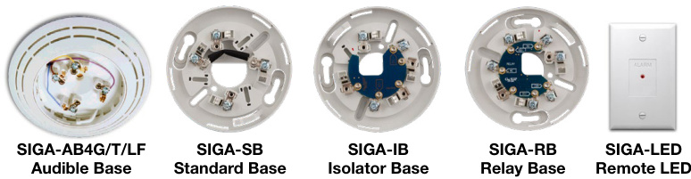
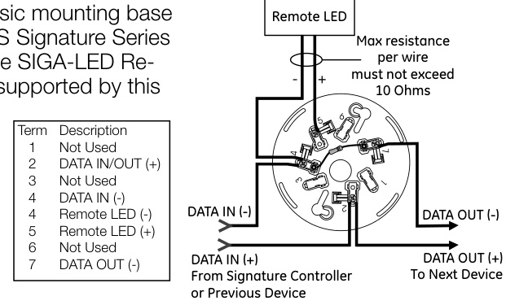
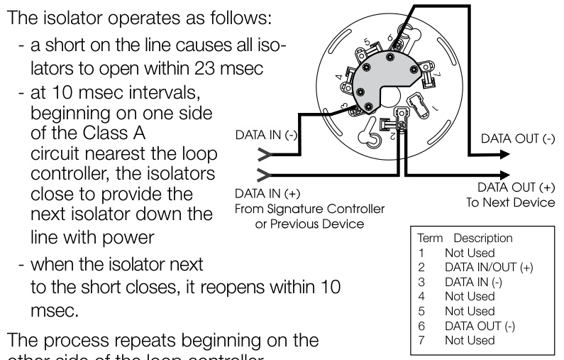
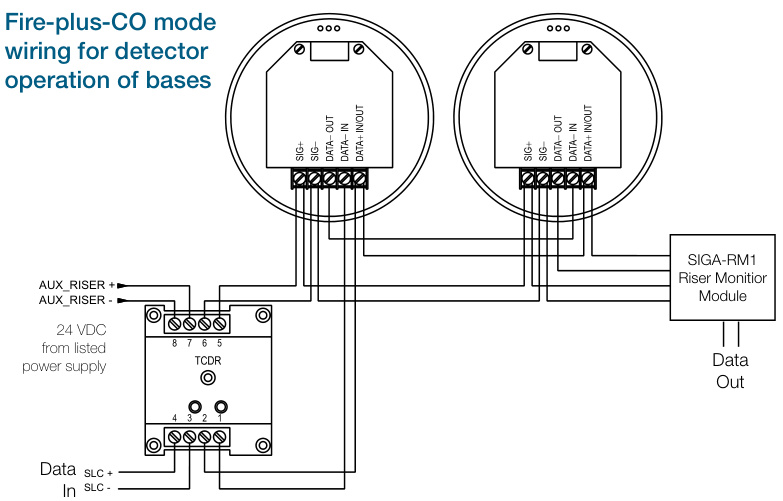
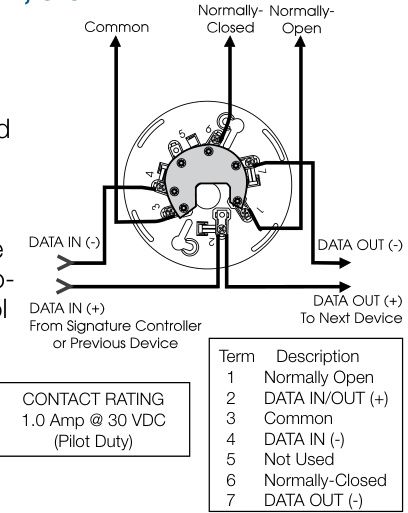
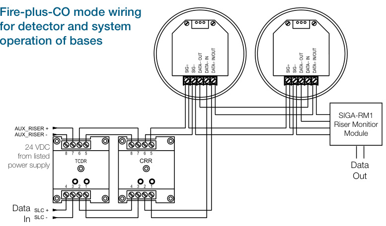
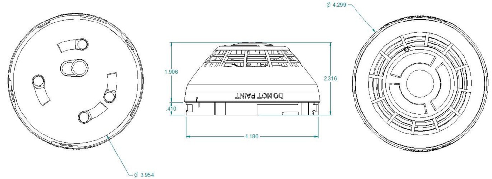

# Intelligent CO Detector SIGA-COD  

# Overview  

The Signature Series SIGA-COD carbon monixide detector brings advanced sensing technology to a practical design that increases efficiency, saves installation time, cuts costs, and extends life safety capabilities. Continuous self-diagnostics ensures reliability over the long-haul, while advanced electrochemical CO sensing technology provides performance benefits that keep occupants safe from carbon monoxide, the “silent killer”.  

Like all Signature Series detectors, the SIGA-COD is an intelligent device that gathers analog information from its CO sensor, converting this data into digital signals. To make an alarm decision, the detector’s on-board microprocessor measures and analyzes sensor readings over time. Digital filters remove signal patterns that are not typical of life safety events, thus virtually eliminating unwanted alarms.  

The SIGA-COD includes an advanced carbon monoxide sensor. When the electrochemical cell reaches its end of life after approximately ten years, the detector signals a trouble condition to the control panel. Refer to the control panel documentation for specific end of life timing.  

# Standard Features  

Note: Some features described here may not be supported by all control systems. Check your control panel’s Installation and Operation Guide for details.  

•	 Next Generation CO Sensing Technology   
•	 Advanced electrochemical carbon monoxide sensing technology   
•	 Uses existing wiring   
•	 Automatic device mapping   
•	 Sensor Markings Provide Easy Testing Identification Up To 250 Total Signature Adresses Per Loop   
•	 Non-volatile memory Electronic addressing   
•	 Automatic day/night sensitivity adjustment   
•	 Bicolor (green/red) status LED   
•	 Standard, relay, fault isolator, and audible mounting bases  

# Application  

CO detection has rapidly become a standard part of life safety strategies everywhere. Monitored CO detection is mandated with increasing frequency in all types of commercial applications, but particularly in occupancies such as hotels, rooming houses, dormitories, day care facilities, schools, hospitals, assisted living facilities, and nursing homes. In fact, more than half of the U.S. population already lives in states requiring the installation of CO detectors in some commercial occupancies. This is because carbon monoxide is the leading cause of accidental poisoning deaths in America. Known as the “Silent Killer,” CO is odorless, tasteless, and colorless. It claims nearly 500 lives, and results in more than 15,000 hospital visits annually.  

<html><body><table><tr><td>Concentration</td><td>Symptoms</td><td>Durationof Exposure</td></tr><tr><td>35PPM</td><td>None</td><td><=8hours</td></tr><tr><td>150PPM</td><td>MildHeadache</td><td>2-3hours</td></tr><tr><td>400PPM</td><td>Headache/Nausea</td><td>1-2hours</td></tr><tr><td rowspan="2">800PPM</td><td>Headache/nausea/dizziness/</td><td>45 min.</td></tr><tr><td>Progressingtounconscious</td><td>to2hours</td></tr><tr><td>6,400 PPM</td><td>Headache/nausea&dizziness</td><td>1 -2 min.</td></tr><tr><td>12,800PPM</td><td>Immediatelydangeroustolifeorhealth</td><td></td></tr></table></body></html>  

# Compatibility  

The SIGA-COD detector is compatible only with the Signature Loop Controller.  

# Installation  

Signature Series detectors mount to North American 1-gang boxes, 3-1/2 inch or 4 inch octagon boxes, and to 4 inch square electrical boxes 1-1/2 inches (38 mm) deep. They mount to European BESA and 1-gang boxes with 60.3 mm fixing centers. See mounting base installation and wiring for more information.  

  

# Testing & Maintenance  

The user-friendly maintenance program shows the current state of each detector and other pertinent messages. Single detectors may be turned off temporarily from the control panel. Availability of maintenance features is dependent on the fire alarm system used.  When the CO sensor’s electrochemical cell reaches its end of life, the detector signals a Trouble condition to the control panel. Scheduled maintenance (regular or selected) for proper detector operation should be planned to meet the requirements of the Authority Having Jurisdiction (AHJ).  Refer to current NFPA 72, NFPA 720, and ULC CAN/ULC 536 standards.  

# Sensor Life  

The CO sensor has a 10-year life from the date of manufacture or when the control panel indicates a sensor end-of-life condition, whichever comes first. The detector signals a “COMMON TRBL ACT” condition on the control panel when the CO sensor reaches its end of life. Pressing the Details button on the control panel displays “END OF LIFE ACT” providing verification that it is an endof-life trouble of the CO sensor. This trouble remains active until the detector is replaced, even if the panel is reset.  

# Sensing and reporting technology  

The microprocessor in each detector provides additional benefits - Self-diagnostics and History Log, Automatic Device Mapping, and Fast, Stable Communication.  

Self-diagnostics and History Log - Each Signature Series detector constantly runs self-checks to provide important maintenance information. The results of the self-check are automatically updated and permanently stored in the detector’s non-volatile memory.  

Automatic Device Mapping - The loop controller learns where each device’s serial number address is installed relative to other devices on the circuit. The mapping feature provides supervision of each device’s installed location to prevent a detector from being reinstalled (after cleaning etc.) in a different location from where it was originally.  

Fast Stable Communication - On-board intelligence means less information needs to be sent between the detector and the loop controller. Other than regular supervisory polling response, the detector only needs to communicate with the loop controller when it has something new to report.  

# Accessories  

Detector mounting bases have wiring terminals that are accessible from the “room-side” after mounting the base to the electrical box. The bases mount to North American 1-gang boxes and to $3\%$ inch or 4 inch octagon boxes, $1\,\%$ inches $(38\;\mathsf{m m})$ ) deep. They also mount to European BESA and 1-gang boxes with $60.3\;\mathrm{mm}$ fixing centers. The SIGA-SB4, SIGA-RB4, and SIGA-IB4 mount to North American 4 inch sq. electrical boxes in addition to the above boxes. They include the SIGA-TS4 Trim Skirt, which is used to cover the “mounting ears” on the base. The SIGA-AB4G mounts to a 4 inch square box only.  

  
Remote LED SIGA-LED - The remote LED connects to the SIGA-SB or SIGA-SB4 Standard Base only. It features a North American size 1-gang plastic faceplate with a white finish and red alarm LED.  

SIGA-TS4 Trim Skirt - Supplied with 4 inch bases, it can also be ordered separately to use with the other bases to help hide surface imperfections not covered by the smaller bases.  

Sounder Bases - Signature Series sounder bases are designed for use where localized or group alarm signaling is required.  

•	 SIGA-AB4GT bases provide sounder capability to the SIGACOD when used with a SIGA-TCDR Temporal Pattern Generator to produce the appropriate CO (TC4) tone pattern. •	 SIGA-AB4G-LF bases provide 520 Hz low frequency sounder capability to the SIGA-COD when used with a SIGA-TCDR Temporal Pattern Generator to produce the appropriate CO (TC4) tone pattern. The SIGA-AB4G-LF is suitable for applications requiring low frequency audible tones.  

# Typical Wiring  

The detector mounting bases accept #18 AWG $(0.75\mathsf{m m}^{2})$ , #16 $(1.0\mathsf{m m}^{2})$ ,  #14 AWG $(1.5\mathsf{m m}^{2})$ , and #12 AWG $(2.5\mathsf{m m}^{2})$ wire sizes. Sizes #16 AWG $(1.0\mathsf{m m}^{2})$ and #18 AWG $(0.75\mathsf{m m}^{2})$ ) are preferred for ease of installation.  

This is the basic mounting base for EDWARDS Signature Series  

  
Standard Detector Base, SIGA-SB, SIGA-SB4  

# Isolator Detector Base, SIGA-IB, SIGA-IB4  

This base includes a built-in line fault isolator for use on Class A circuits. A detector must be installed for it to operate. The isolator base does not support the SIGA-LED Remote LED.  

  

AB4GT and AB4G-LF sounder bases.  

# Audible Sounder Bases, Fire-plus-CO Mode  

These configurations require a SIGA-TCDR Temporal Pattern Generator to produce the appropriate CO (TC4) tone pattern.  

  

other side of the loop controller.  

# Relay Detector Base, SIGA-RB, SIGA-RB4  

This base includes a relay.  Normally Open or Normally Closed operation is selected during installation. The dry contact is rated for 1 amp (pilot duty) $@$ 30 Vdc. The relay’s position is supervised to avoid accidentally jarring it out of position. The SIGA-RB can be operated as a control relay if programmed to do so at the control panel. The relay base does not support the SIGA-LED Remote LED.  

  

  

# Warnings & Cautions  

This detector is designed to protect individuals from the acute affects of CO exposure. It will not fully safeguard individuals with specific medical conditions. People with special medical problems should consider using specialized detection devices with less than 30 ppm (parts per million) alarming capabilities. If in doubt, consult a medical practitioner.   
If the detector is in trouble or at the end of its life, it may not sense CO and cannot be relied upon to monitor CO levels. Replace the detector every ten years from the date of manufacture or when the control panel indicates a sensor end-oflife condition, whichever comes first.   
A detector installed outside a bedroom may not awaken a sleeper.   
Normal noise due to stereos, television, etc. may also prevent the detector from being heard if distance or closed or partly closed doors muffle the sounder. This unit is not designed for the hearing impaired.   
CO detectors are not a substitute for life safety. Though these detectors will warn against increasing CO levels, we do not warrant or imply in any way that they will protect lives from CO poisoning. They should only be considered as an integral part of a comprehensive safety program.  

# Dimensions  

  

# Specifications  

<html><body><table><tr><td>Operatingvoltage</td><td>15.20to19.95VDC</td></tr><tr><td>Normal operating current</td><td>51 μA</td></tr><tr><td>Alarmcurrent</td><td>68 μA</td></tr><tr><td>Vibrationlevel</td><td>10 to35Hz,withanamplitudeof0.01in.</td></tr><tr><td>Compatiblebases</td><td>SeeOrderingInformation</td></tr><tr><td>Compatibledetectortesters</td><td>Testifire1000,Testifire2000</td></tr><tr><td>Operating environment</td><td>32 to120°F(0 to49°C),0 to90%RH,noncondensing</td></tr><tr><td>Construction</td><td>HighImpact EngineeringPolymer,White</td></tr><tr><td>Storagetemperature</td><td>-4 to 140°F(-20 to60°C)</td></tr><tr><td>ULCOalarmlevel per UL 2034, CAN/CSA 6.19</td><td>70 ppm60 to240 minutes 150ppm 10 to50 minutes 400ppm4 to15minutes</td></tr><tr><td>ULCOfalsealarmlevel</td><td>30 ppm 30 days</td></tr><tr><td>per UL 2034,CAN/CSA 6.19</td><td>70 ppm 60 minutes</td></tr><tr><td>AgencyListings,SIGA-COD AgencyListings,SIGA-COD-CA</td><td>UL2075.EvaluatedtotheCOalarmsensitivitylimitsofUL2034. ULCListedtoCAN/CSA6.19.</td></tr></table></body></html>  

# Ordering Information  

<html><body><table><tr><td>Catalog Number</td><td>Ship Wt. Description Ibs (kg)</td></tr><tr><td>SIGA-COD</td><td>IntelligentCarbonMonoxideDetector 0.4 (0.16)</td></tr><tr><td>SIGA-COD-CA</td><td>IntelligentCarbonMonoxideDetector,CanadianMarket 0.4 (0.16)</td></tr></table></body></html>  

<html><body><table><tr><td colspan="3">CompatibleBases</td></tr><tr><td>SIGA-SB</td><td>DetectorMountingBase-Standard</td><td rowspan="6">0.2 (.09)</td></tr><tr><td>SIGA-SB4</td><td>4-inchDetectorMountingBasec/wTrimSkirt</td></tr><tr><td>SIGA-RB</td><td>DetectorMountingBasew/Relay</td></tr><tr><td>SIGA-RB4</td><td>4-inchDetectorMountingBasew/Relay,c/wTrimSkirt</td></tr><tr><td>SIGA-IB</td><td>DetectorMountingBasew/FaultIsolator</td></tr><tr><td>SIGA-IB4</td><td>4-inchDetectorMountingBasew/FaultIsolator,c/wTrimSkirt</td></tr><tr><td>SIGA-LED</td><td>RemoteAlarmLED(notforEN54applications)</td></tr><tr><td>SIGA-TCDR</td><td>ToneGeneratorforDetectorSounderBaseswithCOmode 0.2 (0.1)</td></tr><tr><td>SIGA-AB4G-LF</td><td>LowFrequencyAudible(Sounder)BaseforCOandFireDetectors 0.3 (0.15)</td></tr><tr><td>SIGA-AB4GT</td><td>Audible(Sounder)BaseforCOandFireDetectors 0.3 (0.15)</td></tr><tr><td>SIGA-TS4</td><td>TrimSkirt(suppliedwith4-inchbases) 0.1 (.04)</td></tr><tr><td>SIGA-RTA DetectorRemovalTool</td><td></td></tr></table></body></html>  