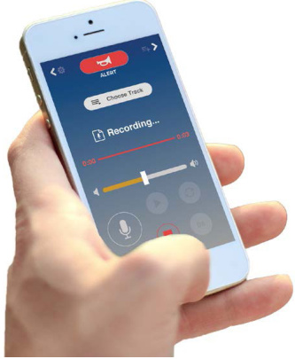

# Portable Loudspeaker System MN-HSPB  

# Overview  

The MN-HSPB is a self-contained, portable loudspeaker system that weighs a mere 15 lbs. Despite its light weight, the MN-HSPB packs a peak acoustic output of 144dBfor an intelligible communication range of more than 2,450 feet (750 m).  

The MN-HSPB penetrates high background noiseenvironments to ensure that unmistakable commands and piercing alert tones are heard. Exceeding traditional megaphones and common loudspeakers, the MN-HSPB brings clear and intelligible messages to the intended recipients with an exceptional STI rating of 0.85 out of 1.0.  

The MN-HSPB is equipped with internal rechargeable batteries and includes a built-in high frequency alert tone that is activated with an easily-accessible on-board pushbutton. Accessories include mounting options, a phone app for remote control capability, and a transit case.  

# Standard Features  

•	 144 dB SPL Peak Acoustic Output   
•	 Long Range: $750+$ m  
•	 Narrow Acoustic Beam: $\pm15$ Degrees   
•	 Frequency Range: 400Hz-7Khz   
Highly Intelligible Voice Output   
•	 STI: 0.85 out of 1.0   
•Built-in High Frequency Alert Tone   
•	 Lightweight Design   
•	 Rugged Composite Construction   
•	 Integrated Record/Play Functionality  

# Application  

•Crowd Control •Search and Rescue •First Responders •Law Enforcement •Campus and Public Safety •Emergency and Event Control •Maritime Communication •Border and Port Protection.  

  

Specifications   

<html><body><table><tr><td>PortableLoudspeaker System</td><td>MN-HSPB-S Standard Output</td><td>MN-HSPB-H High Output</td></tr><tr><td colspan="3">Acoustic</td></tr><tr><td>Sound Pressure Level (peak)</td><td>136dB A-weighted @ 1m</td><td>144dB A-weighted @ 1m</td></tr><tr><td>Usable Range</td><td>400+m</td><td>750+m</td></tr><tr><td>Beam Width</td><td colspan="2">±15 degrees</td></tr><tr><td>Frequency Range</td><td colspan="2">400Hz-7kHz</td></tr><tr><td>STI (at range)</td><td colspan="2">0.85</td></tr><tr><td colspan="3">Power Requirements</td></tr><tr><td>Power</td><td colspan="2">Internal rechargeable battery pack</td></tr><tr><td>Battery Life</td><td>15 hours @ duty cycle</td><td>8 hours @ duty cycle</td></tr><tr><td>Battery Charge Time</td><td colspan="2">4.5 hours</td></tr><tr><td colspan="3">Physical Specifications</td></tr><tr><td>Dimensions</td><td colspan="2">13.5 in H× 12.5 in Lx 10.0 in W (34.3 cm Hx31.8cmLx25.4 cm W)</td></tr><tr><td>Weight</td><td>12lbs</td><td>15lbs</td></tr><tr><td>Housing Material</td><td colspan="2">Flame retardant UV stable composite</td></tr><tr><td>Color</td><td colspan="2">Black</td></tr><tr><td colspan="3"></td></tr><tr><td>Environmental Ingress Protection</td><td colspan="2">IP65,NEMA3R</td></tr><tr><td>Operating Temperature</td><td colspan="2">-20 to 60°C(-4 to 140 °F)</td></tr><tr><td></td><td colspan="2"></td></tr><tr><td>Humidity Range</td><td colspan="2">0-75% non-condensing</td></tr></table></body></html>  

# Ordering Information  

<html><body><table><tr><td>MN-HSPB-S HSHandHeldPortablespeaker</td></tr><tr><td>MN-HSPB-H HS Hand Held Port speaker HO (high output)</td></tr></table></body></html>  

Accessories   

<html><body><table><tr><td></td><td></td></tr><tr><td>MN-HSPMIC-S</td><td>ModelSMicrophone(replacement)</td></tr><tr><td>MN-HSPMIC-H</td><td>ModelH Microphone(replacement)</td></tr><tr><td>MN-HSPMICHS</td><td>WiredBoom(Headset)Microphone</td></tr><tr><td>MN-HSPSS</td><td>ShoulderStrap(ComeswithModelH.UseifyouwanttoaddtoModelS.)</td></tr><tr><td>MN-HSPWALL</td><td>WallCharger</td></tr><tr><td>MN-HSPLIC</td><td>ReplacementLineInCable</td></tr><tr><td>MN-HSPACCBAG</td><td>AccessoryBag(ComeswithModelH.UseifyouwanttoaddtoModelS.)</td></tr><tr><td>MN-HSPCHARGEKIT</td><td>s</td></tr><tr><td>MN-HSPMP3</td><td>MP3Player</td></tr><tr><td>MN-HSPACCPOUCH</td><td>AccessoryPocket</td></tr><tr><td>MN-HSPSOFTCASE</td><td>SoftCase</td></tr><tr><td>MN-HSPPHTC</td><td>HardTransitCase</td></tr><tr><td>MN-HSPUMMT</td><td>Magneticmountwithtripodadaptor</td></tr><tr><td>MN-HSPTRIPOD</td><td>Tripod for Model Sor H</td></tr></table></body></html>  