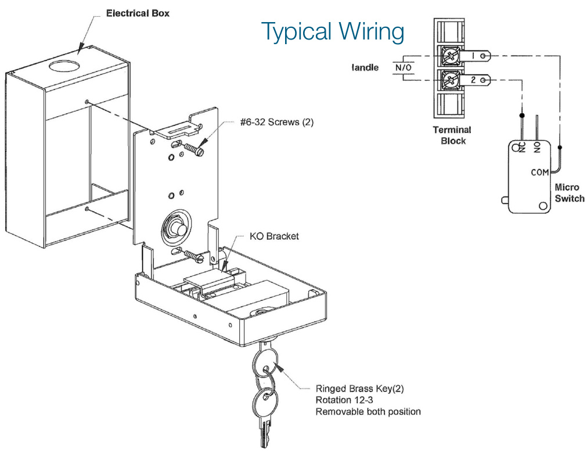

# Key-operated Fire Alarm Station RMS-1T-KO  

# Overview  

The RMS-1T-KO Key-operated Fire Alarm Station is ideal for use in buildings such as penal institutions or special needs housing, or anywhere an ordinary pull station would be operated for reasons other than its intended purpose. The RMS-1T-KO station is fitted with a key-operated switch of which the key is not easily duplicated.  

The RMS-1T-KO has one Single Pole Normally Open contact rated for 10 amps at 125 Vdc. It features terminal connectors for easy field wiring. The key can be removed in both the “ON” and “OFF” positions.  

The RMS-1T-KO Station flush mounts to any standard North American 1-gang electrical box 2-1/2 inch (63mm) deep minimum.  

# Standard Features  

•	 Tamperproof actuation •	 Single-stage operation •	 Single-pole N.O. contact •Terminal connectors •	 One-gang flush mounting  

# Installation  

EDWARDS recommends that these Key-operated Fire Alarm Stations always be installed in accordance with the latest recognized editions of local and national fire alarm codes.  

  

# Specifications  

<html><body><table><tr><td>KeyswitchContacts</td><td>SinglePoleNormallyOpen Rating:10 amp at 125Vdc</td></tr><tr><td>WireConnection</td><td>Terminals</td></tr><tr><td>Mounting</td><td>Flush to: One-gang 2-1/2 inch (63mm) deep standard North-American electricalbox</td></tr><tr><td>Operating Environment</td><td>NormalIndoor</td></tr></table></body></html>  

# Ordering Information  

<html><body><table><tr><td>CatalogNumber</td><td>Description</td><td>ShippingWeight</td></tr><tr><td>RMS-1T-KO</td><td>Key-operated Fire Alarm Station — Normally Open</td><td>0.3 Ib (0.6 Ib)</td></tr></table></body></html>  