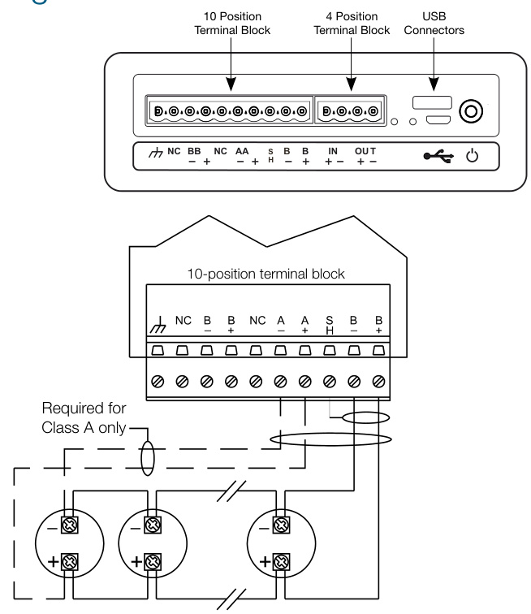
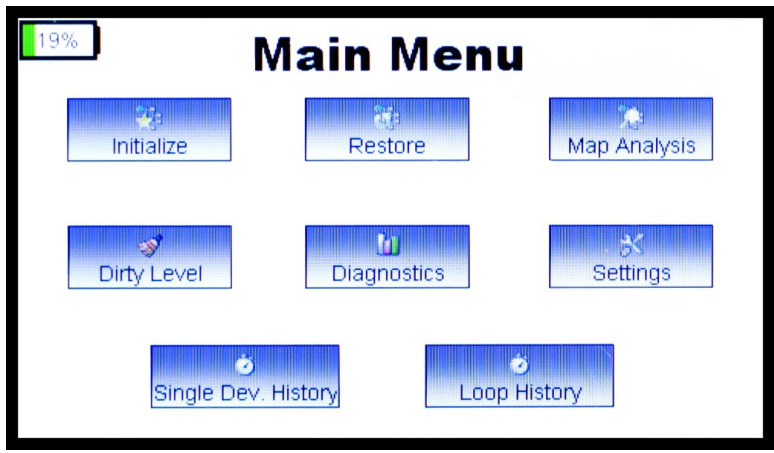
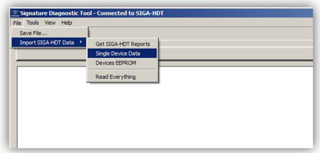

# Signature Series Diagnostic Tool SIGA-HDT  

# Description  

The SIGA-HDT is a compact and easy-to-use diagnostic tool that assists installation and troubleshooting EDWARDS Signature Series device loops and connected devices. The SIGA-HDT is a hand-held unit, and features a touch screen that makes it possible for the operator to manipulate, test, and monitor the Signature loop in the field using live data in real time.  

The SIGA-HDT comes with PC-compatible software that generates detailed reports for archiving or further diagnostic analysis. Data collected and stored on the SIGA-HDT may be downloaded from the unit directly to a laptop or desktop computer by means of a USB cable, or it may also be saved to a USB Flash drive for later use off-site.  

Terminal blocks on top of the unit provide easy connection of field wiring, while USB 2.0 and Micro-B ports provide an interface for data exchange, and power. The SIGA-HDT is powered by a rechargeable lithium-ion battery.  

# Standard Features  

•	 Manipulates, tests, and monitors Signature SLC and connected devices   
•	 Ideal for system verification and troubleshooting   
•	 Compact, easy-to-use for factor   
•	 Bright touch-screen graphical user interface   
•	 Easy-access terminal blocks for field wiring   
•	 Rechargeable lithium-ion battery   
•	 Includes PC software for report generation and data management  

# Application  

The SIGA-HDT is ideal for verifying new projects, troubleshooting existing installations, or testing retrofits. It can be used to initialize the Signature loop before connecting to a control panel, or it can be used for diagnosis and troubleshooting after loop connections are made to the controller.  

In operation, the SIGA-HDT performs the following functions:  

Initializes the loop (i.e. identifies all devices connected to the SLC) •	 Restores the loop •	 Performs Map Analysis on detectors and modules (contact analysis and map consistency) and identifies failed units Performs Dirty Level analysis on photo detectors and identifies detectors that require cleaning •	 Allows the user to program new device address to a detector or module •	 Perform maintenance on a single detector or module •	 Reinitialize the device address of detectors or modules on a loop to zeros •	 Single device diagnostics •	 Loop history, etc.  

For details concerning the capabilities and operation of the SIGAHDT, consult SIGA-HDT Operations user guide, P/N 3102424-EN.  

# Wiring  

  

# Operation  

  

The SIGA-HDT Main Menu displays high level testing and diagnostics options.  

# Initialize  

The initialize loop function enables the device to perform some initial actions such as resetting all devices and opening all isolators. This function uses the device serial number to assign new short addresses, read device address, version numbers, device types, shorts on the SLC, and checks for ground fault on the SLC loop. The initialized data is stored in the “Stored Database Info” page of the display and can be accessed by pressing the Loop History button.  

# Restore  

The Restore loop function closes all isolators and checks all device statuses on the loop.  

# Map Analysis  

The SIGA-HDT provides two methods of investigating a new or existing loop installation. These methods help pinpoint specific devices that are causing map faults or have the potential to cause a future map fault. The map fault analysis function performs the following two diagnostic tests:  

# Map Consistency  

The map consistency function maps each device on the Signature loop three times and compares the responses of all three readings to see if there is a mismatch. If a device is not responding consistently, it is flagged as failed and an investigation is required.  

# Contact Analysis  

The contact analysis function tests the response measured by listening device(s) when the annunciating device is activated. The response is an indirect measurement of the contact resistance and can be used to identify existing mapping issues or devices that have the potential to cause an issue in the future.  

# Dirty Level  

This function is only associated with optical detectors. It enables the user to determine the dirty level of each optical detector on the loop. After the successful execution of this function, the SIGA-HDT erases the old database of Dirty Levels and replaces it with the new Dirty Level data.  

# Diagnostic  

The Diagnostic Menu holds functions that enable a user to run diagnostics on the Signature devices on the connected loop. The functions below can be performed within the diagnostic menu screen.  

# Normalize Photo Function  

This function normalizes (writes the new clean air count into memory). After cleaning the detector using the approved tools or method, the user can connect the detector(s) back to the loop and initiate this function to normalize the photo value.  

# Single Device Function  

The single device function allows a user to diagnose a single device within a loop or outside a loop. The single device function consists of five sub-functions that include: Read EE data, Photo A/D value, Program Device Address, Program Maintenance date, and Trouble Codes.  

# Read EEPROM Function  

The Read EEPROM function is an advanced function that may be requested by technical support or engineering.  

# Reinitialize Function  

This function is useful if the user needs to reset all device addresses on the loop to zero.  

# Program Maintenance Date  

This function is useful when a user performs maintenance on a photo detector and needs to update the maintenance date register on the detector.  

# Trouble Codes  

The Trouble Code function enables the user to understand the trouble condition, the possible cause, and possible solution to resolve the trouble. Trouble Codes are displayed during the Restore Loop execution.  

# Settings  

The Settings screen displays current date and time. The SIGAHDT needs to be connected to the computer software to sync the time and date. The interface and GUI board versions along with the battery status, loop output voltage and current are displayed  

# Single Device History  

The “Single Device History” displays data only when the single device Read EE Data function was performed. The database stores each single device’s Short Address (SA), Operation Hours (OpHrs), Alarm, Last Alarm Bytes, and Alarm Originator. When there is no alarm status, N/A is displayed on the Alarm, Last Alarm Bytes, and Alarm originator respectively.  

# Loop History  

The Loop History function takes the user to the Stored Database Screen; this screen shows the device information stored in the memory of the SIGA-HDT. If no actions (Initialize, map analysis, etc.) have been performed previously, no data is displayed in the database.  

# SIGA-HDT PC Software  

The SIGA-HDT comes with PC-compatible software that may be used for firmware updates as well as importing data from the device for saving to the PC.  

  

The user can import three categories of data:  

# 1.	 Device EEPROM Data  

2.	 SIGA-HDT Report Data: The SIGA-HDT Report contains all the device information, the dirty level for each photo detector on the loop and mapping data.   
3.	 Single Device Data: This function imports the single device history data saved in the SIGA-HDT internal memory to the Signature Diagnostic Tool software.  

For details concerning diagnostic and mapping capabilities of the SIGA-HDT software, consult SIGA-HDT Operations user guide, P/N 3102424-EN.  

# Ordering Information  

SIGA-HDT Signature Handheld Diagnostic Tool The SIGA-HDT ships with the following documentation and accessories:  

USB flash drive (Includes PC software and user guide)   
•USB charging cable (USB 2.0 A-male to Micro-B cable)   
•AC USB charging adapter 10-position terminal connector block   
•4-position terminal connector block   
•SIGA-HDT Installation sheet (P/N 3102422-EN)   
•SIGA-HDT Operations user guide (P/N 3102424-EN) Lithium-ion battery  