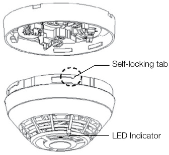
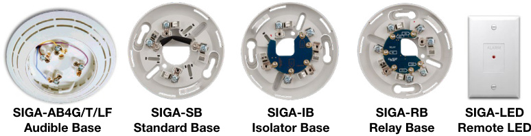
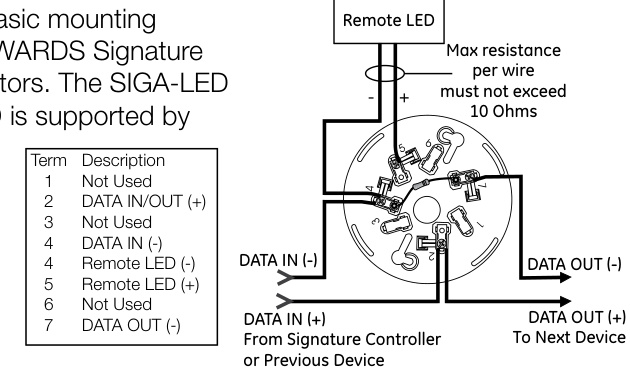
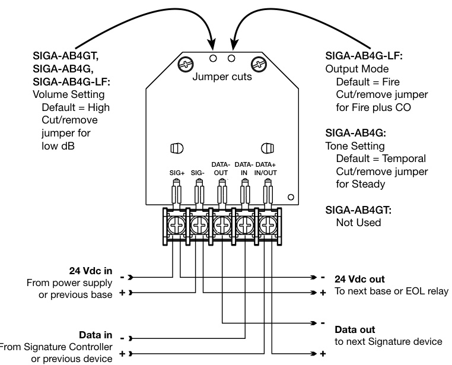
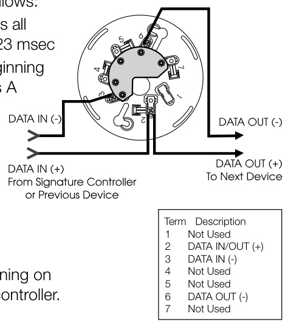
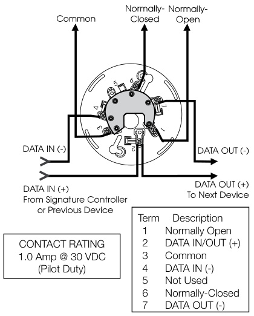
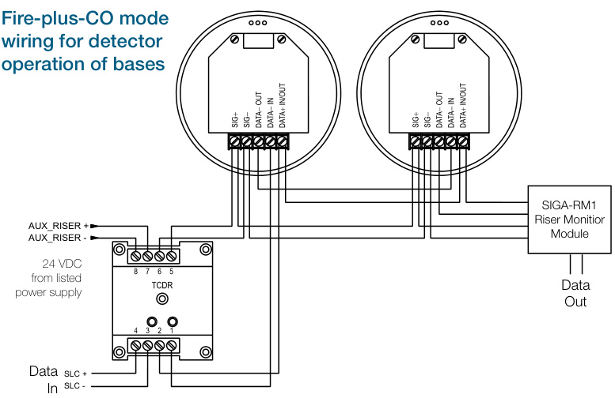
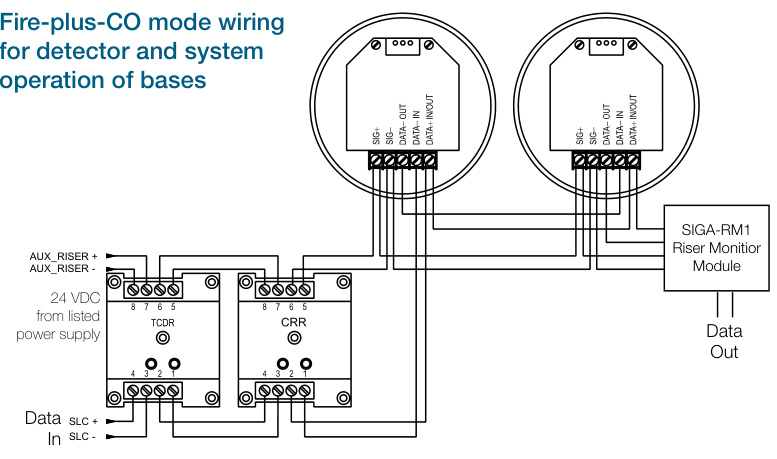
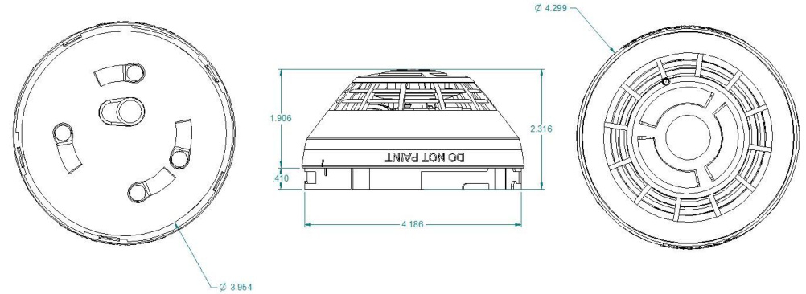

# Intelligent Multisensor Heat and CO Detector SIGA-HCD, SIGA-HCD-CA  

# Overview  

The Signature Series SIGA-HCD detector brings advanced multisensing technology to a practical design that increases efficiency, saves installation time, cuts costs, and extends life safety and property protection capabilities. Continuous self-diagnostics ensures reliability over the long-haul, while environmental compensation helps reduce maintenance costs.  

The SIGA-HCD provides the best of both worlds with multisensor life safety monitoring. Rate-of-rise heat sensing technology provides efficient identification of smoldering fires, as well as fast flaming fires. With the added element of CO monitoring, this detector pulls double duty: continually monitoring the environment for signs of fire — as well as its invisible yet deadly companion, carbon monoxide.  

Like all Signature Series detectors, the SIGA-HCD gathers analog information from its sensing elements and converts this data into digital signals. To make an alarm decision, the detector’s on-board microprocessor measures and analyzes the heat sensor readings and compares this information to historical data. Digital filters remove signal patterns that are not typical of fires, thus virtually eliminating unwanted alarms.  

The detector also analyzes heat sensor independently from the CO sensor to determine whether to initiate a fire alarm, a life safety CO alarm, or both.  

# Standard Features  

Note: Some features described here may not be supported by all control systems. Check your control panel’s Installation and Operation Guide for details.  

•	 Next Generation Detection Technology   
•	 Integrates rate-of-rise heat sensing with carbon monoxide detection   
•	 Sensor Markings Provide Easy Testing Identification   
•	 Uses existing wiring   
•	 Automatic device mapping   
Up To 250 Total Signature Addresses Per Loop   
•	 Automatic environmental compensation   
•	 Non-volatile memory   
•Electronic addressing   
•	 Automatic day/night sensitivity adjustment   
•	 Bicolor (green/red) status LED   
•	 Standard, relay, fault isolator, and audible mounting bases  

# Application  

# Heat detection  

The SIGA-HCD detector provides a 15 °F $(9\,^{\circ}\mathrm{C})$ per minute rate-of-rise heat sensor for the detection of fast-developing fires, as well as a $135^{\circ}\mathsf{F}$ $(57^{\circ}\mathrm{C})$ fixed temperature sensor for slow building-fires. The heat sensors monitor the temperature of the air and determines whether a fire alarm should be initiated.  

# CO Detection  

Monitored CO detection, such as that provided by the SIGA-HCD is becoming mandated with increasing frequency in all types of commercial applications, but particularly in occupancies such as hotels, rooming houses, dormitories, day care facilities, schools, hospitals, assisted living facilities, and nursing homes. Known as the “Silent Killer,” CO is odorless, tasteless, and colorless. It claims nearly 500 lives, and results in more than 15,000 hospital visits annually.  

The SIGA-HCD’s CO sensor monitors the presence of CO particles in the air and determines whether a life safety alarm should be initiated. Alarm levels are reached at 70 ppm when detected for 60 to 240 minutes; 150 ppm for 10 to 50 minutes; and, 400 ppm for 4 to 15 minutes.  

# Installation  

Signature Series detectors mount to North American 1-gang boxes, 3-1/2 inch or 4 inch octagon boxes, and to 4 inch square electrical boxes 1-1/2 inches (38 mm) deep. They mount to European BESA and 1-gang boxes with $60.3\:\mathrm{mm}$ fixing centers. See mounting base installation and wiring for more information.  

  

# Testing & Maintenance  

Scheduled maintenance (regular or selected) for proper detector operation should be planned to meet the requirements of the Authority Having Jurisdiction (AHJ). Refer to current NFPA 72, NFPA 720, and ULC CAN/ULC 536 standards.  

# CO Sensor Life  

The CO sensor has a 10-year life from the date of manufacture or when the control panel indicates a sensor end-of-life condition, whichever comes first. When the sensor reaches its end of life, the detector signals a “COMMON TRBL ACT” condition on the control panel. Pressing the Details button on the control panel displays “END OF LIFE ACT” providing verification that it is an end-of-life trouble of the CO sensor. This trouble remains active until the detector is replaced, even if the panel is reset.  

# Sensing and reporting technology  

The microprocessor in each detector provides additional benefits – Self-diagnostics and History Log, Automatic Device Mapping, and Fast, Stable Communication.  

Self-diagnostics and History Log - Each Signature Series detector constantly runs self-checks to provide important maintenance information. The results of the self-check are automatically updated and permanently stored in the detector’s non-volatile memory.  

Automatic Device Mapping - The loop controller learns where each device’s serial number address is installed relative to other devices on the circuit. The mapping feature provides supervision of each device’s installed location to prevent a detector from being reinstalled (after cleaning etc.) in a different location from where it was originally.  

Fast Stable Communication - On-board intelligence means less information needs to be sent between the detector and the loop controller. Other than regular supervisory polling response, the detector only needs to communicate with the loop controller when it has something new to report.  

# Accessories  

Detector mounting bases have wiring terminals that are accessible from the “room-side” after mounting the base to the electrical box. The bases mount to North American 1-gang boxes and to $3\%$ inch or 4 inch octagon boxes, $1\,\%$ inches $(38\;\mathsf{m m})$ )deep. They also mount to European BESA and 1-gang boxes with $60.3\:\mathrm{mm}$ fixing centers. The SIGA-SB4, SIGA-RB4, and SIGA-IB4 mount to North American 4 inch sq. electrical boxes in addition to the above boxes. They include the SIGA-TS4 Trim Skirt, which is used to cover the “mounting ears” on the base. The SIGA-AB4G mounts to a 4 inch square box only.  

  
Remote LED SIGA-LED - The remote LED connects to the SIGA-SB or SIGA-SB4 Standard Base only. It features a North American size 1-gang plastic faceplate with a white finish and red alarm LED.  

SIGA-TS4 Trim Skirt - Supplied with 4 inch bases, it can also be ordered separately to use with the other bases to help hide surface imperfections not covered by the smaller bases.  

Sounder Bases - Signature Series sounder bases are designed for use where localized or group alarm signaling is required.  

•	 SIGA-AB4GT bases provide sounder capability to the SIGA-HCD when used with a SIGA-TCDR Temporal Pattern Generator to separate CO (TC4) and Fire (TC3) tone patterns. •	 SIGA-AB4G-LF bases provide 520 Hz low frequency sounder capability to the SIGA-HCD when used with a SIGA-TCDR Temporal Pattern Generator to separate CO (TC4) and Fire (TC3) tone patterns. The SIGA-AB4G-LF is suitable for applications requiring low frequency audible tones.  

# Warnings & Cautions  

•	This product is intended for use in indoor locations of dwelling units. It is not designed to comply with Occupational Safety and Health Administration (OSHA) commercial or industrial standards. •	The detector indicates the presence of CO gas at the detector. Carbon monoxide gas may be present in other areas. •	Failure to properly install, test, and maintain a CO detector may cause it to fail, potentially resulting in loss of life. •	This detector does not operate without electrical power. As fires frequently cause power interruption, discuss further safeguards with the authority having jurisdiction (AHJ).  

# Typical Wiring  

The detector mounting bases accept #18 AWG $(0.75\mathsf{m m}^{2})$ ,#16 $(1.0\mathsf{m m}^{2})$ , #14 AWG $(1.5\mathsf{m m}^{2})$ , and #12 AWG (2.5mm²) wire sizes. Sizes #16 AWG $(1.0\mathsf{m m}^{2})$ and #18 AWG $(0.75\mathsf{m m}^{2})$ are preferred for ease of installation.  

This is the basic mounting base for EDWARDS Signature  

  
Standard Detector Base, SIGA-SB, SIGA-SB4  

# Isolator Detector Base, SIGA-IB, SIGA-IB4  

This base includes a built-in line fault isolator for use on Class A circuits. A detector must be installed for it to operate. The isolator base does not support the SIGA-LED Remote LED.  

The isolator operates as follows:   
- 	a short on the line causes all isolators to open within 23 msec - 	at 10 msec intervals,beginning on one side of the Class A circuit nearest the loop controller, the isolators close to provide the next isolator down the line with power - 	when the isolator next to the short closes, it reopens within 10 msec.  

# Audible Sounder Bases, Fire Mode  

AB4GT, AB4G, AB4G-LF sounder bases  

  

  

# Relay Detector Base, SIGA-RB, SIGA-RB4  

This base includes a relay. Normally Open or Normally Closed operation is selected during installation. The dry contact is rated for 1 amp (pilot duty) $@$ 30 Vdc. The relay’s position is supervised to avoid accidentally jarring it out of position. The SIGA-RB can be operated as a control relay if programmed to do so at the control panel. The relay base does not support the SIGA-LED Remote LED.  

  

# Audible Sounder Bases, Fire-plus-CO Mode  

AB4GT and AB4G-LF sounder bases only.  

These configurations require a SIGA-TCDR Temporal Pattern Generator to separate CO (TC4) and Fire (TC3) tone patterns.  

  

  

# Dimensions  

  

# Specifications  

<html><body><table><tr><td>Operating voltage</td><td>15.20 to19.95VDC</td></tr><tr><td>Normal operating current</td><td>51 μA</td></tr><tr><td>Alarmcurrent</td><td>68 μA</td></tr><tr><td>Rate-of-rise rating</td><td>15°F/min (9°C/min)</td></tr><tr><td>Fixedtemperaturerating</td><td>135°F (57.2°C). Actual alarm point 129 to 141°F (53.9 to 60.6°C)</td></tr><tr><td>Vibrationlevel</td><td>10 to 35 Hz,with an amplitude of 0.01 in.</td></tr><tr><td>Spacing,heatdetectors</td><td>Max. 50 ft. (15.2 m) centers</td></tr><tr><td>Factory Mutual rating</td><td>Fixed -Special,Fixed/ROR-Ultra-fast</td></tr><tr><td>Compatibledetectortesters</td><td>Testifire2000</td></tr><tr><td>Operating environment</td><td>32 to 100°F (0 to 38°C), 0 to 90% RH, noncondensing</td></tr><tr><td>Construction</td><td>High Impact Engineering Polymer, White</td></tr><tr><td>Storagetemperature</td><td>-4 to 140°F(-20 to60°C)</td></tr><tr><td>Environmental compensation</td><td>Automatic</td></tr><tr><td>UL CO alarm level per UL 2034, CAN/CSA 6.19</td><td>70 ppm 60 to 240 minutes; 150 ppm 10 to 50 minutes; 400 ppm 4 to 15 minutes</td></tr><tr><td>ULCOfalsealarmlevel per UL 2034, CAN/CSA 6.19</td><td>30 ppm 30 days 70 ppm 60 minutes</td></tr><tr><td>Agency Listings, SIGA-COD, SIGA-HCD, SIGA-HCD-CA</td><td>UL521,UL2075andULC-s530 Evaluated to the CO alarm sensitivity limits of UL 2034. CSFM,FMapproved.</td></tr></table></body></html>  

# Ordering Information  

<html><body><table><tr><td>Catalog Number</td><td>Ship Wt. Description Ibs (kg)</td></tr><tr><td>SIGA-HCD</td><td>MultisensorHeat,andCODetector 0.4 (0.16)</td></tr><tr><td>SIGA-HCD-CA</td><td>MultisensorHeat,andCODetector,CanadianMarket 0.4 (0.16)</td></tr></table></body></html>  

<html><body><table><tr><td colspan="2">CompatibleBases</td></tr><tr><td>SIGA-SB</td><td>DetectorMountingBase-Standard</td><td rowspan="5">0.2 (.09)</td></tr><tr><td>SIGA-SB4</td><td>4-inchDetectorMountingBasec/wTrimSkirt</td></tr><tr><td>SIGA-RB</td><td>DetectorMountingBasew/Relay</td></tr><tr><td>SIGA-RB4</td><td>4-inch Detector Mounting Base w/Relay, c/w Trim Skirt</td></tr><tr><td>SIGA-IB</td><td>DetectorMountingBasew/FaultIsolator</td></tr><tr><td>SIGA-IB4</td><td>4-inch Detector Mounting Base w/ Fault Isolator, c/w Trim Skirt</td><td rowspan="3">0.3 (0.15)</td></tr><tr><td>SIGA-LED</td><td>RemoteAlarmLED(notforEN54applications)</td></tr><tr><td>SIGA-AB4G-LF</td><td>Low Frequency Audible (Sounder) Base for CO and Fire Detectors</td></tr><tr><td>SIGA-AB4GT</td><td>Audible(Sounder)BaseforCOandFireDetectors</td><td></td></tr><tr><td>SIGA-LED</td><td>RemoteAlarmLED (notfor EN54applications)</td><td></td></tr><tr><td>SIGA-TCDR</td><td>ToneGeneratorforDetectorSounderBaseswithCOmode</td><td>0.2 (0.1)</td></tr><tr><td>SIGA-TS4</td><td>Trim Skirt (supplied with 4-inch bases)</td><td>0.1 (.04)</td></tr><tr><td>SIGA-RTA</td><td>DetectorRemovalTool</td><td></td></tr><tr><td>SIGA-VA</td><td>DetectorCleaningTool</td><td></td></tr></table></body></html>  