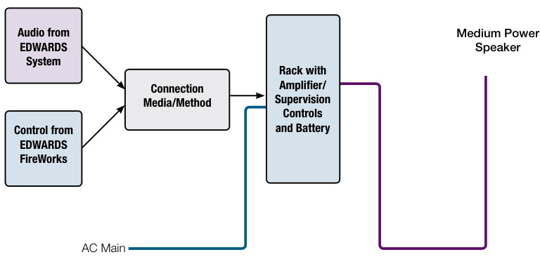
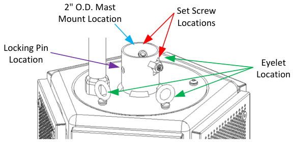
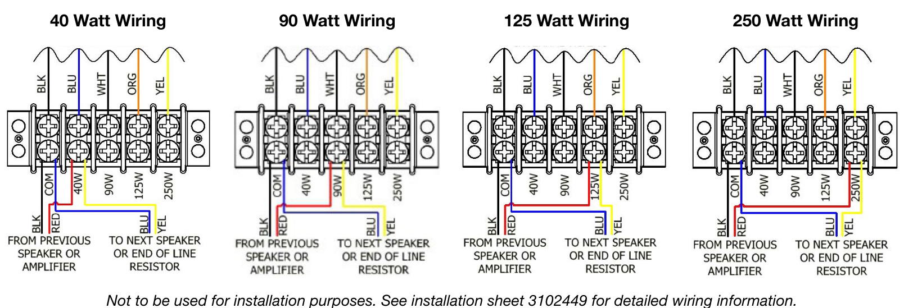
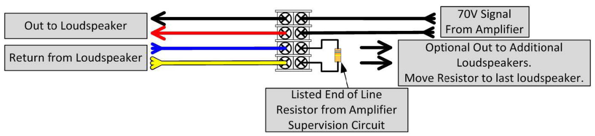
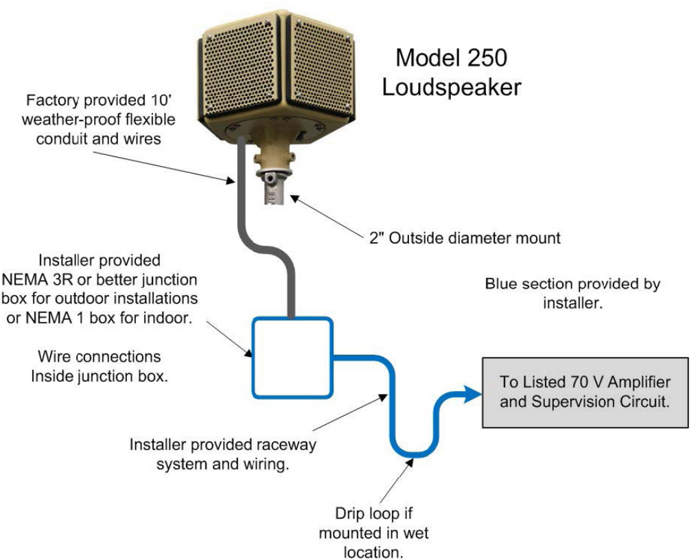

# UL Listed 250W Medium Power Speaker Arrays Hyperspike® Series  

# Overview  

EDWARDS brand Model 250 Hyperspike Series UL Listed Medium Power loudspeakers employ HyperSpike® technology to deliver lightweight and acoustically sophisticated solutions for large indoor and smaller outdoor mass notification installations.  

These rugged units are among the industry’s smallest in physical size, yet they reproduce some of the clearest and loudest audio signals available for this range of service.  

These UL Listed units are omni-directional loudspeakers that produce 360 degrees of acoustic energy. The high fidelity output remains intelligible over up to a quarter mile from the device. It is rated for indoor or outdoor use.  

The unique design of Hyperspike Series Medium Power loudspeakers allow for a 100 percent up-time duty cycle. When powered from an AC source, they can be powered and ready to perform 24/7. This makes them ideally suited for daily activation, as well as emergency use.  

Hyperspike Series UL Listed Medium Power loudspeakers can be permanently installed, or configured for portable use. They can be powered from a local audio power amplifier for paging applications, as well as from EDWARDS fire alarm systems for fully integrated UL Listed applications.  

# Standard Features  

•	 113 dB SPL Peak Acoustic Output   
•1/4 Mile Radius Communication Range   
•Wide Frequency Range: 175 Hz - 8 Khz   
•250 W Peak Power Highly intelligible audio performance   
•24/7/365 duty cycle Easy, flexible installation Lightweight, rugged design UL/ULC and CSFM listed Four power taps 40W, 90W, 125W, 250W  

# Typical Deployment  

  
UL250 speaker requires supervision to comply with listing requirements.  

# Application  

For optimal performance and safety when installing in permanent locations, Hyperspike Series Medium Power Loudspeakers should be mounted above personnel: typical 20 feet (6.1 m) above floor level. For portable or vehicle-mounted applications the loudspeaker head should be at least 15 feet $(4.57\;\mathrm{m})$ above grade and away from people when active. For all installations, it is crucial to have clear, open space around the speaker head. Loudspeaker output is best via line-of-sight.  

Typical applications for MN-HSMx25P5N loudspeakers are:  

Large indoor open areas Factories Production facilities Industrial complexes Refineries Power plants Schools Parking lots Military bases Force protection Ships Piers Docks Camp Grounds  

# Installation and Mounting  

All models can be mounted indoors or outdoors. Mounting options include mast mount or use of safety cable.  

Standard 2 inch outer diameter mast mount for use on top of pole or suspended from overhead pole or three eyelets provided for safety cable use for suspended installation as well. Refer to installation manual for details.  

  
A 10 ft., nominal $3/4$ -inch plastic flexible conduit with four 14 AWG electrical leads is preinstalled through the mounting plate of the Model 250. The connection at the end of the 10 foot flexible conduit requires an installer supplied junction box with a rating suitable for the installation environment of the box. Installation of a 4-position terminal block is recommended, but wire nuts may also be used. Installation must be compliant with UL1480, section 4.3.b.i) or ii).  

# Internal Wiring  

  

# Example Wiring Terminations in Installer-supplied Junction Box  

  

  

# Specifications  

The UL Listed Model 250 has four field selectable power taps that run off of a 70VRMS audio system. The taps can easily be changed among the 40W, 90W, 125W and 250W power ratings. The speaker has an integrated blocking capacitor that allows the fire alarm control panel to conduct circuit supervision. Each speaker meets UL Standard 1480 (Speakers for Fire Protective Signaling Systems) and ULC S541 (Speakers for Fire Alarm Systems)  

<html><body><table><tr><td>AcousticSpecifications</td><td>(Reverberation)</td><td></td></tr><tr><td>70V Tap setting</td><td>Sound Pressure Level @ 1oft (dBA)</td><td>Sound Pressure Level @ 1oft (dBA)</td></tr><tr><td>40W</td><td>103</td><td>105</td></tr><tr><td>90W</td><td>106</td><td>108</td></tr><tr><td>125W</td><td>108</td><td>110</td></tr><tr><td>250W</td><td>111</td><td>113</td></tr><tr><td colspan="3">Directionality: SPL does not change with direction</td></tr><tr><td colspan="3"> Power Requirements</td></tr><tr><td>Power Adjustable Tap Setting</td><td colspan="2"></td></tr><tr><td>Input Voltage 70VRMS</td><td colspan="2"></td></tr><tr><td colspan="3"></td></tr><tr><td>Physical Specifications</td><td colspan="2"></td></tr><tr><td>Dimensions - Emitter</td><td colspan="2">12.4" Dia. x 8.0" H (31.5cm Dia x 20.3cm H)</td></tr><tr><td>Weight-Emitter</td><td colspan="2">20lbs (9.1kg)</td></tr><tr><td>Housing Material</td><td colspan="2">Composite</td></tr><tr><td>Housing Color</td><td colspan="2">Gray/Tan/Red</td></tr><tr><td colspan="3"></td></tr><tr><td>Environmental</td><td colspan="2"></td></tr><tr><td>Operating Temperature Range</td><td colspan="2">-4 °F - 140F(-20°C to 60°C)</td></tr><tr><td>Operating Humidity Range</td><td colspan="2">0-95% Non-Condensing</td></tr><tr><td>Ingress Protection</td><td colspan="2">NEMA3R</td></tr><tr><td>Certification</td><td colspan="2"></td></tr><tr><td>UL 1480</td><td></td><td></td></tr><tr><td>ULC S541</td><td>Fire Alarm,Emergency,& Commerical Use</td><td></td></tr><tr><td></td><td>Fire Alarm & Equipment</td><td></td></tr><tr><td>CSFM</td><td>CaliforniaStateFireMarshal Listed</td><td></td></tr></table></body></html>  

# Ordering Information  

Medium Power Speaker Arrays   
Extended Warranties   

<html><body><table><tr><td>MN-HSMT25P5N</td><td>Tan</td><td>HyperspikeSeriesMediumPower Omni-directional loudspeaker</td></tr><tr><td>MN-HSMG25P5N</td><td>Gray</td><td>assembly.Fourwattage taps:40W,90w,125W,and250W. Meets UL Standard 1480(Speakers for FireProtectiveSignaling</td></tr><tr><td>MN-HSMR25P5N</td><td>Red</td><td>Systems)andULCS541 (SpeakersforFireAlarmSystems).</td></tr></table></body></html>  

MN- Hyperspike Series 650 and 250 Class extended warranty - 2 years total.   
HSMP650EXWARR2 Must be ordered when MPSA is ordered.  

Accessories, spare parts   

<html><body><table><tr><td>MN-AUDSOF1</td><td>HyperspikeSeriesaudiooptimizationsoftwarepackage</td></tr><tr><td>MN-HSLPMK1</td><td>Hyperspike Series Emitter (loudspeaker) pole-mount kit. Bolts to steel or</td></tr><tr><td>MN-HSPM16</td><td>wooden pole. Additional support and guy wires may be necessary. Hyperspike Series portable tripod mast. Extends up to 16'</td></tr><tr><td>MN-HSPM33</td><td>Hyperspike Series Portable mast & guy wire unit.Extends up to a maximum33'(10M)</td></tr><tr><td>MN-HSTEP1</td><td></td></tr><tr><td>MN-HSTPMS1</td><td>Nottobeusedwith3200wattor6400wattsystems. HyperspikeSeriesEmitter(loudspeaker)tripod mounting system.10 tripodwith14'mast.Additionalsupportandguywiresmaybenecessary</td></tr><tr><td>MN-HSWB1</td><td>ECCcannotbemountedtothisunit. HyperspikeSeriesEmitterhead (loudspeaker)wall-mountbracket& installationkit</td></tr></table></body></html>  

# Third-party Compatibility  

The EDWARDS UL250 Speaker has been thoroughly tested with Edward amplifiers. Third-party amplifiers with 70V output may be used, but compatibility has not been investigated with any amplifiers supplied by manufacturers other than EDWARDS.  

EDWARDS recommends de-rating the third-party amplifiers by at least 25 percent in order to have confidence that the system will function as intended. Thorough and complete testing of third-party amplifiers with this speaker is recommended before placing the system into service.  

The table below shows the four available wattage taps and the minimum recommended third-party amplifier power to drive the speaker at those wattages.  

<html><body><table><tr><td>MN-HSMSeries wattagetap</td><td>Recommended minimumthird-party amplifierpowerrating</td></tr><tr><td>40</td><td>55</td></tr><tr><td>06</td><td>120</td></tr><tr><td>125</td><td>170</td></tr><tr><td>250</td><td>350</td></tr></table></body></html>  