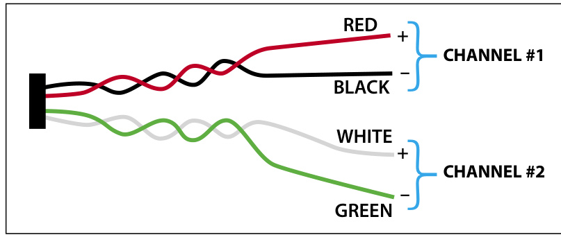

# UL1480 HyperSpike LineWave Loudspeaker  

HyperSpike Series  

# Overview  

Designed with the latest technology in line array speaker systems, the EDWARDS HyperSpike® LineWave loudspeaker is optimized to produce clear and authoritative voice commands and powerful tones never before possible within reverberant environments. The beam forming capability of the LineWave loudspeaker allows even coverage across the listening plane while focusing the acoustic pattern away from surfaces that cause unwanted reflections. This technology is essential for achieving optimum levels of speech intelligibility within reverberant spaces. The result is clear and intelligible direct sound that ensures critical messages are heard and understood.  

While line arrays have been around 1877, this is the first availability of line wave speakers to Life Safety and Emergency Communication applications.  

- The standard output drop for a speaker is 6 dB for every distance doubling. With line wave, the drop will be less and can approach 3 dB for every distance doubling with the larger units in normal ceiling heights like most rooms and hallways. This provides a much more consistent acoustic level throughout the acoustically defined space.  

- An added benefit of the first point is that line source requires lower output power to achieve the same dB level at typical target audience distances and throughout the coverage area.  

- In vertical orientation, there is less output to the top and bottom which will improve intelligibility due to limited reflections from the floor and ceiling.  

- Multiple drivers allow for less driver displacement over single drivers to achieve the same acoustic output. This reduces the distortion from the drivers and prevents the “overdriven” sound that some loudspeakers produce at maximum output.  

# Standard Features  

•	 Industry Leading Voice Intelligibility for Reverberant Spaces   
•	 123dB Max SPL $@$ 1 Meter   
•	 Rated for Indoor or Outdoor Applications   
•	 Universal Mounting Interface 25V, 70V, & 100V or 4/8/16Ω Configurable   
•	 Durable Environmental Resistant Construction   
•	 Available in Black, Red, White, Gray   
•	 STI: Excellent Intelligibility Up To 0.93 STI   
•	 SJOOW service cable provided (see description on page 4)   
•	 Agency listings UL1480, ULC-S541 and CSFM   
•	 UL 1480 listing requires the supervised use of the appropriate constant voltage transformer. The direct drive application of the LineWave loudspeakers cannot be supervised and will not meet the UL1480 requirements.  

Note: Edwards equipment only supports 25 and 70V. Note: Only 25, 70 or 100 V are UL 1480 listed for fire   

<html><body><table><tr><td>Model</td><td>Input Voltage (M)</td><td>Tap Color</td><td>Power Draw (W)</td><td>SPL (Max @ 1m)</td><td>*dB SPL Reverb (@ 10ft)</td><td>*dB SPL Anechoic (@ 3m)</td></tr><tr><td rowspan="12">LineWave: 90243A-801-L Transformer: 72575B-801-L</td><td>25</td><td>Blue</td><td>0.5</td><td>86</td><td>72.4</td><td>78.2</td></tr><tr><td>25</td><td>Orange</td><td>1.3</td><td>91</td><td>77.1</td><td>82.2</td></tr><tr><td>25</td><td>Red</td><td>1.6</td><td>92</td><td>78.2</td><td>83.8</td></tr><tr><td>25</td><td>Brown</td><td>2.7</td><td>94</td><td>79.9</td><td>85.3</td></tr><tr><td>70</td><td>Blue</td><td>3.0</td><td>95</td><td>80.8</td><td>86.3</td></tr><tr><td>70</td><td>Orange</td><td>8.3</td><td>100</td><td>84.9</td><td>90.7</td></tr><tr><td>70</td><td>Red</td><td>10.7</td><td>101</td><td>85.9</td><td>91.9</td></tr><tr><td>70</td><td>Brown</td><td>15.3</td><td>103</td><td>87.2</td><td>92.7</td></tr><tr><td>100</td><td>Blue</td><td>5.7</td><td>98</td><td>83.5</td><td>89.1</td></tr><tr><td>100</td><td>Orange</td><td>15.3</td><td>103</td><td>87.1</td><td>92.9</td></tr><tr><td>100</td><td>Red</td><td>19.5</td><td>104</td><td>88.0</td><td>93.8</td></tr><tr><td rowspan="7">LineWave: 90243A-802-L Transformer:</td><td>25</td><td>Blue</td><td>0.8</td><td>92</td><td>75.8</td><td>81.9</td></tr><tr><td>25</td><td>Orange</td><td>2.2</td><td>97</td><td>80.5</td><td>86.6</td></tr><tr><td>25</td><td>Red</td><td>2.8</td><td>98</td><td>81.6</td><td>87.8</td></tr><tr><td>25</td><td>Brown</td><td>4.1</td><td>100</td><td>83.2</td><td>89.4</td></tr><tr><td>70</td><td>Blue</td><td>5.3</td><td>101</td><td>84.4</td><td>91.2</td></tr><tr><td>70</td><td>Orange</td><td>14.9</td><td>106</td><td>88.6</td><td>94.6</td></tr><tr><td>70</td><td>Red</td><td>19.3</td><td>107</td><td>89.5</td><td>95.6</td></tr><tr><td rowspan="6">72575B-801-L</td><td>70</td><td>Brown</td><td>27.4</td><td>109</td><td>90.7</td><td>96.9</td></tr><tr><td>100</td><td>Blue</td><td>10.3</td><td>104</td><td>87.1</td><td>92.9</td></tr><tr><td>100</td><td>Orange</td><td>27.8</td><td>109</td><td>90.9</td><td>96.9</td></tr><tr><td>25</td><td>Blue</td><td>1.7</td><td>101</td><td>79.9</td><td>87.8</td></tr><tr><td>25</td><td>White</td><td>3.3</td><td>103</td><td>82.9</td><td>91.0</td></tr><tr><td>25</td><td>Orange</td><td>6.6</td><td>105</td><td>85.9</td><td>94.3</td></tr><tr><td rowspan="8">LineWave: 90243A-803-L Transformer: 72542B-801-L</td><td>25</td><td>Yellow</td><td>12.7</td><td>108</td><td>88.5</td><td>96.6</td></tr><tr><td>70</td><td>Blue</td><td>12.4</td><td>110</td><td>88.5</td><td>96.6</td></tr><tr><td>70</td><td>White</td><td>23.9</td><td>112</td><td>91.2</td><td>99.5</td></tr><tr><td>70</td><td>Orange</td><td>46.2</td><td>114</td><td>93.8</td><td>102.0</td></tr><tr><td>70</td><td>Yellow</td><td>81.6</td><td>117</td><td>95.8</td><td>104.0</td></tr><tr><td>100</td><td>Blue</td><td>23.8</td><td>113</td><td>91.2</td><td>99.0</td></tr><tr><td>100</td><td>White</td><td>44.6</td><td>115</td><td>93.6</td><td>101.0</td></tr><tr><td>100</td><td>Orange</td><td>83.3</td><td>117</td><td>96.0</td><td>104.0</td></tr><tr><td rowspan="10">LineWave: 90243A-804-L Transformer: 72542B-802-L</td><td>25</td><td>Blue</td><td>3.2</td><td>106</td><td>83.3</td><td>92.1</td></tr><tr><td>25</td><td>White</td><td>6.3</td><td>109</td><td>86.3</td><td>95.1</td></tr><tr><td>25</td><td>Orange</td><td>12.9</td><td>111</td><td>89.3</td><td>97.4</td></tr><tr><td>25</td><td>Yellow</td><td>24.3</td><td>114</td><td>91.7</td><td>100.0</td></tr><tr><td>70</td><td>Blue</td><td>24.3</td><td>115</td><td>91.8</td><td>101.0</td></tr><tr><td>70</td><td>White</td><td>46.6</td><td>118</td><td>94.4</td><td>103.0</td></tr><tr><td>70</td><td>Orange</td><td>90.6</td><td>120</td><td>96.8</td><td>105.0</td></tr><tr><td>70</td><td>Yellow</td><td>159.3</td><td>123</td><td>98.4</td><td>106.0</td></tr><tr><td>100</td><td>Blue</td><td>47.8</td><td>118</td><td>94.5</td><td>103.0</td></tr><tr><td>100 100</td><td>White Orange</td><td>89.1 165.8</td><td>121 123</td><td>96.8 98.7</td><td>105.0 107.0</td></tr></table></body></html>

\*UL Standard SPL Measurement  

# Sound Dispersion Patterns  

Polar Plots and Beam Width  

  
90243A-804 Horizontal Polars  

90243A-804 Vertical Polars  

  

  
90243A-804 Horizontal Beam Width  

  
90243A-804 Vertical Beam Width  

# Wiring Reference  

  
90243A-801-L, 90243A-802-L and 90243A-803-L  

LineWave models 90243A-801-L, 90243-802-L, and 90243A-803-L (16Ω, 8Ω, and 4Ω respectively) provide a six foot SJOOW-18/2 cable for amplifier interconnection.  

  
90243A-804-L  

LineWave model 90243A-804-L provides a six foot SJOOW-18/4 cable wired as two 4Ω channels for amplifier interconnection  

SJOOW stands for:  

$\mathsf{S}\mathsf{J}=$ hard service cable rated for 300V $\mathrm{OO}=\mathrm{O}||$ Resistant both inside insulation and outside jacket. $\mathsf{W}=\mathsf{C S A}$ designation for weather/water resistance.  

18/4 or $18/2$ is the wire gauge and number of conductors.  

SJOOW cable is a thermoset cable, it entails a very heavy-duty rubber jacket around the copper wires inside. Thermoset means that it does not get soft or melt at high temperatures.  

# Mounting Reference  

All LineWave models include hardware to facilitate Wall Mounting. If it is desired to mount a LineWave to a pole, HyperSpike Pole Mount 72581B-801 is available. All mounts allow for Pan and Tilt angle adjustment after installation.  

  

# Specifications  

# Architect and Engineer Specifications:  

Voice paging and tone signaling loudspeaker shall be EDWARDS Part Numbers Unit shall be UL 1480 Listed, weather resistant and constructed of powder coated aluminum and steel. The loudspeaker shall be able to operate within any ambient temperature environment ranging from -$\cdot20^{\circ}\mathrm{C}$ to $60^{\circ}\mathrm{C}$ (- $-4^{\circ}\mathsf{F}$ to $140^{\circ}\mathsf{F})$ . The speaker shall have a sensitivity of when measured at 1m $(\mathsf{A V G}\,250{-}15,000\mathsf{H}z)$ , and a horizontal beam width of $187^{\circ}$ (AVG 1kHz to 4kHz). The transducer coils shall have a nominal    8 ohm impedance. When applicable, a minimum of four transformer power settings shall be selectable for each speaker, and it shall operate on 25V, 70V, or 100V distributed audio systems. Transformers shall contain an in-line capacitor to allow DC supervision of wiring. Frequency response shall be 250Hz-15kHz. Dimensions shall be $"H\times4.9"W\times2.9"D$ ( ____ $.\mathsf{c m}\times12.47\mathsf{c m}\times7.37\mathsf{c m})$ .  

Transformer Specifications   

<html><body><table><tr><td>System</td><td>72575B-801-L</td><td>72542B-801-L</td><td>72542B-802-L</td></tr><tr><td>Type</td><td></td><td>Optional Transformer</td><td></td></tr><tr><td>OperationMode</td><td colspan="3">25 /70/100WattTapSettings</td></tr><tr><td>LineWaveCompatibility</td><td>90243A-801-L</td><td>90243A-803-L</td><td>90243A-804-L</td></tr><tr><td>MaximumPowerDraw</td><td>90243A-802-L 30W</td><td>85W</td><td>170W</td></tr><tr><td>MaximumSupervisoryVoltage:</td><td colspan="3">32VDC</td></tr><tr><td>EnclosureMaterial</td><td colspan="3">Plastic</td></tr><tr><td>IngressProtection</td><td colspan="3">Indoor/Outdoor</td></tr><tr><td>ProductDimensions</td><td>5.9x5.9x3.9</td><td>9.8x5.9x3.9</td><td>9.8x5.9x3.9</td></tr><tr><td>HxWxD (in) Net Weight</td><td>(15.0cm ×15.0cm x10cm) 3lbs (1.36kg)</td><td>(24.9cmx15.0cm×10cm) 4.5lbs (2.04kg)</td><td>(24.9cmx15.0cmx10cm) 6.5lbs (2.95kg)</td></tr></table></body></html>  

  

72542B-801-L   
72542B-802-L  

  

72575B-801-L  

<html><body><table><tr><td>System</td><td>90243A-801-L</td><td>90243A-802-L</td><td>90243A-803-L</td><td>90243A-804-L</td></tr><tr><td>Type</td><td></td><td>Full Range, Column Loudspeaker</td><td></td><td></td></tr><tr><td>Operation Mode</td><td colspan="4">16/8/4Q Loudspeaker with Optional Line Matching Transformer</td></tr><tr><td>Number of Speakers in Array</td><td>2</td><td>4</td><td>8</td><td>16</td></tr><tr><td>Maximum Power Draw:</td><td>20W</td><td>40W</td><td>80W</td><td>160W</td></tr><tr><td>16Ω, 8Q, and 4Q Models Max SPL @ 1m, 18V Direct Drive</td><td>105dB</td><td>111dB</td><td>117dB</td><td>123dB</td></tr><tr><td>Peak SPL @ 1m</td><td>113dB</td><td>119dB</td><td>125dB</td><td>131dB</td></tr><tr><td>Usable Range @ 80dB,</td><td>17m (56ft)</td><td>35m (115ft)</td><td>70m (230ft)</td><td>141m (463ft)</td></tr><tr><td>A-Weighted *Reverb SPL @ 10 ft,</td><td>87.8</td><td>91.7</td><td>94.3</td><td>95.7</td></tr><tr><td>18V Direct Drive *Anechoic SPL @ 3m,</td><td>93.4</td><td>98.0</td><td>103.0</td><td>104.0</td></tr><tr><td>18V Direct Drive Input Sensitivity (2.83Vrms/1m)</td><td>85dB</td><td>91dB</td><td>97dB</td><td>103dB</td></tr><tr><td>Nominal Impedance</td><td>16Q</td><td>80</td><td>4Ω</td><td>4Ω,2 Channel</td></tr><tr><td>Vertical Coverage -9dB (Avg.</td><td>99°</td><td>45°</td><td>21°</td><td>10°</td></tr><tr><td>1kHz-4kHz) Frequency Response (+/- 6dB)</td><td colspan="4">250Hz-15kHz</td></tr><tr><td>Required Input Signal Processing</td><td colspan="4">High Pass at 200Hz - Direct Drive Models Only</td></tr><tr><td>Horizontal Coverage -9dB (Avg. 1kHz-4kHz)</td><td colspan="4">187°</td></tr><tr><td>Maximum Input Voltage: 16Ω, 8Q, and 4Q Models</td><td colspan="4">18V RMS,36V Peak</td></tr><tr><td>Color</td><td colspan="4">Black,Red,White, Silk Grey</td></tr><tr><td> Enclosure Material</td><td colspan="4">Aluminum</td></tr><tr><td>Grille Material</td><td colspan="4">Steel</td></tr><tr><td>Input Connection</td><td colspan="4">SJOOW Cable,6ft.Provided</td></tr><tr><td>Ingress Protection</td><td colspan="4">Indoor and Outdoor Applications 23.7 x4.9 x 2.9 46.5 x4.9 x2.9</td></tr><tr><td>Product Dimensions, HxWxD (in)</td><td colspan="4">6.6 x4.9x2.9 12.3x 4.9x 2.9 (16.76cm x (31.24cm x 12.47cmx 12.47cmx</td></tr><tr><td>Net Weight (Ibs)</td><td>7.37cm) 2.6 (1.18kg)</td><td>7.37cm) 4.3 (1.95kg)</td><td>(60.20cm x 12.47cmx 7.37cm) 7.5 (3.4 kg)</td><td>(118.11cm x 12.47cm x 7.37cm) 14.7 (6.67kg)</td></tr><tr><td>Operating Temperature Range</td><td colspan="4">-20°C-60°℃(-4F-140°F)</td></tr><tr><td>Agency Listings</td><td colspan="4">UL1480,ULC-S541andCSFM</td></tr></table></body></html>

\*UL Standard SPL Measurement  

# Ordering Information  

<html><body><table><tr><td>Part Number</td><td>Description</td></tr><tr><td colspan="2">UL Listed Distributed AudioSpeakers</td></tr><tr><td>90243A-801-01-L</td><td>HyperSpikeUL LineWave line array loudspeaker 2Black</td></tr><tr><td>90243A-802-01-L</td><td>HyperSpikeUL LineWave line array loudspeaker 4 Black</td></tr><tr><td>90243A-803-01-L</td><td>HyperSpikeULLineWavelinearrayloudspeaker8Black</td></tr><tr><td>90243A-804-01-L</td><td>HyperSpikeULLineWavelinearrayloudspeaker16Black</td></tr><tr><td>90243A-801-05-L</td><td>HyperSpikeUL LineWave line array loudspeaker 2 Red</td></tr><tr><td>90243A-802-05-L</td><td>HyperSpike UL LineWave line array loudspeaker 4 Red</td></tr><tr><td>90243A-803-05-L</td><td>HyperSpikeUL LineWave line array loudspeaker8 Red</td></tr><tr><td>90243A-804-05-L</td><td>HyperSpikeUL LineWave line array loudspeaker 16 Red</td></tr><tr><td>90243A-801-06-L</td><td>HyperSpike UL LineWaveline array loudspeaker 2White</td></tr><tr><td>90243A-802-06-L</td><td>HyperSpikeULLineWavelinearrayloudspeaker4White</td></tr><tr><td>90243A-803-06-L</td><td>HyperSpike UL LineWaveline array loudspeaker 8White</td></tr><tr><td>90243A-804-06-L</td><td>HyperSpikeUL LineWave linearrayloudspeaker16White</td></tr><tr><td>90243A-801-07-L</td><td>HyperSpikeUL LineWave line array loudspeaker 2 Gray</td></tr><tr><td>90243A-802-07-L</td><td>HyperSpikeUL LineWave line array loudspeaker 4 Gray</td></tr><tr><td>90243A-803-07-L</td><td>HyperSpike UL LineWave line array loudspeaker 8 Gray</td></tr><tr><td>90243A-804-07-L</td><td>HyperSpike UL LineWave line array loudspeaker 16 Gray</td></tr><tr><td>72575B-801-L</td><td>UL LineWave 25V/70V/100VTransformer 2/4speaker</td></tr><tr><td>72542B-801-L</td><td>UL LineWave 25V/70V/100VTransformer8speaker</td></tr><tr><td>72542B-802-L</td><td>ULLineWave25V/70V/100VTransformer16speaker</td></tr><tr><td>Mounting Hardware</td><td></td></tr><tr><td>72581B-801</td><td>LineWaveline array speakerpolemountkit</td></tr><tr><td>90243A-401</td><td>LineWaveSpeakerDemoKit. The kit comes with TWO (2) 8X LineWave speakers that fold up to make a 16Xunit,ONE(1)4X and ONE(1)2X unit.It also comes with the necessary cablestoconnect the speakertothe amplifier,charging cablefor the amplifier and adapter kit to mount the speaker onto a tripod (tripod NOT included). The amplifier is a battery powered unit that is very mobile and compact.</td></tr></table></body></html>  