# Genesis LED G1 Series Compact Notification Devices  

# Overview  

Genesis LED G1 Series horns and LED strobes feature a sleek low profile design and energy-efficient technology that makes them less expensive to install and operate by reducing overhead. High performance LEDs require fewer circuits and power supplies. These new appliances are designed with energy-efficiency and life safety in mind.  

Genesis LED G1 Series uses high efficiency optics, combined with patented electronics, to deliver a highly controlled and efficiently focused light distribution pattern in exchange for lower current requirements. Strobes feature field-selectable 15, 30, or 75 cd light output.  

Compared with Xenon-type strobes, Genesis LED G1 Series appliances need fewer power supplies and often smaller wire gauge, which lightens conduit requirements. They are also backwards compatible with legacy strobes, so there’s no need to replace all your existing devices to upgrade to new LED technology. In fact, G1 strobes can be mixed on the same circuit and used in the same field of view as Xenon-based strobes. This makes Genesis LED G1 Series ideal for new installations and retrofits alike.  

Field-configurable sound output levels provide the flexibility modern life safety projects demand, while the Genesis LED control protocol keeps multiple strobes on compatible NAC circuits synchronized to well within NFPA 72 requirements.  

Serviceability is another area where G1 Series appliances shine. The innovative under-cover diagnostic test points provide easy access to device circuit testing while mounted.  

# Standard Features  

High Performance LED Strobe Technology – Ultra low device current consumption – High efficiency optics – Selectable 15, 30, or 75 cd light output – LED devices may be mixed with legacy Xenon strobes  

Efficient Audible Output  

– Selectable high or low dB horn output – Selectable temporal or steady horn output – Improved audio frequency range for better wall penetration Low-profile Design – Compact design... single gang mounting – Ultra-slim... protrudes about 1" from the mounting surface – Attractive appearance... no visible mounting screws  

Multiple “FIRE” Marking Options – Order English, French, Spanish or no FIRE markings – Change markings at any time with quick-swap covers  

Easy to Install  

– Diagnostic test points streamline device circuit testing – Fits standard 1-gang electrical boxes, no trim ring needed – Optional trim ring available for 4-inch square boxes – Slide switches for field configuration – 12 to 18 AWG in-out screw terminals for quick wiring  

# Application  

# Strobes  

Genesis LED G1 Series strobes are UL 1971-listed for use indoors as wall-mounted public-mode notification appliances for the hearing impaired. Prevailing codes require strobes to be used where ambient noise conditions exceed 105 dBA (87 dBA in Canada), where occupants use hearing protection, and in areas of public accommodation as defined in the Americans with Disabilities Act.  

Synchronization is important in order to avoid epileptic sensitivity. All Genesis LED strobes exceed UL synchronization requirements (within 10 milliseconds over a two-hour period) when used with a synchronization source. See the specifications table for a list of compatible sources.  

# Horns  

Genesis LED horn output reaches as high as 92 dBA and features an improved audio frequency range compared with other Genesis LED horns. This results in excellent sound penetration through walls and a clear warning of danger. They can also be set for high or low dBA output. This setting reduces horn output by about 6 dBA. Horn-only models may be ceiling-mounted or wall-mounted and may be configured for either coded or non-coded notification appliance circuits.  

The suggested sound pressure level for each signaling zone used with alarm signals is at least 15 dBA above the average ambient sound level, or 5 dBA above the maximum sound level having a duration of at least 60 seconds, whichever is greater. These values are measured at five feet $(1.5\,\mathsf{m})$ above the floor. The average ambient sound level is A-weighted, fast response sound pressure measured over a 24-hour period.  

Doubling the distance from the signal to the ear will theoretically result in a 6 dBA reduction of the received sound pressure level. The actual effect depends on the acoustic properties of materials in the space. A 3 dBA difference represents a barely noticeable change in volume.  

# Installation  

All Genesis LED devices come with mounting screws for easy installation. The tab at the bottom of the device unlocks the cover to reveal the mounting holes. The shallow depth of Genesis LED devices leaves ample room behind them for extra wiring. Once installed with the cover in place, no mounting screws are visible.  

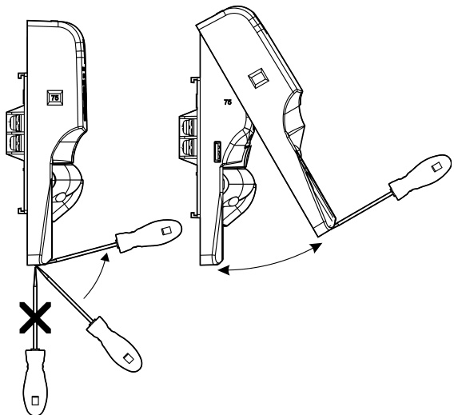  

Genesis LED G1 Series horns and strobes mount to any standard one-gang surface or flush electrical box. Matching optional G1T trim rings are available to cover oversized openings and can accommodate one-gang or four-inch square boxes. Optional color matched single-gang surface boxes are also available.  

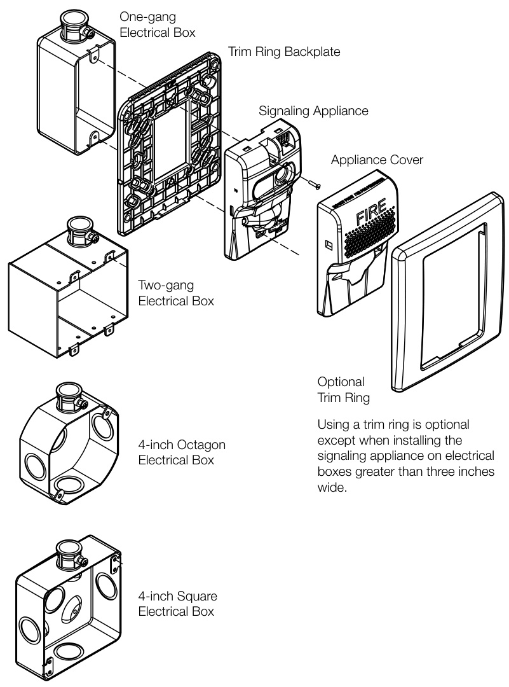  

# Wiring  

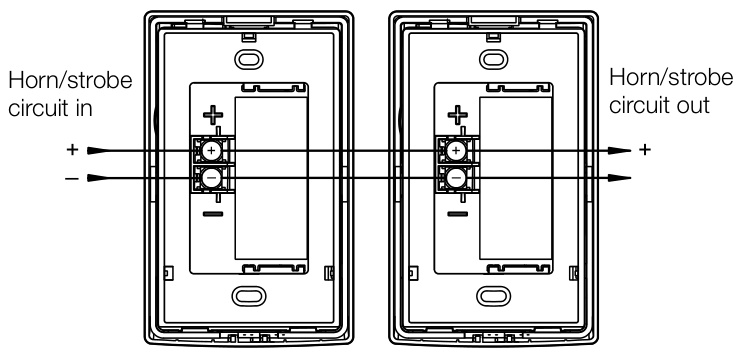  

Signal polarity shown in the active condition.  

# Dimensions  

# G1 Notification Appliances  

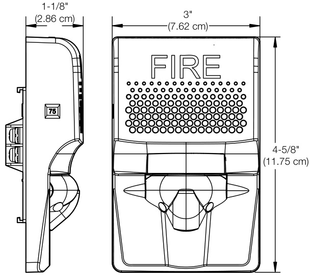  

# G1T Trim Ring  

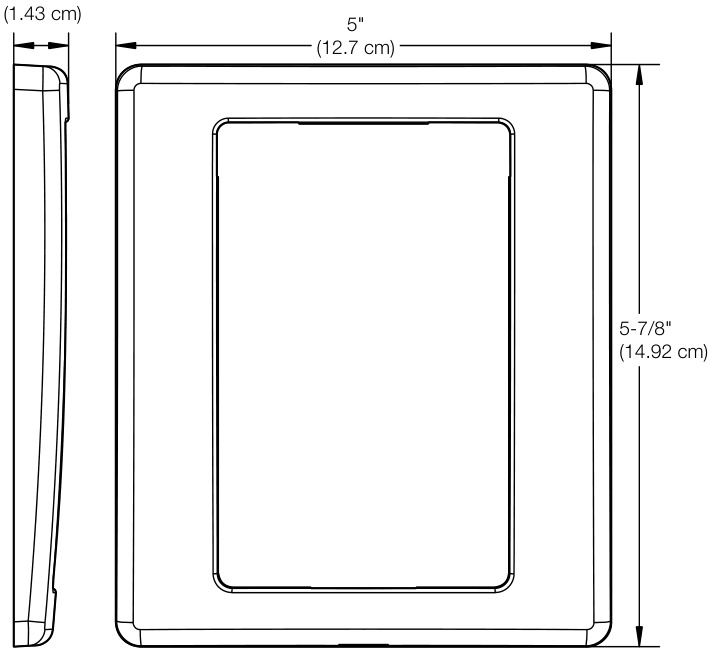  

# Diagnostics  

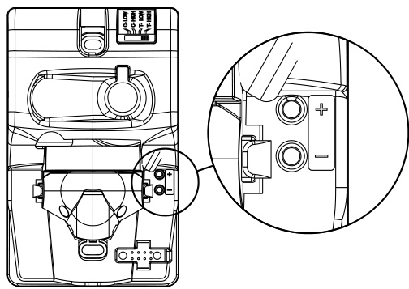  

Test points indicated above are used to validate the Notification Appliance Circuit and verify device function.  

# Field Configuration  

Temporal horn and horn-strobe models are factory set to sound in a three-pulse temporal pattern. By sliding the tone selector switch, units may be configured for constant horn output that can be coded at precise intervals by EDWARDS control panels and control modules.  

Note: Temporal 3 coding is the required output for fire notification devices per NFPA 72. Any device coding other than temporal 3 is at the discretion and approval of the local authority having jurisdiction (AHJ).  

Horns and horn-strobes are factory set for high dB output. Low dB output may be selected by sliding the tone selector switch. This reduces the output by about 6 dBA.  

Genesis LED clear strobes and horn-strobes may be set for 15, 30, or 75 candela output. The output setting is changed by simply removing the cover and sliding the candela switch to the desired setting. The device does not have to be removed from the wall to change the output setting. The setting remains visible through a small window on the left-hand side of the device after the cover is closed.  

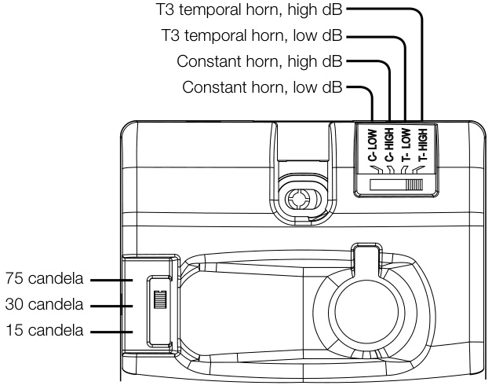  

# Operating current  

<html><body><table><tr><td colspan="2">Horns</td><td colspan="3">Strobes</td></tr><tr><td>Sound</td><td>16to33</td><td>16to33</td><td>Strobe</td><td>16to33 16to33</td></tr><tr><td>setting</td><td>VDC</td><td>VFWR</td><td>setting VDC</td><td>VFWR</td></tr><tr><td>C-Low T-LOW</td><td>13 mA</td><td>15 mA</td><td>15,30,75 24 mA</td><td>32 mA</td></tr><tr><td>C-High T-High</td><td>23 mA</td><td>29 mA</td><td></td><td></td></tr></table></body></html>  

Horn-Strobes   

<html><body><table><tr><td>Strobe setting</td><td>Sound setting</td><td>16 to33VDC</td><td>16to33VFWR</td></tr><tr><td rowspan="2">15,30,75</td><td>C-Low, T-LOW</td><td>35mA</td><td>43r mA</td></tr><tr><td>C-High, T-High</td><td>45 mA</td><td>55r mA</td></tr></table></body></html>  

# Sound Output  

<html><body><table><tr><td>Soundsetting</td><td>Reverberant (UL 464)</td><td>Anechoic (CAN/ULCS525)</td></tr><tr><td>C-Low T-LOW</td><td>80dBA</td><td>86dBA</td></tr><tr><td>C-High T-High</td><td>85dBA</td><td>92dBA</td></tr></table></body></html>  

Sound pattern (ULC)   

<html><body><table><tr><td>Axis</td><td>Angle</td><td>Change inoutput</td></tr><tr><td rowspan="2">Horizontal</td><td>45° and115°</td><td>-3dBA</td></tr><tr><td>5° and 130°</td><td>-6dBA</td></tr><tr><td rowspan="2">Vertical</td><td>65° and135°</td><td>-3dBA</td></tr><tr><td>45° and140°</td><td>-6dBA</td></tr></table></body></html>  

# Light Distribution  

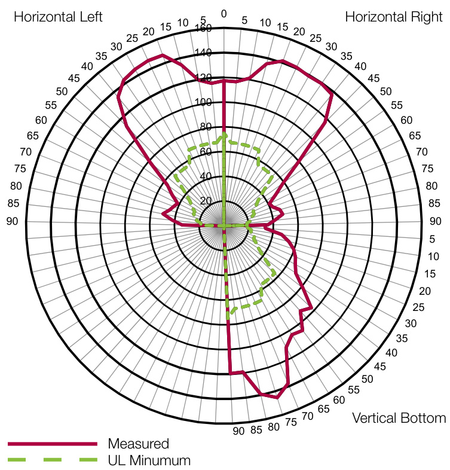  

Specifications   

<html><body><table><tr><td>Operating voltage</td><td>16to33VDC,16to33VFWR</td></tr><tr><td>Horn signal type</td><td>Constant or T3 temporal</td></tr><tr><td>Light output</td><td>15,30,or 75 candela</td></tr><tr><td>Strobeflashrate</td><td>1 fps (flash per second) approx.</td></tr><tr><td>Synchronization</td><td>20 Ω max.between any two devices. (To determine allowed wire resistance, refer to these specifications,</td></tr><tr><td>Synchronization sources</td><td>and the specifications for the synchronized signal source.) EDWARDSCCSeriesSignal Modules,Booster and AuxiliaryPowerSupplies,</td></tr><tr><td>Wire size</td><td>and IntelligentandConventional ControlPanels 12 to 18 AWG (0.75 to 2.50 mm²)</td></tr><tr><td>Dimensions (WxHxD)</td><td>3 × 4-5/8 × 1-1/8 in. (7.62 × 11.75 x 2.86 cm)</td></tr><tr><td>Strobe-to-box center offset</td><td>-0.71 inches (-1.8 cm)</td></tr><tr><td>Compatible electrical boxes [1]</td><td>1-gang, 2-gang, 4-inch octagon, 4-inch square</td></tr><tr><td>Trim rings</td><td>G1TR, G1TW - Dimensions 5 x 5-7/8 x 9/16 in.(12.7 x 14.92 x 1.43 cm)</td></tr><tr><td>Agency Listings</td><td>FCC,ICC,UL1971,UL1638,UL464,CSFM</td></tr><tr><td>Operating environment</td><td></td></tr><tr><td>Temperature</td><td>32 to 122°F (0 to 50°C)</td></tr><tr><td>Relative humidity</td><td>0 to 93% noncondensing</td></tr></table></body></html>

[1] Electrical boxes must be at least 1-1/2 in. $(3.81\ \mathsf{c m}$ ) deep. Electrical boxes greater than three inches wide require a trim ring.  

<html><body><table><tr><td colspan="2">Notification Appliances</td><td>Color Marking</td></tr><tr><td colspan="4"></td></tr><tr><td rowspan="7">Horns Selectable High/low dB</td><td>G1ARF Red</td><td>FIRE</td></tr><tr><td>G1ARF-FR</td><td>Red FEU</td></tr><tr><td>G1ARF-SP Red</td><td>FUEGO</td></tr><tr><td>G1ARN Red</td><td>None</td></tr><tr><td>G1AWF White</td><td>FIRE</td></tr><tr><td>G1AWF-FR White</td><td>FEU</td></tr><tr><td>G1AWF-SP White</td><td>FUEGO</td></tr><tr><td></td><td>G1AWN White</td><td>None</td></tr><tr><td rowspan="9">Strobes Selectable 15, 30, 75 cd</td><td>G1VRF Red</td><td>FIRE</td></tr><tr><td>G1VRF-FR Red</td><td>FEU</td></tr><tr><td>G1VRF-SP Red</td><td>FUEGO</td></tr><tr><td>G1VRN Red</td><td>None</td></tr><tr><td>G1VWA* White</td><td>ALERT</td></tr><tr><td>G1VWF White</td><td>FIRE</td></tr><tr><td>G1VWF-FR White</td><td>FEU</td></tr><tr><td>G1VWF-SP White</td><td></td></tr><tr><td>G1VWN White</td><td>FUEGO None</td></tr><tr><td></td><td></td><td></td></tr><tr><td rowspan="6">Horn-strobes</td><td>G1AVRF Red</td><td>FIRE</td></tr><tr><td>G1AVRF-FR Red</td><td>FEU</td></tr><tr><td>G1AVRF-SP Red</td><td>FUEGO</td></tr><tr><td>G1AVRN Red</td><td>None</td></tr><tr><td>G1AVWF White</td><td>FIRE</td></tr><tr><td>G1AVWF-FR White</td><td>FEU</td></tr><tr><td rowspan="4">Selectable 15, 30, 75 cd, High/low dB</td><td></td><td></td></tr><tr><td>G1AVWF-SP White</td><td>FUEGO</td></tr><tr><td>G1AWWN White</td><td>None</td></tr><tr><td></td><td></td></tr></table></body></html>  

<html><body><table><tr><td colspan="2">ReplacementApplianceCovers</td><td>Color</td><td>Marking</td></tr><tr><td></td><td></td><td></td><td></td></tr><tr><td rowspan="9">Horn Covers</td><td>G1ARA-CVR</td><td>Red</td><td>ALERT</td></tr><tr><td>G1ARF-CVR</td><td>Red</td><td>FIRE</td></tr><tr><td>G1ARF-FR-CVR</td><td>Red</td><td>FEU</td></tr><tr><td>G1ARF-SP-CVR</td><td>Red</td><td>FUEGO</td></tr><tr><td>G1ARN-CVR</td><td>Red</td><td>None</td></tr><tr><td>G1AWA-CVR</td><td>White</td><td>ALERT</td></tr><tr><td>G1AWF-CVR</td><td>White</td><td>FIRE</td></tr><tr><td>G1AWF-FR-CVR</td><td>White</td><td>FEU</td></tr><tr><td>G1AWF-SP-CVR G1AWN-CVR</td><td>White</td><td>FUEGO None</td></tr><tr><td></td><td></td><td>White</td><td></td></tr><tr><td rowspan="10">Strobe Covers</td><td>G1VRA-CVR</td><td>Red</td><td>ALERT</td></tr><tr><td>G1VRF-CVR</td><td>Red</td><td>FIRE</td></tr><tr><td>G1VRF-FR-CVR</td><td>Red</td><td>FEU</td></tr><tr><td>G1VRF-SP-CVR</td><td>Red</td><td>FUEGO</td></tr><tr><td>G1VRN-CVR</td><td>Red</td><td>None</td></tr><tr><td>G1VWA-CVR</td><td>White</td><td>ALERT</td></tr><tr><td>G1VWF-CVR</td><td>White</td><td>FIRE</td></tr><tr><td>G1VWF-FR-CVR</td><td>White</td><td>FEU</td></tr><tr><td>G1VWF-SP-CVR</td><td>White</td><td>FUEGO</td></tr><tr><td>G1VWN-CVR</td><td>White</td><td>None</td></tr><tr><td></td><td></td><td></td><td></td></tr><tr><td rowspan="9">Horn-strobe Covers</td><td>G1AVRA-CVR</td><td>Red</td><td>ALERT</td></tr><tr><td>G1AVRF-CVR</td><td>Red</td><td>FIRE</td></tr><tr><td>G1AVRF-FR-CVR</td><td>Red</td><td>FEU</td></tr><tr><td>G1AVRF-SP-CVR</td><td>Red</td><td>FUEGO</td></tr><tr><td>G1AVRN-CVR</td><td>Red</td><td>None</td></tr><tr><td>G1AVWA-CVR</td><td>White</td><td>ALERT</td></tr><tr><td>G1AVWF-CVR G1AVWF-FR-CVR</td><td>White</td><td>FIRE</td></tr><tr><td></td><td>White</td><td>FEU</td></tr><tr><td>G1AVWF-SP-CVR G1AVWN-CVR</td><td>White White</td><td>FUEGO None</td></tr></table></body></html>  

Accessories  

G1TR Trim ring, G1 Series, red 27193-11 One-gang surface mount box, red  

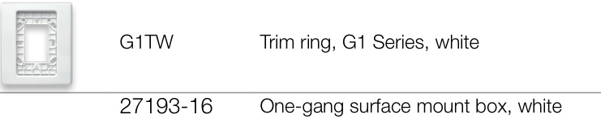  

# Model Number Syntax, Appliances  

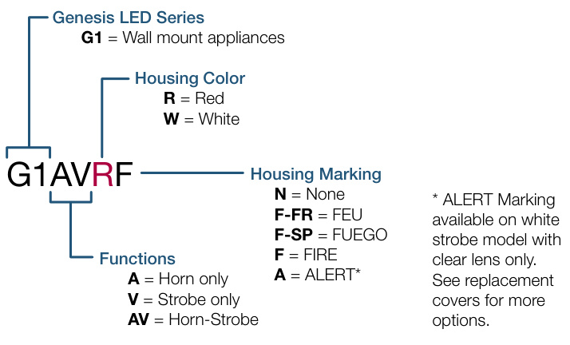  

# Model Number Syntax, Replacement Covers  

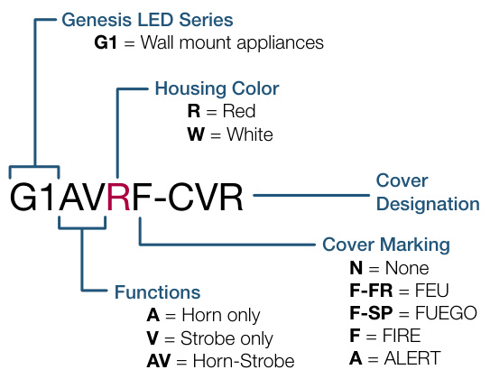  