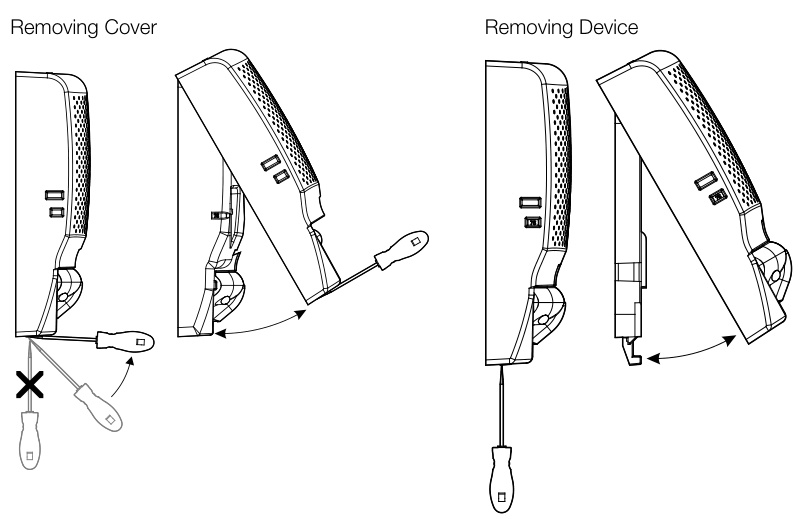
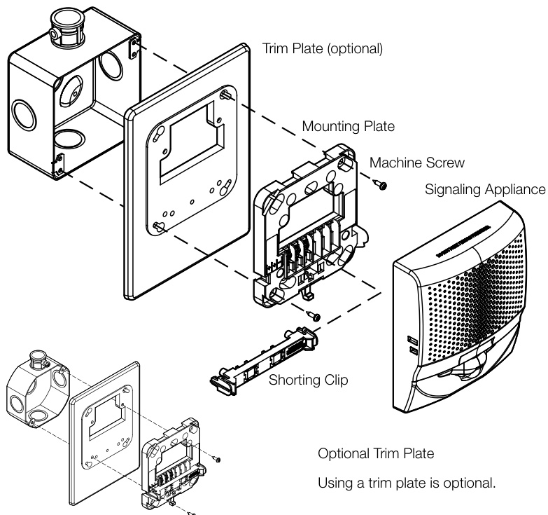
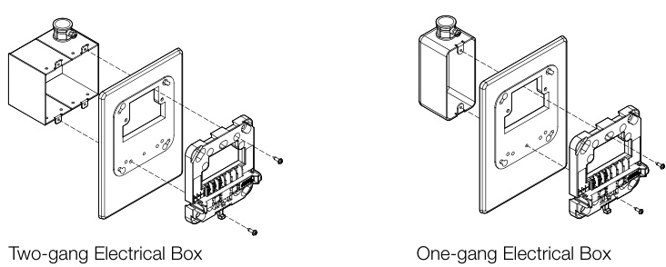
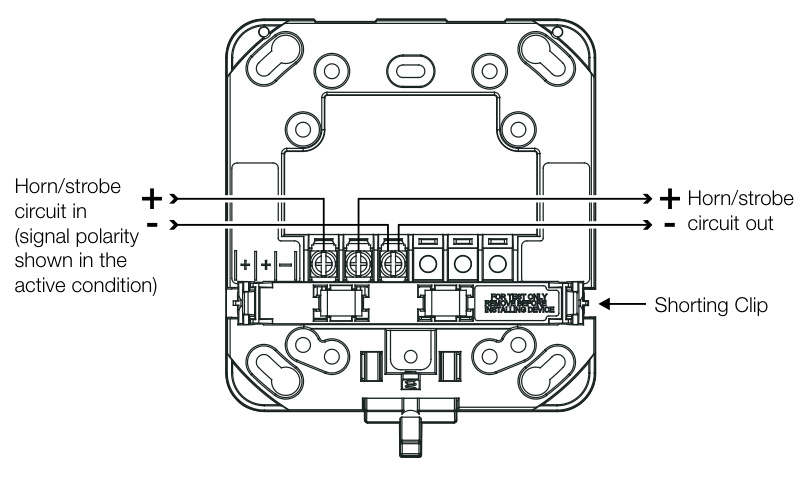
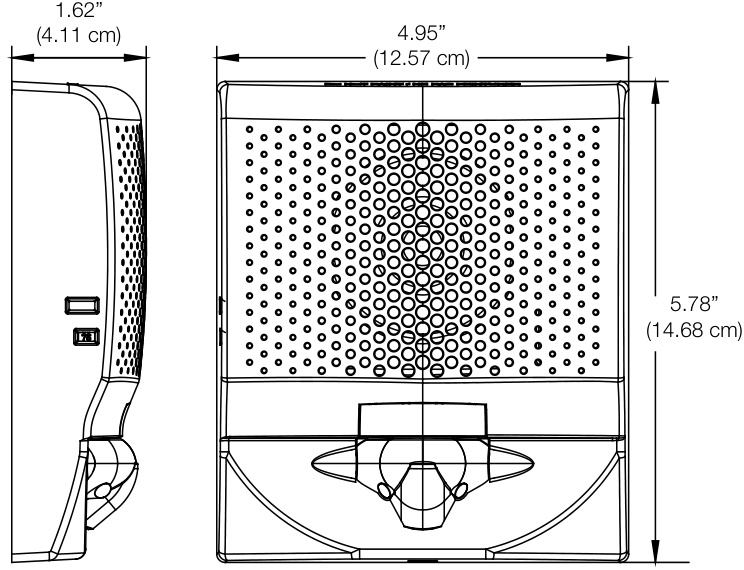
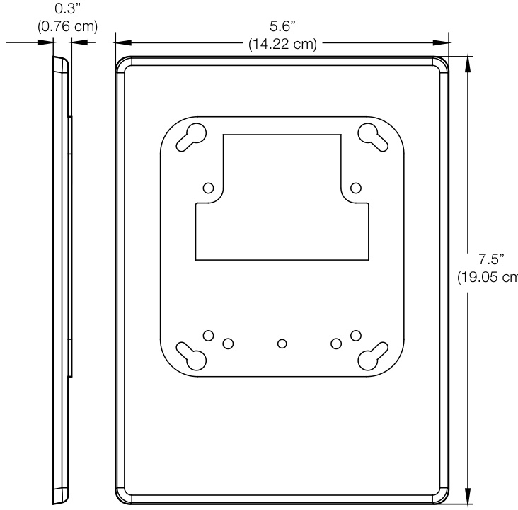
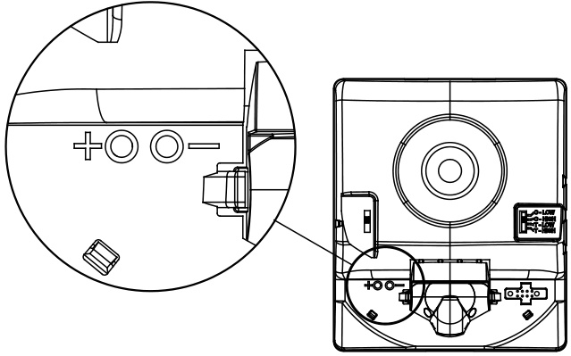
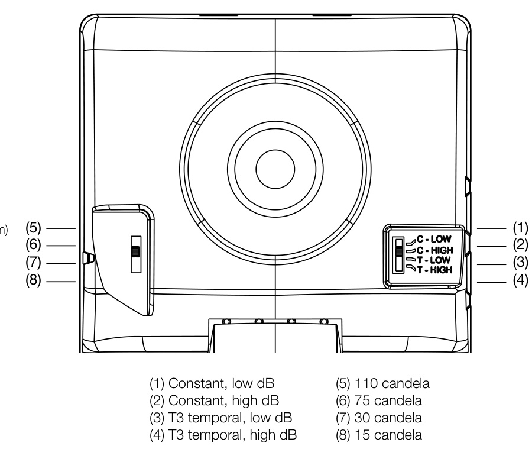
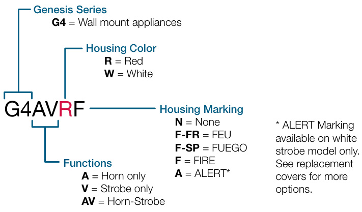
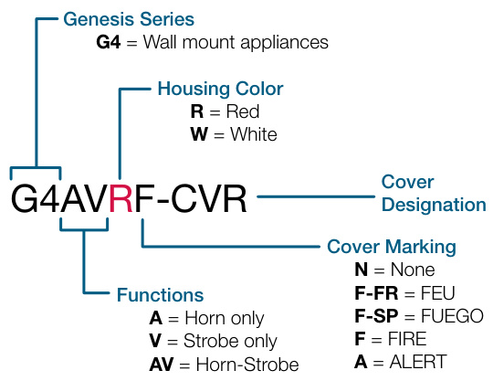

# Wall Mount Signaling Appliances Genesis LED G4 Series  

# Overview  

Genesis LED G4 Series horns and LED strobes feature a sleek low profile design and energy-efficient technology that makes them less expensive to install and operate by reducing overhead. High performance LEDs require fewer power supplies, backup power, and batteries. These new appliances are designed with, energy-efficiency, and life safety in mind.  

Genesis LED G4 Series uses high efficiency optics, combined with patented electronics, to deliver a highly controlled and efficiently focused light distribution pattern in exchange for lower current requirements. Strobes feature field-selectable 15, 30,75, or 110 cd light output.  

Compared with Xenon-type strobes, Genesis LED G4 Series appliances need fewer power supplies and often smaller wire gauge, which lightens conduit requirements. They are also backwards compatible with legacy strobes, so there’s no need to replace all your existing devices to upgrade to new LED technology. In fact, G4 strobes can be mixed on the same circuit and used in the same field of view as Xenon-based strobes. This makes Genesis LED G4 Series ideal for new installations and retrofits alike.  

Field-configurable sound output levels provide the flexibility modern life safety projects demand, while the Genesis LED control protocol keeps multiple strobes on compatible NAC circuits synchronized to well within NFPA 72 requirements.  

Serviceability is another area where G4 Series appliances shine. The universal room side wiring plate allows for pre-installation and electrical wiring as well as checking continuity with the included diagnostics check bar. G4 Series devices can then be easily snapped into place with the confidence of knowing the wiring is correct. The innovative under-cover diagnostic test points provide easy access to device circuit testing while mounted.  

# Standard Features  

# High Performance LED Strobe Technology  

– Ultra low device current consumption allows: – More devices per circuit – Ability to use lower gauge wire – Longer wire runs – Fewer booster power supplies   
– High efficiency optics   
– Selectable 15, 30, 75, or 110 cd light output   
– LED devices may be mixed with legacy Xenon strobes  

# Efficient Audible Output  

– Selectable high or low dB horn output – Selectable temporal or steady horn output – Improved audio frequency range for better wall penetration  

# Low-profile Design  

– Ultra-slim... protrudes about $1.5^{\mathfrak{n}}$ from the mounting surface – Attractive appearance... no visible mounting screws  

# Multiple “FIRE” Marking Options  

– Order English, French, Spanish or no FIRE markings – Change markings at any time with replaceable quick-swap covers  

# Easy to Install  

– Pre-install and pre-wire with convenient universal room side wiring plate   
– Check electrical continuity on room side wiring plate with included diagnostics check bar   
– Diagnostics port streamlines device circuit testing   
– Fits 1-gang, 2-gang, 3.5-inch octagon, and 4-inch square electrical boxes   
– Optional red and white trim plates available   
– Slide switches for field configuration   
– 12 to 18 AWG in-out screw terminals for quick wiring  

# Application  

# Strobes  

Genesis G4 Series strobes are UL 1971-listed for use indoors as wall-mounted public-mode notification appliances for the hearing impaired. Prevailing codes require strobes to be used where ambient noise conditions exceed 105 dBA (87 dBA in Canada), where occupants use hearing protection, and in areas of public accommodation as defined in the Americans with Disabilities Act.  

Synchronization is important in order to avoid triggering seizures in people with photosensitive epilepsy. All Genesis strobes exceed UL synchronization requirements (within 10 milliseconds over a two-hour period) when used with a synchronization source. See the specifications table for a list of compatible sources.  

# Horns  

Genesis horn output reaches as high as 92 dBA and features an improved audio frequency range compared with other Genesis horns. This results in excellent sound penetration through walls and a clear warning of danger. Horn only models may be configured for either coded or non-coded notification appliance circuits. They can also be set for high or low dBA output. This setting reduces horn output by about 6 dBA. Horn-only models may be ceiling-mounted or wall-mounted.  

The suggested sound pressure level for each signaling zone used with alarm signals is at least 15 dBA above the average ambient sound level, or 5 dBA above the maximum sound level having a duration of at least 60 seconds, whichever is greater. These values are measured at five feet $(1.5\,\mathsf{m})$ above the floor. The average ambient sound level is A-weighted, fast response sound pressure measured over a 24-hour period.  

Doubling the distance from the signal to the ear will theoretically result in a 6 dBA reduction of the received sound pressure level. The actual effect depends on the acoustic environment in the space. A 3 dBA difference represents a barely noticeable change in volume.  

# Installation  

Genesis G4 horns and strobes mount to the required GP10 room side wiring plate. The GP10 mounting plate is ordered separately from the G4 device in packs of 10 for convenient pre-installing and pre-wiring. The device can be removed easily from the room side wiring plate by pushing up with a screwdriver. The cover can also be removed from the device easily with a screwdriver to access the light and sound output settings and a diagnostics test port for voltage testing.  

  

Genesis LED G4 Series horns, strobes, and horn-strobes mount to any standard one-gang, two-gang, 3.5-inch octagon, and 4-inch square electrical box. Matching optional G4T trim rings are available to cover oversized openings. Optional color matched double-gang surface boxes are also available.  

Double Gang Electrical Box  

  
3.5-inch Octagon Electrical Box  

  

# Wiring  

  

# Dimensions  

  
G4 Notification Appliances   
G4T Trim Plate (optional)  

# Field Configuration  

Temporal horn and horn-strobe models are factory set to sound in a three-pulse temporal pattern. By sliding the tone selector switch, horn only models may be configured for constant horn output that can be coded at precise intervals by EDWARDS control panels and control modules.  

Note: Temporal 3 coding is the required output for fire notification devices per NFPA 72. Any device coding other than temporal 3 is at the discretion and approval of the local authority having jurisdiction (AHJ).  

Horns and horn-strobes are factory set for high dB output. Low dB output may be selected by sliding the tone selector switch. This reduces the output by about 6 dBA.  

Genesis LED clear strobes and horn-strobes may be set for 15, 30, 75, or 110 candela output. The output setting is changed by simply removing the cover and sliding the candela switch to the desired setting. The device does not have to be removed from the wall to change the output setting. The setting remains visible through a small window on the left-hand side of the device after the cover is closed.  

  

# Diagnostics  

  

Test points indicated above are used to validate the Notification Appliance Circuit and verify device function.  

Light and Sound Output Settings  

  

# Operating current  

<html><body><table><tr><td colspan="3">Horns</td><td colspan="3">Strobes</td></tr><tr><td>Sound setting</td><td>16to33 VDC</td><td>16to33 VFWR</td><td>Strobe setting</td><td>16to33 VDC</td><td>16to33 VFWR</td></tr><tr><td>C-Low, T-LOW</td><td>18 mA</td><td>22 mA</td><td>15,30, 75,110</td><td>28mA</td><td>36mA</td></tr><tr><td>C-High, T-High</td><td>28mA</td><td>38mA</td><td></td><td></td><td></td></tr></table></body></html>  

Horn-Strobes   

<html><body><table><tr><td>Strobe setting</td><td>Sound setting</td><td>16to33 VDC</td><td>16to33VFWR</td></tr><tr><td>15,30,</td><td>C-Low, T-Low</td><td>40 mA</td><td>48 mA</td></tr><tr><td>75,110</td><td>C-High, T-High</td><td>50mA</td><td>60 mA</td></tr></table></body></html>  

# Sound Output  

Horn & Horn-Strobe   

<html><body><table><tr><td>Sound setting</td><td>Reverberant (UL464)</td><td>Anechoic (CAN/ULC- 5925）</td></tr><tr><td>C-Low, T-LOW</td><td>80dBA</td><td>86dBA</td></tr><tr><td>C-High, T-High</td><td>85dBA</td><td>92dBA</td></tr></table></body></html>  

Sound pattern (ULC)   

<html><body><table><tr><td>Axis</td><td>Angle</td><td>Change in output</td></tr><tr><td rowspan="2">Horizontal</td><td>135° and45°</td><td>-3dBA</td></tr><tr><td>150° and30°</td><td>-6dBA</td></tr><tr><td rowspan="2">Vertical</td><td>135° and 40°</td><td>-3dBA</td></tr><tr><td>150° and30°</td><td>-6dBA</td></tr></table></body></html>  

Specifications   

<html><body><table><tr><td>Operatingvoltage</td><td>16to33VDC,16to33VFWR</td></tr><tr><td>Horn signal type</td><td>ConstantorTC3temporal</td></tr><tr><td>Light output</td><td>15,30,75,or110candela</td></tr><tr><td>Strobeflashrate</td><td>1 fps (flash per second) approx.</td></tr><tr><td>Synchronization</td><td>20Ωmax.betweenanytwodevices.Todetermineallowedwireresistance,refer</td></tr><tr><td>Synchronization Sources</td><td>tothesespecifications,and thespecificationsforthesynchronizedsignalsource.</td></tr><tr><td>Wiresize</td><td>IntelligentandConventionalControlPanels 12 to 18 AWG (0.75 to 2.50 mm2)</td></tr><tr><td>Dimensions (WxHxD)</td><td>4.95 x 5.78 x 1.62 in (12.57 x 14.68 x 4.11 cm)</td></tr><tr><td>Strobe-to-boxcenteroffset</td><td>-1.70 inches (-4.32 cm)</td></tr><tr><td>Compatible electrical boxes[1]</td><td>1-gang,2-gang,3.5-inch octagon,4-inch square</td></tr><tr><td>Trim plates</td><td>G4TR,G4TW (5.6×7.5x 0.3 in (14.22x 19.05x 0.76 cm))</td></tr><tr><td>Operating environment</td><td></td></tr><tr><td>Temperature</td><td>32 to 122°F(0 to 50°C)</td></tr><tr><td>Relativehumidity</td><td>0 to 93% noncondensing</td></tr><tr><td>StorageTemperature</td><td>-40 to 158 F (-40 to 70 C)</td></tr></table></body></html>

[1] Electrical boxes must be at least 1-1/2 in. $(3.81\ \mathsf{c m}$ ) deep.  

<html><body><table><tr><td colspan="2">Notification Appliances Color</td></tr><tr><td colspan="2"></td></tr><tr><td rowspan="9">Horns</td><td>Marking G4ARF Red FIRE</td></tr><tr><td>G4ARF-FR Red FEU</td></tr><tr><td>G4ARF-SP Red FUEGO</td></tr><tr><td>G4ARN Red None</td></tr><tr><td>G4AWF White FIRE</td></tr><tr><td>G4AWF-FR White FEU</td></tr><tr><td>G4AWF-SP White FUEGO</td></tr><tr><td>G4AWN White None</td></tr><tr><td>FIRE FEU</td></tr><tr><td>G4VRF G4VRF-FR</td></tr><tr><td>Strobes</td></tr><tr><td>Red Red G4VRF-SP</td></tr><tr><td>Red FUEGO G4VRN Red None</td></tr><tr><td>G4VWF White FIRE</td></tr><tr><td></td></tr><tr><td>G4VWF-FR White FEU</td></tr><tr><td>G4VWF-SP White FUEGO</td></tr><tr><td>G4VWN White None FIRE</td></tr><tr><td>G4AVRF Red G4AVRF-FR</td></tr><tr><td></td></tr><tr><td>Red FEU G4AVRF-SP Red</td></tr><tr><td>FUEGO</td></tr><tr><td>G4AVRN Red None</td></tr><tr><td>G4AWWF White FIRE</td></tr><tr><td>G4AVWF-FR White FEU Horn-strobes</td></tr><tr><td>G4AVWF-SP White FUEGO</td></tr><tr><td>G4AWWN White None</td></tr></table></body></html>  

<html><body><table><tr><td colspan="2">Replacement Appliance Covers</td><td>Color</td><td>Marking</td></tr><tr><td colspan="2"></td><td></td><td></td></tr><tr><td rowspan="10">Horn Covers</td><td>G4ARA-CVR</td><td>Red</td><td>ALERT</td></tr><tr><td>G4ARF-CVR</td><td>Red</td><td>FIRE</td></tr><tr><td>G4ARF-FR-CVR</td><td>Red</td><td>FEU</td></tr><tr><td>G4ARF-SP-CVR</td><td>Red</td><td>FUEGO</td></tr><tr><td>G4ARN-CVR</td><td>Red</td><td>None</td></tr><tr><td>G4AWA-CVR</td><td>White</td><td>ALERT</td></tr><tr><td>G4AWF-CVR</td><td>White</td><td>FIRE</td></tr><tr><td>G4AWF-FR-CVR</td><td>White</td><td>FEU</td></tr><tr><td>G4AWF-SP-CVR</td><td>White</td><td>FUEGO</td></tr><tr><td>G4AWN-CVR</td><td>White</td><td>None</td></tr><tr><td rowspan="11"></td><td></td><td></td><td></td></tr><tr><td>G4VRA-CVR</td><td>Red</td><td>ALERT</td></tr><tr><td>G4VRF-CVR</td><td>Red</td><td>FIRE</td></tr><tr><td>G4VRF-FR-CVR</td><td>Red</td><td>FEU</td></tr><tr><td>G4VRF-SP-CVR</td><td>Red</td><td>FUEGO</td></tr><tr><td>G4VRN-CVR</td><td>Red</td><td>None</td></tr><tr><td rowspan="8">Strobe Covers</td><td>G4VWA-CVR</td><td>White</td><td>ALERT</td></tr><tr><td>G4VWF-CVR</td><td>White</td><td>FIRE</td></tr><tr><td>G4VWF-FR-CVR</td><td>White</td><td>FEU</td></tr><tr><td>G4VWF-SP-CVR</td><td>White</td><td>FUEGO</td></tr><tr><td>G4VWN-CVR</td><td>White</td><td>None</td></tr><tr><td></td><td></td><td></td></tr><tr><td>G4AVRA-CVR</td><td>Red</td><td>ALERT</td></tr><tr><td>G4AVRF-CVR</td><td>Red</td><td>FIRE</td></tr><tr><td rowspan="8">Horn-strobe Covers</td><td>G4AVRF-FR-CVR</td><td>Red</td><td>FEU</td></tr><tr><td>G4AVRF-SP-CVR</td><td></td><td></td></tr><tr><td>G4AVRN-CVR</td><td>Red Red</td><td>FUEGO None</td></tr><tr><td>G4AVWA-CVR</td><td>White</td><td>ALERT</td></tr><tr><td>G4AVWF-CVR</td><td>White</td><td>FIRE</td></tr><tr><td>G4AVWF-FR-CVR</td><td>White</td><td>FEU</td></tr><tr><td>G4AVWF-SP-CVR</td><td>White</td><td>FUEGO</td></tr><tr><td>G4AVWN-CVR</td><td>White</td><td>None</td></tr></table></body></html>  

Accessories   

<html><body><table><tr><td>GP10</td><td>RoomSideWiring Plate (required, orderedseparately)</td><td>G4TR</td><td>Trimplate,G4Series, red</td><td>G4TW</td><td>Trimplate,G4Series, white</td></tr><tr><td></td><td></td><td>27193-21</td><td>Two-gang surface mount box, red</td><td>27193-26</td><td>Two-gang surface mountbox，white</td></tr></table></body></html>  

  
Model Number Syntax, Appliances  

  
Model Number Syntax, Replacement Covers  