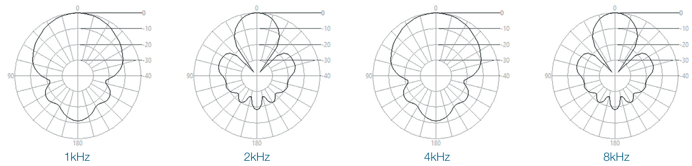
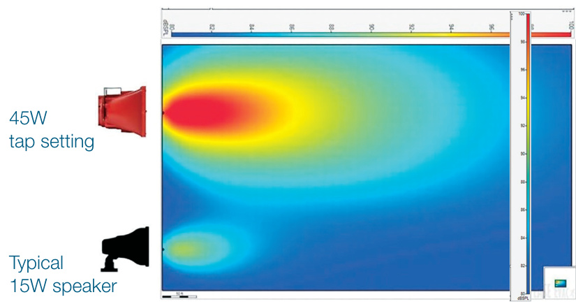
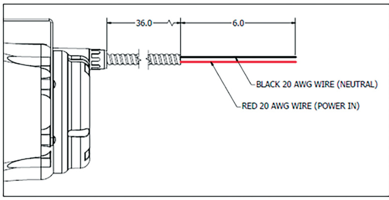
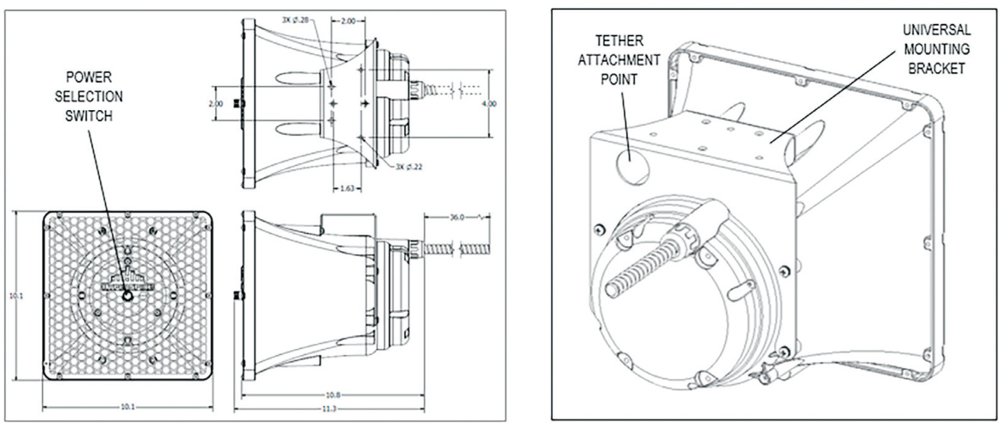
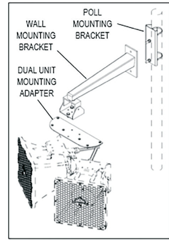
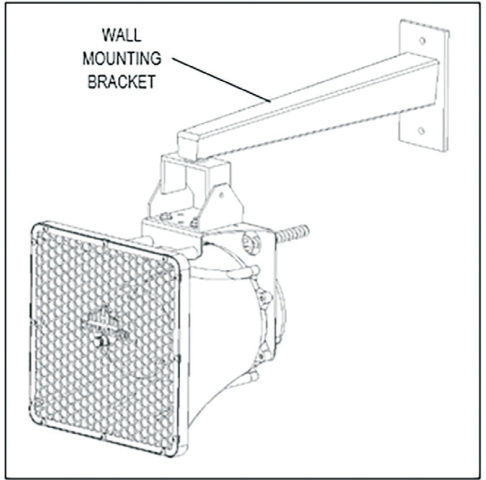

# TCPA-10 Medium Power Speaker HyperSpike Series  

# Overview  

The EDWARDS HyperSpike® Series TCPA-10 is intended for indoor and outdoor audio signaling and notification. The five power settings have been designed to interface with industry standard amplification. Its $90^{\circ}$ wide acoustic beam makes it an ideal notification tool for indoor and outdoor areas. The optional dual-mount system creates a $180^{\circ}$ wide beam that is ideal for outdoor perimeter use.  

Its best-in-class acoustic coverage allows for fewer units to be installed in large indoor and outdoor areas, lowering installation and long-term maintenance costs, while also improving intelligibility and aesthetics. Best-in-industry voice quality and intelligibility, combined with sharp and high impact tone capability, make it the right choice for ensuring messages are heard and understood.  

# Standard Features  

Industry Leading Voice Intelligibility (STI PA $=$ Excellent)   
•139dB Max SPL $@$ 1 meter   
•Rated for indoor or outdoor applications   
•UL 1480 Listed   
•Universal mounting interface   
•Built-in transformer (25V, 70V, &100V) Durable environmental-resistant construction   
•	 Performs to NEMA 3R standards   
•	 UL listed for Class l, Division 2, Groups A, B, C, D  

<html><body><table><tr><td>Input Voltage</td><td>Watts</td><td>dB SPL (Peak @ 1m)</td><td>dB SPL (Max @ 1m)</td><td>* dB SPL (Max @ 10ft)</td><td>UsableRange (Feet @ 80db)</td></tr><tr><td>25</td><td>0.5</td><td>119</td><td>114</td><td>90</td><td>160</td></tr><tr><td>25</td><td>1</td><td>122</td><td>117</td><td>96</td><td>230</td></tr><tr><td>25</td><td>1.5</td><td>124</td><td>119</td><td>98</td><td>290</td></tr><tr><td>25</td><td>2</td><td>126</td><td>121</td><td>99</td><td>360</td></tr><tr><td>25</td><td>3</td><td>128</td><td>123</td><td>100</td><td>460</td></tr><tr><td>70</td><td>4</td><td>129</td><td>124</td><td>102</td><td>520</td></tr><tr><td>70/100</td><td>8</td><td>131</td><td>126</td><td>104</td><td>650</td></tr><tr><td>70</td><td>12</td><td>133</td><td>128</td><td>107</td><td>820</td></tr><tr><td>70/100</td><td>16</td><td>134</td><td>129</td><td>107</td><td>920</td></tr><tr><td>70/100</td><td>24</td><td>136</td><td>131</td><td>109</td><td>1,160</td></tr><tr><td>100</td><td>32</td><td>137</td><td>132</td><td>110</td><td>1,300</td></tr><tr><td>100</td><td>45</td><td>139</td><td>134</td><td>112</td><td>1,640</td></tr></table></body></html>  

<html><body><table><tr><td colspan="4">(90215A) Distributed AudioTone dBSPL (MaxRMS @ 1 meter)</td></tr><tr><td>Tone</td><td>25V</td><td>70V</td><td>100V</td></tr><tr><td>Temporal3</td><td>119</td><td>128</td><td>131</td></tr><tr><td>BroadbandFastSiren</td><td>121</td><td>130</td><td>133</td></tr><tr><td>SlowSweepTone</td><td>122</td><td>131</td><td>134</td></tr></table></body></html>  

<html><body><table><tr><td>Tap</td><td>Impedance (Q)</td><td>Watts @25V</td><td>Watts@70V</td><td>Watts @ 100V</td></tr><tr><td>1</td><td>1,250</td><td>0.5</td><td>4</td><td>8</td></tr><tr><td>2</td><td>625</td><td>1</td><td>8</td><td>16</td></tr><tr><td>3</td><td>416</td><td>1.5</td><td>12</td><td>24</td></tr><tr><td>4</td><td>312</td><td>2</td><td>16</td><td>32</td></tr><tr><td>5</td><td>208</td><td>3</td><td>24</td><td>45</td></tr></table></body></html>

\*UL Standard SPL Measurement  

# Sound Dispersion Patterns  

  
EASE Comparison Plot  

  

# Wiring  

The TCPA-10 has a three-foot long $\%$ trade size\* flexible conduit with 20 AWG wires exiting the end. The power tap selection switch is located on the front of the unit (see Figure 2 in Interface and Mounting Reference).  

$\sqrt[x]{4}$ trade size conduit has a nominal $\varnothing.39^{\circ}$ ID / Ø.57” OD  

  
Figure 1  

# Interface and Mounting Reference  

  

Figure 2  

Figure 3  

  

  

Figure 4 (single unit)  

Figure 5 (double unit)  

# Specifications  

General Specifications:   

<html><body><table><tr><td>Certifications</td><td>UL148O,ULC,CSFM,ClassI,Division2,GroupsA,B,C,D</td></tr><tr><td>PowerRating</td><td>Upto45Wcontinuous</td></tr><tr><td>FrequencyResponse</td><td>375Hz-15kHz(nominal)</td></tr><tr><td></td><td>400Hz-4kHz(general signaling)</td></tr><tr><td>Sensitivity</td><td></td></tr><tr><td>DispersionAngle</td><td>60° (-3dB),90° (-6dB)</td></tr><tr><td>Weight</td><td>9 Ibs</td></tr><tr><td>Dimensions</td><td>10.1"H × 10.1"W× 11.3"D</td></tr><tr><td>OperatingTemperatureRange</td><td>-40°C-60°C</td></tr></table></body></html>  

# Engineer Specifications:  

Voice paging and tone signaling loudspeaker shall be Edwards Part Number _____ (see Part Numbers in chart below). Unit shall be UL1480 listed and Class I Division 2 certified, weather resistant and constructed of rugged 5VA flammability rated, UV resistant ABS plastic. The loudspeaker shall be able to operate within any ambient temperature environment ranging from - $-40^{\circ}{\mathrm{C}}$ to $60^{\circ}\mathrm{C}$ . The speaker shall have a sensitivity of 112dB when measured at 1m (AVG 400-4,000Hz) and a beam width of $90^{\circ}$ (-6dB at 1kHz). Model shall be a non-re-entrant compression-loaded transducer with a $3"$ polyimide diaphragm and power handling of 45W continuous. The transducer coil shall be a nomimal 8 ohm impedance and ferro-fluid shall surround the coil to optimize heat dissipation. Transformer power settings shall be selectable and include 100V: 45W, 32W, 24W, 16W, 8W; 70V: 24W, 16W, 12W, 8W, 4W; 25V: 3W, 2W, 1.5W, 1W, 0.5W. Speaker shall contain in-line capacitor to allow DC supervision of wiring and be supplied with $3^{\prime}$ of 5VA flammability rated conduit with flying leads.  

Environmental Specifications:   

<html><body><table><tr><td>Enclosure</td><td>Performs toNEMA3R standards</td></tr><tr><td>Operating Temperature</td><td>-40°C-6 60°C</td></tr><tr><td>Humidity Range</td><td>0-75% non-condensing</td></tr></table></body></html>  

# Ordering Information  

<html><body><table><tr><td>Part Number</td><td>Description</td></tr><tr><td colspan="2">ULListedDistributedAudioSpeakers</td></tr><tr><td>90215A-801-01-L</td><td>UL1480listedC1D2certifiedTCPA-10DistributedAudioSpeakerwith systems.Black.</td></tr><tr><td>90215A-801-04-L</td><td>systems. Gray.</td></tr><tr><td>90215A-801-05-L</td><td>UL1480listedC1D2certifiedTCPA-10DistributedAudioSpeakerwith systems.Red.</td></tr><tr><td>90215A-801-06-L</td><td>UL1480listedC1D2certifiedTCPA-10DistributedAudioSpeakerwith</td></tr><tr><td>Mounting Hardware</td><td>systems.White.</td></tr><tr><td>72377B-801</td><td>TCPA-10WallMount(includesceilingandpolemount)</td></tr><tr><td>72378B-801</td><td>TCPA-10DualUnitMountingAdapter</td></tr></table></body></html>  