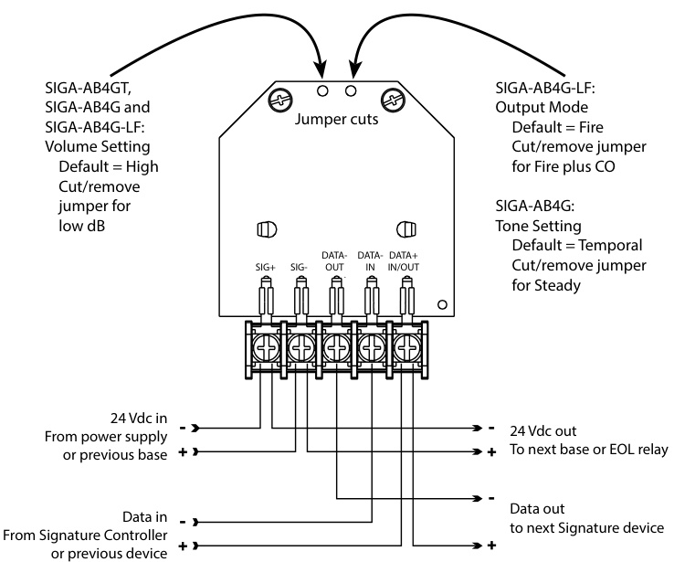

# Intelligent Multisensor Smoke and Heat Detector SIGA-OSHD  

# Overview  

The Signature Optica Series SIGA-OSHD smoke detector brings advanced optical (photoelectric) sensing technology to a practical  

design that increases efficiency, saves installation time, cuts costs, and extends life safety and property protection capabilities. Continuous self-diagnostics ensure reliability over the long-haul, while environmental compensation helps reduce maintenance costs.  

The SIGA-OSHD provides an optical smoke sensor and a rate-of-rise heat sensor with a fixed temperature setting. Together these sensors efficiently detect smoldering fires, as well as fast flaming fires.  

Like all Signature Optica Series detectors, the SIGA-OSHD is an intelligent device that gathers analog information from multiple optical sensors, converting this data into digital signals. Utilizing dual optical wavelengths combined with multiple detection angles, the SIGA-OSHD differentiates particles that are not representative of actual smoke. Particle data is input into digital filters which feed a series of ratios removing signal patterns that are typical of nuisance sources, thus reducing unwanted alarms. To make an alarm decision, the detector’s on-board microprocessor measures and analyzes all optical sensor readings and compares this information to preprogrammed settings.  

# Standard Features  

Multi-criteria optical smoke sensing technology Integrates optical smoke with rate-of-rise heat sensing Wide 0.5 to $4.36\,\%.$ /ft. (1.6 to $13.6\,\%/\mathrm{m})$ ) smoke obscuration Integrated nuisance rejection reducing unwanted alarms from general cooking particulates Uses existing wiring Listed to UL 268 7th edition Automatic device mapping Sensor Markings Provide Easy Testing Identification Up To 250 Total Signature Addresses Per Loop   
•	 Two levels of environmental compensation   
Two levels of dirty detector warning Twenty pre-alarm settings Five sensitivity settings Non-volatile memory Electronic addressing Automatic day/night sensitivity adjustment Bicolor (green/red) status LED   
•	 Standard, relay, fault isolator, and audible mounting bases  

Note: Some features described here may not be supported by all control systems. Check your control panel’s Installation and Operation Guide for details.  

# Application  

# Smoke detection  

The SIGA-OSHD detects particles from a wide range of combustion sources and will trigger an alarm when smoke density in the chamber reaches preprogrammed level. Thanks to its high-performance reflective response technology, the smoke sensor responds quickly and reliably to a wide range of fire types, including both fast and slow burning fires fueled by combustibles typically found in modern multi-use buildings.  

# Heat detection  

SIGA-OSHD’s on-board rate-of-rise heat sensor provides a $15\^{\circ}\mathsf{F}$ $(9\,^{\circ}\mathrm{C})$ per minute function for the detection of fast-developing fires while also providing a $135\,^{\circ}\mathsf{F}$ $(57.2\,^{\circ}\mathrm{C})$ fixed detection threshold. The heat sensors monitor the temperature of the air and determines whether an alarm should be initiated.  

# Compatibility  

The Siga-OSHD detector is compatible only with control panels using a Signature Loop controller.  

# Installation  

Signature Series detectors mount to North American 1-gang boxes, 3-1/2 inch or 4 inch octagon boxes, and to 4 inch square electrical boxes 1-1/2 inches $\left(38\,\mathsf{m m}\right)$ deep. They mount to European BESA and 1-gang boxes with $60.3\,\mathsf{m m}$ fixing centers. See mounting base installation and wiring for more information.  

  

# Testing & Maintenance  

Scheduled maintenance (regular or selected) for proper detector operation should be planned to meet the requirements of the Authority Having Jurisdiction (AHJ). Refer to current NFPA 72, NFPA 720, and ULC CAN/ULC 536 standards.  

# Smoke Sensor Sensitivity  

The SIGA-OSHD determines when its optical sensor is dirty or defective and can transmit sensitivity data to the loop controller. A sensitivity report can also be printed to satisfy NFPA sensitivity measurements, which must be conducted at the end of the first year and every two years thereafter. The availability of maintenance features depends on the fire alarm system used.  

# Sensing and reporting technology  

The microprocessor in each detector provides additional benefits – Self-diagnostics and History Log, Automatic Device Mapping and Fast, Stable Communication.  

Self-diagnostics and History Log - Each Signature Series detector constantly runs self-checks to provide important maintenance information. The results of the self-check are automatically updated and permanently stored in the detector’s non-volatile memory.  

Automatic Device Mapping - The loop controller learns where each device’s serial number address is installed relative to other devices on the circuit. The mapping feature provides supervision of each device’s installed location to prevent a detector from being reinstalled (after cleaning etc.) in a different location from where it was originally.  

Fast Stable Communication - On-board intelligence means less information needs to be sent between the detector and the loop controller. Other than regular supervisory polling response, the detector only needs to communicate with the loop controller when it has something new to report.  

# Accessories  

Detector mounting bases have wiring terminals that are accessible from the “room-side” after mounting the base to the electrical box. The bases mount to North American 1-gang boxes and to $3\%$ inch or 4 inch octagon boxes, $1\%$ inches $\left(38\,\mathsf{m m}\right)$ deep. They also mount to European BESA and 1-gang boxes with $60.3\,\mathsf{m m}$ fixing centers. The SIGA-SB4, SIGA-RB4, and SIGA-IB4 mount to North American 4 inch sq. electrical boxes in addition to the above boxes. They include the SIGA-TS4 Trim Skirt, which is used to cover the “mounting ears” on the base. Sounder bases mount to a 4 inch square boxes only.  

  

Remote LED SIGA-LED - The remote LED connects to the SIGA-SB or SIGA-SB4 Standard Base only. It features a North American size 1-gang plastic faceplate with a white finish and red alarm LED.  

SIGA-TS4 Trim Skirt - Supplied with 4 inch bases, it can also be ordered separately to use with the other bases to help hide surface imperfections not covered by the smaller bases.  

Sounder Bases - Signature Series sounder bases are designed for use where localized or group alarm signaling is required.  

•	 SIGA-AB4G bases provide sounder capability to Signature Series smoke and heat detectors. They are not for use with devices that include a CO sensor.  

•	 SIGA-AB4GT bases provide sounder capability to Signature Series smoke and heat detectors, as well as Signature detectors that include a CO Sensor when used with a SIGATCDR Temporal Pattern Generator to separate CO (TC4) and Fire (TC3) tone patterns.  

•	 SIGA-AB4G-LF bases provide $520\,{\sf H z}$ low frequency sounder capability to Signature Series smoke and heat detectors, as well as Signature detectors that include a CO Sensor when used with a SIGA-TCDR Temporal Pattern Generator to separate CO (TC4) and Fire (TC3) tone patterns. The SIGA-AB4G-LF is suitable for applications requiring low frequency audible tones.  

# Typical Wiring  

The detector mounting bases accept #18 AWG $(0.75\mathsf{m m}^{2})$ ,#16 $1.0\mathsf{m m}^{2})$ , #14 AWG $(1.5\mathsf{m m}^{2})$ , and #12 AWG $(2.5\mathsf{m m}^{2})$ wire sizes. Sizes $\#16$ AWG $(1.0\mathsf{m m}^{2})$ and $\#18$ AWG $(0.75\mathsf{m m}^{2})$ )are preferred for ease of installation.  

This is the basic mounting base for EDWARDS Signature Series  

  
Standard Detector Base, SIGA-SB, SIGA-SB4  

# Isolator Detector Base, SIGA-IB, SIGA-IB4  

This base includes a built-in line fault isolator for use on Class A circuits. A detector must be installed for it to operate. The isolator base does not support the SIGA-LED Remote LED.  

The isolator operates as follows: - 	a short on the line causes all isolators to open within 23 msec. - 	at 10 msec intervals,beginning on one side of the Class A circuit nearest the loop controller, the isolators close to provide the next isolator down the line with power. - 	when the isolator next to the short closes, it reopens within 10 msec.  

  

# Audible Sounder Bases, Fire Mode  

AB4G, AB4GT and AB4G-LF sounder bases  

  

# Warnings & Cautions  

This detector does not operate without electrical power. As fires frequently cause power interruption, discuss further safeguards with the local fire protection specialist. This detector does not sense fires in areas where smoke or heat cannot reach the detector. Smoke or heat from fires in walls, roofs, or on the opposite side of closed doors may not reach the detector. In Canada, install according to the CAN/ULC-S524 Standard for the Installation of Fire Alarm Systems, the CSA C22.1 Canadian Electrical Code, and the local authority having jurisdiction. Upon completion of the original installation and following any modifications or additions to the system, perform a calibrated sensitivity test per NFPA code. Signature Series devices can perform this test and the panel can generate a system sensitivity report.  

# Relay Detector Base, SIGA-RB, SIGA-RB4  

This base includes a relay. Normally Open or Normally Closed operation is selected during installation. The dry contact is rated for 1 amp (pilot duty) $@30$ Vdc. The relay’s position is supervised to avoid accidentally jarring it out of position. The SIGA-RB can be operated as a control relay if programmed to do so at the control panel. The relay base does not support the SIGA-LED Remote LED.  

  

# Dimensions  

  

# Specifications  

<html><body><table><tr><td>Operatingvoltage</td><td>15.20 to19.95VDC</td></tr><tr><td>Normaloperatingcurrent</td><td>32 μA</td></tr><tr><td>Alarmcurrent</td><td>45 μA</td></tr><tr><td>Vibrationlevel</td><td>10to35Hz,withanamplitudeof0.01in.</td></tr><tr><td>SmokeSensitivityRange</td><td>UL/ULC:0.5 to4.36%/ft.(1.6 to13.6%/m)obscuration</td></tr><tr><td>Rate-of-rise rating</td><td>15°F/min(8°C/min)</td></tr><tr><td>Fixedtemperaturerating</td><td>135°F(57.2°C).Actual alarm point129 to141°F(53.9 to60.6°C).</td></tr><tr><td>Air velocity</td><td>0to 4,000 ft./min(0 to20.32m/s)</td></tr><tr><td>Wallmounting</td><td>12in.(305mm)max.fromceiling</td></tr><tr><td>Spacing,heat detectors</td><td>Max.50ft.(15.2m)centers</td></tr><tr><td>Compatiblebases</td><td>SeeOrderingInformation</td></tr><tr><td>Compatibledetectortesters</td><td>Testifire1000,Testifire2000</td></tr><tr><td>Operating environment</td><td>32to100°F(0to38°C),0to93%RH,noncondensing</td></tr><tr><td>Construction</td><td>HighImpactEngineeringPolymer,White</td></tr><tr><td>Storagetemperature</td><td>-4to140°F(-20 to60°C)</td></tr><tr><td>Environmentalcompensation</td><td>Automatic</td></tr><tr><td>AgencyListings</td><td>CAN/ULC-S529,CAN/ULC-S530,UL268-7,UL268A, UL521,CSFM</td></tr></table></body></html>  

# Ordering Information  

<html><body><table><tr><td>Catalog Number</td><td>Description</td><td>Ship Wt. Ibs (kg)</td></tr><tr><td>SIGA-OSHD</td><td>IntelligentMultisensorSmokeandHeatDetector</td><td>0.4 (0.16)</td></tr></table></body></html>  

<html><body><table><tr><td colspan="3"></td></tr><tr><td>CompatibleBases SIGA-SB</td><td>DetectorMountingBase-Standard</td><td rowspan="6">0.2 (.09)</td></tr><tr><td>SIGA-SB4</td><td>4-inchDetectorMountingBasec/wTrimSkirt</td></tr><tr><td>SIGA-RB</td><td>DetectorMountingBasew/Relay</td></tr><tr><td>SIGA-RB4</td><td>4-inchDetectorMountingBasew/Relay,c/wTrimSkirt</td></tr><tr><td>SIGA-IB</td><td>DetectorMountingBasew/FaultIsolator</td></tr><tr><td>SIGA-IB4</td><td>4-inchDetectorMountingBasew/FaultIsolator,c/wTrimSkirt</td></tr><tr><td>SIGA-LED</td><td></td></tr><tr><td>SIGA-AB4G-LF</td><td>RemoteAlarmLED(notforEN54applications) LowFrequencyAudible(Sounder)BaseforCOandFireDetectors 0.3 (0.15)</td></tr><tr><td>SIGA-AB4GT</td><td>Audible(Sounder)BaseforCOandFireDetectors 0.3 (0.15)</td></tr><tr><td>SIGA-TS4</td><td></td></tr><tr><td></td><td>TrimSkirt(suppliedwith 4-inchbases) 0.1 (.04)</td></tr><tr><td>SIGA-TSB</td><td>TrimSkirtfor4"Base,Black 0.1 (.04)</td></tr><tr><td>SIGA-DMP</td><td>DetectorMountingPlate 3.0 (1.4)</td></tr><tr><td>SIGA-RTA</td><td>DetectorRemovalTool</td></tr><tr><td>SIGA-VA DetectorCleaningTool</td><td></td></tr></table></body></html>  