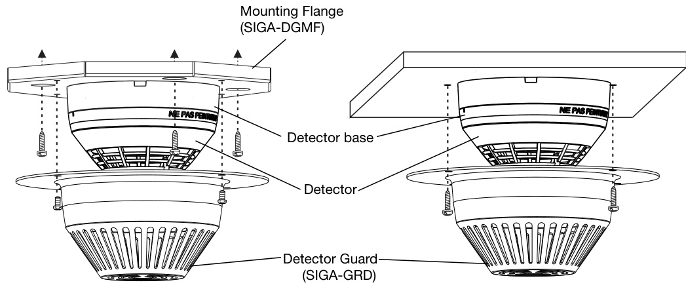

# Smoke Detector Guard SIGA-GRD  

# Overview  

The SIGA-GRD Smoke Detector Guard protects Signature Series smoke detectors from damage and tampering without affecting airflow to the detector head. The sophisticated louver configuration on the detector guard allows Signature smoke detectors to be installed at their listed spacing and has no affect on the detector’s selected operating sensitivity. The guard is constructed of rugged 16-guage steel and is finished with durable white baked powder coat enamel.  

# Application  

Detector guards should be used wherever flying objects may accidentally damage the detector, or wherever they may be intentionally damaged or used to conceal contraband. Typical applications include correctional or detention facilities, mental hospitals, industrial or warehousing spaces, sports facilities and gymnasiums.  

NFPA 72 Section 5-1.3.1 states “Where subject to mechanical damage, an initiating device shall be protected. A mechanical guard used to protect a smoke or heat detector shall be listed for use with the detector being used”.  

# Standard Features  

Agency listed with Signature Series smoke detectors Tested and listed by Underwriters’ Laboratories Inc.  

Compatible with Signature Series smoke and CO detectors Advanced design does not affect detector sensitivity; does not reduce the listed detector spacing.  

Rugged, tamper-proof design 16-gauge steel louvered construction provides superior physical protection. Special fasteners guard against unauthorized access to the detector.  

Easy mounting Simple design ensures very fast, very secure installation, yet allows easy removal for detector cleaning and inspection.  

Flush or surface mount SIGA-DGSB Surface Mount Accessory allows installation over surface mounted conduit and electric boxes.  

# Installation and Mounting  

The SIGA-GRD may be mounted one of three ways:  

1.	Directly to the ceiling, enclosing a detector installed to a flush-mounted electrical box. 2.	To the SIGA-DGSB Surface Mount Adapter, which encloses a surface-mount electrical box.  

3.	To the optional mounting flange. This accessory is useful where the detector guard is removed periodically for inspection.  

  

# Specifications  

<html><body><table><tr><td></td><td>SIGA-GRD DetectorGuard</td><td>SIGA-DGSB DetectorGuardSurfaceAdapter</td></tr><tr><td>Construction</td><td colspan="2">16gaugesteel</td></tr><tr><td>Dimensions</td><td>7.27inch(184.7mm) diameterx3.25</td><td>8.9 inch (225mm) octagonal x 2.25 inch (57mm) high</td></tr><tr><td>Finish</td><td colspan="2">inch(82.6mm)high White;bakedpowdercoatenamel</td></tr><tr><td>Mounting</td><td>Mountsoverflush1-gang,octagon, andfour-inchsquareNorthAmerican</td><td>Enclosessurfacemountedoctagon orone-gangelectricbox</td></tr><tr><td>Compatible Detectors</td><td colspan="2">electricboxes DetectorS:SIGA-COD,SIGA-COD-CA,SIGA-PCD,SIGA-PCD-CA,SIGA-PD</td></tr><tr><td>Agency Listings</td><td>BaSeS:SIGA-SB,SIGA-RB,SIGA-IB UL,ULC,CSFM</td><td></td></tr></table></body></html>  

# Ordering Information  

<html><body><table><tr><td>CatalogNumber</td><td>Description</td><td>Ship Wt., Ib. (kg)</td></tr><tr><td>SIGA-GRD</td><td>SmokeDetectorGuard</td><td>0.8 (0.36)</td></tr><tr><td>SIGA-DGSB</td><td>DetectorGuardSurfaceMountAccessory</td><td>2 (0.9)</td></tr><tr><td>SIGA-DGMF</td><td>MountingFlange(optional)</td><td>2. (0.9)</td></tr></table></body></html>  