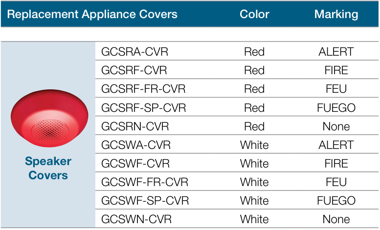

# Ceiling Mount Speakers and Speaker-Strobes Genesis LED GCS Series  

# Overview  

Genesis LED GCS Series speakers and speaker-strobes combine high performance output with a sleek low profile design and energy-efficient technology that makes them less expensive to install and operate. High performance LEDs require fewer power supplies, backup power, and batteries. These new appliances are designed with energy-efficiency, and life safety in mind.  

Speakers feature selectable wattage taps, while speakerstrobes allow for both wattage and light output levels to be configured in the field. Both settings remain clearly visible — even after final installation. Speakers are also capable of both 25V and 70V and voltage in a single model with a field selectable switch. All this flexibility allows devices to be easily fine-tuned to exactly how they’re needed to perform. All Genesis speakers include a DC blocking capacitor to allow electrical supervision of the audio distribution circuit.  

Genesis LED GCS Series uses high efficiency optics, combined with patented electronics, to deliver a highly controlled and efficiently focused light distribution pattern in exchange for lower current requirements. Strobes feature field-selectable 15, 30,75, or 115 cd light output.  

Compared with Xenon-type strobes, Genesis LED GCS Series appliances offer greatly reduced current draw which provides benefits in longer circuit lengths, more devices per circuit, smaller wire gauge and reduced power supply quantities for an installation. They are also backwards compatible with legacy strobes, so there’s no need to replace all your existing devices to upgrade to new LED technology. In fact, GCS strobes can be mixed on the same circuit and used in the same field of view as Xenon-based strobes. This makes Genesis LED GCS Series ideal for new installations and retrofits alike.  

Field-configurable sound output levels provide the flexibility modern life safety projects demand, while the Genesis LED control protocol keeps multiple strobes on compatible NAC circuits synchronized to well within NFPA 72 requirements. They also meet NFPA and UL 520Hz requirements for sleeping areas making them ideal for new construction or retrofits.  

GCS Series speakers produce crisp, clear voice audio output that is highly intelligible over large areas. In an emergency, intelligibility is critical to life safety. Understanding the content of the message is as important as knowing there is an emergency. Intelligibility is measured in Speech Transmission Index and anything above .76 is considered excellent. GCS Series speakers deliver audio with an STI of .81 ensuring the message is clear.  

Serviceability is another area where GCS Series appliances shine. The universal room side wiring plate allows for preinstallation and electrical wiring as well as checking continuity with the included diagnostics check bar. GCS Series devices can then be easily snapped into place with the confidence of knowing the wiring is correct. The innovative under-cover diagnostic test points provide easy access to device circuit testing while mounted.  

High Fidelity performance with excellent STI – Increased sound fidelity and audio intelligibility with an STI rating of .81 (More than .76 is excellent)  

•	 Low Frequency (520Hz) capable – Low frequency output meets NFPA standards for newly constructed commercial sleeping areas  

# High Performance LED Strobe Technology  

– Ultra low device current consumption allows: – More devices per circuit – Ability to use lower gauge wire – Longer wire runs – Fewer booster power supplies   
– High efficiency optics   
– Selectable 15, 30, 75, or 115 cd light output   
– LED devices may be mixed with legacy Xenon strobes on the same circuit and in the same field of view  

# Field flexibility  

– Speakers are also capable of both 25V and 70V and voltage in a single model with a field selectable switch – Speakers feature selectable wattage taps for ¼W, ½W, 1W, and 2W to configure sound output levels in the field  

Low-profile Design  

– Ultra-slim... protrudes about $1.5^{\mathfrak{n}}$ from the mounting surface – Attractive appearance... no visible mounting screws  

# Multiple “FIRE” Marking Options  

– Order English, French, Spanish or no FIRE markings – Change markings at any time with replaceable quick-swap covers  

# Easy to Install  

– Pre-install and pre-wire with convenient universal room side wiring plate – Check electrical continuity on room side wiring plate with included diagnostics check bar – Diagnostics port streamlines device circuit testing – Fits 2-gang and 4-inch square electrical boxes – Optional red and white trim plates available – Slide switches for field configuration – 12 to 18 AWG in-out screw terminals for quick wiring •	 Current draw is the same for all candela output settings – Easier for new system design – Flexible for future changes in light output needs  

# Application  

# Strobes  

Genesis GCS Series strobes are UL 1971-listed for use indoors as wall or ceiling public-mode notification appliances for the hearing impaired. Prevailing codes require strobes to be used where ambient noise conditions exceed 105 dBA (87 dBA in Canada), where occupants use hearing protection, and in areas of public accommodation as defined in the Americans with Disabilities Act.  

Synchronization is important in order to avoid triggering seizures in people with photosensitive epilepsy. All Genesis strobes exceed UL synchronization requirements (within 10 milliseconds over a two-hour period) when used with a synchronization source. See the specifications table for a list of compatible sources.  

# Speakers  

The suggested sound pressure level for each signaling zone used with alert or alarm signals is a minimum of 15 dB above the average ambient sound level or 5 dB above the maximum sound level having a duration of at least 60 seconds, whichever is greater. This is measured 5 feet (1.5 m) above the floor.  

Doubling the distance from the signal to the ear will theoretically cause a 6 dB reduction in the received sound pressure level. The actual effect depends on the acoustic properties of materials in the space. Doubling the power output of a device (e.g.: a speaker from 1W to 2W) will increase the sound pressure level by 3dBA.  

# High Fidelity Sound  

Genesis LED GCS Series High Fidelity appliances feature 87dB of sound output along with a highly intelligible Speech Transmission Index (STI) rating of .81.  An STI rating above .76 is considered excellent for speech intelligibility They are also effective in areas subject to high levels of ambient noise.  

These appliances are ideal for hotels, dormitories and other residential occupancies that have sleeping areas that require 520Hz tones.  In sleeping areas, always ensure that the wattage tap of the speaker is set sufficiently high so that the sound pressure reaches at least 75 dBA at the pillow.  

These appliances are part of an end-to-end audio system approved for use in sleeping areas when used in conjunction with approved audio hardware and a factory-supplied 520 Hz tone. Check the System Compatibility List for other 520 Hz signaling requirements.  

# Installation  

Genesis GCS speakers and speaker-strobes mount to the required GRSW room side wiring plate. The GRSW mounting plate is ordered separately from the GCS device in packs of 10 (GRSW-10) for convenient pre-installing and pre-wiring. The device can be removed easily from the room side wiring plate by pushing up with a screwdriver. The cover can also be removed from the device easily with a screwdriver to access the light and sound output settings and a diagnostics test port for voltage testing.  

Genesis LED GCS Series speakers and speaker-strobes mount to any standard two-gang and 4-inch square electrical box. Matching optional GCT trim rings are available to cover oversized openings. Optional color matched double-gang surface boxes are also available.  

  
Electrical Box  

(1）Electricalbox   
(2)Trim plate(optional)   
(3）Wiring plate(required,ordered separately)   
(4）Machine screw(2X,suppliedwithwiringplate)   
(5)Notification appliance  

# Removing Cover  

  

Removing Device  

  

# Dimensions  

# GCS Notification Appliances  

  
GCT Trim Plate (optional)  

  

# Wiring  

  

Test points indicated above are used to validate the Notification Appliance Circuit and verify device function.  

# Diagnostics  

# Strobe Circuit Test Points  

  
Speaker Circuit Test Points  

  

# Field Configuration  

Genesis LED speakers are capable of both 25V and 70V operation depending on the system,  The voltage is set via a switch under the cover.  Speakers also may be set for ¼, ½, 1, or 2 watt operation. The wattage setting is visible through a small window on the side of the device and is changed by simply sliding the switch under the cover until the desired setting appears in the window. The speaker does not have to be removed to change the wattage, only the cover skin.  

Genesis LED clear strobes and speaker-strobes may be set for 15, 30, 75, or 115 candela output. The output setting is changed by simply removing the cover and sliding the candela switch to the desired setting. The device does not have to be removed from the wall to change the output setting. The setting remains visible through a small window on the left-hand side of the device after the cover is closed.  

# Light and Sound Output Settings  

  
Light Output Setting (Candela)  

# Sound Settings (Watts and Volts)  

  

# Operating current  

Strobes   

<html><body><table><tr><td>Strobe setting</td><td>16to33VDC</td><td>16to33VFWR</td></tr><tr><td>15,30,75,115</td><td>35mA</td><td>45 mA</td></tr></table></body></html>

Note: Current draw is the same for all candela settings  

Sound Level Output   

<html><body><table><tr><td>Voltage setting</td><td>Wattage setting</td><td>Reverberant (UL 1480)</td><td>Anechoic (CAN/ ULC-S541)</td></tr><tr><td rowspan="4">25V/70V</td><td>14W</td><td>78</td><td>77</td></tr><tr><td>12W</td><td>81</td><td>80</td></tr><tr><td>1W</td><td>84</td><td>83</td></tr><tr><td>2W</td><td>87</td><td>86</td></tr></table></body></html>  

# Sound Output  

Sound pattern (ULC)   

<html><body><table><tr><td>Axis</td><td>Angle</td><td>Change einoutput</td></tr><tr><td rowspan="2">Horizontal</td><td>120° and60°</td><td>-3dBA</td></tr><tr><td>140° and40°</td><td>-6dBA</td></tr><tr><td rowspan="2">Vertical</td><td>120° and60°</td><td>-3dBA</td></tr><tr><td>145° and 40°</td><td>-6dBA</td></tr></table></body></html>  

# Light Distribution  

  

  

<html><body><table><tr><td rowspan="4">FIRE Speaker-</td><td>GCSVRF Red</td><td>FIRE</td></tr><tr><td>GCSVRF-FR Red</td><td>FEU</td></tr><tr><td>GCSVRF-SP Red</td><td>FUEGO</td></tr><tr><td rowspan="3">GCSVRN Red</td><td>None</td></tr><tr><td>GCSWWF</td><td>White FIRE</td></tr><tr><td rowspan="3">GCSVWF-FR White</td><td>FEU</td></tr><tr><td>strobes GCSVWF-SP</td><td>FUEGO</td></tr><tr><td rowspan="3">GCSWWN White</td><td>White</td></tr><tr><td>White</td><td>None ALERT</td></tr><tr><td colspan="2">GCSWWA</td></tr></table></body></html>  

  

<html><body><table><tr><td rowspan="9">FIRE Speaker- strobeCovers</td><td>GCSVRA-CVR Red ALERT</td></tr><tr><td>GCSVRF-CVR Red FIRE</td></tr><tr><td>GCSVRF-FR-CVR Red FEU</td></tr><tr><td>GCSVRF-SP-CVR Red FUEGO</td></tr><tr><td>GCSVRN-CVR Red None</td></tr><tr><td>GCSWWA-CVR White ALERT</td></tr><tr><td>GCSVWF-CVR White FIRE</td></tr><tr><td>GCSVWF-FR-CVR White FEU</td></tr><tr><td>GCSVWF-SP-CVR White FUEGO</td></tr><tr><td>GCSVWN-CVR White None</td></tr></table></body></html>  

# Accessories  

  

# Model Number Syntax, Appliances  

  

# Model Number Syntax, Replacement Covers  

  

# Specifications  

<html><body><table><tr><td>Strobe operatingvoltage</td><td>16to33VDC,16to33VFWR</td></tr><tr><td>Speaker operating voltage</td><td>25VRMSof7OVRMS(selectable)</td></tr><tr><td>Speaker frequencyresponse</td><td>400Hz-4,000Hz</td></tr><tr><td>Light output</td><td>15,30,75,or 115 candela</td></tr><tr><td>Strobe flashrate</td><td>1 fps (flash per second) approx.</td></tr><tr><td>Synchronization</td><td>20 Ω max.between any two devices.To determineallowedwireresistance,referto thesespecifications,and the specifications for the synchronized signal source.</td></tr><tr><td>Synchronization Sources</td><td>EdwardsCCSeriesSignal Modules, Booster andAuxiliaryPowerSupplies, Intelligent and Conventional Control Panels</td></tr><tr><td>Wiresize</td><td>12 to18AWG (0.75 to 2.50 mm²)</td></tr><tr><td>Dimensions (0 × D)</td><td>6.8 x 1.82 in (17.27 x 4.62 cm)</td></tr><tr><td>Strobe-to-boxcenter offset</td><td>-1.70 inches (-4.32 cm)</td></tr><tr><td>Compatible electrical boxes [1]</td><td>2-gang, 4-inch square</td></tr><tr><td>Trim plates</td><td>GCTR,GCTW10.6×0.3in. (26.92 x 0.76 cm)</td></tr><tr><td>Operating environment Temperature Relative humidity</td><td>32 to 122°F (0 to 50°C) 0 to 93% noncondensing</td></tr><tr><td>Storage Temperature</td><td>-40 to 158 F(-40 to 70 C)</td></tr><tr><td>RAL Color</td><td>Red=RAL3013 White=RAL 9002</td></tr></table></body></html>

[1] Electrical boxes must be at least 1-1/2 in. (3.81 cm) deep. (2) Recommend electrical boxes be mounted at 81 inches AFF  