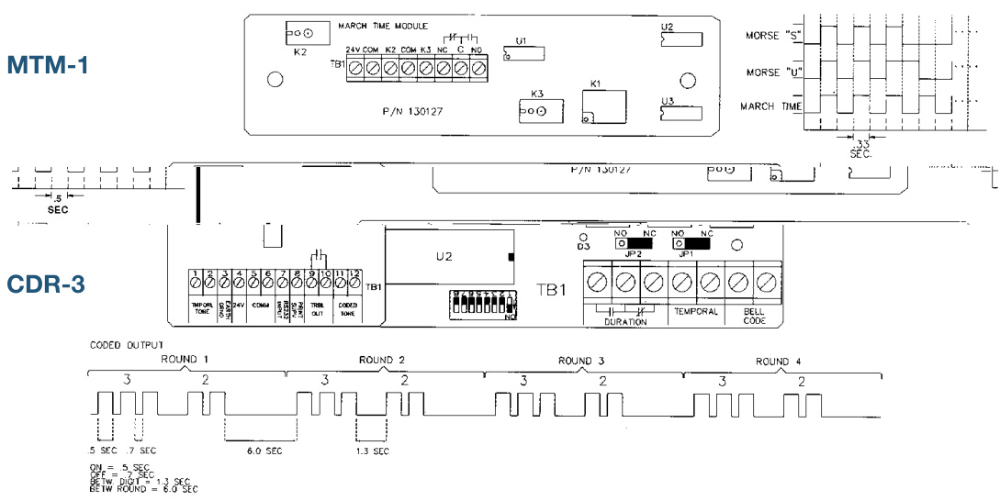

# Coders Models CDR-3 (PSNI) MTM-1 (March Time)  

# Overview  

# CDR-3  

The CDR-3 Coder is a microprocessor based system option module that provides audio and dry contact coded outputs. The coder activates in response to alarm information received over a supervised RS-232 communications circuit from a fire alarm panel output port.  

The CDR-3 provides five LED status indicators. The module is supervised for loss of RS-232 communications from the host panel. Should communications be lost, the module will enter the fail-safe mode and automatically send a temporal signal from the coder outputs. The supervised PSNI and temporal tone outputs also transmit supervisory tones for circuit supervision. Loss of 24 VDC power, and microprocessor failures are also supervised. Module failure indication is provided with a dry relay contact.  

# MTM-1, March Time  

The March Time Coder provides March Time, Morse “S”, or Morse “U” codes. The on board generated code is selected by contact closure or terminal block jumper configurations. The output is provided through Form C dry contacts. The MTM is activated by applying power through a contact closure, such as the common alarm contact closure from the power supply on the 24 VDC system power supply.  

# Standard Features  

# CDR-3  

•	 Microprocessor controlled   
•RS-232 Input   
•1,000,000 code possibilities Active supervision of RS-232 port   
•Positive Successive Non-Interfering Trouble output for coder failure 2, 3, or 4 digit code selection   
•4-Code output: 2 Tone, 2 dry contact   
•Tone codes: PSNI and March Time or Temporal Dry Contact code outputs: PSNI and March Time or Temporal   
•Low Current Fail Safe operation mode Dip Switch Selectable operating modes   
Mounts in cabinet in 1/2 size footprint space  

# MTM-1, March Time  

Three input selectable codes •Low current Form C relay contacts out Mounts in cabinet in 1/2 size footprint space  

# Application  

# CDR-3  

Coded systems are used where it is desirable to notify building occupants of a fire’s location via the fire alarm system audible notification appliances. The code sequence can identify specific areas of a facility to enable faster fire brigade response, etc. The CDR-3 can be used with conventional 24 VDC notification appliances or used in conjunction with audio emergency notification systems to provide a coded tone for broadcast over speaker circuits.  

The CDR-3 supports up to 1,000,000 unique codes consisting of 2, 3, or 4 digits. When a three-digit code is used, one digit in the code may be extended up to 15 pulses. Coded outputs four rounds of the code using the Positive, Successive, Non-Interfering (PSNI) format, which ensures that multiple codes will each sound completely, and without clashing with other codes waiting to be sounded.  The module is provided with a buffer that stores up to 50 active codes. The coded output is available as both 1KHz audio tones and a normally open or normally closed (jumper selectable) dry relay contact, which follow the code. The form C duration relay activates whenever PSNI code is being sent. This relay can be used to transfer the coder output while the coder is operating. At the end of the PSNI code sequence, the coder can be configured to output a continuous temporal or march time output.  

# MTM-1, March Time  

The MTM-1 coder is used in applications requiring a March Time Code for chimes, bells, horns or flashing lights. The MTM-1 is activated by applying power to the module. Upon the application of power the code begins according to the jumper settings for the selected code. The output coder relay is used to interrupt power to the NAC riser.  

# Engineering Specifications  

Audible notification appliances shall be coded using a microprocessor based Positive, Successive, Non Interfering (PSNI) coder module. The coder shall have a capacity for 1,000,000 unique codes and be capable of storing pending codes without a loss of an active code or interference from a new code. The coder shall output four rounds of 2, 3, or 4 digit code sequences. The coder shall provide both 1 KHz audio tone output as well as a dry relay contact output. The coder shall output a continuous <temporal> <60/90 BPM march time> output at the end of the PSNI code sequence. In the event of a failure of the microprocessor, the coder shall automatically output a temporal code.  

The March Time coder shall be started by an alarm contact and provide a code output for bells, horns or flashing lights. The coder shall be selectable for March Time, Morse Code U or Morse Code S.  

  
Product Diagrams  

<html><body><table><tr><td></td><td>CDR-3, PSNI</td><td>MTM-1, March Time</td></tr><tr><td>Input Voltage</td><td>24Vdc 30 Vdc @ 4 Amps (pf. 35)</td><td>24Vdc</td></tr><tr><td>Contact Ratings</td><td>25 Vrms @ 100 Watts 70 Vrms @ 100 Watts</td><td>30 Vdc @ 4 Adc (pf. 35)</td></tr><tr><td>Standby Current</td><td>60 mA</td><td>N/A</td></tr><tr><td>Active Current ToneOutputs(isolated)</td><td>100 mA</td><td>30 mA</td></tr><tr><td>Output Impedance Output Voltage EOL</td><td>1.2K Ohm 3.5VRMS 10K Ohm</td><td>N/A</td></tr><tr><td>Coded Output Code Format ExtendedRangeFormat Numberofdifferentcodes</td><td>4 or 6 rounds, 1-4 digits, each digit 1-9 (1-35 on EST3 only) 4 rounds, 1-3 digits, 1 digit 1-15 and 2 digits 1-9 1,000,000</td><td>N/A</td></tr><tr><td>March Time Output RS-232BaudRate</td><td>60 or 90 BeatsPer Minute (configurable) 600,1200,2400,0r4800</td><td>60BeatsPerMinute N/A</td></tr><tr><td>Environment</td><td>32°F - 120F (0°C - 49°C) 93% RH,Non-condensing</td><td></td></tr><tr><td>Listings</td><td colspan="2">ULI,FM,ULC,CSFM</td></tr><tr><td></td><td colspan="2"></td></tr></table></body></html>  

# Ordering Information  

<html><body><table><tr><td>Model</td><td>Description</td></tr><tr><td>CDR-3</td><td>PSNICoderModule</td></tr><tr><td>MTM-1</td><td>MarchTimeCoderModule</td></tr><tr><td>EXR</td><td>PolarizedCoderRelay</td></tr><tr><td>ARM-8</td><td>AuxiliaryRelayModule</td></tr><tr><td>ARA-1</td><td>AuxiliaryRelay</td></tr></table></body></html>  