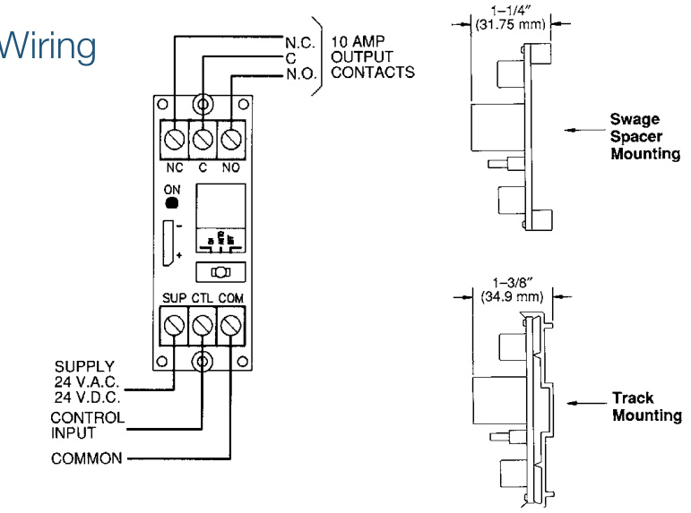
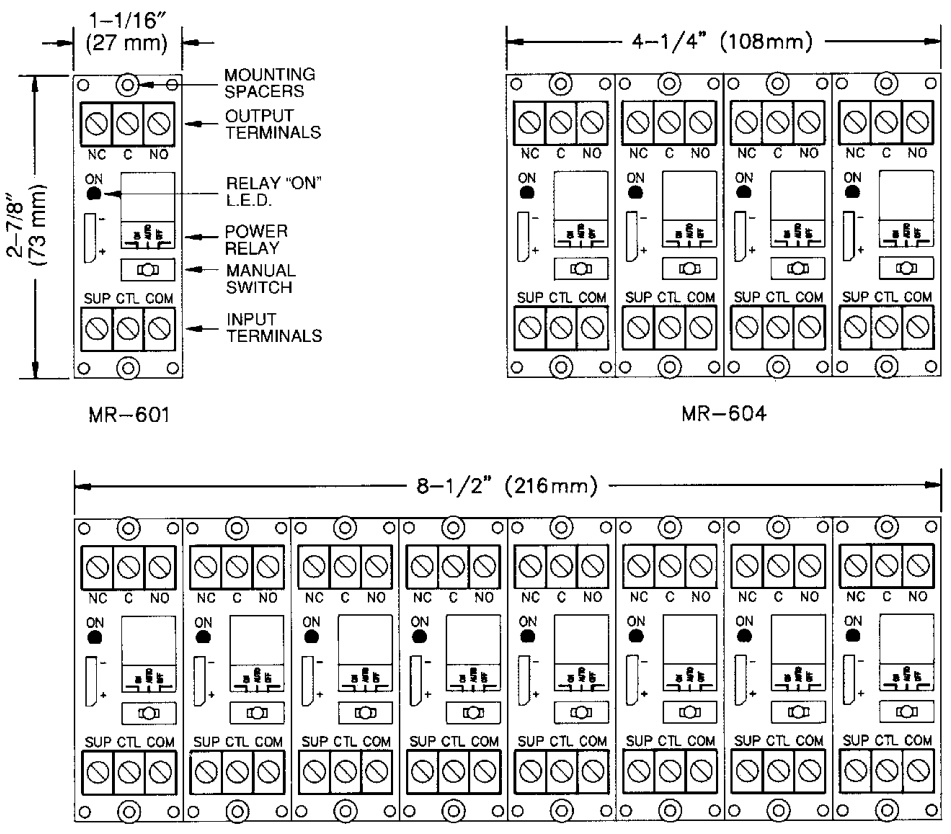

# Manual Override Relays MR600 Series  

# Overview  

The MR600 Series Relays provide SPDT, 10 Amp contacts with manual override capability by means of an ON-AUTO-OFF switch.  

The relay requires a 24 Vac or 24 Vdc power source supplied by the controlling system. With the switch in the ON position the power relay is energized. With the switch in the AUTO position the relay is allowed to operate as signaled by the controlling system. With the switch in the OFF position the relay cannot be energized.  

Each relay position contains a high intensity LED which, when illuminated, indicated the relay coil is energized.  

Individual relay circuits may be snapped apart from standard four or eight-position modules, and are also available in the single circuit configuration.  

The common power to each relay position is bussed on the printed wiring board which permits power to be connected only once per multi-position module.  

These devices are ideal for applications where local or remote contacts are required for control of electrical loads. They are suitable for use with HVAC, Temperature Control, Fire Alarm, Security, Energy management, and Lighting Control Systems.  

# Standard Features  

•	 Each relay position contains 10 Amp SPDT contacts   
•	 Each relay position contains an on-auto-off switch for manual override or external input control   
•	 24 Vac or 24 Vdc operation   
•	 Each relay position contains a red led to indicate relay is energized   
•	 Track mounting or metal swage spacers available   
•	 Bussed power between individual relays which permits only two power wires per module   
•	 Snap-apart construction — single relays may easily be removed from large module  

  

# Installation  

  
MR-608  

Specifications   

<html><body><table><tr><td>Power Requirement</td><td>24Vacor24Vdc@15mA perposition</td></tr><tr><td>Relay Contacts</td><td>10Amps @120Vac; 10Amps @24Vdc</td></tr><tr><td>Relay Data</td><td>UL Recognized,CSA Approved</td></tr><tr><td>Ambient tTemperature</td><td>-58°F to 185°F(-50°to 85°C)</td></tr></table></body></html>  

# Ordering Information  

<html><body><table><tr><td>Model</td><td>Description</td></tr><tr><td>MR601/T</td><td>Single SPDT relay with LED, switch and mounting track</td></tr><tr><td>MR604/T</td><td>Four-positionSPDTr relaywithLEDs,switchesand mountingtrack</td></tr><tr><td>MR608/T</td><td>Eight-position SPDT relay with LEDs, switches， and mounting track</td></tr><tr><td>MR608/S</td><td>Eight-positionSPDT relay withLEDs,switches andmounting spacers</td></tr></table></body></html>  