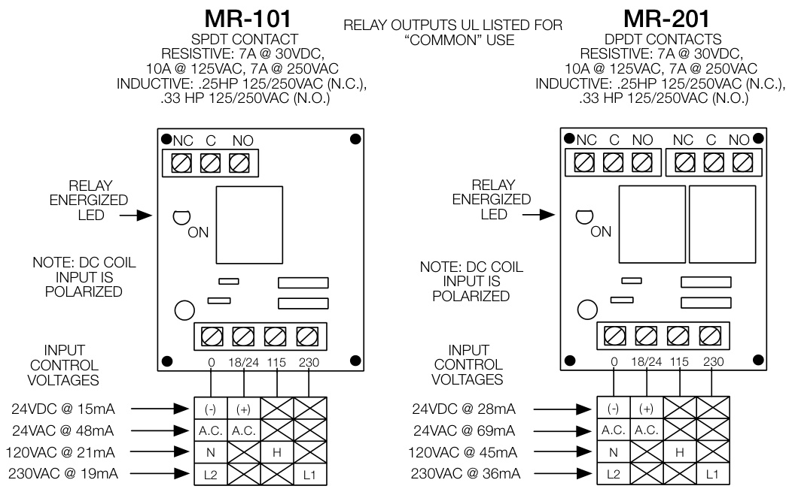

# Multi-Voltage Control Relays MR100 & MR200 Series  

# Overview  

The MRSeries Multi-Voltage Control Relays offer SPDT	  or DPDT 10 Amp contacts which may be operated by one of four input control voltages. A single relay may be energized from a voltage source of 24 Vdc, 24 Vac, 115 Vac or 230 Vac by wiring to appropriate input terminals.  

Each relay position contains a red light emitting diode (LED) which indicates the relay coil is energized. Relays may be “snapped apart” from a standard four-module assembly and used independently.  

These devices are ideal for applications where local contacts are required for system status, remote contacts for control of electrical loads and general purpose switching. They are suitable for use with HVAC Temperature Control, Fire Alarm, Security, Energy Management, and Lighting Control Systems.  

# Standard Features  

•	 Each relay position may be energized from one of four input voltages   
•	 Each relay position contains a red LED which illuminates when the coil is energized. This provides a timesaving convenience when checking an installed system; no metering is required. Single, dual or triple relay modules may be “snapped apart” from a standard four-position master   
•	 SPDT or DPDT relays available   
•	 Available in dustproof metal enclosures with LED viewing port   
Track mounting hardware to facilitate installation in standard cabinets   
•	 UL recognized relays rated at 10 million mechanical operations   
•	 ULI listed as control unit accessory  

# Installation Wiring  

  

# Specifications  

<html><body><table><tr><td colspan="2">PowerRequirements</td></tr><tr><td>MR101Position</td><td>15mA@24Vac,24Vdc,115Vac,230Vac</td></tr><tr><td>MR201Position</td><td>35mA@24Vac,24Vdc,115Vac,230Vac</td></tr><tr><td>Relays</td><td></td></tr><tr><td>MR101</td><td>UL Recognized SPDT</td></tr><tr><td>MR201</td><td>ULRecognizedSPDT</td></tr><tr><td>Enclosure</td><td></td></tr><tr><td>ContactRating</td><td>10Amps@115Vac</td></tr><tr><td>AmbientTemperature</td><td>-58°Fto185°F（-50°Cto85°C)</td></tr><tr><td>Approvals</td><td>ULListedcontrolunitaccessory</td></tr><tr><td colspan="2">Dimensions</td></tr><tr><td>MR101/TandMR201/T</td><td>3.0Hx2.125W×1.5Din(76Hx54Wx38Dmm)</td></tr><tr><td>MR104TandMR204/T</td><td>3.0Hx8.5W×1.5Din(76H×216W×38Dmm)</td></tr><tr><td>MR101/CandMR201/C</td><td>6.125Hx3.25W×2.5Din(156mmH×83mmW×64Dmm)</td></tr><tr><td>MR104CandMR204/C</td><td>6.125H×9.5W×2.5Din(156H×241Wx64D mm)</td></tr></table></body></html>  

# Ordering Information  

<html><body><table><tr><td>Model</td><td>Description</td></tr><tr><td>MR101/T</td><td>SingleSPDTrelaywithLEDand trackmountinghardware</td></tr><tr><td>MR101/C</td><td>SingleSPDTrelaywithLEDmountedinmetalenclosure</td></tr><tr><td>MR104T</td><td>Four-positionSPDTrelaywithLEDsandtrackmountinghardware</td></tr><tr><td>MR104C</td><td>Four-positionSPDTrelaywithLEDsmountedinmetalenclosure</td></tr><tr><td>MR201/T</td><td></td></tr><tr><td>MR201/C</td><td>SingleDPDTrelaywithLEDmountedinmetalenclosure</td></tr><tr><td>MR204/T</td><td>Four-positionDPDTrealywithLEDsandtrackmountinghardware</td></tr><tr><td>MR204/C</td><td>Four-positionDPDTrelaywithLEDsmountedinmetalenclosure</td></tr></table></body></html>  