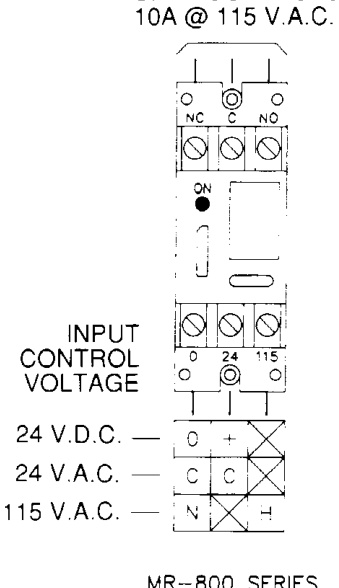

# Multi-Voltage Control Relays MR800 Series  

# Overview  

The MR800 Series relays offer SPDT 10 Amp contacts which may be operated by one of three input control voltages: 24 Vdc, 24 Vac or 115 Vac. Each relay position contains a high intensity LED which, when illuminated, indicates the relay coil is energized.  

Individual relays may be “snapped apart” from a standard eightposition module.  

Relays are equipped with either mounting spacers or track mounting hardware.  

These devices are ideal for applications where local contacts are required for control of electrical loads or general purpose switching. They are suitable for use with HVAC, Temperature Control, Fire Alarm, Security, Energy Management, and Lighting Control Systems.  

# Standard Features  

•	 Each relay position may be energized from one of four input voltages   
•	 Each relay position contains a red LED which illuminates when the coils are energized. This provides a time saving convenience when checking an installed system; no metering is required   
•	 From one to eight relay modules may be formed by “snapping apart” desired positions   
•	 Compact 10 AMP SPDT contacts   
•	 Choice of metal spacers or plastic track for mounting   
•	 UL recognized components  

# Wiring  

# SPDT CONTACTS  

  

# Specifications  

<html><body><table><tr><td>PowerRequiremets</td><td>15mAperposition@24Vdc，24Vac，115Vac</td></tr><tr><td>Relay</td><td>ULRecognizedSPDT</td></tr><tr><td>ContactRating</td><td>10Amps@115Vac</td></tr><tr><td>AmbientTemperature</td><td>-58°Fto185°F（-50°Cto85°C）</td></tr><tr><td>Approvals</td><td>ULRecognizedcomponents</td></tr><tr><td colspan="2"></td></tr><tr><td>Dimensions</td><td></td></tr><tr><td>MR801</td><td>3.25 H× 1.062W× 1.0 D in (82.6 H×27W25.4D mm)</td></tr><tr><td>MR804</td><td>3.25Hx4.25Wx1.0 D in(82.6H×108W×25.4Dmm)</td></tr><tr><td>MR808</td><td>3.25Hx8.5W×1.0 D in(82.6H×216W×25.4D mm)</td></tr></table></body></html>  

# Ordering Information  

<html><body><table><tr><td>Model</td><td>Description</td></tr><tr><td>MR801/S</td><td>SingleSPDT relay with LED and mounting spacers</td></tr><tr><td>MR801/T</td><td>SingleSPDTrelaywithLEDandtrackmountinghardware</td></tr><tr><td>MR804/S</td><td>Four-positionSPDTrelaywithLED andmountingspacers</td></tr><tr><td>MR804/T</td><td>Four-positionSPDTrelaywithLED andtrack mountinghardware</td></tr><tr><td>MR808/S</td><td>Eight-position SPDT relay with LED and mounting spacers</td></tr><tr><td>MR808/T</td><td>Eight-positionSPDTrelaywithLEDandtrack mountinghardware</td></tr></table></body></html>  