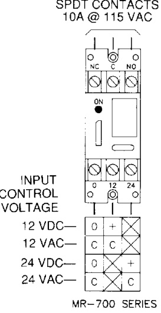

# Multi-Voltage Control Relays MR700 Series  

# Overview  

The MR700 Series relays offers SPDT 10 Amp contacts which may be operated by one of four input control voltages: 12 Vdc, 12 Vac, 24 Vdc, or 24 Vac. Each relay position contains a high intensity LED which, when illuminated, indicates the relay coil energized.  

Individual relays may be “snapped apart” from a standard eightposition module.  

Relays are equipped with either mounting spacers or track mounting hardware.  

These devices are ideal for applications where contacts are required for control of electrical loads or general purpose switching. They are suitable for use with HVAC, Temperature Control, Fire Alarm, Security, Energy Management, and Lighting Control Systems.  

# Standard Features  

•	 Each relay position may be energized from one of four input voltages   
Each relay position contains a red LED which illuminates when the coil is energized. Provides a timesaving convenience when checking an installed system; no metering is required From one to eight relay modules may be formed by “snapping apart” desired positions   
•	 Compact 10 AMP SPDT contacts   
•	 Choice of metal spacers or plastic track for mounting   
•	 UL recognized components  

# Wiring  

  

# Specifications  

<html><body><table><tr><td>PowerRequiremets</td><td>30mAperposition@12Vdc，12Vac,24Vdc,24Vac</td></tr><tr><td>Relay</td><td>ULRecognizedSPDT</td></tr><tr><td>ContactRating</td><td>10Amps@115Vac</td></tr><tr><td>AmbientTemperature</td><td>-58°Fto185°F(-50°Cto85°C）</td></tr><tr><td>Approvals</td><td>ULRecognized componets</td></tr><tr><td></td><td></td></tr><tr><td colspan="2">Dimensions</td></tr><tr><td>MR701</td><td></td></tr><tr><td>MR704</td><td>3.25H×1.062W×1.0 D in (82.6H×27Wx25.4 D mm)</td></tr><tr><td>MR708</td><td>3.25 H×4.25W×1.0 D in(82.6 H×108W× 25.4 D mm) 3.25Hx8.5Wx1.0 D in(82.6 H×216 W×25.4D mm)</td></tr></table></body></html>  

# Ordering Information  

<html><body><table><tr><td>Model</td><td>Description</td></tr><tr><td>MR701/S</td><td>SingleSPDTrelaywithLED andmountingspacers</td></tr><tr><td>MR701/T</td><td>SingleSPDTrelaywithLED andtrackmountinghardware</td></tr><tr><td>MR704/T</td><td>Four-positionSPDTrelaywithLED andtrack mountinghardware</td></tr><tr><td>MR708/S</td><td>Eight-positionSPDTrelaywith LED andmounting spacers</td></tr><tr><td>MR708/T</td><td>Eight-positionSPDTrelaywithLED andtrack mountinghardware</td></tr></table></body></html>  