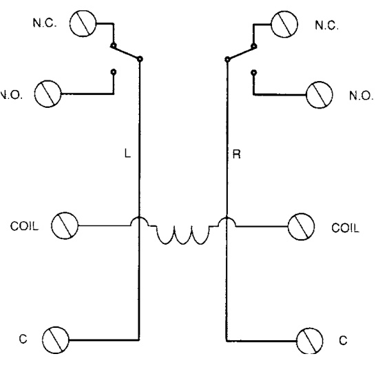

# Heavy Duty Power Relays MR 199 Series  

# Overview  

The MR 199 Heavy Duty Power Relays are designed for control applications where 30 Amp DPDT contacts are required. Two models are available: a 115 Vac coil and a 24 Vdc coil, each of which may be mounted in a rugged steel enclosure.  

# Standard Features  

•	 Heavy duty 30 Amp DPDT contacts •	 24 Vdc or 120 Vac models available •	 Sturdy metal enclosure  

Wiring  

  

Specifications   

<html><body><table><tr><td>ContactArrangement</td><td>DPDTStandard</td></tr><tr><td>ContactRating</td><td>30Amps@300Vac,2HPMotorLoad</td></tr><tr><td>CoilPower</td><td>MR-199X-13:24Vdc@85mA</td></tr><tr><td>TemperatureRange</td><td>-22°Fto122°F(-30°Cto50°C)</td></tr><tr><td></td><td></td></tr><tr><td>Dimensions</td><td></td></tr><tr><td>MR199X13&MR199AX14</td><td>3.13 Hx2.5 WX2.31inches(79.4 Hx63.5Wx58.7D mm)</td></tr><tr><td>MR199X13/C &MR199AX14/C</td><td>5.31Hx3.38Wx3.13Dinches (134.9Hx85.9Wx96.8Dmm)</td></tr></table></body></html>  

# Ordering Information  

<html><body><table><tr><td>Model</td><td>Description</td></tr><tr><td>MR199X13</td><td>DPDT,24Vdc,relayonly</td></tr><tr><td>MR199X13/C</td><td>DPDT,24Vdc,mountedinenclosure</td></tr><tr><td>MR199AX14</td><td>DPDT,120Vac,relayonly</td></tr><tr><td>MR199AX14/C</td><td>DPDT,120Vac,mountedinenclosure</td></tr></table></body></html>  