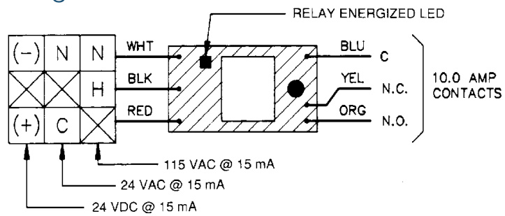

# Multi-Voltage Control Relay Model PAM1  

# Overview  

The PAM1 Relay is encapsulated multi-voltage device providing 10 Amp Form C contacts. The relay may be energized by one of three input voltages: 24 Vac, 24 Vdc, or 115 Vac.  

A red LED is provided which, when illuminated, indicates the relay coil is energized.  

The PAM1 may be mounted by using the double-sided adhesive tape, the self-drilling screw, or loosely placed in a back box.  

The PAM1 is ideal for applications where remote relays are required for control or status feedback. They are suitable for use with HVAC, Temperature Control, Fire Alarm, Security, Energy Management, and Lighting Control Systems.  

# Standard Features  

•	 Completely encapsulated 10 Amp relay   
•	 Relay may be energized by one of three input voltages Contains a red LED which illuminates when relay coil is energized May be mounted by double-sided adhesive tape, self-drilling screw or placed in back box   
•	 Convenient 6 in (150mm) wire leads for electrical connections  

# Wiring  

  

Specifications   

<html><body><table><tr><td>PowerRequirments</td><td>15 mA per position @24Vdc,24Vac,115Vac</td></tr><tr><td>Relay</td><td>ULRecognizedSPDT</td></tr><tr><td>ContactRating</td><td>10 Amps @ 115Vac</td></tr><tr><td>AmbientTemperature</td><td>-58°Fto185°F(-50°Cto85°C)</td></tr><tr><td>Approvals</td><td>ULRecognizedcomponents</td></tr><tr><td>Dimensions</td><td>1.5 Hx1W.875 D inches(38.1x24.5x22.2mm) with6inch(150mm)wireleads18AWG (1.00mm2)</td></tr></table></body></html>  

# Ordering Information  

Model Description   
PAM1 Single SPDT relay with LED double-sided adhesive tape, mounting screw and 6 in (150 mm) leads.  