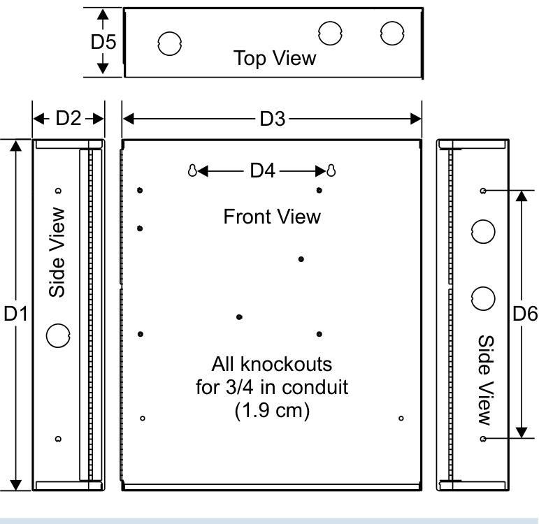
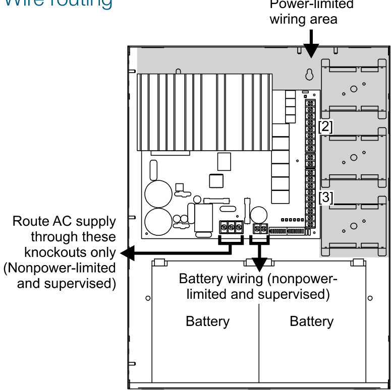
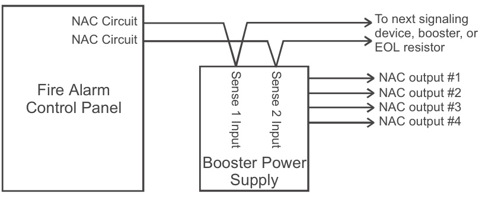
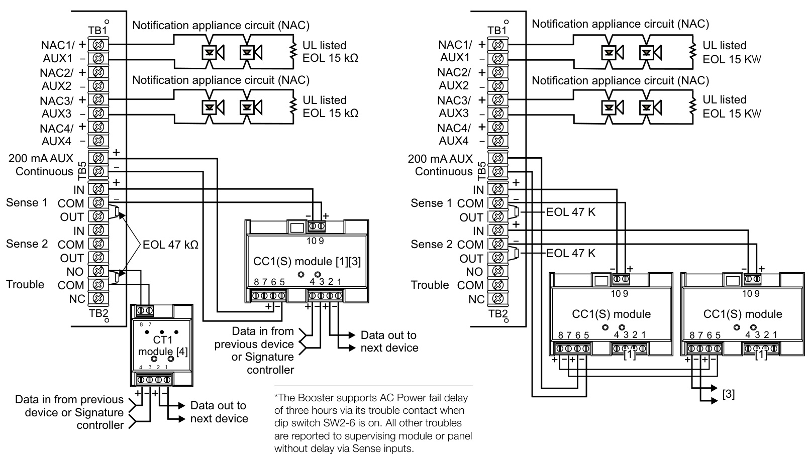
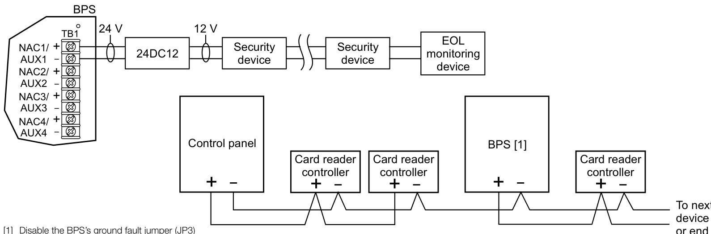

# Remote Booster Power Supplies BPS6A, BPS10A  

# Overview  

The Booster Power Supply (BPS) is a UL 864, 9th Edition listed power supply. It is a 24 Vdc filtered-regulated, and supervised unit that can easily be configured to provide additional notification appliance circuits (NACs) or auxiliary power for Mass Notification/ Emergency Communication (MNEC), as well as life safety, security, and access control applications.  

The BPS contains the circuitry to monitor and charge internal or external batteries. Its steel enclosure has room for up to two 10 ampere-hour batteries. For access control-only applications, the BPS can support batteries totaling up to 65 ampere-hours in an external enclosure. The BPS has four Class B (convertible to two Class A) NACs. These can be activated in one or two groups from the BPS’s unique dual input circuits.  

The BPS is available in 6.5 or 10 ampere models. Each output circuit has a capacity of three amperes; total current draw cannot exceed the unit’s rating.  

The BPS meets current UL requirements and is listed under the following standards:  

<html><body><table><tr><td>Standard(CCN) Description</td></tr><tr><td colspan="2">UL8649thed.ition(UOXX)FireAlarmSystems</td></tr><tr><td>UL636 (ANET, UEHX7)</td><td>HoldupAlarmUnitsandSystems</td></tr><tr><td>UL609(AOTX,AOTX7)</td><td>LocalBurglarAlarmUnitsandSystems</td></tr><tr><td>UL294 (ALVY, UEHX7)</td><td>AccessControlSystems</td></tr><tr><td>UL365(APAW,APAW7)</td><td>PoliceStationConnectedBurglarAlarmUnitsandSystems</td></tr><tr><td></td><td>s</td></tr><tr><td>UL1610 (AMCX)</td><td>CentralStationAlarmUnit</td></tr><tr><td>ULC-S527(UOXXC)</td><td>ControlUnits,FireAlarm(Canada)</td></tr><tr><td>ULC-S303(AOTX7)</td><td>Local Burglar Alarm Units and Systems (Canada)</td></tr><tr><td>C22.2No.205</td><td>SignalingEquipment(Canada)</td></tr></table></body></html>  

# Standard Features  

Allows for reliable filtered and regulated power to be installed where needed   
•Cost effective system expansion   
•Provides for Genesis and Enhanced Integrity notification appliance synchronization   
•Supports coded output operation   
•Self-restoring overcurrent protection   
•Multiple signal rates   
•Can be cascaded or controlled independently   
•Easy field configuration   
•On-board diagnostic LEDs identify wiring or internal faults   
•Standard EDWARDS keyed lockable steel cabinet with removable door   
•110 and 230 Vac models available   
•Accommodates 18 to 12 AWG wire sizes   
•Optional tamper switch   
•Dual battery charging rates Optional earthquake hardening: OSHPD seismic pre-approval for component Importance Factor 1.5  

# Application  

The BPS provides additional power and circuits for notification appliances and other 24 Vdc loads. It is listed for indoor dry locations and can easily be installed where needed.  

Fault conditions are indicated on the on-board diagnostic LEDs, opening the BPS input sense circuit and the trouble relay (if programmed). While this provides indication to the host system, the BPS can still be activated upon command. A separate AC Fail contact is available on the BPS circuit board, which can be programmed for trouble or AC Fail. There are seven on-board diagnostic LEDs: one for each NAC fault, one for battery fault, one for ground fault, and one for AC power.  

The unique dual-input activation circuits of the BPS can be activated by any voltage from 6 to 45 VDC (filtered-regulated) or 11 to 33 Vdc (full-wave rectified, unfiltered). The first input circuit can be configured to activate 1-4 of the four possible outputs. The second input circuit can be configured to control circuits 3 and 4. When outputs are configured for auxiliary operation, these circuits can be configured to stay on or automatically deactivate 30 seconds after AC power is lost. This feature makes these circuits ideal for door holder applications. The BPS also has a separate 200 mA 24 Vdc output that can be used to power internal activation modules.  

BPS NACs can be configured for a 3-3-3 temporal or continuous output. California temporal rate outputs are also available on certain models. This makes the BPS ideal for applications requiring signaling rates that are not available from the main system.  

In addition to the internally generated signal rates, the BPS can also be configured to follow the coded signal rate of the main system NACs. This allows for the seamless expansion of existing NACs.  

The BPS enclosure has mounting brackets for up to three Signature modules to the right of the circuit board.  

# Engineering Specification  

Supply, where needed, EDWARDS BPS Series Booster Power Supplies (BPS) that are interconnected to and supervised by the main system. The BPS shall function as a stand-alone auxiliary power supply with its own fully-supervised battery compliment. The BPS battery compliment shall be sized to match the requirements of the main system. The BPS shall be capable of supervising and charging batteries having the capacity of 24 ampere-hours for Mass Notification/Emergency Communication (MNEC), life safety and security applications, and the capacity of 65 amperehours for access control applications.  

<<The BPS shall be capable of installation for a seismic component Importance Factor of $1.5.>>$ The BPS shall provide a minimum of four independent, fully supervised Class B circuits that can be field configurable for notification appliance circuits or auxiliary 24 Vdc power circuits. BPS NACs shall be convertible to a minimum of two Class A NACs. Each BPS output circuit shall be rated at 3 amperes at 24 Vdc. Each output circuit shall be provided with automatically restoring overcurrent protection. The BPS shall be operable from the main system NAC and/or EDWARDS Signature Series control modules. BPS NACs shall be configurable for continuous, 3-3-3 temporal or optionally, California rate. Fault conditions on the BPS shall not impede operation of main system NAC. The BPS shall be provided with ground fault detection circuitry and a separate AC fail relay.  

# Dimensions  

  

<html><body><table><tr><td>D1</td><td>D2</td><td>D3</td><td>D4</td><td>D5</td><td>D6</td></tr><tr><td>17.0 in (43.2 cm)</td><td>3.5 in (8.9 cm)</td><td>13.0 in (33.0 cm)</td><td>6.5 in (16.5 cm)</td><td>3.375in (8.6 cm)</td><td>12.0 in (30.4 cm)</td></tr></table></body></html>  

# Wire routing  

  

Notes   
1.	 Maintain 1/4-inch $(6\,\mathsf{m m})$ ) spacing between power-limited and nonpower-limited wiring or use type FPL, FPLR, or FPLP cable per NEC.   
[2] Power-limited and supervised when not configured as auxiliary power. Nonsupervised when configured as auxiliary power.   
[3] Source must be power-limited. Source determines supervision.   
4. When using larger batteries, make sure to position the battery terminals towards the door.  

# Single or cascaded booster anywhere on a notification appliance circuit  

Existing NAC end-of-line resistors are not required to be installed at the booster’s terminals. This allows multiple boosters to be driven from a single NAC circuit without the need for special configurations.  

  

# Multiple CC1(S) modules using the BPS’s sense inputs  

  
Configuring the Booster for AC Power Fail delay operation\*   
Security and access  

  

Specifications   

<html><body><table><tr><td>Model</td><td>6.5 amp Booster</td><td>10 amp Booster</td></tr><tr><td>AC Line Voltage</td><td>120VACor220-240VAC50/60Hz 390 watts</td><td>120VACor220-240VAC50/60Hz 580 watts</td></tr><tr><td>Notification Appliance Circuit Ratings</td><td>3.0A max. per circuit @ 24Vdc nominal 6.5A max total all NACs</td><td>3.0A max. per circuit @ 24Vdc nominal 10A max total all NACs</td></tr><tr><td>Trouble Relay</td><td colspan="2">2 Amps @ 30Vdc</td></tr><tr><td>Auxiliary Outputs</td><td colspan="2">Four configurable outputs replace NACs 1,2,3 or 4.as auxiliary outputs and 200 mA dedicated auxiliary. (See note 2.)</td></tr><tr><td>Input Current</td><td colspan="2">3mA@12Vdc,6mA@24Vdc</td></tr><tr><td>(from an existing NAC) Booster Internal</td><td colspan="2">70mA+35mAforeachcircuitset toAUX</td></tr><tr><td>Supervisory Current Booster Internal Alarm</td><td colspan="2">270mA</td></tr><tr><td>Current Signature Mounting</td><td colspan="2">Accomodates three two-gang modules.</td></tr><tr><td>Space Maximum Battery Size</td><td colspan="2">10 Amp Hours (2 of 12V10A) in cabinet up to 24 Amp hours with ex-</td></tr><tr><td>Terminal Wire Gauge</td><td colspan="2">ternal battery cabinet for fire and security applications; up to 65 Amp hours for access control applications in external battery box. 18-12 AWG</td></tr><tr><td>Relative Humidity</td><td colspan="2">0 to 93% non condensing @ 32°℃</td></tr><tr><td></td><td colspan="2">32°to 120F (0°to 49°C)</td></tr><tr><td>Temperature Rating</td><td colspan="2"></td></tr><tr><td>NAC Wiring Styles</td><td colspan="2">Class A or Class B</td></tr><tr><td>Output Signal Rates</td><td colspan="2">Continuous, California rate,3-3-3 temporal, or follow installed panel's NAC. (See note 1.)</td></tr><tr><td>GroundFaultDetection</td><td colspan="2">EnableorDisablevia jumper</td></tr><tr><td>Agency Listings</td><td colspan="2">UL, ULC, CSFM</td></tr></table></body></html>

1.	 Model BPS\*CAA provides selection for California rate, in place of temporal. 2.	 Maximum of  8 Amps can be used for auxiliary output.  

# Ordering Information  

<html><body><table><tr><td>Catalog Number</td><td>Description</td><td>Shipping Wt.Ib (kg)</td></tr><tr><td>BPS6A</td><td>6.5AmpBoosterPowerSupply</td><td>13 (5.9)</td></tr><tr><td>BPS6AC</td><td>6.5AmpBoosterPowerSupply(ULC)</td><td>13 (5.9)</td></tr><tr><td>BPS6A/230</td><td>6.5AmpBoosterPowerSupply(220v)</td><td>13 (5.9)</td></tr><tr><td>BPS6CAA</td><td>6.5AmpBoosterPowerSupplywithCaliforniarate</td><td>13 (5.9)</td></tr><tr><td>BPS10A</td><td>10 AmpBoosterPower Supply</td><td>13 (5.9)</td></tr><tr><td>BPS10AC</td><td>10AmpBoosterPowerSupply(ULC)</td><td>13 (5.9)</td></tr><tr><td>BPS10A/230</td><td>10AmpBoosterPowerSupply(220V)</td><td>13 (5.9)</td></tr><tr><td>BPS10CAA</td><td>10AmpBoosterPowerSupplywithCaliforniarate</td><td>13 (5.9)</td></tr></table></body></html>  

1. Requires installation of separate battery cabinet.   
2. BPS supports batteries greater than 24 Amp hours for access control applications only.   
3. For earthquake anchorage, including detailed mounting weights and center of gravity detail, refer to Seismic Application Guide 3101676.  Approval of panel anchorage to site structure may require local AHJ, structural or civil engineer review.  

<html><body><table><tr><td colspan="3">RelatedEquipment</td></tr><tr><td>12V6A5</td><td>7.2AmpHourBattery,tworequired</td><td>3.4 (1.6)</td></tr><tr><td>12V10A</td><td>10AmpHourBattery,tworequired</td><td>9.5 (4.3)</td></tr><tr><td>3-TAMP</td><td>Tamperswitch</td><td></td></tr><tr><td>BC-1EQ</td><td>SeismicKitforBC-1.OrderBC-1separately.Seenote3.</td><td></td></tr><tr><td>BPSEQ</td><td>SeismickitforBPS6AorBPS10BoosterPowerSupplies.See note3</td><td></td></tr><tr><td>BC-1</td><td>BatteryCabinet(upto2-40AmpHourBatteries)</td><td>58 (26.4)</td></tr><tr><td>BC-2</td><td>BatteryCabinet(up to2-17AmpHourBatteries)</td><td>19 (8.6)</td></tr><tr><td>12V17A</td><td>18 Amp Hour Battery, two required (see note 1)</td><td>13 (5.9)</td></tr><tr><td>12V24A</td><td>24 AmpHourBattery,tworequired (seenote 1)</td><td>20 (9.07)</td></tr><tr><td>12V40A</td><td>40AmpHourBattery,two required (see notes 1，2)</td><td>32 (14.5)</td></tr><tr><td>12V50A</td><td>50 Amp Hour Battery, two required (see notes 1,2)</td><td>40 (18.14)</td></tr><tr><td>12V65A</td><td>65AmpHourBattery,tworequired(seenotes1，2)</td><td>49 (22.2)</td></tr></table></body></html>  